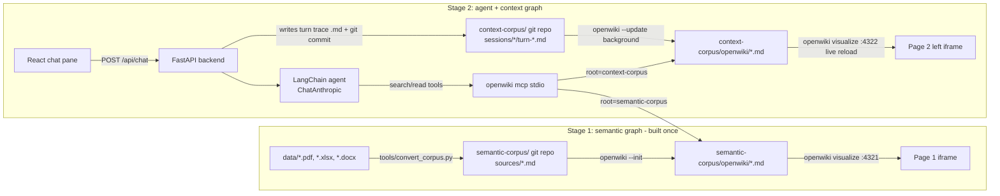

# Build Spec: OpenWiki Semantic + Context Graph POC

**Audience:** Claude Code (VS Code, Windows) implementing this POC end to end.
**Owner:** Pranav. **Status:** ready to build. **Last updated:** 2026-10-04.

Read this whole file before writing code. Sections 3 and 10 list facts verified against the OpenWiki
source and the places where you must re-verify on the installed version.

---

## 1. Goal

Test how far **OpenWiki** (LangChain's CLI, `npm install -g openwiki`) can go at generating and
visualizing two kinds of graphs:

| Stage | What it is | Built by | Visualized by |
|---|---|---|---|
| **Stage 1 - Semantic graph** | Knowledge graph of the bank's documents (3 PDF reports, 3 Excel models, 1 API reference) | `openwiki --init` over a text corpus | `openwiki visualize` (page 1 of the web app) |
| **Stage 2 - Context graph** | Agent memory: every conversation turn, tool call, decision trace, source used | `openwiki --init` / `--update` over trace files written by the agent | `openwiki visualize` (left pane of page 2) |

Stage 2 also has a **LangChain Q&A agent** (Anthropic model) in the right pane of page 2. It answers
questions using **only** OpenWiki's `openwiki_search` / `openwiki_read` tools against the semantic wiki
(and its own context wiki for memory).

The user wants OpenWiki used for **both graph generation and both visualizations**. Do not replace
OpenWiki with a custom graph builder or a custom graph renderer in the base build.

Non-goals for the base build: calculating new model scenarios, persistence across demos, click-a-node-
to-ask. Section 11 describes each as an extension with an effort estimate.

## 2. What is already in this package

```
openwiki-graph-poc/
  BUILD_SPEC.md              <- this file
  CLAUDE.md                  <- tells Claude Code to follow this spec
  README.md                  <- quickstart for the person the project is shared with
  data/
    reports/   MHFC_2025_Annual_Report.pdf (27 pp), MHFC_Q2_2026_Earnings_Supplement.pdf (21 pp),
               MHFC_2025_Pillar3_Disclosures.pdf (22 pp)
    models/    NII_Sensitivity_Model.xlsx, CECL_Allowance_Model.xlsx, Capital_Planning_Model.xlsx
    api_docs/  MHFC_Developer_Platform_API_Reference.docx (18 APIs, 37 pp)
  semantic-corpus-preview/   <- the converted Markdown already produced from data/ (for inspection;
                                setup regenerates it as semantic-corpus/)
  templates/
    semantic-INSTRUCTIONS.md <- OpenWiki brief for stage 1 (page types + relationships)
    context-INSTRUCTIONS.md  <- OpenWiki brief for stage 2 (context-graph page types)
  tools/
    convert_corpus.py        <- PDF/XLSX/DOCX -> Markdown corpus (working, tested)
  generators/                <- scripts that generated the mock data (only needed to regenerate it)
```

**The mock bank.** Meridian Harbor Financial Corp. (MHFC) is fictional, styled after large U.S. bank
disclosures (segments: Consumer & Community Banking, Commercial & Investment Bank, Asset & Wealth
Management, Corporate). Every document carries a "synthetic document" disclaimer. The documents are
deliberately cross-linked so the graph has real edges:

- Reports cite the three models by ID (MDL-ALM-014, MDL-CR-007, MDL-CAP-003) and the APIs that feed them.
- The Excel models' README sheets list their upstream APIs and downstream disclosures.
- The API reference has a data-lineage table per API and an API-to-model matrix.
- Numbers agree across documents (e.g. the allowance of $15,920 million is in the Annual Report Note 6,
  the Pillar 3 report and `CECL_Allowance_Model.xlsx!Allowance_Summary!G12`).

**Excel models (formulas are live; recalculated, zero errors):**

| File | Model | What it computes |
|---|---|---|
| NII_Sensitivity_Model.xlsx | MDL-ALM-014 | 12-month NII under +/-100/200 bp parallel shocks (repricing factor x beta), EVE via modified duration, limit checks |
| CECL_Allowance_Model.xlsx | MDL-CR-007 | Lifetime ECL = EAD x lifetime PD x LGD per segment under 3 weighted scenarios, qualitative overlay, reconciliation, weight sensitivity |
| Capital_Planning_Model.xlsx | MDL-CAP-003 | 9-quarter CET1 projection (baseline and severely adverse), indicative stress capital buffer, headroom |

## 3. OpenWiki facts this design depends on (verified in source, v0.7.0, Oct 2026)

1. **Two modes.** Code mode documents "the current repository" (a git repo) into `openwiki/`. Personal
   mode ingests connectors (Notion, Gmail, git repos, web search...) into `~/.openwiki/wiki`. **Neither
   reads PDF/XLSX/DOCX**, so we convert to Markdown and use **code mode on a document repo**.
2. **The repo root must be its own git repository** with at least one commit. OpenWiki fingerprints the
   repo with git (tracked + untracked files, HEAD). Corpora must therefore be **separate git repos**,
   not subfolders of the project repo (otherwise git resolves the project root, and OpenWiki would
   document the backend code).
3. **`openwiki/INSTRUCTIONS.md`** is a user-authored brief that OpenWiki reads for scope and priorities
   and never rewrites. Our templates use it to define node types (front-matter `type`) and relationships.
4. **Graph model.** The visualizer graph = one node per Markdown page (id = relative path without `.md`,
   type = front-matter `type`), one edge per relative Markdown link between pages. Edges are unlabeled;
   links to pages outside the served folder are dropped. `INSTRUCTIONS.md` and `log.md` are excluded.
5. **Visualizer.** `openwiki visualize <dir> --port <p> --no-open` serves on **127.0.0.1 only**, live-
   reloads via SSE when files change (works on Windows; uses recursive `fs.watch`), and **auto-increments
   the port if it is taken** (read the actual URL from its stdout banner line `open: http://...`).
   It sends a CSP header but **no X-Frame-Options / frame-ancestors**, so it can be embedded in an
   iframe. It loads libraries from cdn.jsdelivr.net and fonts from Google, so **internet is required**.
   `GET /api/graph` on the visualizer returns the full graph JSON (nodes with `id`, `title`, `type`,
   `body`, `links`, `backlinks`; edges).
6. **MCP server for retrieval.** `openwiki mcp --host <id>` starts a **stdio MCP server** exposing
   `openwiki_search`, `openwiki_read`, `openwiki_list_workspaces`, `openwiki_list_wikis` (plus generation
   tools we will not use). Search and read are local, read-only and make **no model calls**.
   - `openwiki_search({ root, query, paths?, limit?, workspace? })` -> ranked results with refs like
     `openwiki/models/cecl.md#scenario-weighting`.
   - `openwiki_read({ root, page, sections, wiki? })` -> complete Markdown sections.
   - `root` = **absolute path of the git repository root that contains `openwiki/`**. One MCP server
     process can serve both wikis by passing different roots.
7. **Non-interactive runs.** `--init` / `--update` exit on success; `-p/--print` forces one-shot mode.
   A run is non-interactive only when credential setup is complete: provider + key + model id are set,
   **and** either `LANGSMITH_API_KEY` is set or `LANGCHAIN_TRACING_V2` is defined (set it to `false`),
   **and** code-mode onboarding is complete: `<config dir>/onboarding.json` has `completedAt` and
   `modeId: "code"`, and the repo has a non-empty `openwiki/INSTRUCTIONS.md`. Do the first semantic init
   interactively once (it writes onboarding.json); later context runs then never prompt.
8. **State directory.** `OPENWIKI_CONFIG_DIR` relocates all OpenWiki state (keys, onboarding, history).
   We point it at `<project>/.openwiki-state/` so the POC never touches the user's global `~/.openwiki`
   and is easy to share/reset. OpenWiki restricts its permissions (Windows ACLs supported).
9. **Anthropic provider:** `OPENWIKI_PROVIDER=anthropic`, `ANTHROPIC_API_KEY`, `OPENWIKI_MODEL_ID`
   (presets include `claude-sonnet-5`, `claude-haiku-4-5`, `claude-opus-5`; custom IDs allowed).
   `OPENWIKI_PAGE_CONCURRENCY=1..8` parallelizes page writing (start at 3).
10. **Telemetry** is on by default; set `OPENWIKI_TELEMETRY_DISABLED=1` if sharing inside a company.

## 4. Architecture



The FastAPI backend is the single process the user starts. It supervises three child processes:
semantic visualizer, context visualizer, and the OpenWiki MCP server (via the LangChain MCP client).

### 4.1 Repository layout to create

```
openwiki-graph-poc/                  (project git repo)
  .gitignore                         semantic-corpus/, context-corpus/, .openwiki-state/, .env, logs/, node_modules/, .venv/
  .env.example
  scripts/
    setup.ps1                        prerequisites check, venv, pip/npm installs, openwiki install
    build-semantic.ps1               convert corpus, git init, copy brief, openwiki --init (interactive first time)
    dev.ps1                          start backend + frontend
    reset-context.ps1                wipe context-corpus (also exposed as a UI button)
  backend/
    pyproject.toml / requirements.txt
    app/
      main.py                        FastAPI app, lifespan starts/stops children
      config.py                      pydantic-settings, reads .env
      openwiki_cli.py                resolve node + openwiki cli.js path; build env; run commands
      visualizers.py                 spawn/stop `openwiki visualize`, parse actual port
      mcp_tools.py                   MCP client + 4 LangChain tools (semantic/context search/read)
      agent.py                       create_agent, system prompt, structured answer
      tracing.py                     callback handler capturing tool calls + timings
      context_store.py               session/turn files, git commit, reset
      memory_sync.py                 background openwiki --init/--update with lock + status
      schemas.py                     pydantic models for API
  frontend/                          Vite + React + TypeScript
    src/pages/SemanticGraphPage.tsx
    src/pages/AgentPage.tsx
    src/components/{NavBar,GraphFrame,ChatPanel,TurnCard,DecisionTrace,MemoryStatusPill}.tsx
  semantic-corpus/                   (generated; separate git repo)
    .openwikiignore                  raw/
    raw/  sources/  openwiki/INSTRUCTIONS.md  openwiki/...generated
  context-corpus/                    (generated at runtime; separate git repo)
    README.md  .openwikiignore  sessions/  openwiki/INSTRUCTIONS.md  openwiki/...generated
  .openwiki-state/                   (OPENWIKI_CONFIG_DIR)
  logs/
```

## 5. Prerequisites (Windows 10/11)

- **Node.js 22.22.0 or newer** (OpenWiki `engines`), npm on PATH. Install OpenWiki with npm
  (`npm install -g openwiki@<pinned>`); **do not use bun** (it can fall back to compiling
  `better-sqlite3`, which needs Visual Studio C++ build tools).
- **Git for Windows** (OpenWiki shells out to `git`).
- **Python 3.11+** (3.12 recommended) for converter + backend; use a venv in `.venv/`.
- Internet access (Anthropic API; visualizer CDN).
- An **Anthropic API key**. Optional: LangSmith key (Section 11.4).

Pin versions in `setup.ps1`: run `npm view openwiki version` and pin the exact version you test with
(the source reviewed for this spec was 0.7.0). Record versions in README.

**Windows process notes (important):**
- `openwiki` on PATH is an npm `.cmd` shim. Python `subprocess` cannot reliably exec `.cmd` without a
  shell, and MCP stdio clients have the same problem. **Always launch OpenWiki as
  `node <npm root -g>/openwiki/dist/cli/cli.js <args>`** (this is what OpenWiki's own Pi integration
  does). Resolve the path once at startup (`npm root -g`) and allow override via `OPENWIKI_CLI_JS`.
- Use `127.0.0.1`, never `localhost`, in iframe URLs (localhost may resolve to `::1`; the visualizer
  binds IPv4 loopback only).
- Kill child process trees on shutdown (`psutil` children, or `taskkill /PID <pid> /T /F`).
- Paths may contain spaces; pass argument lists, never shell strings.

## 6. Configuration (`.env`)

```dotenv
# Anthropic (used by both OpenWiki and the LangChain agent)
ANTHROPIC_API_KEY=sk-ant-...
OPENWIKI_PROVIDER=anthropic
OPENWIKI_MODEL_ID=claude-sonnet-5        # model OpenWiki uses to write the wikis (verify ID; see 10)
CONTEXT_OPENWIKI_MODEL_ID=                # optional cheaper model for context-graph syncs (e.g. Haiku)
AGENT_MODEL_ID=claude-sonnet-5           # model the Q&A agent uses (langchain-anthropic)
OPENWIKI_PAGE_CONCURRENCY=3
LANGCHAIN_TRACING_V2=false               # keeps OpenWiki non-interactive when no LangSmith key
OPENWIKI_TELEMETRY_DISABLED=1
OPENWIKI_CONFIG_DIR=.openwiki-state      # resolved to an absolute path by the backend/scripts
OPENWIKI_CLI_JS=                         # optional override for <npm root -g>/openwiki/dist/cli/cli.js

# Paths and ports
SEMANTIC_CORPUS_DIR=semantic-corpus
CONTEXT_CORPUS_DIR=context-corpus
SEMANTIC_VIS_PORT=4321
CONTEXT_VIS_PORT=4322
BACKEND_PORT=8000
FRONTEND_ORIGIN=http://127.0.0.1:5173

# Behaviour
RESET_CONTEXT_ON_START=true              # demo mode: wipe agent memory on every backend start
MEMORY_SYNC_MODE=per_turn                # per_turn | manual
MEMORY_SYNC_TIMEOUT_SEC=1200
```

Every OpenWiki subprocess gets: the process env + the keys above + `OPENWIKI_CONFIG_DIR` (absolute).

## 7. Stage 1 - Semantic graph

### 7.1 Build steps (`scripts/build-semantic.ps1`)

1. `python tools/convert_corpus.py --data data --out semantic-corpus` (already tested; produces
   `sources/reports/*.md` with `<!-- page N -->` markers, `sources/models/*.md` with value grids and
   every formula with cell, row label and value, `sources/api_docs/*.md` plus one file per API).
2. Write `semantic-corpus/.openwikiignore` containing `raw/`.
3. Copy `templates/semantic-INSTRUCTIONS.md` to `semantic-corpus/openwiki/INSTRUCTIONS.md`.
4. In `semantic-corpus/`: `git init`, `git add -A`, `git commit -m "corpus"` (set a local
   `user.name`/`user.email` if git has none).
5. Run OpenWiki init **from inside `semantic-corpus/`** (it documents the cwd's repo):
   `node <cli.js> --init` the first time **interactively** (choose Anthropic, the model, skip LangSmith,
   code mode). This writes `.openwiki-state/onboarding.json`. Afterwards it can run as
   `node <cli.js> --init --print`. Log stdout/stderr to `logs/semantic-init-<ts>.log`.
6. Verify: `semantic-corpus/openwiki/` has many pages with front-matter `type` values from the brief,
   `index.md` with `okf_version: "0.2"`, and `.claims/` sidecars. Run `node <cli.js> visualize
   semantic-corpus/openwiki --no-open` and open the printed URL.

Expect the first init to take tens of minutes and to cost real API spend (it is a multi-page Deep
Agents run over ~310 KB of text). For a cheap dry run, set `OPENWIKI_MODEL_ID` to Haiku first, inspect
the graph, then rerun with Sonnet. Rerunning `--init` replaces the generated wiki but keeps
`INSTRUCTIONS.md`; interrupted runs resume from `openwiki/.run.json`.

### 7.2 If the semantic graph comes out too thin

OpenWiki's agent is prompted for codebases. If the first result has few pages or few cross-links:
1. Strengthen `INSTRUCTIONS.md` (it is the main lever): require one page per API/model/metric, require a
   Relationships section with links, give example page paths.
2. Run `node <cli.js> "<follow-up instruction>"` inside the repo (interactive chat, code mode) to ask the
   agent to add missing pages/links, or rerun `--init`.
3. Record what you changed and why in `docs/openwiki-findings.md`: testing OpenWiki's capability is the
   point of the POC, so these observations are a deliverable.

## 8. Stage 2 - Agent and context graph

### 8.1 Context corpus lifecycle (`context_store.py`)

On backend start, if `RESET_CONTEXT_ON_START=true` (default): stop the context visualizer, delete
`context-corpus/` contents, then recreate:
- `README.md` (one paragraph: "Trace log of the MHFC Q&A agent; see openwiki/INSTRUCTIONS.md").
- `.openwikiignore` (empty, or `*.log`).
- `openwiki/INSTRUCTIONS.md` copied from `templates/context-INSTRUCTIONS.md`.
- `sessions/`.
- `git init` + initial commit.
Then start the context visualizer on `context-corpus/openwiki`. With no generated pages yet the graph is
empty; **verify `openwiki visualize` starts on a folder holding only INSTRUCTIONS.md**. If it does not,
write a minimal placeholder `openwiki/index.md` (front matter `okf_version: "0.2"`, `type: Section`,
one line "Memory graph appears after the first synced turn") and let the first `--init` replace it.
The frontend shows an overlay message until the first sync completes.

Session id format: `YYYYMMDD-HHMMSS-<4 hex>`. A new session starts when the page loads (or "New
session" button); the frontend keeps `session_id` in memory.

### 8.2 Turn trace file (written after each answer)

Path: `context-corpus/sessions/<session_id>/turn-<NNNN>.md`. Exact format:

```markdown
---
type: TurnTrace
session_id: 20261004-093012-a1b2
turn: 3
timestamp: 2026-10-04T09:41:55Z
previous_turn: turn-0002.md
model: claude-sonnet-5
latency_ms: 8423
input_tokens: 5120
output_tokens: 712
confidence: medium
tools_used: [semantic_search, semantic_read, memory_search]
semantic_pages_read:
  - openwiki/models/cecl-allowance-model.md#scenario-weighting
  - openwiki/reports/annual-report-2025.md#note-6-allowance
context_pages_read: []
---

# Turn 3: Which APIs feed the CECL model and what would change if downside weight rose?

## Question
<verbatim user question>

## Answer
<final answer text as shown to the user>

## Decision trace
| Step | Tool | Input | Result (refs / summary) | ms |
|---|---|---|---|---|
| 1 | memory_search | "CECL" | 1 hit: turns/turn-0001 (earlier CECL question) | 41 |
| 2 | semantic_search | "CECL model upstream APIs" | 5 hits: openwiki/models/cecl...#upstream-apis, ... | 37 |
| 3 | semantic_read | openwiki/models/cecl-allowance-model.md [upstream-apis, sensitivity] | 2 sections, 1,830 chars | 22 |

## Sources cited
- openwiki/models/cecl-allowance-model.md#upstream-apis - why: lists API-10/11/14
- ...

## Reasoning summary (agent self-report)
<reasoning_summary field>

## Follow-up questions
- ...
```

Also maintain `sessions/<session_id>/session.md` (front matter `type: SessionLog`, start time, turn
count; body: ordered list of links to turn files with the question text). After writing, `git add -A`
and `git commit -m "turn <session>/<n>"` in `context-corpus/`.

### 8.3 Memory sync engine (`memory_sync.py`)

- One asyncio task + lock; states: `idle`, `queued`, `syncing`, `error`. Track `last_success_at`,
  `last_duration_s`, `pending_turns`, `last_error` (tail of log).
- Trigger: after each turn when `MEMORY_SYNC_MODE=per_turn`; or `POST /api/memory/sync`.
- If a sync is running, set `dirty=True`; when it finishes, run exactly one more sync if dirty
  (coalesces bursts of turns).
- Command, cwd = `context-corpus/`: first time `node <cli.js> --init --print`; afterwards
  `node <cli.js> --update --print` (decide by checking a marker file the backend writes after the first
  successful init, e.g. `.poc-initialized`, kept out of git via `.gitignore` in that repo, or by the
  presence of `openwiki/.last-update.json`). Timeout `MEMORY_SYNC_TIMEOUT_SEC`. Log to
  `logs/context-sync-<ts>.log`.
- The context visualizer live-reloads when `openwiki/` changes; no iframe reload is needed. The
  frontend polls `GET /api/memory/status` every 3 s while not idle.
- Be explicit in the UI that memory lags behind the chat: each sync is a full OpenWiki agent run
  (expect roughly a minute or more per update, plus API cost). Show "Memory: syncing (2 turns pending)".

### 8.4 The agent (`agent.py`, `mcp_tools.py`, `tracing.py`)

Stack: `langchain` (v1, `from langchain.agents import create_agent`), `langchain-anthropic`
(`ChatAnthropic`), `langchain-mcp-adapters` (`MultiServerMCPClient`, stdio transport). Check the
installed versions' docs for exact signatures before coding.

**MCP connection.** One server entry:
`{"openwiki": {"transport": "stdio", "command": "node", "args": [CLI_JS, "mcp", "--host", "poc-agent"],
"env": <openwiki env>}}`. Load the MCP tools once at startup; keep handles to `openwiki_search` and
`openwiki_read`.

**Tools exposed to the model** (thin wrappers so the model never handles absolute Windows paths; each
calls the MCP tool with the right `root`):

| Tool | Calls | Purpose |
|---|---|---|
| `semantic_search(query: str, limit: int = 8)` | `openwiki_search(root=SEMANTIC_ROOT, ...)` | find knowledge about the bank |
| `semantic_read(page: str, sections: list[str])` | `openwiki_read(root=SEMANTIC_ROOT, ...)` | read exact sections from search refs |
| `memory_search(query: str, limit: int = 5)` | `openwiki_search(root=CONTEXT_ROOT, ...)` | find earlier turns/decisions (empty before first sync) |
| `memory_read(page: str, sections: list[str])` | `openwiki_read(root=CONTEXT_ROOT, ...)` | read memory sections |

This is still "only OpenWiki search/read": the wrappers just bind the wiki root. If the context wiki
does not exist yet, `memory_*` returns `{"results": [], "note": "memory not built yet"}` instead of
erroring. `memory_search` cannot see the current session's newest turns until they are synced, so also
pass the last 6 turns of the current session to the model as normal chat history.

**Structured answer** (`response_format` on `create_agent`):

```python
class SourceCitation(BaseModel):
    ref: str            # e.g. "openwiki/models/cecl-allowance-model.md#upstream-apis"
    why: str
class AgentAnswer(BaseModel):
    answer: str
    sources: list[SourceCitation]
    reasoning_summary: str          # 2-5 sentences: what was looked up and why, what was chosen
    confidence: Literal["high", "medium", "low"]
    follow_up_questions: list[str]  # 0-3
```

**System prompt (starting point):**
> You answer questions about Meridian Harbor Financial Corp., a fictional bank, using its knowledge
> wiki. Always ground answers in the wiki: call `semantic_search`, then `semantic_read` on the most
> relevant refs before answering numeric or factual questions. Quote numbers exactly with units and
> as-of dates, and cite the refs you used. If the user refers to earlier conversation ("as you said",
> "that model"), check `memory_search` and the chat history first. If the wiki does not contain the
> answer, say so; do not use outside knowledge about real banks. You can explain how the Excel models
> work but you cannot run them with new inputs; say so if asked to compute a new scenario. Keep answers
> concise.

**Trace capture.** Implement a `BaseCallbackHandler` (`on_tool_start` / `on_tool_end` / `on_tool_error`,
`on_llm_end` for token usage) that records an ordered list of steps with tool name, input, a short
result summary (first refs or char count) and duration. Use it to build the Decision trace table and
`semantic_pages_read`. Never invent steps; the table is built from observed calls only. The reasoning
summary is labeled as self-reported.

### 8.5 Backend API (`main.py`)

| Method | Path | Body / returns |
|---|---|---|
| GET | `/api/health` | `{ok, openwiki_version, children: {semantic_vis, context_vis, mcp}}` |
| GET | `/api/config` | `{semantic_vis_url, context_vis_url, semantic_ready: bool}` (actual ports) |
| POST | `/api/sessions` | `{}` -> `{session_id}` |
| POST | `/api/chat` | `{session_id, message}` -> `{session_id, turn, answer, sources[], confidence, follow_up_questions[], trace: {steps[], latency_ms}}` |
| GET | `/api/sessions/{id}` | turns so far (from files) |
| GET | `/api/memory/status` | sync state (8.3) |
| POST | `/api/memory/sync` | queue a sync now |
| POST | `/api/demo/reset` | wipe context corpus (8.1), restart context visualizer, new session |

CORS: allow `FRONTEND_ORIGIN`. Non-streaming chat is fine for the POC (optional SSE later).
`semantic_ready=false` if `semantic-corpus/openwiki/index.md` is missing: page 1 then shows "Run
scripts/build-semantic.ps1" instead of an empty iframe, and chat replies with a clear message.

### 8.6 Frontend

Vite + React + TypeScript + react-router. Two routes and a top nav bar with a toggle:

- **`/semantic` - Semantic Graph:** full-height `<iframe src={semantic_vis_url}>` (OpenWiki's own
  graph + reader). Header shows corpus stats (pages, from `/api/graph` of the visualizer is optional),
  "Open in new tab" link.
- **`/agent` - Agent & Memory:** two-column layout (50/50, draggable splitter optional).
  - Left: `<iframe src={context_vis_url}>` + `MemoryStatusPill` (idle / syncing N pending / error) +
    "Sync memory now" button + overlay "Memory graph appears after the first synced turn" while empty.
  - Right: `ChatPanel` with message list; each assistant message is a `TurnCard` showing answer,
    confidence badge, source refs, follow-up chips (click to ask), and a collapsible `DecisionTrace`
    table. Input box, "New session", "Reset demo" (confirm dialog).
- Keep both iframes mounted when switching routes (or accept reload); do not proxy the visualizer.

## 9. Acceptance tests (demo script)

Stage 1 (semantic graph): the graph shows typed nodes for the 3 reports, 3 models, 18 APIs, the 4
segments and key metrics; selecting `MDL-CR-007` shows links to API-10, API-11, API-14 and to the
allowance metric and Annual Report. Record node/edge counts from `/api/graph` in `docs/openwiki-findings.md`.

Stage 2 (ask in order, in one session):
1. "What was Meridian Harbor's CET1 ratio at year-end 2025, and what is its requirement?" -> 15.1%
   (15.08%) vs 10.2% requirement, 13.0% target; cites capital pages.
2. "Which APIs feed the CECL model, and who owns that model?" -> API-10, API-11, API-14; Consumer &
   Wholesale Credit Risk - Allowance Methodology.
3. "How does that model turn scenarios into an allowance?" (follow-up; must resolve "that model" from
   history) -> PD elasticity to unemployment, lifetime PD, LGD, EAD, 20/50/30 weights, overlay $681mm.
4. "What happens to NII if rates drop 200 bp?" -> about -$3.0bn (-6.0%), within 7% limit.
5. "What would the CET1 ratio be if buybacks doubled?" -> agent explains it cannot run the model with
   new inputs (no calculation tool) and points to the Capital Planning model's relevant sheet.
6. After syncs finish: "What have I asked so far, and where were you least confident?" -> uses
   `memory_search` against the context wiki.

Context graph after these turns shows: one Session node; Turn nodes linked in sequence; Decision nodes;
SourceReference nodes such as the CECL model page; Topic nodes (capital, CECL, NII); an OpenQuestion for
turn 5.

## 10. Risks and things to verify on the installed version

| Risk | Mitigation |
|---|---|
| Code-mode prompts are tuned for source code; document corpora may yield fewer/odder pages | The INSTRUCTIONS briefs; 7.2 iteration; record findings |
| Grounded Claims expect `repo://path#Lx-Ly` evidence; Markdown sources should work, but check `.claims/` | Inspect after first init; note in findings |
| `--init --print` flag combination or onboarding may prompt in a subprocess | Run `openwiki --help`; do first init interactively; ensure `LANGCHAIN_TRACING_V2=false` and INSTRUCTIONS.md present |
| Model IDs: OpenWiki presets list `claude-sonnet-5`, `claude-haiku-4-5`; current Anthropic API IDs may differ (e.g. `claude-sonnet-5-5`) | Check Anthropic docs (docs.claude.com) and use a valid ID for both OpenWiki and `ChatAnthropic` |
| Context sync latency/cost per turn | Coalescing (8.3), `MEMORY_SYNC_MODE=manual` switch, Haiku for context syncs (`CONTEXT_OPENWIKI_MODEL_ID` override) |
| Visualizer on an empty wiki folder | Placeholder index.md fallback (8.1) |
| Port auto-increment | Parse stdout banner for actual URL |
| Cross-wiki links (context -> semantic pages) are dropped as edges by the visualizer | Expected: context graph shows SourceReference stub pages instead; noted for the demo |
| Windows `.cmd` shims | Always run `node cli.js` (Section 5) |
| Internet needed for visualizer CDN | Note in README |

## 11. Extensions (not in the base build) with effort estimates

### 11.1 Persist memory across sessions (pending Pranav's confirmation)
Set `RESET_CONTEXT_ON_START=false`: the context corpus, its git history and generated wiki stay;
new sessions add folders; `--update` stays incremental (only changed evidence is reworked). Add a
"Reset memory" button that calls the existing reset. Also give the agent the last session summary on
start. **Effort: about 1-2 hours.** Caveats: the context wiki grows (update time grows slowly); decide
retention (e.g. keep last N sessions) and whether shared users get separate corpora.

### 11.2 Click a node to ask
OpenWiki's visualizer runs on its own origin; the parent page cannot read its clicks. Options:
- **(a) Patch the visualizer (recommended, about half a day).** OpenWiki is MIT. In
  `src/visualize/client.ts`, node clicks call `selectNode(id)` (wired via
  `.onNodeClick((n) => selectNode(n.id))`). Add
  `window.parent.postMessage({type: "openwiki:node", id, title}, "*")` there, build the fork, serve it
  with `--export` (static `index.html`, `client.js`, `graph.json`) or run the forked CLI's `visualize`.
  The React page listens for `message` events (check `event.origin`) and pre-fills or sends
  "Tell me about <title>". Keeps OpenWiki's look and reader; you must maintain the patch on upgrades.
- **(b) Own renderer from OpenWiki data (about 1 day).** Fetch `GET /api/graph` from the visualizer
  (or the static `graph.json`), render with `react-force-graph`, show `node.body` as Markdown, and wire
  clicks to the chat. Fully controllable, but it is no longer OpenWiki's visualizer.

### 11.3 Let the agent calculate with the Excel models
Add a `run_model_scenario(model_id, overrides: dict[str, float])` tool:
1. A manifest per workbook lists editable input cells (the blue cells, e.g.
   `Scenarios!B8` downside weight, `Assumptions!B13` buybacks/quarter) with bounds, and the output
   cells to return (e.g. `Allowance_Summary!G12`, `Summary!B9`).
2. Copy the workbook to a temp folder, write overrides with openpyxl, recalculate with the pure-Python
   `formulas` package (Windows-friendly) or headless LibreOffice, read outputs, return a diff vs base.
3. Log the call and overrides in the decision trace, so the context graph shows "computed scenario"
   decisions. Guardrails: allowlisted cells only, bounds checks, timeouts, and a note that results come
   from a simplified demo model.
**Effort: about 1-1.5 days** including tests that the base case reproduces the reported numbers
(allowance 15,920; CET1 path; NII deltas). Alternative: re-implement the three models in Python (faster
at runtime, but duplicates logic and drifts from the spreadsheets).

### 11.4 Richer decision traces via LangSmith (optional)
OpenWiki's code-mode **LangSmith connector** pulls recent traces (tool calls, outcomes, latency) from
chosen LangSmith projects into a code wiki. Turning on LangSmith tracing for the agent (project
`mhfc-poc-agent`) and adding the connector to the context corpus during `--init` (source menu; writes
`openwiki/.langsmith.json`; key in `OPENWIKI_LANGSMITH_API_KEY`) would let OpenWiki itself mine the
traces. Requires internet and a LangSmith key; the connector is configured interactively, which
conflicts with per-demo resets (keep `.langsmith.json` in `templates/` and copy it in on reset).

## 12. Implementation order (milestones)

1. **Setup:** `setup.ps1`, `.env.example`, `.gitignore`, venv, npm install of openwiki, resolve cli.js.
2. **Stage 1:** `build-semantic.ps1`; run it; inspect graph; write `docs/openwiki-findings.md`.
3. **Backend skeleton:** config, child process supervisor, visualizers on 4321/4322, `/api/config`.
4. **Frontend skeleton:** nav + two pages with iframes.
5. **Agent:** MCP client, 4 tools, structured answer, `/api/chat`, test questions 1-4.
6. **Context store + trace files + git commits.**
7. **Memory sync engine + status pill;** verify context graph updates live; question 6.
8. **Polish:** reset button, error states, README quickstart (Windows), record versions.

At each milestone, run it on Windows and fix path/process issues before moving on.

## 13. Open questions for Pranav

- Persistence across sessions: confirm later (default stays reset-per-demo; Section 11.1).
- Model choice for OpenWiki builds vs the agent (cost vs quality), e.g. Sonnet for stage 1, Haiku for
  context syncs.
- Whether the shared recipient will use their own Anthropic key (default: yes, via `.env`).
