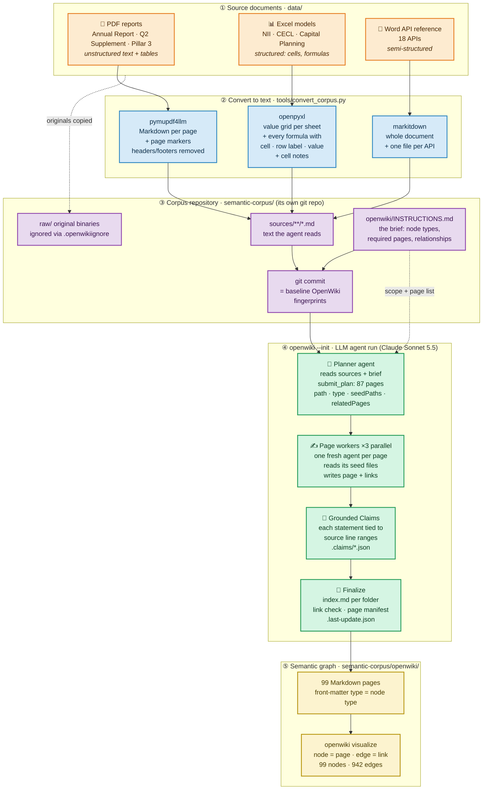
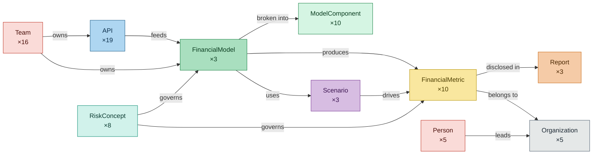
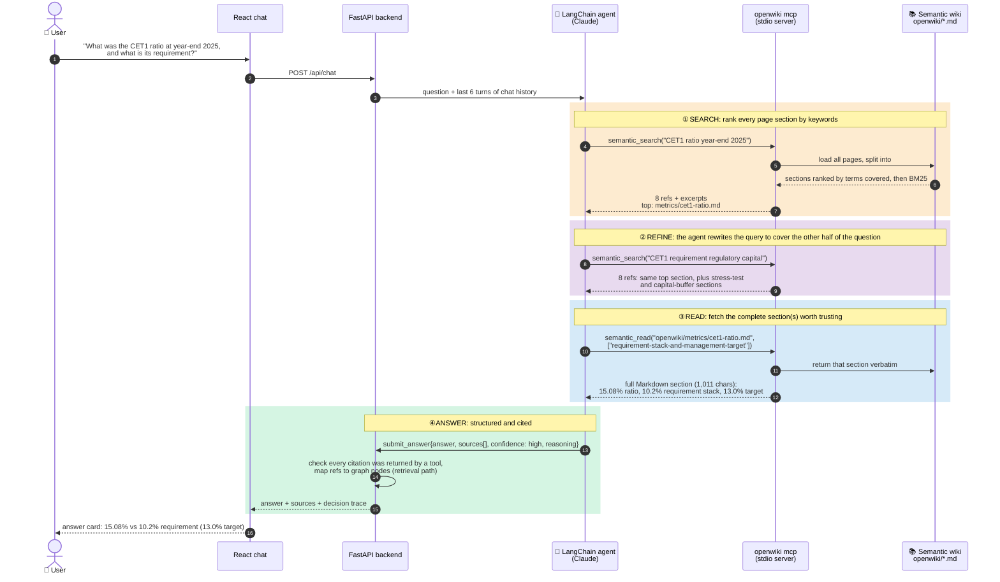
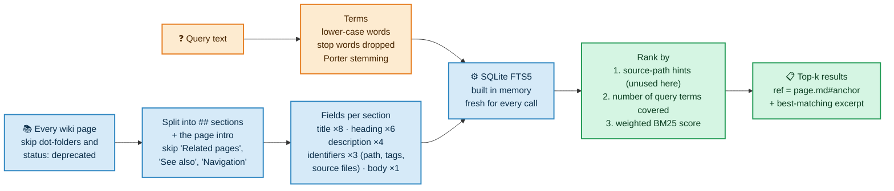
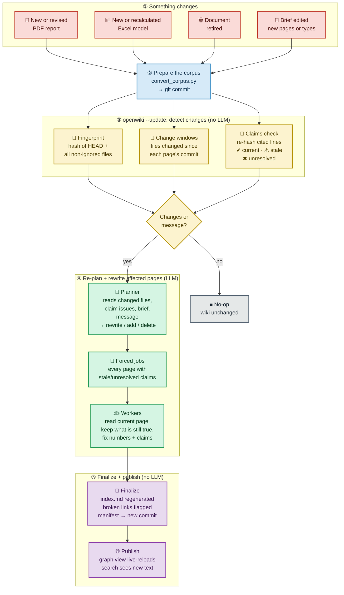
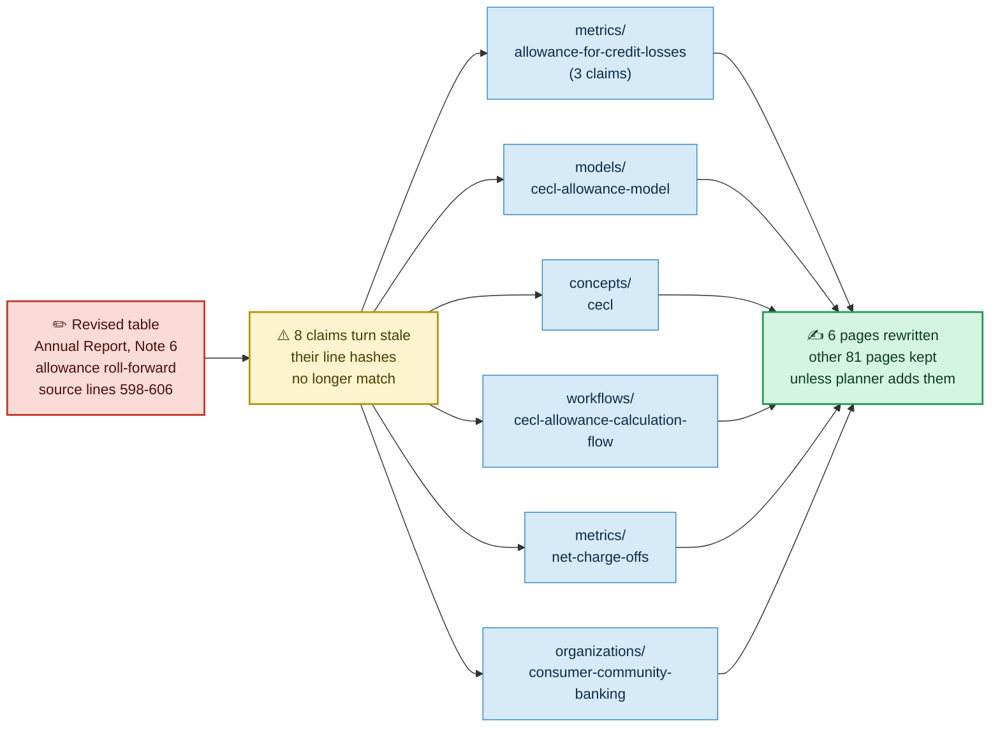

# Workings of the Wiki: how OpenWiki builds and uses the semantic graph

This note explains how the semantic graph (the "wiki") in this project is built from the bank's PDFs,
Excel models and Word document, how the Q&A agent finds answers in it, and how it is kept up to date
when documents change. It covers the **semantic wiki only** (`semantic-corpus/openwiki/`), not the
agent-memory context graph.

The tool is LangChain's **OpenWiki** CLI (v0.7.0), which works much like DeepWiki: an LLM agent reads
a repository and writes a linked Markdown wiki about it. Everything below was checked against the
installed OpenWiki source, the generated wiki in this repo and the traces in `docs/openwiki-findings.md`.

> Diagrams are Mermaid. They render on GitHub, in VS Code (with a Mermaid preview extension), in
> Obsidian and in most Markdown viewers.

---

## 0. The idea in one minute

The "graph" is **not a graph database and has no vector embeddings**. It is a folder of Markdown files:

| Graph concept | What it physically is | Example |
|---|---|---|
| **Node** | One Markdown page | `openwiki/models/cecl-allowance-model.md` |
| **Node type** | The page's front-matter `type:` field | `type: FinancialModel` |
| **Edge** | A relative Markdown link from one page to another | `[API-10](../apis/api-10-credit-risk-scoring-api.md)` |
| **Edge meaning** | The sentence or "Relationships" bullet around the link (the visualizer draws edges without labels) | `- consumes: [API-10 ...]` |
| **Evidence** | "Grounded Claims": each statement points to exact source lines | `repo://sources/models/cecl-allowance-model.md#L119-L137` |
| **Retrieval** | Keyword (BM25) search over page sections, then a read of whole sections | `openwiki_search` -> `openwiki_read` |

The current wiki has **99 pages (nodes) and 942 links (edges)**, built from 7 source documents.

---

## 1. How the graph is built from structured and unstructured data



### Steps, summarized

1. **Collect the documents.** 3 PDF reports (unstructured prose and tables), 3 Excel models
   (structured cells and live formulas) and 1 Word API reference (semi-structured). The documents
   cross-reference each other on purpose (reports cite model IDs, models list their upstream APIs), and
   those references become edges later.

2. **Turn every file into Markdown text** (`tools/convert_corpus.py`). OpenWiki's agent reads text
   files with shell tools and **cannot open PDF, XLSX or DOCX**, so this step is required.
   - **PDF:** `pymupdf4llm` produces Markdown page by page with `<!-- page N -->` markers (so pages can be
     cited) and strips running headers, footers and table-of-contents dot leaders.
   - **Excel:** `openpyxl` reads the workbook twice (formulas and cached values). Each sheet becomes a
     value grid, followed by a table of **every formula** with its cell, row label, column header,
     formula text and computed value, plus cell comments. README sheets become key/value text. This is
     what lets the wiki explain model logic down to cells like `Allowance_Summary!G12`.
   - **Word:** `markitdown` converts the whole reference, and the script also splits it into one file
     per API, so each API has its own source file.

3. **Make the corpus a git repository** (`semantic-corpus/`). OpenWiki only documents "the current
   repository": it fingerprints files and records the git commit it documented. The originals are
   kept in `raw/` but hidden from OpenWiki with `.openwikiignore`.

4. **Write the brief** (`openwiki/INSTRUCTIONS.md`, from `templates/semantic-INSTRUCTIONS.md`). OpenWiki
   reads it and never rewrites it. It defines the **graph schema**: 10 node types (Organization,
   Report, FinancialMetric, FinancialModel, ModelComponent, API, RiskConcept, Scenario, Person, Team), the
   ~80 pages to create, and the relationships to express as links. This is the main lever on the graph's
   shape: with a brief that only described page types, the first (Haiku) run planned a single page.

5. **Plan** (`openwiki --init`, planning phase). A planner agent explores `sources/` and the brief and
   calls `submit_plan` once with the full page list. For this corpus it planned 87 pages, each with a
   path, a type, **seed paths** (source files to read) and **related pages** (future links). Page paths
   are fixed from this point.

6. **Write pages in parallel** (generating phase). One fresh worker agent per planned page (3 at a
   time here) reads its seed files and writes only its own page: front matter (`type`, `title`,
   `description`, `tags`), sections with exact numbers and as-of dates, Mermaid diagrams, and a
   **Relationships** section of typed links. `relatedPages` from the plan only tells the worker which
   pages to link to; the links themselves are ordinary Markdown written by the model. A worker that
   fails or never submits is marked skipped (11 pages in the first full run), and
   `scripts/build-semantic.ps1` re-runs those pages with a targeted `--update`.

7. **Ground every claim.** When a worker submits its page, it also submits the page's key factual
   statements ("claims"), each with evidence pointing to exact source lines
   (`repo://sources/...#L166-L176`). OpenWiki resolves the evidence and stores it in
   `.claims/<page>.json` together with hashes of the cited lines and three lines of context on each
   side. A page without at least one claim is rejected. The current wiki has 803 claims across 87
   claim files. These hashes are what later tells OpenWiki which pages a source edit affects.

8. **Finalize.** OpenWiki then does the bookkeeping itself, without the LLM:
   - regenerates an `index.md` in every folder (title and description of each page);
   - checks every internal link and heading anchor, and marks broken ones with an HTML comment
     instead of failing;
   - fills each page's `sources:` and `verified:` front matter from its claims;
   - writes `.page-manifest.json` (per page: the commit and source fingerprint it was written against,
     plus a hash of its content) and `.last-update.json` (commit documented, model, status).

   The manifest and `.last-update.json` are the baseline that later updates compare against.

9. **Visualize.** `openwiki visualize semantic-corpus/openwiki` turns the folder into the graph: one
   node per page (coloured by `type`), one edge per link. Links to pages that do not exist are dropped,
   and `INSTRUCTIONS.md` is excluded.

### What the graph looks like (schema)

The brief's relationship rules give the graph this shape (counts are nodes in the current wiki):



An actual node: the bottom of `openwiki/apis/api-10-credit-risk-scoring-api.md`. Each bullet is one
edge in the graph, and the words before the colon say what the edge means:

```markdown
## Relationships

- owned by: [Risk Analytics Engineering](../teams/risk-analytics-engineering.md)
- feeds (PD/LGD inputs): [CECL allowance model (MDL-CR-007)](../models/cecl-allowance-model.md)
- feeds (PD calculation): [CECL lifetime PD](../models/components/cecl-lifetime-pd.md)
- consumes: [API-11 Loan Servicing API](api-11-loan-servicing-api.md)
- consumes: [API-14 Macroeconomic Scenario API](api-14-macroeconomic-scenario-api.md)
```

---

## 2. How the agent navigates the wiki to answer a question

The agent (LangChain `create_agent` + Claude, in `backend/app/agent.py`) has two wiki tools,
`semantic_search` and `semantic_read`. They are thin wrappers over OpenWiki's MCP tools `openwiki_search`
and `openwiki_read` (`backend/app/mcp_tools.py`). The diagram follows a real recorded turn from
`context-corpus/sessions/`: *"What was Meridian Harbor's CET1 ratio at year-end 2025, and what is its
requirement?"*



What happens inside one `openwiki_search` call (`dist/retrieval/wiki.js`):



### Steps, summarized

1. **The question arrives with context.** The backend passes the question and the last 6 chat turns to
   the agent. The system prompt tells it to ground every factual answer in the wiki: search first, read
   the best sections, quote numbers exactly with units and dates, and cite refs.

2. **Search finds sections, not pages.** The agent turns the question into a short keyword query.
   OpenWiki loads every wiki page, cuts it into its `##` sections and ranks them with SQLite full-text
   search. A section that covers more of the query's words wins first; BM25 breaks ties, giving the most
   weight to a page's title, then section headings, then the description. Each result is compact: a
   `page.md#section` ref plus the best-matching paragraph.

3. **The agent refines and decomposes.** Keyword search works best on short, specific queries, so the
   agent splits multi-part questions into several searches. Running OpenWiki's search function on this
   wiki shows why:

   | Query | Top result |
   |---|---|
   | the whole question: "Which APIs feed the CECL model, and who owns that model?" | `teams/lending-platforms-engineering.md` (off target) |
   | "CECL allowance model input APIs" | `models/cecl-allowance-model.md#inputs-and-the-apis-consumed` ✅ |
   | "MDL-CR-007 owner" | `teams/consumer-wholesale-credit-risk-allowance-methodology.md#what-the-team-owns` ✅ |

4. **Read pulls the exact section.** `semantic_read(page, [anchors])` returns the complete Markdown of
   the chosen sections (tables, formulas, numbers with dates). This two-step "search, then read" keeps
   prompts small (the CET1 turn used about 14.5k input tokens in total). The agent sometimes answers
   from the search excerpts alone when they already contain the number.

5. **The graph helps, but search does not walk it.** `openwiki_search` never follows links. The graph
   helps in three indirect ways:
   - **One entity per page:** a search lands on the node about the thing asked (the CET1 page, the
     CECL model page) rather than a long mixed document.
   - **Neighbours are restated on each page:** the CECL model page already lists its APIs and owner
     team in sentences, so one section often answers a "who/what is connected" question without a hop.
   - **The agent makes the hops:** names it reads in a section (API-10, MDL-CR-007, a team name) become
     its next search query. That is how it moves from node to node.

6. **Answer, cited and checked.** The agent calls `submit_answer` with the answer, the refs it relied
   on, a confidence level and a short reasoning summary. The backend flags any citation that no tool
   actually returned, and builds a "How the answer was found" retrieval path: every node the tools
   touched, whether it was opened or cited, and the graph edges between them (taken from the visualizer's
   `/api/graph`).

7. **Limits.** The wiki holds what the Excel models compute (cell values and formula text), so the
   agent can explain a model but cannot rerun it with new inputs; for "what if" questions it names the
   input cell and the outputs that would change instead. If the wiki has no answer, it says so rather
   than using outside knowledge.

---

## 3. How the graph is updated when information changes

The wiki is not rebuilt for every change. `openwiki --update` works out which pages a change touches,
rewrites only those, and leaves every other page as it was (apart from bookkeeping such as folder
indexes and broken-link markers). (`openwiki --init`, by
contrast, deletes everything except `INSTRUCTIONS.md` and rebuilds from scratch: about 45 minutes and
$25-35 for this corpus.)



### Steps, summarized

1. **A document changes or arrives.** The new or revised file goes into `data/`. Excel workbooks must be
   recalculated and saved in Excel or LibreOffice first: the converter reads the values cached in the
   file, not live formula results.

2. **Re-convert and commit.** `tools/convert_corpus.py` re-renders every document. Unchanged documents
   come out with identical text (when converted on the same OS, see line endings below), so git only
   sees real changes. The converter never deletes old output,
   so a retired document's Markdown must be removed from `semantic-corpus/sources/` by hand. Then commit
   in `semantic-corpus/`.

3. **Detect what changed.** `openwiki --update` compares the repository with the baseline from the last
   run in three ways:
   - **Fingerprint:** a hash over the current commit and the bytes of every file that is not ignored
     (`openwiki/` and `raw/` are excluded). Any new commit changes it.
   - **Per-page change windows:** for each page, the list of files changed (git diff) since the commit
     that page was last written against. The planner gets file paths only, not diffs.
   - **Claims check:** every claim's cited lines are found and re-hashed. Lines that only moved stay
     *current*; lines whose text changed make the claim *stale*; lines or files that are gone make it
     *unresolved*. This is the precise link from "a number changed in a PDF" to "these pages quote it".

4. **No-op if nothing changed.** If the tree is clean, no source file changed since the last run and
   every claim is current, the run exits without calling the planner. Passing a message
   (`--update --print "<guidance>"`) always forces planning.

5. **Re-plan.** The planner agent sees the change windows, the stale and unresolved claims, the brief
   and any message. It can rewrite pages, add pages, delete pages, or submit an empty plan. OpenWiki then
   adds a job for every page with a stale or unresolved claim that the planner left out, so affected
   pages are never skipped.

6. **Rewrite selectively.** Workers on existing pages are told to read the current page first and keep
   accurate content that is unaffected. They re-confirm, replace or retract claims. Pages not in the plan
   are not rewritten and keep their old baseline in the manifest.

7. **Finalize.** Folder `index.md` files are regenerated, so new pages appear in the listings. Links are
   re-checked: links to a deleted page are flagged with a comment but **not repaired** unless that
   linking page was also rewritten. The manifest records the new baseline for each rewritten page, and
   `.last-update.json` moves to the new commit (it stays `interrupted` if any page was skipped).

8. **Publish.** `--update` edits files in place, and the running visualizer watches the folder, so it
   redraws the graph with the new nodes and edges on its own. (After an `--init` the folder is recreated and the viewer has to be
   restarted.) Search needs no re-indexing step: it builds its index from the Markdown on every call.

### A concrete ripple: one edited table, six pages

Suppose the Annual Report's Note 6 allowance roll-forward is revised. In the converted text that table
is `sources/reports/mhfc-2025-annual-report.md` lines 598-606. The claims files show exactly which pages
cite those lines:



These six pages are the minimum: OpenWiki forces them into the plan even if the planner misses them,
and the planner may add more. In practice the same figure also sits in the CECL workbook and the
Pillar 3 report, so a real revision would change those sources too, and their claims would pull in
their own pages the same way.

### What happens for each kind of change

| Change | What you do | What `openwiki --update` does |
|---|---|---|
| **A figure is revised in an existing PDF** | Replace the PDF, re-convert, commit | Claims citing the edited lines go stale, so every page quoting the figure is rewritten (example above). |
| **A new PDF arrives** (e.g. a Q3 2026 earnings supplement) | Add it, re-convert, commit. Add its page to the brief's required-pages list or pass a message | No existing claim cites the new file, so nothing is forced. The planner sees the new path in the change list and decides what to add: typically a new `Report` page plus rewrites of the metric and segment pages that should link to it. Each new link is a new edge. |
| **A new Excel model arrives** | Add it, re-convert, commit. List the model and its component pages in the brief | The planner adds `FinancialModel` and `ModelComponent` pages from the converted formulas and links them to the APIs, metrics and teams it names. |
| **An Excel assumption changes** (e.g. scenario weights) | Recalculate and save the workbook, re-convert, commit | The value grid and formula lines change, so claims go stale and the model, component and metric pages are rewritten with the new numbers. |
| **A document is retired** | Delete it from `data/` and its Markdown from `sources/`, commit | Its claims become unresolved, so the citing pages are forced into the plan. The planner can delete pages that only described it. Links that still point to deleted pages are flagged, not removed. |
| **Only the brief changes** (new page or type) | Edit `INSTRUCTIONS.md`, then `--update --print "<what to add>"`, or `--init` for a restructure | Brief edits are outside change detection (`openwiki/` is excluded), so the planner is not told the brief changed. Say what to add in the message. |
| **Nothing changed** | — | No-op: quick exit, no model calls. |

### Things to know before running an update

- **Every update is an LLM run.** Time and cost scale with the number of pages rewritten. Re-running
  11 skipped pages with Sonnet took about 10 minutes.
- **A plain `--update` will not improve thin pages.** With no source change and no claim issues it is a
  no-op. Name the pages and what is missing in a message. The message reaches the planner only; workers
  see it only if the planner copies it into a page's instructions.
- **Commit the wiki after each run.** Uncommitted wiki pages make the next no-op check think the tree
  has changed.
- **Convert on the same OS as the original build, or normalise line endings.** Python writes CRLF on
  Windows and LF on macOS. Re-converting this corpus on a Mac produced text identical to the shipped
  corpus apart from line endings, but every file's bytes differ, so every file would count as changed.
- **First update after restoring the prebuilt wiki (this repo).** The wiki's baseline commit
  (`afc1c7a…` in `.last-update.json` and the manifest) comes from the original build machine and does not
  exist in the restored `semantic-corpus` history (one commit, `46bfa6f`). From reading the OpenWiki
  source (not yet tested): the git diff behind the change windows then fails silently, so **committed**
  source changes would not be listed for that first update. Edits to cited lines are still caught by the
  claims check. To be safe, leave the source changes uncommitted for the first update (uncommitted and
  untracked files are listed), or pass a message naming the changed files.
- **No automatic trigger in this POC.** The semantic wiki is built once and shipped prebuilt. OpenWiki
  also generated `.github/workflows/openwiki-update.yml`, which runs `openwiki code --update --print`
  daily in GitHub Actions and opens a pull request with the wiki changes. That would automate updates if
  the corpus repository were hosted on GitHub.

### Update recipe

```text
1. Put the new or changed file in data/        (recalculate and save Excel workbooks first)
2. python tools/convert_corpus.py --data data --out semantic-corpus
3. Retired document?   delete its Markdown under semantic-corpus/sources/
4. New entity type or page?   add it to semantic-corpus/openwiki/INSTRUCTIONS.md
5. In semantic-corpus/:   git add -A   then   git commit -m "corpus: <what changed>"
6. In semantic-corpus/:   node <openwiki cli.js> --update --print ["<optional guidance>"]
   (same environment as scripts/build-semantic.ps1: OPENWIKI_CONFIG_DIR, provider, model,
    ANTHROPIC_API_KEY, LANGCHAIN_TRACING_V2=false)
7. In semantic-corpus/:   git add -A   then   git commit -m "wiki: update"
```

---

## Where things live

| What | Path |
|---|---|
| Original documents | `data/reports/`, `data/models/`, `data/api_docs/` |
| Converter | `tools/convert_corpus.py` |
| Graph brief (schema and page list) | `templates/semantic-INSTRUCTIONS.md` -> `semantic-corpus/openwiki/INSTRUCTIONS.md` |
| Converted text the agent reads | `semantic-corpus/sources/` |
| The wiki (graph) | `semantic-corpus/openwiki/*.md` |
| Claims and evidence | `semantic-corpus/openwiki/.claims/` |
| Update baseline | `semantic-corpus/openwiki/.page-manifest.json`, `.last-update.json` |
| Build script | `scripts/build-semantic.ps1` |
| Agent and its wiki tools | `backend/app/agent.py`, `backend/app/mcp_tools.py` |
| Retrieval path (nodes found, opened, cited) | `backend/app/retrieval_path.py` |
| Measured behaviour, timings, issues | `docs/openwiki-findings.md` |
