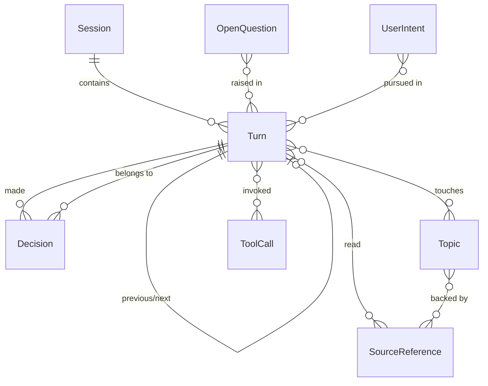

## Overview

The context graph is the wiki this repository builds on top of the agent's raw
trace files. Where a trace file (`sessions/<session-id>/turn-NNNN.md`) records
one turn's raw question, answer, decision trace, and sources, the context
graph re-organizes those same facts into a linked set of typed pages so a
reader can answer cross-cutting questions such as "what has the user asked so
far?", "why did the agent answer X?", "which sources were used most?", "where
was the agent unsure?", and "which earlier answer is this question following
up?". See [Trace Log Format](trace-log-format.md) for the raw file shape this
graph is built from, and [Build Context Graph](../workflows/build-context-graph.md)
for the procedure that produces it.

The graph is defined by two things: a fixed set of page **types**, each with a
fixed granularity ("one page per X"), and a **mandatory link graph** between
those pages. Both are normative: every context-graph page must declare one of
these `type` values in its front matter, and every Turn/Decision pair must
carry the required links described below.

## Page types

Each page type uses exactly one of these values in its front-matter `type`
field. There is no page type for the timeline or the wiki index; those are
structural pages described separately below.

| `type` | Granularity: one page per | Required content |
|---|---|---|
| `Session` | session folder (`sessions/<session-id>/`) | start time, number of turns, topics covered, links to every Turn in order |
| `Turn` | turn file (`sessions/<session-id>/turn-NNNN.md`) | the question, a short answer summary, confidence, latency, links to its Session, previous/next Turn, Decisions, Topics, and SourceReferences |
| `Decision` | each meaningful choice recorded in a turn's decision trace | what was chosen (e.g. "searched the semantic wiki for CECL scenario weights", "relied on Annual Report Note 6 over the Excel model", "declined to compute a new scenario"), why (from the reasoning summary and tool results), and the outcome |
| `ToolCall` | each distinct tool-call *pattern*, not each individual call | tool name, typical queries, how often the pattern is used, which Turns used it |
| `SourceReference` | each semantic-wiki page path the agent read, aggregated across turns | the semantic-wiki page path (e.g. `openwiki/models/cecl-allowance-model.md`), what it was used for, which Turns used it |
| `Topic` | each recurring subject the user asks about | e.g. CECL allowance, NII sensitivity, capital plan, API lineage; links to the Turns that touched it and the SourceReferences used for it |
| `OpenQuestion` | each unresolved or low-confidence item | follow-ups the agent suggested, questions it could not answer, contradictions it noticed |
| `UserIntent` | each distinct goal the user appears to pursue across turns | e.g. "understand how models depend on APIs"; links to the Turns that advance that goal |

Source: the page-type table and per-type content rules in the OpenWiki brief.

### Aggregation types are deliberately not one-per-event

`ToolCall` and `SourceReference` are aggregation types: they summarize a
recurring pattern across many turns rather than recording a single event.

- A `ToolCall` page covers one distinct tool-call *pattern* (for example, "semantic-wiki search for CECL-related pages"). Do not create a separate `ToolCall` page for every individual invocation recorded in a decision trace; instead, fold repeated invocations of the same pattern into the one page and list the turns that used it.
- A `SourceReference` page covers one semantic-wiki page *path*, aggregated across every turn that read it. If turn 3 and turn 7 both cite `openwiki/models/cecl-allowance-model.md`, that is a single `SourceReference` page with both turns linked, not two pages.

This keeps `Turn` pages short (raw per-turn detail lives on the Turn and
Decision pages) while aggregate analysis — which tool patterns and sources
recur most, where confidence is weakest — lives on the `ToolCall`, `SourceReference`,
and `Topic` pages instead of being duplicated on every Turn.

### Structural pages outside the eight types

Two additional pages are required but do not use one of the eight `type`
values above:

- **`timeline`**: a single page listing every Turn from every Session in chronological order, independent of which session it belongs to. It is the cross-session ordering view that complements each Session's own ordered Turn list. See [Timeline](../timeline.md).
- **`index.md`**: the reserved wiki index/entry point.

## Required link graph

The brief fixes a minimum link graph that every Turn and Decision page must
satisfy; pages that omit these links are incomplete even if their prose is
accurate.

- Every **Turn** page links to:
  - its **Session** page;
  - the **previous Turn** (if one exists) and the **next Turn** (if one exists), forming a chronological chain within the session;
  - each **Decision** page for a decision made during that turn;
  - each **Topic** page the turn's question or answer touches;
  - each **SourceReference** page for a semantic-wiki page the turn read.
- Every **Decision** page links back to the **Turn** it belongs to.

These rules only state the mandatory minimum edges. `Session` pages add the
reverse edge to every Turn they contain (in order); `Topic`, `ToolCall`, and
`SourceReference` pages add reverse edges back to the Turns that reference
them, so every link in the graph is effectively navigable in both directions
even though only the Turn -> Session/Decision/Topic/SourceReference and
Decision -> Turn directions are mandated directly.

`OpenQuestion` and `UserIntent` pages are populated from the same per-turn
evidence (a turn's reasoning summary, follow-up questions, and the arc of
goals a user pursues across turns) but the brief does not mandate a fixed set
of edges for them beyond linking to the Turns that motivate them; treat that
linkage as a one-way reference from the OpenQuestion/UserIntent page to the
relevant Turns.

## Entity-relationship diagram

Entity-relationship diagram of the eight context-graph page types: the Turn
entity is the hub, mandatorily linked to its Session, its previous/next Turn,
the Decisions it made, and the Topics and SourceReferences it touched; every
Decision links back to exactly one Turn.

## Invariants and failure modes

- **No invented facts.** Every Turn, Decision, ToolCall, and SourceReference page must copy exact facts (timestamps, tool names, semantic-wiki page paths, confidence values) from the underlying trace files. A context-graph page must never record a tool call or a cited source that is not present in a trace file.
- **Self-reported reasoning is labeled, not treated as verified.** Each turn's "Reasoning summary" is the agent's own self-report; Turn and Decision pages must present it as such rather than as confirmed reasoning.
- **Turn pages stay short.** Per-turn pages hold only the question, a short answer summary, confidence, latency, and the required links; cross-turn aggregate analysis (most-used sources, recurring uncertainty, tool-call frequency) belongs on Topic, ToolCall, and SourceReference pages instead.
- **Granularity mismatches break the model.** Creating one `ToolCall` page per individual call, or one `SourceReference` page per (turn, semantic page) pair instead of per semantic page path, violates the aggregation rule and fragments the graph's aggregate views.
- **Every Decision must resolve to a Turn.** A `Decision` page with no `Turn` backlink, or a `Turn` with a decision in its trace but no corresponding `Decision` page, is an incomplete graph and should be treated as a build defect, not an acceptable gap.

## Related pages

- [Trace Log Format](trace-log-format.md) — the per-turn Markdown trace files this graph is derived from.
- [Timeline](../timeline.md) — the cross-session chronological view built from every Turn page.
- [Build Context Graph](../workflows/build-context-graph.md) — the workflow that reads trace files and produces/updates these typed pages and links.
