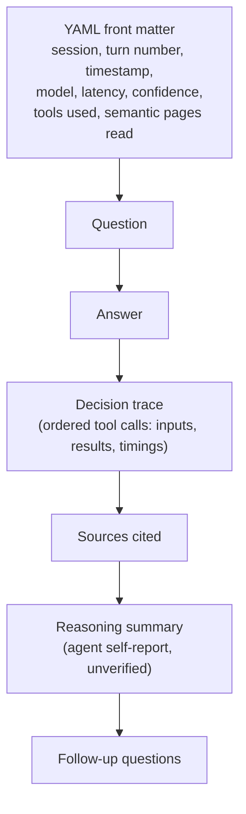

## Status: schema not yet observed in real files

This repository's `sessions/` directory currently contains no populated
`sessions/<session-id>/` folders — only a placeholder (`sessions/.gitkeep`).
Everything below is the **schema as specified** in
[openwiki/INSTRUCTIONS.md](../../openwiki/INSTRUCTIONS.md) and the repository
[README.md](../../README.md), not a description of files that have actually
been read. No trace file content (timestamps, tool names, semantic-wiki page
paths, confidence values, etc.) has been observed yet. When real
`sessions/<session-id>/session.md` and `sessions/<session-id>/turn-NNNN.md`
files exist, this page must be updated to copy their exact fields and values
rather than paraphrase them — concrete facts should never be invented ahead of
that evidence.

## Purpose

The trace log is the primary data source for the entire context graph
documented in [Context Graph Model](context-graph-model.md) and built by the
workflow in [Build Context Graph](../workflows/build-context-graph.md). It is
the ground truth the agent writes as it answers questions about the fictional
bank (Meridian Harbor Financial Corp.) using a separate semantic wiki. Every
`Session`, `Turn`, `Decision`, `ToolCall`, `SourceReference`, `Topic`,
`OpenQuestion`, and `UserIntent` page in the context graph must be faithfully
derivable from these files — no fact may be invented or inferred beyond what
a trace file states.

## On-disk layout

```
sessions/
  <session-id>/
    session.md
    turn-0001.md
    turn-0002.md
    ...
```

- One folder per conversation session, named by `<session-id>`.
- Each session folder holds exactly one `session.md` and one `turn-NNNN.md`
  per conversation turn, where `NNNN` is the turn number (zero-padded, per
  the `turn-NNNN.md` naming convention).

## `session.md`: session metadata and turn list

Per the repository brief, `session.md` holds:

- Session metadata (e.g. session identity/start information).
- A running list of the turns that belong to the session, in order.

This file is the authoritative source for a `Session` page's turn ordering —
the context-graph build must link every `Turn` page to its `Session` and
preserve the previous/next turn ordering exactly as listed here, not as
inferred from file names or timestamps.

## `turn-NNNN.md`: one file per conversation turn

Each turn file has two parts: YAML front matter, followed by a fixed set of
Markdown sections.

### Front matter fields

The front matter records (per turn):

- session — the owning session identifier.
- turn number — the turn's position within the session.
- timestamp — when the turn occurred.
- model — the model used to answer.
- latency — time taken to answer.
- confidence — the agent's self-assessed confidence in its answer.
- tools used — which tools were invoked during the turn.
- semantic pages read — which semantic-wiki page paths the agent consulted.

These are the exact fields the context graph's `Turn` pages must surface
(confidence, latency, tool names) and the `SourceReference` pages must key on
(semantic-wiki page paths). Once real trace files exist, these values must be
copied verbatim into the wiki rather than summarized or rounded.

### Sections

Following the front matter, each `turn-NNNN.md` contains, in order:

1. **Question** — the user's question for this turn, verbatim.
2. **Answer** — the agent's answer.
3. **Decision trace** — the ordered sequence of tool calls made while
   answering, including each call's inputs, results, and timings. This is
   the source material for individual `Decision` pages (what was chosen, why,
   and the outcome) and for aggregate `ToolCall` pages (tool name, typical
   queries, frequency, which turns used it).
4. **Sources cited** — the semantic-wiki pages the answer actually cites,
   feeding `SourceReference` pages (what a source was used for, which turns
   used it).
5. **Reasoning summary** — **the agent's own self-report of why it answered
   as it did.** This section is *not* verified reasoning and must never be
   presented in the context graph as ground truth; any page that quotes or
   paraphrases it (e.g. a `Decision` page's "why") must label it explicitly
   as the agent's self-report.
6. **Follow-up questions** — questions the agent suggests for later turns;
   source material for `OpenQuestion` pages (unresolved or low-confidence
   items) and for linking a `Turn` to a subsequent one that follows up on it.

### Turn file structure



## Relationship to the context graph

| Trace log element | Feeds context-graph page type |
|---|---|
| `session.md` metadata and turn list | `Session` |
| Turn front matter + Question/Answer | `Turn` |
| Decision trace entries | `Decision`, aggregated into `ToolCall` |
| Sources cited / semantic pages read | `SourceReference` |
| Recurring subjects across Questions/Answers | `Topic` |
| Reasoning summary / follow-up questions | `OpenQuestion` (self-reported uncertainty, suggested follow-ups) |
| Goals implied across multiple turns | `UserIntent` |

See [Context Graph Model](context-graph-model.md) for how these page types
link to one another, and [Build Context Graph](../workflows/build-context-graph.md)
for the procedure that reads trace files and produces these pages.

## Invariants the build must respect

- **Never invent tool calls, sources, or values.** Every timestamp, tool
  name, semantic-wiki page path, and confidence value placed on a
  context-graph page must be copied exactly from a `turn-NNNN.md` or
  `session.md` file, not approximated or guessed.
- **Reasoning summary is self-reported.** Any content sourced from a turn's
  Reasoning summary section must be clearly labeled as the agent's own
  account, distinct from the verifiable Decision trace (tool calls, inputs,
  results, timings) and Sources cited sections.
- **Ordering is authoritative.** The turn order recorded in `session.md` and
  the tool-call order recorded in a turn's Decision trace determine the
  previous/next `Turn` links and the sequencing shown on `Session` sequence
  diagrams; they must not be re-derived from file timestamps alone when the
  file content specifies order explicitly.
- **No populated examples exist yet.** Because `sessions/` currently has no
  `<session-id>` folders, no context-graph page can yet cite a real
  `turn-NNNN.md` or `session.md` file. Pages that describe the schema (like
  this one) must say so plainly rather than fabricate sample sessions, turns,
  or trace values.
