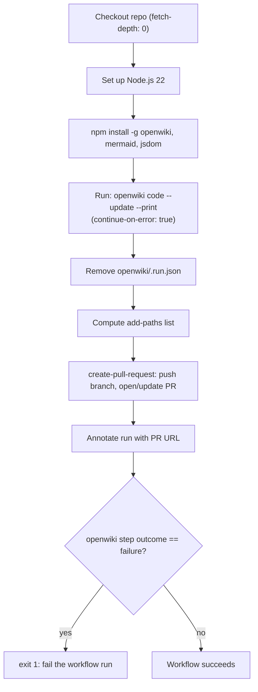

## Purpose

This repository's `openwiki/` context graph is not written by hand. It is
regenerated by a scheduled GitHub Actions workflow,
[`.github/workflows/openwiki-update.yml`](../../.github/workflows/openwiki-update.yml),
which runs the `openwiki code --update` command against the repository's
trace files (`sessions/<session-id>/session.md`, `sessions/<session-id>/turn-NNNN.md`)
and opens a pull request with whatever pages change. Anyone changing how the
graph is produced — cadence, credentials, which files get committed, or how
failures are surfaced — changes this workflow, not the generated pages
themselves. See [Quickstart](../quickstart.md) for what the graph contains and
[Build Context Graph](../workflows/build-context-graph.md) for how trace files
turn into pages; this page is about the automation that invokes that process.

## Trigger and permissions

The workflow (`name: OpenWiki Update`) runs on two triggers:

- `schedule`: cron `0 8 * * *` — once per day at 08:00 UTC.
- `workflow_dispatch`: manual runs from the Actions UI, useful for forcing an
  out-of-band refresh or re-running after fixing a failure.

It requests `contents: write` and `pull-requests: write` permissions, which it
needs to push the `openwiki/update` branch and open/update a pull request
against it.

## Pipeline steps

*Control flow of the scheduled refresh: the pull request is created even when
the OpenWiki run itself failed, and the job only fails afterward.*

1. **Checkout repository** (`actions/checkout@v4`) with `fetch-depth: 0`. A
   full clone is required because `openwiki code --update` diffs the current
   `HEAD` against the commit it last documented
   (`openwiki/.last-update.json`); a shallow clone would hide that commit and
   make the update see an empty change summary, i.e. it would think nothing
   changed.
2. **Set up Node.js** (`actions/setup-node@v4`) pinned to Node 22.
3. **Install OpenWiki**: `npm install --global openwiki@0.7.0 mermaid@11.16.0 jsdom@29.1.1`.
   The `mermaid`/`jsdom` packages are optional extras that let OpenWiki
   validate Mermaid diagrams at generation time (a diagram that fails to
   parse is degraded to a plain text fence with an explanatory comment rather
   than left broken); they can be dropped if a wiki never uses diagrams.
4. **Run OpenWiki**: `openwiki code --update --print`, with `continue-on-error: true`
   and `id: openwiki` so the job keeps going even if this step fails and
   later steps can read `steps.openwiki.outcome`.
5. **Remove transient OpenWiki run state**: deletes `openwiki/.run.json` so
   it is never committed. This step runs whenever the job was not cancelled
   (`if: ${{ !cancelled() }}`), i.e. even after step 4 failed, so a failed run
   still cleans up before any commit/PR step runs.
6. **List OpenWiki update paths**: builds a comma-separated `add-paths` list
   for the PR step — `openwiki,AGENTS.md,.github/workflows/openwiki-update.yml`,
   plus `CLAUDE.md` only if that file exists (staging a missing path makes
   `git add` fail and stage nothing, so the step probes for it first).
7. **Create OpenWiki update pull request**
   (`peter-evans/create-pull-request@v7`): stages exactly the listed paths,
   pushes branch `openwiki/update`, and opens or updates a pull request
   titled `docs: update OpenWiki` with commit message `docs: update OpenWiki`.
   The PR body embeds `${{ steps.openwiki.outcome }}` and an explanatory note
   (see below). This step also runs whenever the job was not cancelled, so a
   failed `openwiki` step still produces a PR with whatever pages were
   completed before the failure.
8. **Annotate OpenWiki update pull request**: emits a `::notice` Actions
   annotation with the PR URL when one was created/updated, so the URL is
   visible directly in the run summary instead of only in the step logs.
9. **Propagate OpenWiki failure**: if `steps.openwiki.outcome == 'failure'`,
   the job runs `exit 1`. This happens *after* the PR has already been
   created, so the workflow run is correctly marked failed (surfacing the
   problem to maintainers/alerts) without losing the partial documentation
   progress that was made.

## Environment variables and secrets

The `openwiki code --update` step is configured through environment
variables rather than CLI flags:

| Variable | Source | Purpose |
|---|---|---|
| `OPENWIKI_PROVIDER` | literal `gemini-enterprise` | Selects the model provider backend OpenWiki uses to generate page content. |
| `GOOGLE_CLOUD_PROJECT` | repo/org variable `vars.GOOGLE_CLOUD_PROJECT` | Project used by the `gemini-enterprise` provider for authentication/billing. |
| `OPENWIKI_MODEL_ID` | literal `claude-sonnet-5` | Pins the specific model used to write and update pages. |
| `OPENWIKI_LANGSMITH_API_KEY` | secret `secrets.OPENWIKI_LANGSMITH_API_KEY` | Required so the LangSmith connector's code-mode pull can authenticate when reading source trace data. Additional LangSmith workspaces are added as `OPENWIKI_LANGSMITH_API_KEY_2`, `_3`, etc., each needing both a new repo secret and a new env entry in this workflow. |
| `LANGSMITH_API_KEY` | secret `secrets.LANGSMITH_API_KEY` | Optional: enables tracing of the OpenWiki run itself to LangSmith (separate from the `OPENWIKI_LANGSMITH_API_KEY_*` connector credentials). |
| `LANGCHAIN_PROJECT` | literal `openwiki` | LangSmith project name for the optional self-trace. |
| `LANGCHAIN_TRACING_V2` | literal `"true"` | Enables LangChain/LangSmith tracing for the optional self-trace. |

Because `OPENWIKI_LANGSMITH_API_KEY` is required for the connector to read
trace data at all, a missing or expired secret will cause the `openwiki`
step to fail; the rest of the pipeline (PR creation, failure propagation)
still runs as described above so the failure is visible and any partial
output is preserved.

## Generated/transient state that is explicitly excluded

Two files in `openwiki/` are workflow-managed run state, not part of the
documentation graph, and are deliberately kept out of commits:

- `openwiki/.run.json` — the in-progress run record for a single
  `openwiki code --update`/`init` invocation: `runId`, `mode`, `phase`,
  `sourceFingerprint`, `targetGitHead`, the resolved `wikiGoal` brief, and the
  per-page `plan` (each planned page's path, purpose, seed paths, related
  pages, instructions, and `status`). The workflow explicitly deletes this
  file after the `openwiki` step (step 5 above) so it never reaches the
  pull request.
- `openwiki/.last-update.json` — a small pointer (`updatedAt`, `command`,
  `model`, `status`, `language`) recording the most recent run's outcome;
  OpenWiki itself manages this file across runs and uses it (together with
  the full git history from `fetch-depth: 0`) to compute what changed since
  the last update.

Because `add-paths` in the create-pull-request step only stages
`openwiki,AGENTS.md,.github/workflows/openwiki-update.yml` (plus `CLAUDE.md`
when present), any other working-tree changes outside those paths are never
included in the automated PR even if present after the run.

## Partial-progress-on-failure behavior

`openwiki code --update` can fail partway through a multi-page run (for
example, a connector authentication error or a model error on one page).
The pipeline is deliberately designed so that a failure does not discard
work already done in the same run:

- `continue-on-error: true` on the `openwiki` step lets the job proceed to
  cleanup, PR creation, and annotation instead of stopping immediately.
- The cleanup and PR-creation steps use `if: ${{ !cancelled() }}`, so they
  run after either success or failure (only an explicit workflow
  cancellation skips them).
- The PR body includes `OpenWiki result: ${{ steps.openwiki.outcome }}` and a
  note that, when the result is `failure`, the PR intentionally contains only
  the pages completed before the failure, and merging it makes that partial
  progress the new baseline for the next scheduled run.
- Only after the PR is created does the final step re-raise the failure
  (`exit 1`) so the GitHub Actions run is marked failed and any configured
  failure notifications fire.

The net effect: a failed refresh still produces a reviewable PR with
whatever pages were finished, the workflow run still shows red so the
failure is not silently swallowed, and the next scheduled run resumes
against whatever was merged, not against a fully discarded attempt.

## Operating guidance

- **Do not hand-edit generated OpenWiki pages** outside of the OpenWiki
  planning process described by this pipeline. If a page is wrong or
  incomplete, update the underlying source trace files under `sessions/` (or
  the relevant seed sources for other pages) and let the next scheduled or
  manually dispatched run regenerate the affected pages; direct edits will be
  overwritten by the next refresh and bypass the Claim-tracking this pipeline
  relies on.
- To force a refresh outside the daily cadence, use the `workflow_dispatch`
  trigger from the Actions UI rather than waiting for the cron schedule.
- When adding a new LangSmith workspace as a trace source, add both a new
  `OPENWIKI_LANGSMITH_API_KEY_N` repository secret and a matching env entry
  in this workflow; the connector will not pick up a workspace whose key is
  only present as a secret but not wired into the job.
- `openwiki/.run.json` and `openwiki/.last-update.json` are workflow/tooling
  state, not content to curate; `.run.json` is removed by the workflow every
  run, and `.last-update.json` is owned by OpenWiki itself.
- If `GOOGLE_CLOUD_PROJECT` or any `OPENWIKI_LANGSMITH_API_KEY*`/`LANGSMITH_API_KEY`
  secret is rotated or revoked, the `openwiki` step will fail on the next
  scheduled run; because of the partial-progress behavior above, this
  surfaces as a failed workflow run plus (if any pages completed before the
  failure) a PR to review, rather than a silently stale wiki.
