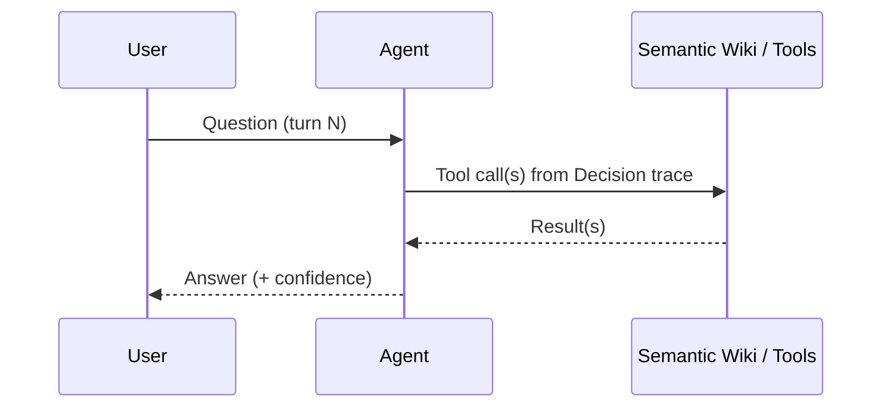

## Purpose

This repository is the trace log of a question-answering agent that answers questions about a
fictional bank by consulting a separate semantic wiki. Every conversation turn is written to disk as
a pair of Markdown trace files under `sessions/<session-id>/`:

- `session.md` - session metadata and a running list of turns.
- `turn-NNNN.md` - one file per turn, with YAML front matter (session, turn number, timestamp, model,
  latency, confidence, tools used, semantic pages read) followed by Question, Answer, Decision trace,
  Sources cited, Reasoning summary, and Follow-up questions sections.

This workflow describes how OpenWiki turns those raw trace files into a **context graph**: a set of
linked wiki pages that let a reader answer "what has the user asked so far?", "why did the agent
answer X?", "which sources were used most?", "where was the agent unsure?", and "which earlier answer
is this question following up?". See [Context Graph Model](../concepts/context-graph-model.md) for the
page-type schema this workflow populates, and [Trace Log Format](../concepts/trace-log-format.md) for
the exact shape of `session.md` and `turn-NNNN.md`. No sessions exist in this repository yet; the
steps below are the intended process to run as soon as the agent starts writing trace files, not a
record of pages already produced.

## When this workflow runs

The workflow triggers whenever the [wiki refresh pipeline](../operations/wiki-refresh-pipeline.md)
observes new or changed files under `sessions/`. Two situations are distinguished:

- **New session**: a `sessions/<id>/` folder appears that has no corresponding Session page yet.
- **New turn(s)**: one or more `turn-NNNN.md` files appear (or `session.md`'s turn list grows) under a
  session that already has a Session page.

Both cases run the same per-turn extraction step; a new session additionally creates the Session page
itself before its first Turn is processed.

## Inputs and outputs

| Input | Produces / updates |
|---|---|
| `sessions/<id>/session.md` | one `Session` page |
| `sessions/<id>/turn-NNNN.md` | one `Turn` page, zero or more `Decision` pages, updates to `ToolCall` and `SourceReference` pages |
| All turns across all sessions, read incrementally | `Topic`, `UserIntent`, and `OpenQuestion` pages (created or updated as evidence accumulates) |
| Every processed turn | one row appended to the `timeline` page in chronological order |

## Step 1 - Create or update the Session page

For a new `sessions/<id>/session.md`, create one `Session` page recording the start time, the eventual
number of turns, the topics covered (filled in and kept current as Topics are detected in later
steps), and ordered links to every Turn page belonging to the session. Each Session page must include
a Mermaid sequence diagram showing `user -> agent -> tools -> answer` for its turns, built from the
tool calls recorded in that session's turn files - never invented tools or steps.


*Shape of the per-session sequence diagram: one such diagram per Session page, built only from that session's actual turns.*

When later turns are added to an existing session, the Session page's turn list, topic list, and
diagram are updated rather than recreated.

## Step 2 - Per-turn extraction (Turn, Decision, ToolCall, SourceReference)

Each `turn-NNNN.md` is processed independently, in turn order, into one `Turn` page plus the pages for
whatever it introduces:

1. **Turn page.** Create one page per turn containing the question, a short answer summary, the
   confidence and latency values copied verbatim from the trace file's front matter, and links to: the
   Turn's Session, the previous Turn (if any) and the next Turn once it exists, each Decision made in
   this turn, each Topic the turn touches, and each SourceReference it read. Keep this page short -
   push aggregate analysis to the Topic, ToolCall, and SourceReference pages instead (see Step 4).
2. **Decision pages.** Read the turn's Decision trace section. For each meaningful choice recorded
   there (for example, "searched semantic wiki for CECL scenario weights", "relied on Annual Report
   Note 6 over the Excel model", "declined to compute a new scenario"), create one Decision page
   capturing what was chosen, why (drawn from the reasoning summary and the tool results that preceded
   the choice), and the outcome. Link each Decision page back to its originating Turn.
3. **ToolCall aggregation.** For each tool invocation in the turn's Decision trace, attribute it to the
   ToolCall page for that tool-name/query-pattern pair, creating the page on first use. Do not create
   one page per individual call; update the existing page's typical queries, usage count, and list of
   turns that used it. A ToolCall page therefore accretes evidence across many turns and sessions.
4. **SourceReference aggregation.** For each semantic-wiki page listed as read or cited by the turn
   (front matter's "semantic pages read" and the Sources cited section), attribute it to the
   SourceReference page for that exact semantic page path, creating it on first use and otherwise
   appending what it was used for in this turn and adding this turn to its list of citing turns.

Every tool name, semantic-wiki page path, timestamp, and confidence value copied into these pages must
match the trace file exactly - never invent a tool call or a source that is not present in the trace
file being processed.

<!-- openwiki: mermaid parse failed and this diagram was converted to a text fence so it does not break rendering. Fix the diagram source and restore the mermaid fence. Parser error: Heuristic: an unescaped angle bracket inside a label breaks rendering; rephrase the label. -->
```text
flowchart TD
    A["New turn-NNNN.md detected"] --> B["Parse front matter + sections"]
    B --> C["Create/update Turn page"]
    B --> D["Extract Decision trace entries"]
    D --> E["Create one Decision page per meaningful choice"]
    D --> F["Attribute each tool call to its ToolCall page"]
    B --> G["Extract Sources cited + semantic pages read"]
    G --> H["Attribute each page to its SourceReference page"]
    C --> I["Scan Question/Answer/Reasoning for Topics, UserIntent, OpenQuestion signals"]
    I --> J["Create/update Topic, UserIntent, OpenQuestion pages"]
    E --> K["Link Decision <-> Turn"]
    F --> K
    H --> K
    J --> K
    K --> L["Append turn to timeline page in chronological order"]
```
*Per-turn ingestion: one turn file fans out into a Turn page plus updates to several aggregate page types, then into the timeline.*

## Step 3 - Cross-turn detection (Topic, UserIntent, OpenQuestion)

Unlike Decision, ToolCall, and SourceReference, these three page types are not derived from a single
trace-file section; they are inferred by comparing a turn against the turns seen so far:

- **Topic.** When a turn's question, answer, or sources indicate a recurring subject (for example CECL
  allowance, NII sensitivity, capital plan, API lineage), attribute the turn to that Topic page,
  creating it on first occurrence. Each Topic page links to every Turn and SourceReference associated
  with it and is the right place to record aggregate facts such as which sources are most used for
  that subject.
- **UserIntent.** When a sequence of turns (possibly across sessions) appears to pursue one distinct
  goal (for example "understand how models depend on APIs"), create or update a UserIntent page
  linking the contributing Turns in order. UserIntent is an inference, not an explicit trace-file
  field, so state the inference's basis (which turns and phrasing suggested it) on the page.
- **OpenQuestion.** When a turn has low confidence, ends with an unanswered follow-up question, or its
  reasoning summary surfaces a contradiction, create or update an OpenQuestion page capturing the
  unresolved item, linking back to the Turn(s) where it arose. Carry forward whether the question is
  later resolved by a subsequent turn.

Because these three types depend on everything processed so far, run Step 3 only after Step 2 has
produced Turn pages for all turns currently being ingested, and re-scan prior turns' linked Topics and
OpenQuestions when a new turn provides resolution or contradiction.

## Step 4 - Linking and chronological ordering

After per-turn and cross-turn extraction, enforce the graph's required link shape:

- Every Turn page links to its Session, its previous Turn (if any), each Decision it made, each Topic
  it touches, and each SourceReference it read.
- Every Decision page links back to its Turn.
- Turns are ordered chronologically within a Session by turn number, and previous/next Turn links are
  only set once both ends of the link exist (a new last turn in a session gets its "next Turn" link
  filled in retroactively once that next turn is ingested).
- Aggregate pages (ToolCall, SourceReference, Topic, UserIntent, OpenQuestion) accumulate links across
  sessions in the order turns were ingested, not necessarily the order sessions were created, since a
  ToolCall or SourceReference can resurface in a much later session.

## Step 5 - Update the timeline page

After a turn's Turn/Decision/ToolCall/SourceReference/Topic/UserIntent/OpenQuestion updates are all
written, append one entry for that turn to the [timeline](../timeline.md) page, in chronological order
across all sessions (ordered by the turn's timestamp, not by session or ingestion order). Each entry
links to the Turn page so the timeline acts as a single ordered index into the whole graph.

## Authoring rules that keep the graph trustworthy

- **Copy, do not infer, hard facts.** Timestamps, tool names, semantic-wiki page paths, and confidence
  values must be copied exactly as they appear in the trace file. Never invent a tool call or a source
  reference that is not present in the trace file being processed.
- **Label self-reported reasoning as such.** A turn's "Reasoning summary" section is the agent's own
  account of why it answered as it did, not independently verified reasoning. Context-graph prose that
  draws on it (Decision pages especially) must say "the agent reports..." or similar, never state the
  reasoning as established fact.
- **Keep Turn pages short.** A Turn page is a pointer and a short summary, not an analysis. Aggregate
  analysis - which sources are used most, where uncertainty recurs, how often a tool is called - belongs
  on the Topic, ToolCall, and SourceReference pages, which are specifically the pages designed to
  accumulate that evidence across many turns.
- **Idempotent re-ingestion.** Re-processing a turn file that has already been ingested must update the
  same set of pages rather than duplicating Decision, ToolCall, or SourceReference entries; aggregation
  keys are the tool-name/query pattern (ToolCall) and the exact semantic-wiki page path
  (SourceReference).

## Failure modes and invariants

- A Turn page must never exist without a link to its Session; a session's Turn list and a Turn's
  Session link must agree in both directions.
- A Decision page without a link back to its originating Turn indicates a broken extraction and should
  be treated as an ingestion defect to fix, not a valid standalone page.
- If a trace file is malformed or missing an expected section (for example no Decision trace), skip
  creating the pages that section would have produced rather than fabricating placeholder content, and
  still create the Turn page from the sections that are present.
- The timeline page's chronological order is derived from timestamps in the trace files, not from the
  order files were discovered on disk; out-of-order file discovery must not produce an out-of-order
  timeline.

## Extension points

- New recurring Topics, UserIntents, and OpenQuestions are expected to keep appearing as more sessions
  are ingested; this workflow does not bound how many of these pages exist, only how each is detected
  and linked.
- The folder layout suggested for these page types is `sessions/`, `turns/`, `decisions/`, `tools/`,
  `sources/`, `topics/`, `open-questions/`, and `intents/`, mirroring the page types defined in
  [Context Graph Model](../concepts/context-graph-model.md).
