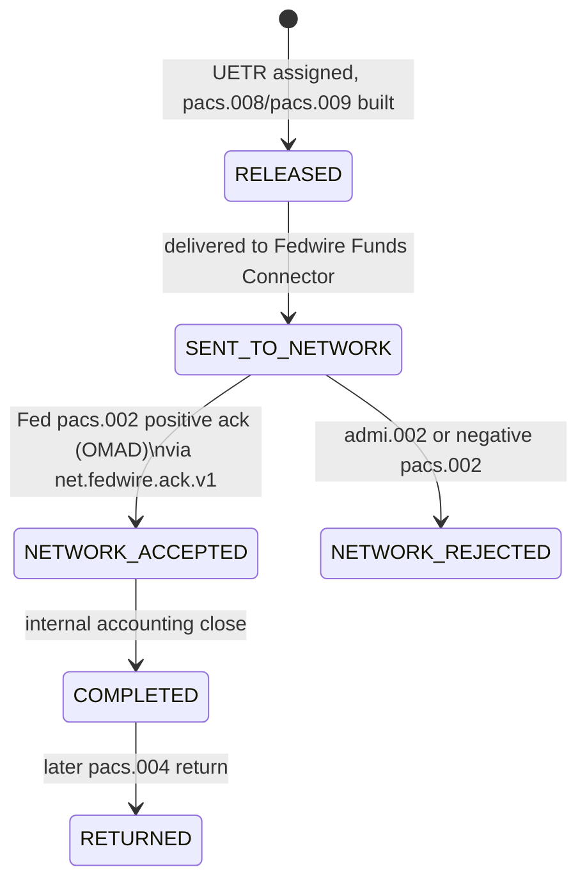

## What it is

The Fedwire Funds Service is the Federal Reserve's domestic real-time gross
settlement (RTGS) rail for US-dollar wire transfers. At Crestline National
Bank (CNB) it is the "domestic rail" reached through the **Fedwire Funds
Connector (FFC)**, one of the two modules of the Payment Network Gateway (the
other being the Swift Alliance/gpi Connector). Wires destined for Fedwire are
orchestrated end-to-end by **PRISM Payments Hub (PPH)**, which validates,
screens, and releases payments before handing them to FFC for transmission.
See [Fedwire Funds Connector](../systems/fedwire-funds-connector.md) for the
connector implementation and
[IMAD / OMAD](../concepts/imad-omad.md) for the identifier pair exchanged on
every Fedwire message.

## ISO 20022 migration (2025-07-14)

The Federal Reserve moved the Fedwire Funds Service to ISO 20022 messaging in
a single-day cutover on **2025-07-14**, retiring the legacy FAIM message
format entirely (no coexistence period). Since that date FFC exchanges only
ISO 20022 message types with the Fed over FedLine Direct (dual MQ channels,
primary Columbus / contingency Charlotte):

- **Outbound** (CNB → Fed): `pacs.008` (customer credit transfer), `pacs.009`
  (financial institution transfer), `pacs.004` (return), `camt.056` (return
  request), `camt.110` (investigation).
- **Inbound** (Fed → CNB): `pacs.008` / `pacs.009` / `pacs.004` (published
  internally to `net.fedwire.inbound.v1`), `pacs.002` positive and negative
  acknowledgments, and `admi.002` technical/business error reports.

## Acknowledgment semantics: pacs.002 is settlement, not beneficiary credit

For every value message the Fed accepts, it returns a `pacs.002` carrying the
**OMAD** (Fed-assigned output message accountability data) and a Fed-generated
creation timestamp. FFC publishes accepted acknowledgments to
`net.fedwire.ack.v1` and publishes errors (`admi.002`) keyed by the original
**IMAD** (the sender-assigned input message accountability data).

This acceptance has a precise legal meaning that is easy to misread
operationally:

> Acceptance by the Fedwire Funds Service constitutes **final and irrevocable
> settlement** between the sending bank and the receiving bank under
> **Regulation J** (and UCC Article 4A) — funds are credited to the receiving
> bank's Federal Reserve master account. The Federal Reserve does **not**
> report, and the pacs.002 does **not** imply, that the receiving bank has
> credited the beneficiary's account.

Whether the beneficiary has actually been paid is entirely a matter for the
receiving bank's own back office; Fedwire's acknowledgment only closes the
interbank settlement leg. This distinction is the reason PPH models
`NETWORK_ACCEPTED` as an interbank-settlement state and why it is a
materially different signal than the Swift CBPR+ delivery ACK for
international wires, which carries no settlement meaning at all (Swift
settlement happens later through correspondent nostro/vostro accounts, and
beneficiary credit is only known from a Swift gpi `ACCC` status if/when it
arrives). See
[Settlement/Release/Completed semantics](../concepts/settlement-release-completed-semantics.md)
for how PPH's lifecycle states encode this difference.

Representative acknowledgment metrics observed by Payment Networks
Engineering (Q3-2025):

| Metric | Value |
|---|---|
| Median Fed acknowledgment latency (send → pacs.002) | 4.2 s |
| Median PPH RELEASED → Fed acceptance (incl. queueing) | 6 min |
| Fed technical/business rejects (`admi.002` / negative `pacs.002`) | 0.07% of messages |

## Operating day, cutoffs, and warehousing

| Item | Value |
|---|---|
| Fedwire operating day | 9:00 p.m. ET (prior calendar day) to 7:00 p.m. ET |
| Fedwire third-party customer transfer cutoff | 6:00 p.m. ET (later items are warehoused under hold reason code HRC-04) |
| CBO same-day domestic wire cutoff (channel-level, ahead of the Fed cutoff) | 5:30 p.m. ET |

A wire submitted after the Fedwire third-party customer transfer cutoff, or
future-dated, is held by PPH in the `WAREHOUSED` state until its value date
rather than being released early or rejected outright.

## Lifecycle position in PPH

PPH's canonical (v2) wire lifecycle reaches the Fedwire rail only after
intake, validation/enrichment, synchronous screening (PRSP), and funds
control have all cleared and a UETR has been assigned at `RELEASED`. The
rail-facing portion of the lifecycle is:

Two details matter for anyone reading or alerting on this state transition:

- The `stateHistory` timestamp PPH records for `NETWORK_ACCEPTED` is **the
  time PPH processed the acknowledgment**, not the Federal Reserve's creation
  timestamp embedded in the `pacs.002`. The authoritative Fed timestamp and
  OMAD travel on `net.fedwire.ack.v1`, not on the v2 lifecycle event itself.
- Consumers of the legacy v1 status API cannot see this transition at all:
  v1 collapses `RELEASED`, `SENT_TO_NETWORK`, `NETWORK_ACCEPTED`, and
  `COMPLETED` into a single `PROCESSED` value, so a v1 caller cannot
  distinguish "released for transmission" from "settled by the Fed."

## Topic access and ownership

| Topic | Producer | Authorized consumers | ACL owner |
|---|---|---|---|
| `net.fedwire.ack.v1` | Fedwire Funds Connector (FFC) | PPH | Payment Networks Engineering (PNE) |
| `net.fedwire.inbound.v1` | FFC | PPH | PNE |

FFC is owned and operated by Payment Networks Engineering; PPH is the sole
authorized consumer of both Fedwire topics, and PNE owns their access
control.

## Operational notes

- Monitoring: Splunk dashboards `PNG-FFC-*`.
- Business continuity: FedLine Advantage serves as the FedLine Direct
  contingency path.
- Change windows: Saturday 22:00–02:00 ET.
- Upcoming change (November 2026): structured/hybrid postal address
  enforcement becomes mandatory for Fedwire (and Swift CBPR+) instructions;
  this is expected to increase repair-queue (`REPAIR`, hold reason HRC-06)
  volume.

## Related pages

- [IMAD / OMAD](../concepts/imad-omad.md) — the sender/receiver message
  accountability identifiers exchanged on every Fedwire message.
- [Settlement/Release/Completed semantics](../concepts/settlement-release-completed-semantics.md)
  — how PPH's lifecycle states map rail acknowledgments to settlement
  meaning, including the Fedwire-vs-Swift contrast.
- [Fedwire Funds Connector](../systems/fedwire-funds-connector.md) — the
  system that implements FedLine Direct connectivity, message
  construction, and acknowledgment publishing described on this page.
