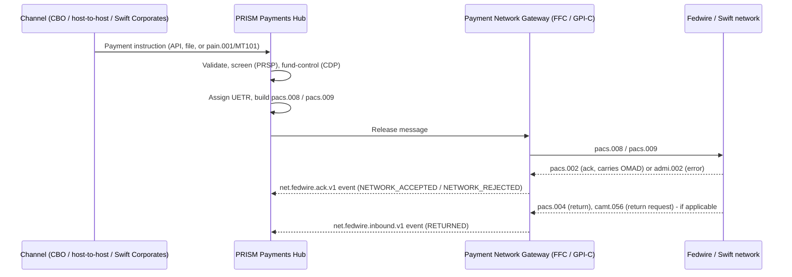

## Overview

CNB's wire estate exchanges payment instructions, acknowledgments, returns, and
investigation messages using the ISO 20022 message family. Two rails are in
scope: **Fedwire Funds** (domestic) and **Swift CBPR+** (cross-border). Both
completed their migration from legacy formats to ISO 20022 in the second half
of 2025:

- **Fedwire**: the Federal Reserve's single-day ISO 20022 cutover on
  **2025-07-14** retired the legacy FAIM format entirely.
- **Swift CBPR+**: ISO 20022 **pacs.008** became mandatory for customer credit
  transfers from **2025-11-22**, ending MT/MX coexistence. CNB does not use the
  MT103 contingency conversion path.

PRISM Payments Hub (PPH) is the orchestration platform that builds and
consumes these messages; the Payment Network Gateway (PNG) - split into the
Fedwire Funds Connector (FFC) and the Swift Alliance & gpi Connector (GPI-C) -
is the network-facing component that actually transmits and receives them.
See [Wire Lifecycle State Model](wire-lifecycle-state-model.md),
[Fedwire Funds Connector](../systems/fedwire-funds-connector.md), and
[Swift gpi Connector](../systems/swift-gpi-connector.md) for the systems that
implement this message handling.

## Message type reference

| Message | Direction / purpose | Producer | Consumer(s) | Rail |
|---|---|---|---|---|
| **pacs.008** (FIToFICustomerCreditTransfer) | Customer credit transfer | PPH (outbound, built at release) / counterparty bank (inbound) | FFC or GPI-C (transmission); PPH (inbound, via `net.fedwire.inbound.v1`) | Fedwire, Swift CBPR+ |
| **pacs.009** (FinancialInstitutionCreditTransfer) | FI-to-FI transfer | PPH (outbound) / counterparty (inbound) | FFC (transmission); PPH (inbound) | Fedwire |
| **pacs.004** (PaymentReturn) | Funds return after release | Federal Reserve / counterparty bank (inbound); PPH/FFC (outbound) | PPH (transitions payment to RETURNED); published to `net.fedwire.inbound.v1` | Fedwire |
| **pacs.002** (FIToFIPaymentStatusReport) | Positive/negative acknowledgment | Federal Reserve | FFC (receives, extracts OMAD), publishes to `net.fedwire.ack.v1`; PPH (consumes) | Fedwire |
| **camt.056** (FIToFIPaymentCancellationRequest) | Return request | PPH/FFC (outbound) | Federal Reserve | Fedwire |
| **camt.110** / **camt.111** | Investigation / exceptions-and-investigations case messages | GPI-C (future) | Swift network / correspondent | Swift CBPR+ (timeline: November 2026) |
| **admi.002** (administration error message) | Technical/business error | Federal Reserve | FFC (receives with IMAD reference); PPH (NETWORK_REJECTED) | Fedwire |
| **pain.001** (CustomerCreditTransferInitiation) | Customer-initiated payment instruction (MT101/pain.001) | Swift for Corporates channel | PPH (intake) | Channel intake, not a network rail message |

Inbound Fedwire value messages (pacs.008 / pacs.009 / pacs.004) are published
by FFC to the Kafka topic `net.fedwire.inbound.v1`; acknowledgments
(pacs.002) and errors (admi.002) are published to `net.fedwire.ack.v1`
(event id EV-PNG-01). PPH is the sole authorized consumer of both topics
today, with Payment Networks Engineering (PNE) owning the ACLs.

## End-to-end message flow

This mirrors the PPH processing stages - intake, validation, screening, funds
control, release, network transmission, and close - described in the
[Wire Lifecycle State Model](wire-lifecycle-state-model.md). PPH assigns the
UETR (UUID v4) at release for every outbound wire and carries it in the
pacs.008 message; GPI-C maps the resulting Swift ACK/NAK and gpi Tracker
status updates back to PPH using that UETR as the join key.

## Fedwire-specific semantics

- Every accepted value message (pacs.008/pacs.009) receives a **pacs.002**
  from the Federal Reserve carrying the OMAD and a Fed-assigned creation
  timestamp. FFC publishes these to `net.fedwire.ack.v1`. Acceptance
  constitutes final and irrevocable interbank settlement under Regulation J /
  UCC Article 4A; it does **not** confirm that the receiving bank credited the
  beneficiary's account. See [IMAD and OMAD](imad-omad.md) for the identifier
  lifecycle.
- Technical/business errors are returned as **admi.002**, published with the
  IMAD reference; PPH surfaces this as lifecycle state `NETWORK_REJECTED`.
  Fed technical/business rejects (admi.002 or negative pacs.002) ran at
  approximately 0.07% of messages in Q3-2025, with a median Fed acknowledgment
  latency of 4.2 seconds from send to pacs.002.
- Returns after release arrive as **pacs.004** and move the payment to
  lifecycle state `RETURNED`; return reason codes (e.g., AC01, AC04, RR05)
  have been published on PPH's `pay.wire.lifecycle.v2` event topic since
  2026-08 (PPH-2266). Outbound return requests use **camt.056**.
- Structured/hybrid postal address enforcement for Fedwire and Swift CBPR+
  messages becomes mandatory in November 2026, which is expected to increase
  repair-queue holds (HRC-06).

## Swift CBPR+-specific semantics

- pacs.008 is the mandatory format for customer credit transfers since
  2025-11-22; CNB does not use MT103 contingency conversion.
- There is no Fedwire-style settlement acknowledgment on this rail: a SwiftNet
  delivery ACK for pacs.008 only confirms the message was accepted for
  delivery to the next agent, not that funds settled or that the beneficiary
  was credited. Settlement occurs through correspondent (nostro/vostro)
  accounts, and beneficiary credit is known only from a Swift gpi **ACCC**
  status (if reported) via the gpi Tracker integration described in
  [Swift gpi Connector](../systems/swift-gpi-connector.md).
- Exceptions-and-investigations handling is migrating from proprietary gpi
  case messages to **camt.110/camt.111** on Swift's published timeline of
  November 2026; this is a planned extension point for GPI-C, not yet live.
- **pain.001** (and legacy MT101) is used only at channel intake for Swift for
  Corporates submissions; it is converted into PPH's internal representation
  and ultimately into an outbound pacs.008, not forwarded to the network
  as-is.

## Producer/consumer summary by system

| System | Produces | Consumes |
|---|---|---|
| PRISM Payments Hub (PPH) | pacs.008 / pacs.009 (outbound, at release) | pacs.002, admi.002, pacs.004 (via `net.fedwire.ack.v1` / `net.fedwire.inbound.v1`); pain.001/MT101 (channel intake) |
| Fedwire Funds Connector (FFC) | camt.056 (return requests, outbound) | pacs.008/009/004 (inbound from Fed, republished to `net.fedwire.inbound.v1`); pacs.002, admi.002 (republished to `net.fedwire.ack.v1`) |
| Swift Alliance & gpi Connector (GPI-C) | pacs.008 (transmitted to Swift); camt.110/camt.111 (planned, November 2026) | Swift ACK/NAK; gpi Tracker status updates (ACSP/ACCC/RJCT) |
| Swift for Corporates channel | pain.001 / MT101 (submitted to PPH) | - |

## Related reading

- [Wire Lifecycle State Model](wire-lifecycle-state-model.md) - how message
  events (pacs.002, admi.002, pacs.004) map to PPH's canonical lifecycle
  states.
- [IMAD and OMAD](imad-omad.md) - the Fedwire identifiers carried on
  pacs.008/pacs.009 and returned in pacs.002.
- [Fedwire Funds Connector](../systems/fedwire-funds-connector.md) and
  [Swift gpi Connector](../systems/swift-gpi-connector.md) - the systems that
  implement message transmission, acknowledgment handling, and tracker
  integration described here.
