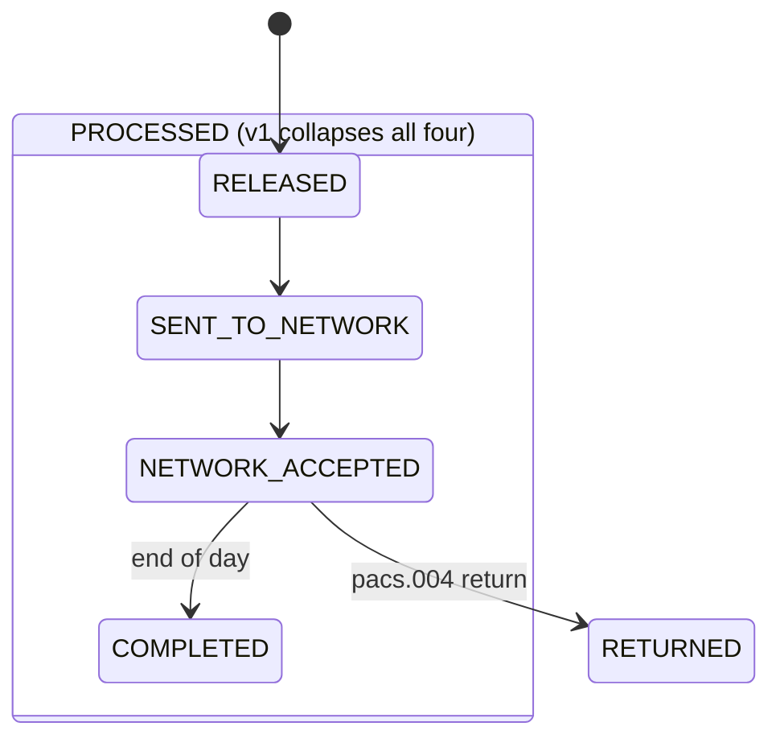

## Why this concept exists

"Completed" sounds like a single, obvious fact about a wire. In practice, three
groups at Crestline National Bank each have a defensible but different answer
to "completed compared to what?" - and none of the three has forced the other
two to converge. This page exists to make that disagreement explicit, because
every feature that surfaces wire status to a client (the 2024 Wire Status Lite
pilot, any future CBO tracking feature, host-to-host status files) re-walks
into the same trap if the terminology is not fixed before build.

The three positions:

1. **Engineering (PPH):** `COMPLETED` is an internal accounting-close state, and the
   consumer-facing v1 status API collapses several distinct lifecycle states into
   one value, `PROCESSED`, that long predates and is broader than `COMPLETED`.
2. **Compliance (FCC):** the words "Completed" or "Settled" may be shown to a
   client only when a specific, rail-dependent network event has occurred -
   never merely because the wire was released or transmitted.
3. **Client experience (CBO):** the UI historically has displayed "Completed"
   at release / `PROCESSED`, well before either engineering's accounting close
   or compliance's permitted trigger - a choice clients took literally.

## Position 1: PPH's internal lifecycle - COMPLETED is accounting close, and PROCESSED hides it

PRISM Payments Hub (PPH) models a wire through a v2 canonical state machine.
`COMPLETED` is one specific, late state in that machine: the **internal
accounting close**, reached at end of day, after the network has already
acknowledged the payment.

| v2 state | Meaning | v1 status shown to consumers |
|---|---|---|
| RELEASED | Released for transmission, UETR assigned | PROCESSED |
| SENT_TO_NETWORK | Message delivered to network gateway | PROCESSED |
| NETWORK_ACCEPTED | Network acknowledgment received (rail-specific) | PROCESSED |
| COMPLETED | Internal accounting close (end of day) | PROCESSED |

The legacy v1 status API - the only interface most channels, including CBO,
have ever integrated against - cannot distinguish any of these four states: it
reports all of them as the single value `PROCESSED`. A wire that was released
one second ago and a wire whose accounting close has already run both read as
`PROCESSED` to a v1 consumer. See the companion [Wire Lifecycle State Model](wire-lifecycle-state-model.md)
for the full state table and rail-specific acknowledgment semantics
(`NETWORK_ACCEPTED` means something different for Fedwire - final interbank
settlement with OMAD - than for Swift CBPR+, where it is only a network
delivery acknowledgment with no settlement implication).


*PPH's v2 lifecycle states that the legacy v1 status API collapses into a single `PROCESSED` value.*

PPH's own documentation is explicit that this collapse is a known interface
limitation, not a business claim: "v1 collapses RELEASED, SENT_TO_NETWORK,
NETWORK_ACCEPTED and COMPLETED into a single value PROCESSED. Consumers of v1
cannot distinguish a wire that has merely been released from one acknowledged
by the network." Because CBO's backend-for-frontend still calls `/pph/v1`
(migration to v2 is unscheduled, tracked as CBO-4471 and gated on the
2027-03-31 v1 sunset), any client-facing label CBO derives from PPH today is
built on this undifferentiated `PROCESSED` signal.

## Position 2: POL-FCC-014 - "Completed/Settled" is gated on a specific network event, not on release

POL-FCC-014 (Customer Communication of Payment Status, Holds & Exceptions
Standard) treats status terminology as a compliance control, not a UX choice.
Its Section 5.2 table defines exactly when the words "Completed" or "Settled"
may be shown to a client:

| Term | Permitted only when | Not permitted |
|---|---|---|
| Completed / Settled | **Domestic:** Fedwire acceptance received. **International:** gpi ACCC received from the beneficiary bank | On release, transmission, Swift network ACK, or ACSP statuses |

In other words: a domestic wire may be called "Completed" only once PPH has
recorded `NETWORK_ACCEPTED` for the Fedwire rail specifically (the Federal
Reserve's pacs.002 positive acknowledgment carrying an OMAD) - which, per
Regulation J and UCC Article 4A, is final and irrevocable interbank
settlement. An international wire may be called "Completed" only once Swift
gpi reports ACCC (funds confirmed credited to the beneficiary's account by the
beneficiary bank) - a status that arrives, if at all, well after Swift's mere
network delivery acknowledgment (ACK) for the outbound pacs.008.

The policy's rationale is the UDAP standard it cites (Section 5 of the FTC
Act) and CNB's own Fair Representation Standard (FRS-02): a status
representation that is accurate for a domestic Fedwire-settled transaction is
misleading if applied to a Swift wire that has only received a network ACK,
because ACK carries no settlement implication at all - settlement happens
later, through correspondent nostro/vostro accounts, and is confirmed only by
gpi ACCC if it is reported at all.

## Position 3: CBO showed "Completed" at release/PROCESSED - which caused CMP-2026-1189

Crestline Business Online's wire status label history took the opposite path
from compliance's rule. In early 2026 (CBO-4471's predecessor story,
delivered R26.1), CBO Product replaced the legacy label "Processed" with
"Completed" based on client feedback that "Processed" was unclear - a
six-client survey found "Completed" tested better. That change mapped the new
"Completed" label onto the same underlying v1 `PROCESSED` signal described
above, i.e., onto release/transmission/network-acknowledgment/accounting-close
all at once, not onto the Fedwire-acceptance or gpi-ACCC triggers POL-FCC-014
requires.

This produced a concrete incident. An international wire for Halvorsen
Industrial Supply (EUR 412,600) showed "Completed" in CBO at release on
2026-09-16, before any gpi ACCC had been received. The beneficiary bank
rejected the payment the next day (RJCT, ISO reason AC04 - account closed);
funds were returned on 2026-09-21. The client had released goods on
2026-09-16 in reliance on the "Completed" status. The resulting complaint,
CMP-2026-1189, is open as a regulatory complaint review: the client is asking
what "Completed" is actually supposed to mean. See
[CMP-2026-1189](../incidents/cmp-2026-1189.md) for the incident record.

```mermaid
flowchart LR
    Release["PPH RELEASED / SENT_TO_NETWORK / NETWORK_ACCEPTED"] -->|v1 reports| Processed["v1 status: PROCESSED"]
    Processed -->|CBO label change, R26.1| Completed["CBO label: Completed"]
    Completed -->|client reliance| ClientAction["Client releases goods 2026-09-16"]
    Completed -.FCC Sec 5.2 requires.-> Gate["Fedwire acceptance (domestic) or gpi ACCC (intl)"]
    ClientAction --> Reject["Beneficiary bank rejects: RJCT AC04, 2026-09-17"]
    Reject --> Complaint["CMP-2026-1189"]
```
*How CBO's "Completed" label, mapped onto release/PROCESSED rather than the POL-FCC-014 gate, produced CMP-2026-1189.*

## The disagreement, stated neutrally

The three sources are not reconcilable by picking a "correct" one; they answer
different questions:

- **PPH-SYS-OVW-9.2** defines `COMPLETED` as PPH's own internal accounting
  close - an engineering/ledger concept, reached at end of day, after network
  acknowledgment has already happened.
- **POL-FCC-014** permits the client-facing label "Completed/Settled" only at
  a specific, verifiable network event: Fedwire acceptance (domestic) or gpi
  ACCC (international) - a compliance/disclosure concept, chosen because it is
  the earliest point at which "Completed" is not misleading.
- **CBO** has shown "Completed" at release/`PROCESSED` - the earliest and
  least final of the three candidate meanings - because that is the only
  granularity the v1 status API (and the Wire Status Lite pilot before it)
  exposed, and because it tested well with clients in isolation from the
  compliance requirement.

None of these three meanings is the same point in the wire's life, and only
one of them (POL-FCC-014's) is framed as a client-facing disclosure rule. The
other two are legitimate for their own purposes (ledger close; network
collapse for API simplicity) but neither was validated against POL-FCC-014
before being surfaced, or adapted from, a client-facing label.

## Evidence this is a real, recurring client-facing failure mode

The 2024 Wire Status Lite pilot (PIR-2024-07) surfaced the same confusion a
label generation earlier, using the term "Processed" rather than "Completed."
Its post-implementation review states plainly: **"37% of surveyed pilot users
believed 'Processed' meant the beneficiary had received the funds."** The PIR
also records that users asked why wires were held and that Treasury Support
"could not explain without FCC guidance" - i.e., the terminology gap was
already visible in 2024, and the PIR's own action list carried forward an open
item, owned by CBO Product, to "Validate client-facing status terminology with
FCC and Legal before any future tracking feature." That action was still open
when CBO independently renamed "Processed" to "Completed" in R26.1 and later
when CMP-2026-1189 occurred - the validation step was not performed before
either change.

## Practical implications for anyone building or changing wire status display

- **Do not treat `PROCESSED` (v1) as a single business fact.** It spans four
  materially different v2 states, one of which (`NETWORK_ACCEPTED`) has
  different finality semantics per rail, and one of which (`COMPLETED`) is a
  purely internal accounting event with no required relationship to funds
  reaching the beneficiary.
- **"Completed" and "Settled" are reserved words under POL-FCC-014's Section
  5.2 terminology table**, not free-text UX copy. Using them earlier than
  their permitted trigger (Fedwire acceptance / gpi ACCC) is a potential UDAP
  and Fair Representation Standard (FRS-02) exposure, independent of client
  satisfaction testing results.
- **Client-preferred wording is not a substitute for compliance validation.**
  CBO's 2026 label change to "Completed" was driven by a usability survey; it
  was not reviewed against POL-FCC-014's Section 6 requirement that
  "new or changed client-facing status ... experiences require FCC Policy &
  Advisory review before build commitment and DRC approval of final copy."
- **A durable fix requires leaving the v1 API.** Because v1 cannot distinguish
  release from network acceptance from accounting close, any status label
  that is both accurate and compliant needs the v2 lifecycle state (or the
  rail-specific acknowledgment events described in
  [Wire Lifecycle State Model](wire-lifecycle-state-model.md)) as its data
  source, not the collapsed `PROCESSED` value.
- **International wires have no domestic equivalent for "credited."**
  POL-FCC-014 permits "Credited to beneficiary" only on gpi ACCC; Fedwire
  provides no equivalent beneficiary-credit confirmation at all. Any status
  feature that implies parity between domestic and international finality
  signals will misrepresent one rail or the other.

## Related pages

- [Wire Lifecycle State Model](wire-lifecycle-state-model.md) - the full PPH v2 state machine and rail-specific acknowledgment semantics referenced above.
- [POL-FCC-014](../policies/pol-fcc-014.md) - the full status-terminology, disclosure-tier, and hold-communication standard.
- [PIR-2024-07](../incidents/pir-2024-07.md) - the Wire Status Lite pilot post-implementation review and its carried-forward terminology-validation action.
- [CMP-2026-1189](../incidents/cmp-2026-1189.md) - the client complaint that resulted from CBO's "Completed" label.
