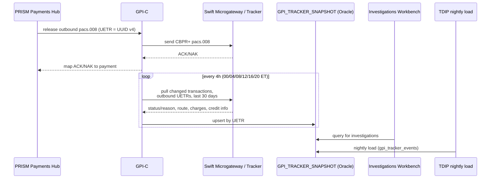

## What it is

Swift gpi ("global payments innovation") and CBPR+ ("Cross-Border Payments
and Reporting Plus") are two complementary parts of the international wire
rail used by Crestline National Bank (CNB) for outbound cross-border
payments. CBPR+ is Swift's ISO 20022 message-format standard for cross-border
payments and reporting; gpi is the end-to-end tracking service layered on top
of those payments, keyed by the Unique End-to-end Transaction Reference
(UETR). At CNB both are reached through the **Swift Alliance & gpi Connector
(GPI-C)**, one of the two modules of the Payment Network Gateway (the other
being the Fedwire Funds Connector). See
[SWIFT gpi Connector](../systems/swift-gpi-connector.md) for the connector
implementation and [gpi Tracker Snapshot](../datasets/gpi-tracker-snapshot.md)
for the Oracle table GPI-C populates.

## CBPR+ ISO 20022 cutover (2025-11-22)

Swift CBPR+ ISO 20022 `pacs.008` became mandatory for customer credit
transfers on **2025-11-22**, marking the end of the MT/MX coexistence period.
CNB does not use the MT103 contingency conversion path that some
counterparties rely on during migration — GPI-C sends and expects CBPR+
`pacs.008` only. PRISM Payments Hub (PPH) assigns the UETR (a UUID v4) at
release time and carries it in the outbound `pacs.008`; GPI-C maps the
resulting Swift ACK/NAK back to PPH. Exceptions and investigations are
migrating from free-text/legacy flows to `camt.110`/`camt.111` on Swift's
published timeline of November 2026, which GPI-C has not yet implemented.

## gpi Tracker integration is batch, not real-time

GPI-C retrieves gpi Tracker updates through the Swift API via the Swift
Microgateway, authenticated with SwiftNet PKI credentials bound to the GPI-C
service account. The integration is **batch**, not event-driven: every 4
hours (00:00, 04:00, 08:00, 12:00, 16:00, 20:00 ET) GPI-C requests changed
payment transactions for outbound UETRs from the last 30 days and upserts the
results into the Oracle table `GPI_TRACKER_SNAPSHOT`, keyed by UETR (the join
key to PPH's `identifiers.uetr`). Consumers are Payment Operations'
Investigations Workbench (IWB) and the TDIP nightly load
(`gpi_tracker_events`).

There is **no internal API** for gpi status — the snapshot table must not be
exposed directly to channels. A client-facing capability (e.g., "where is my
wire" in digital banking) would require a dedicated service with its own SLA,
entitlement checks, and quota management, because the table is a batch
reflection of Swift Tracker state, not a live query surface.

### Why batch frequency cannot simply be increased (PNG-1544)

The Swift Tracker API contract permits **250,000 calls per month** (renewal
2027-01-31); current usage is ~61%, from the 4-hour batch pulls plus Ops
ad-hoc lookups. A 2026-03-03 change request (PNG-1544) to move from 4-hour to
2-hour batches was **declined** because the projected usage would exceed the
contracted quota. Per-payment lookups driven directly from client channels
were separately estimated at ~1.9 million calls/month (based on ~2,900
outbound international wires per day with repeated client-side status views)
— roughly 7x the contracted quota — so any future real-time design must be
built on a change-feed with internal fan-out rather than per-payment Tracker
calls.

## gpi statuses handled

GPI-C recognizes the following gpi status/reason codes and treats them
differently for tracking-continuation purposes:

| Status / reason | Meaning | Tracking implication |
|---|---|---|
| ACSP / G000 | Forwarded to next gpi agent | Further updates expected |
| ACSP / G001 | Forwarded to a non-gpi agent | No further updates will follow - tracking ends at the last gpi agent |
| ACSP / G002 | Credit may not be confirmed same day | Update expected |
| ACSP / G003 | Pending - awaiting documents from creditor | Update expected |
| ACSP / G004 | Pending - awaiting cover funds | Update expected |
| ACCC | Credited to beneficiary account | Terminal; credit timestamp and confirmed amount available |
| RJCT + reason (e.g., AC01, AC04, RR05) | Rejected by an agent | Terminal; return expected via pacs.004 |

The ACSP/G001 case is the important trap for downstream consumers: it is
**not terminal** in the sense of a final outcome, but it **is terminal for
tracking purposes** — once the payment leaves the gpi member network, Swift
Tracker will not report any further status, and GPI-C has nothing more to
upsert into the snapshot for that UETR even though the underlying payment may
still be in flight at the non-gpi agent. Only ACCC and RJCT are genuinely
terminal outcomes with a definite result.

## Observed outcomes (outbound, Q3-2025)

| Outcome | Share |
|---|---|
| Final status ACCC (beneficiary credited) | 88% |
| Last status ACSP/G001 (tracking ended at non-gpi agent) | 8% |
| Pending > 24 h (G002/G003/G004) | 2.5% |
| RJCT | 1.5% |
| Median release-to-ACCC (all corridors) | 2 h 41 min |
| Wires with at least one intermediary deduction reported (SHAR/CRED) | 34% |

Read together with the status table above, these figures mean that in a
given quarter roughly 96% of outbound wires either reach a definite terminal
result (ACCC or RJCT) or exit visible tracking at a non-gpi agent (G001); only
about 2.5% remain genuinely pending beyond 24 hours. The median
release-to-ACCC time of **2h 41min** is the headline operational SLA figure
PNE and Payment Operations use to characterize "how long a successful
international wire takes" — it spans everything from PPH release through
GPI-C transmission, Swift network hops, and the counterparty crediting the
beneficiary, not just CNB's own processing. `DEDUCTED_CHARGES_JSON` in the
snapshot table captures intermediary deductions (SHAR/CRED charge-bearer
codes) when agents report them, which happens on about a third of wires.

## Relationships and boundaries

- **PRISM Payments Hub (PPH)** owns payment orchestration, assigns the UETR,
  and releases the outbound `pacs.008`; see
  [Settlement / Release / Completed Semantics](settlement-release-completed-semantics.md)
  for how PPH's own lifecycle states relate to (and are distinct from) gpi
  Tracker status.
- **GPI-C** owns Swift connectivity, CBPR+ message handling, and the batch
  Tracker pull; it does not own payment lifecycle decisions.
- **GPI_TRACKER_SNAPSHOT** (see
  [gpi Tracker Snapshot](../datasets/gpi-tracker-snapshot.md)) is the sole
  internal representation of gpi status; it is a periodically refreshed
  reflection of Swift Tracker state, never a live proxy to it, and is not
  directly exposed to client channels.
- **Investigations Workbench (IWB)** and the **TDIP** nightly load
  (`gpi_tracker_events`) are the only sanctioned consumers of the snapshot
  table.

## Operational notes

- Change windows for GPI-C: Saturday 22:00-02:00 ET, same as FFC.
- Monitoring: Splunk dashboards `PNG-GPI-*`.
- Business continuity: Swift Alliance Lite2 standby.
- gpi Tracker questions route to the gpi document owner (Tomasz Nowak,
  Payment Networks Engineering); general support is PNE on-call (T1),
  `#payment-networks`.
