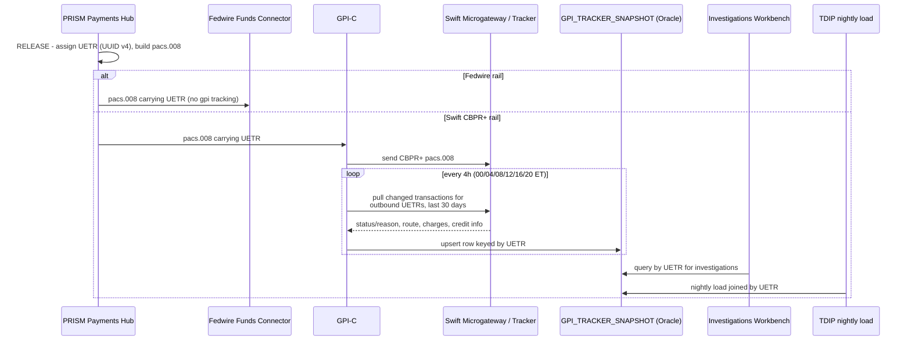

## Overview

The **UETR** (Unique End-to-end Transaction Reference) is the tracking
identifier that Swift gpi uses to follow a payment across every agent in its
route. At Crestline National Bank (CNB), PRISM Payments Hub (PPH) assigns the
UETR itself - as a UUID v4 - at **release** time, for every outbound wire,
not only Swift ones: it is stamped into the outbound `pacs.008` for both the
Swift CBPR+ rail and the Fedwire Funds rail. UETR is therefore not a
Swift-only artifact inside PPH; it is PPH's own end-to-end tracking identifier
that happens to be the key gpi uses externally.

UETR is one of several identifiers PPH manages across a wire's lifecycle,
alongside `pphId`, `cboRef`, IMAD, and OMAD (see
[IMAD and OMAD](imad-omad.md)). Unlike IMAD (available in v1 as `fedRef`),
UETR exists **only in the v2 API and in v2 lifecycle events** - it has no v1
representation at all.

## Assignment and format

| Property | Value |
|---|---|
| Assigned by | PPH, at the **RELEASE** lifecycle stage (not earlier) |
| Format | UUID v4 |
| Governing decision | ADR-PAY-023 (mandates UETR assignment for all outbound wires at release) |
| Carried on | Outbound `pacs.008` for both Swift CBPR+ and Fedwire Funds |
| v2 exposure | `identifiers.uetr` on `GET /pph/v2/payments/{paymentId}`, and on v2 lifecycle events |
| v1 exposure | **None** - no v1 field carries UETR |

Because assignment happens at release, a payment has no UETR while it is
`RECEIVED`, `VALIDATING`, `SCREENING`, `HELD`, `REPAIR`, `FUNDS_CONTROL`, or
`WAREHOUSED` - only once it transitions to `RELEASED` does PPH mint the UUID
v4 and begin stamping it onto the outbound message and subsequent lifecycle
events.

## Why Fedwire wires carry a UETR too

UETR is best known as the key to Swift gpi tracking, and that is its primary
use, but PPH's identifier model assigns and carries UETR on **every**
released wire regardless of rail - including domestic Fedwire transfers,
which have no gpi tracking relationship at all. This makes UETR, alongside
`pphId`, one of the few identifiers that is rail-agnostic and populated
consistently across both the Fedwire Funds Connector (FFC) and the Swift
Alliance & gpi Connector (GPI-C) modules of the Payment Network Gateway.

## UETR as the join key to gpi Tracker data

For Swift CBPR+ wires, GPI-C uses the UETR to pull and upsert gpi Tracker
status into the Oracle table `GPI_TRACKER_SNAPSHOT`. The table's `UETR`
column is explicitly the join key back to PPH's `identifiers.uetr`:

| `GPI_TRACKER_SNAPSHOT` column | Description |
|---|---|
| `UETR` | Tracking id; join key to PPH v2 `identifiers.uetr` |
| `LAST_STATUS` / `LAST_REASON` | ACSP/ACCC/RJCT and G000-G004 or ISO reject reason |
| `ROUTE_JSON` | Ordered agents (BIC, name, country, received/forwarded timestamps) |
| `DEDUCTED_CHARGES_JSON` | Charges deducted per agent, when reported |
| `CONFIRMED_AMOUNT` / `CREDIT_TS` | Amount and timestamp reported with ACCC |
| `SNAPSHOT_TS` | Time GPI-C captured the update |

This join is the only way to associate a Swift Tracker status update with a
specific PPH payment: there is no reverse lookup from Tracker response to
`pphId` except through the UETR carried in the original `pacs.008`.
Downstream, both the Investigations Workbench (IWB) used by Payment
Operations and the TDIP nightly load (`gpi_tracker_events`) consume
`GPI_TRACKER_SNAPSHOT` keyed by this same UETR, making it the join key that
ties together PPH v2 identifiers/events, the gpi Tracker snapshot, and TDIP.
There is **no internal API for gpi status** - the snapshot table itself must
not be exposed directly to channels, so UETR-keyed lookups today only happen
inside IWB and the TDIP batch pipeline, not in any live, client-facing path.

## gpi status vocabulary tracked per UETR

GPI-C records the following gpi status/reason codes against each outbound
UETR, with different implications for whether further tracking updates are
expected:

| Status / reason | Meaning | Tracking implication |
|---|---|---|
| ACSP / G000 | Forwarded to next gpi agent | Further updates expected |
| ACSP / G001 | Forwarded to a non-gpi agent | No further updates will follow - tracking ends at the last gpi agent |
| ACSP / G002 | Credit may not be confirmed same day | Update expected |
| ACSP / G003 | Pending - awaiting documents from creditor | Update expected |
| ACSP / G004 | Pending - awaiting cover funds | Update expected |
| ACCC | Credited to beneficiary account | Terminal; credit timestamp and confirmed amount available |
| RJCT + reason (e.g., AC01, AC04, RR05) | Rejected by an agent | Terminal; return expected via `pacs.004` |

ACSP/G001 is the important edge case: it is not a genuine final outcome for
the underlying payment, but it **is** terminal for tracking purposes - once
the payment leaves the gpi member network, no further Tracker update will
ever arrive for that UETR, even though the payment may still be in flight at
a non-gpi agent.

Observed outcomes for outbound UETRs in Q3-2025: 88% reached a final ACCC
status, 8% had tracking end at ACSP/G001, 2.5% were pending more than 24
hours (G002-G004), and 1.5% were rejected (RJCT); the median time from
release to ACCC across all corridors was 2 h 41 min.

## Quota constraints on UETR-based lookups

The Swift Tracker API contract that GPI-C uses to pull UETR status permits
**250,000 calls per month** (renewal 2027-01-31); the 4-hourly batch plus
ad-hoc Operations lookups already consume roughly 61% of that quota. A
2026-03-03 change request (PNG-1544) to halve the batch interval to 2 hours
was **declined** because projected usage would exceed the contracted quota.
Separately, a hypothetical per-payment, per-UETR lookup pattern driven
directly from client channels was estimated at ~1.9 million calls/month
(based on ~2,900 outbound international wires per day with repeated
client-side status views) - about 7x the contracted quota. Consequently, any
future real-time UETR-status capability must be built on an internal
change-feed with fan-out, not on direct per-UETR Tracker calls.

## Invariants and failure semantics

- A payment has a UETR only from `RELEASED` onward; it is never assigned
  before release and is never reassigned afterward.
- UETR is populated on outbound `pacs.008` for **both** Fedwire and Swift
  CBPR+ rails, but only Swift CBPR+ wires accumulate gpi Tracker status
  against it - Fedwire UETRs have no corresponding `GPI_TRACKER_SNAPSHOT`
  activity.
- UETR is visible only through the v2 API (`identifiers.uetr`) and v2
  lifecycle events; the legacy v1 API has no field for it at all, so any v1
  consumer (including most CNB channels before the v1 sunset) cannot obtain
  or display a payment's UETR.
- `GPI_TRACKER_SNAPSHOT` is a periodically refreshed (4-hourly) snapshot, not
  a live view - a UETR's `LAST_STATUS` can lag the true Swift Tracker state
  by up to the batch interval, and the table must not be surfaced directly to
  any client-facing channel.

## Related concepts

- [IMAD and OMAD](imad-omad.md) - the Fedwire-specific counterparts to UETR, and the broader v1/v2 identifier availability gap.
- [SWIFT gpi & CBPR+](swift-gpi-cbpr.md) - the rail and tracker integration that consumes UETR end-to-end.
- [PPH v2 Payments API](../interfaces/pph-v2-payments-api.md) - the only API surface exposing `identifiers.uetr`.
- [ADR-PAY-023](../decisions/adr-pay-023.md) - the decision mandating UETR assignment at release for all outbound wires.
- [Wire transaction history dataset](../datasets/pay-wire-txn-hist.md) - downstream data that joins on UETR via the TDIP load.
