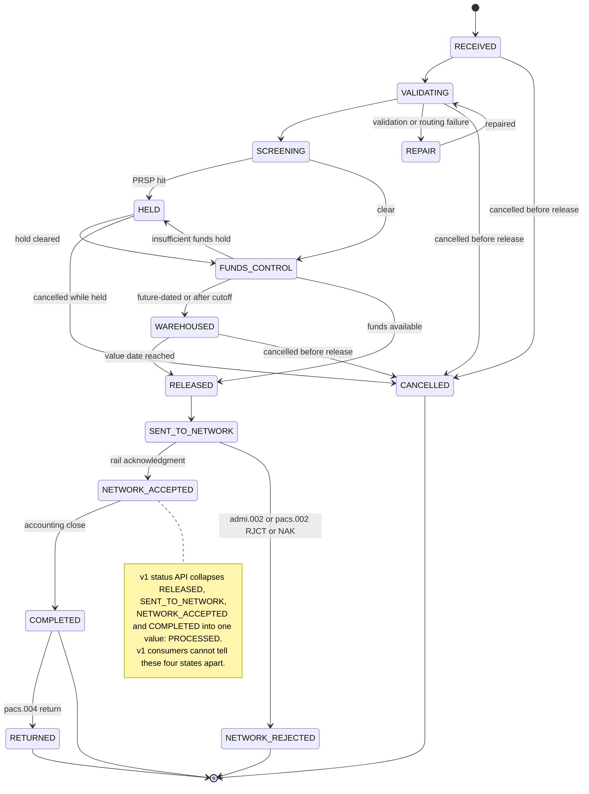

## Overview

PRISM Payments Hub (PPH) orchestrates every outgoing, incoming, and book-transfer
wire for CNB across Fedwire, Swift CBPR+, and internal rails. Internally, PPH
tracks each payment through a fine-grained set of **v2 lifecycle states**, exposed
via the v2 payment-detail API (`GET /pph/v2/payments/{paymentId}`,
`lifecycleState` field) and the `pay.wire.lifecycle.v2` Kafka topic. The older,
still widely-consumed **v1 status API** (`GET /pph/v1/wires/{wireRef}/status`)
exposes a much coarser, seven-value `status` field that collapses several
distinct v2 states together.

This collapse - specifically the v1 value `PROCESSED` - is the single most
load-bearing fact for any feature, dashboard, or client communication that
reports wire status: **a wire can sit in `PROCESSED` for its entire trip from
"released for transmission" to "accounting close," and a v1 consumer has no way
to tell which of those four very different things actually happened.** Getting
this wrong has already caused a production incident
([CMP-2026-1189](../incidents/cmp-2026-1189.md)) and a 2024 client-facing pilot
failure; see [Consequences of the collapse](#consequences-of-treating-processed-as-a-single-fact)
below.

## The ten canonical v2 states

| State | Meaning | Typical duration | v1 status shown to consumers |
|---|---|---|---|
| `RECEIVED` | Instruction accepted by PPH (intake) | < 1 s | `RECEIVED` |
| `VALIDATING` | Format/routing/ISO 20022 enrichment, structured address checks | 1-5 s | `PENDING` |
| `SCREENING` | Synchronous sanctions/fraud screening call to the Payment Risk & Screening Platform (PRSP) | 1-20 s | `PENDING` |
| `HELD` | One or more PRSP Hold Management Service (HMS) holds open | minutes-days | `HELD` |
| `REPAIR` | Parked in the Wire Room repair queue (e.g. bad routing data) | minutes-hours | `PENDING` |
| `FUNDS_CONTROL` | Memo debit posted against the Core Deposit Platform; awaiting available balance | seconds-hours | `PENDING` |
| `WAREHOUSED` | Future-dated, or received after the applicable cutoff | until value date | `PENDING` |
| `RELEASED` | Released for transmission; UETR assigned, pacs.008/pacs.009 message built | seconds | `PROCESSED` |
| `SENT_TO_NETWORK` | Message delivered to the Fedwire Funds Connector or Swift Alliance/gpi Connector | seconds-minutes | `PROCESSED` |
| `NETWORK_ACCEPTED` | Network acknowledgment received (rail-specific meaning, see below) | - | `PROCESSED` |
| `NETWORK_REJECTED` | Network rejected the message (`admi.002` / `pacs.002 RJCT` / NAK) | - | `REJECTED` |
| `COMPLETED` | Internal accounting close | end of day | `PROCESSED` |
| `CANCELLED` | Cancelled before release | - | `CANCELLED` |
| `RETURNED` | Funds returned (`pacs.004`) after release | hours-days | `RETURNED` |

(`RECEIVED` through `RETURNED` is thirteen distinct v2 states in total; the
state-transition behavior each one drives is diagrammed below.)

Each wire's full history of these transitions, with PPH processing timestamps,
is retrievable via `GET /pph/v2/payments/{paymentId}/history`. See
[PPH v1 Wire Status API](../interfaces/pph-v1-wire-status-api.md) for the v1
surface and [PRISM Payments Hub](../systems/prism-payments-hub.md) for how this
state machine fits into the hub's overall request flow.

## State diagram

*The full v2 lifecycle, from intake through release, network handling, and
return; the four states v1 reports as a single `PROCESSED` value are called out
in the note.*

## What v1 `PROCESSED` does and does not confirm

The v1 status API's `status` enum is
`RECEIVED | PENDING | HELD | PROCESSED | REJECTED | CANCELLED | RETURNED` -
seven values standing in for the thirteen v2 states. Four of those v2 states -
**`RELEASED`, `SENT_TO_NETWORK`, `NETWORK_ACCEPTED`, and `COMPLETED`** - all
report as the single v1 value `PROCESSED`. Concretely, `PROCESSED` is consistent
with any of the following, and a v1 consumer cannot distinguish them:

- The wire was released internally seconds ago and has not yet left PPH
  (`RELEASED`).
- The message has been handed to the Fedwire Funds Connector or Swift
  Alliance/gpi Connector but no acknowledgment has come back yet
  (`SENT_TO_NETWORK`).
- The network has acknowledged the message (`NETWORK_ACCEPTED`) - whose
  business meaning itself differs sharply by rail (see below).
- PPH has performed its internal accounting close at end of day (`COMPLETED`).

`PROCESSED` therefore confirms only that the wire has moved past `RELEASED` and
has not (yet, as far as v1 can tell) been rejected, cancelled, or returned. It
does **not** confirm network acceptance, settlement, or beneficiary credit, and
it does not distinguish "sent two seconds ago" from "settled and closed."
Because the v1 `status` field value is literally reused for four semantically
different lifecycle stages, any code or document that treats `PROCESSED` as a
single fact rather than a known ambiguity is building on a false premise.

This same conflation extends to related v1 fields: `holdReasonDesc` carries the
free-text HMS hold description synchronized for backward compatibility (not
curated for external display and absent from v2, which exposes only
`hold.isHeld` / `hold.holdId`), and `fedRef` carries only the IMAD - the v1 API
never exposes OMAD or the UETR, so a v1 consumer cannot even reach for those
identifiers to work around the `PROCESSED` ambiguity. See
[IMAD and OMAD](imad-omad.md) for why OMAD's absence from v1 specifically blocks
a true domestic settlement-status feature.

## Rail-specific meaning of `NETWORK_ACCEPTED`

Even within v2, `NETWORK_ACCEPTED` means something different per rail, which
compounds the v1 ambiguity further since all of these also report as
`PROCESSED` in v1:

| Rail | Acknowledgment source | Business meaning | Finality |
|---|---|---|---|
| Fedwire Funds | Federal Reserve `pacs.002` positive acknowledgment carrying OMAD (relayed via the `net.fedwire.ack.v1` topic) | Payment order accepted and settled by the Federal Reserve; funds credited to the receiving bank's master account | Final and irrevocable interbank settlement (Regulation J / UCC Article 4A). Does **not** confirm credit to the beneficiary's own account. |
| Swift CBPR+ | SwiftNet delivery acknowledgment (ACK) for `pacs.008` | Message accepted by the Swift network for delivery to the next agent | No settlement implication. Settlement occurs through correspondent (nostro/vostro) accounts; beneficiary credit is known only from a Swift gpi `ACCC` status, if available. |

The v2 `stateHistory` timestamp recorded against `NETWORK_ACCEPTED` is the time
PPH processed the acknowledgment, not the Federal Reserve's creation timestamp
inside the `pacs.002` message; the authoritative Fed timestamp and OMAD travel
separately on `net.fedwire.ack.v1`. See
[Fedwire Funds Service](fedwire-funds-service.md) and
[IMAD and OMAD](imad-omad.md) for the identifier mechanics, and
[Swift gpi / CBPR+](swift-gpi-cbpr.md) for why Swift acceptance carries no
settlement guarantee at all.

## Consequences of treating `PROCESSED` as a single fact

Two documented incidents trace directly back to collapsing these four v2 states
into one v1 value:

- **CMP-2026-1189** - a EUR 412,600 international wire showed v1 status
  `PROCESSED` (displayed to the client as "Completed") on 2026-09-16. The
  beneficiary bank rejected it the next day (`pacs.002 RJCT`, reason `AC04`),
  and funds were returned on 2026-09-21. The client had already released goods
  on the strength of the "Completed" label. This is tracked as a regulatory
  complaint; see [CMP-2026-1189](../incidents/cmp-2026-1189.md).
- **PIR-2024-07 (Wire Status Lite pilot, INC-2024-1182)** - a 2024 pilot that
  auto-refreshed v1 wire status in the CBO channel found that 37% of surveyed
  users believed "Processed" meant the beneficiary had already received the
  funds. The same pilot also drove the v1 status API past its thread-pool
  capacity at month-end, delaying wire release by 47 minutes for 1,240 wires;
  the API is now rate-limited to 20 TPS shared across all v1 consumers as a
  direct result.

Because v1's `PROCESSED` cannot distinguish `RELEASED` from `COMPLETED`, no
client-facing feature, SLA measurement, or settlement-confirmation claim should
be built on the v1 `status` field alone. Features that need to assert a
specific point in the lifecycle - e.g., "the network has accepted this wire,"
or "this wire is closed" - must consume the v2 `lifecycleState` field or the
`pay.wire.lifecycle.v2` event stream instead, and must still account for the
rail-specific meaning of `NETWORK_ACCEPTED` above. What it means for a wire to
be genuinely settlement-final once released is covered in
[Settlement & Release Completed Semantics](settlement-release-completed-semantics.md).

## Related pages

- [Settlement & Release Completed Semantics](settlement-release-completed-semantics.md) - what finality actually means once a wire leaves `RELEASED`.
- [PPH v1 Wire Status API](../interfaces/pph-v1-wire-status-api.md) - the full v1 surface that exposes the collapsed `PROCESSED` value.
- [PRISM Payments Hub](../systems/prism-payments-hub.md) - the system that owns this state machine end to end.
- [CMP-2026-1189](../incidents/cmp-2026-1189.md) - the client complaint that traces directly to this ambiguity.
- [IMAD and OMAD](imad-omad.md) - identifier availability gaps that compound the v1 status ambiguity.
- [Fedwire Funds Service](fedwire-funds-service.md) and [Swift gpi / CBPR+](swift-gpi-cbpr.md) - rail-specific meaning of network acceptance.
