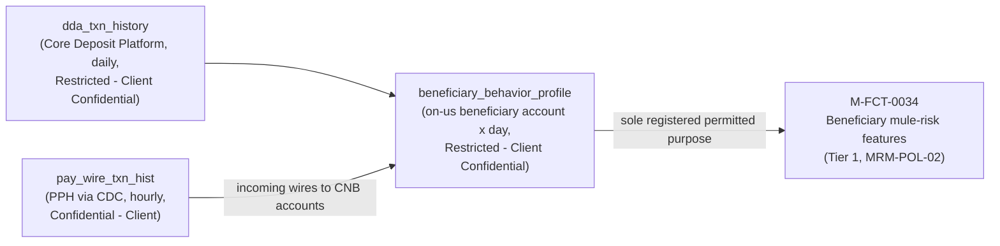

## Overview

`beneficiary_behavior_profile` is a feature table in the Treasury Data & Insights
Platform (TDIP) that summarizes the inbound-wire and subsequent-outflow behavior
of on-us beneficiary accounts, at a grain of **beneficiary account x day**. It is
built specifically to supply behavioral features to **M-FCT-0034 (Beneficiary
mule-risk features)**, a Tier 1 financial-crimes model under
[MRM-POL-02](../policies/mrm-pol-02.md), and has no other registered purpose.

The table is classified **Restricted - Client Confidential**, the most
sensitive classification tier used in the TDIP catalog, which is stricter than
the **Confidential - Client** classification applied to most other payments
datasets (e.g. `pay_wire_txn_hist`, `client_hierarchy`).

## Data lineage and derivation

`beneficiary_behavior_profile` is derived by joining two upstream sources:

- [`dda_txn_history`](dda-txn-history.md) - the Core Deposit Platform's
  on-us deposit account transaction history, itself Restricted - Client
  Confidential, refreshed daily with 7 years of history, owned by Mark
  Sullivan / Deposits Data Engineering.
- `pay_wire_txn_hist` - incoming wire transactions landing in Crestline
  National Bank (CNB) accounts, sourced hourly via CDC from the Payment
  Processing Hub (PPH), Confidential - Client classified, owned by Laura Kim
  / Carlos Mendes.

Because one of its two direct inputs (`dda_txn_history`) already carries the
Restricted classification, `beneficiary_behavior_profile` inherits and retains
that same restricted tier rather than being averaged down to Confidential -
the catalog treats the most sensitive contributing source as the floor for a
derived feature table's classification.

## Feature contents

The catalog extract lists the following representative features on this
table (not exhaustive):

| Feature | Description |
|---|---|
| `bene_median_hours_to_outflow` | Median time between an incoming wire's credit to the beneficiary account and the first subsequent outflow from that account. |
| `bene_outflow_ratio_24h` | Share of incoming wire value moved out of the beneficiary account within 24 hours of receipt. |
| `bene_new_counterparties_30d` | Count of distinct new outbound counterparties seen from the beneficiary account in the trailing 30 days. |

These features are designed to surface mule-account behavioral signatures
(e.g., rapid pass-through of incoming funds, fan-out to many new
counterparties) rather than to describe typical client payment activity, which
is why the table is scoped to fraud/mule detection rather than treated as a
general-purpose beneficiary analytics asset.

## Permitted use and regulatory basis

The permitted purpose of `beneficiary_behavior_profile` is narrowly scoped and
enforced by two linked governance documents:

- **[MRM-POL-02](../policies/mrm-pol-02.md) (Model Risk Management Policy,
  v7.0)** registers `M-FCT-0034` as a Tier 1 model - the tier reserved for
  regulatory, capital, financial-crimes-detection, or high-financial-exposure
  models - requiring full independent validation and annual review.
  `M-FCT-0034` was last validated in 2026-02. Section 4 of the policy
  explicitly states that outputs of financial-crimes models, including
  beneficiary mule-risk features (M-FCT-0034) and Sentinel fraud scores
  (M-FCT-0021), **may not be used for product, marketing, or client-facing
  purposes**. Because `beneficiary_behavior_profile` is a direct input to
  M-FCT-0034, that use limitation applies transitively to the feature table
  itself and to any feature derived from it.
- **[DUS-07](../policies/dus-07.md)** governs data-access approvals for
  datasets of this sensitivity; access to Restricted datasets in TDIP
  additionally requires Privacy Office approval via Collibra, with a
  published SLA of 15 business days.

Consequently, teams building client-facing analytics (e.g., corridor insights,
cash-forecast dashboards, or any new Insights API endpoint) must not source
from `beneficiary_behavior_profile`, must not re-derive its features under a
different name for product use, and must not blend its outputs into
customer-facing estimates. Any proposal to reuse this data for a
customer-facing purpose would itself require registering a new, separately
validated model (Tier 2 at minimum, per MRM-POL-02's tiering criteria for
customer-facing estimates) and would not inherit M-FCT-0034's existing
validation.

## Relationship to other TDIP feature tables

The TDIP catalog (TDIP-CAT-2026.2) lists `beneficiary_behavior_profile`
alongside two other feature tables that illustrate contrasting
classification and permitted-use patterns:

- `wire_corridor_stats_daily` - Internal classification, built for Payment
  Ops dashboards, explicitly descriptive with no MRM registration.
- `client_wire_history_features` - Confidential - Client, a prototype (not
  productionized) with no MRM registration.

Unlike those two tables, `beneficiary_behavior_profile` is both the most
restrictively classified of the three and the only one formally registered
against an MRM model, which is why it is treated as off-limits for any of the
dashboard- or Insights-API-style consumption patterns used elsewhere in the
Payments domain.

## Operational notes

- TDIP runs on Snowflake (Enterprise, US-East) with dbt transformations and a
  Feast feature store; batch scoring for models such as M-FCT-0034 runs on
  Amazon SageMaker. `beneficiary_behavior_profile`, as a feature-store table,
  follows this same batch pipeline rather than the low-latency Insights API
  serving path used for client-facing endpoints.
- Freshness of `beneficiary_behavior_profile` is bounded by its least-fresh
  input: `dda_txn_history` refreshes daily, so the feature table should be
  treated as having at most daily currency even though `pay_wire_txn_hist`
  refreshes hourly.
- Because `dda_txn_history` carries 7 years of history and
  `pay_wire_txn_hist` likewise retains 7 years, long lookback features (e.g.,
  multi-month counterparty novelty) are feasible, but engineering teams
  should confirm actual retention windows configured for this specific
  feature table rather than assuming the full upstream retention is
  materialized.

## Related pages

- [dda_txn_history dataset](dda-txn-history.md)
- [DUS-07 data-access policy](../policies/dus-07.md)
- [MRM-POL-02 Model Risk Management Policy](../policies/mrm-pol-02.md)
