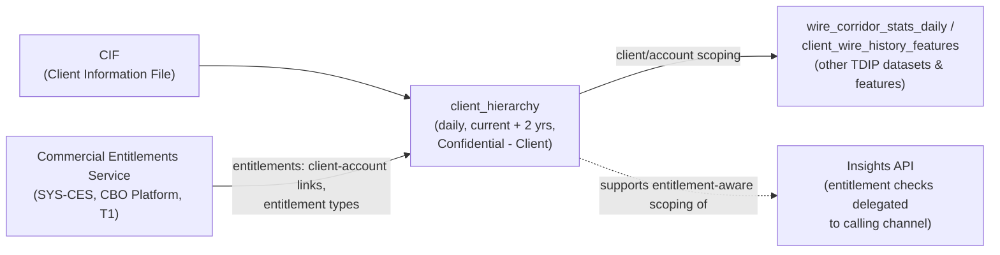

## Overview

`client_hierarchy` is one of the payments-domain datasets cataloged in the
Treasury Data & Insights Platform (TDIP). It links commercial clients to the
accounts they own or are entitled to, and is the reference structure that lets
other TDIP datasets and analytics be scoped and filtered to the correct client
or account ownership boundary. The catalog describes its purpose concisely as
linking clients to accounts for entitlement-aware analytics: any feature
table, corridor statistic, or Insights API response that must respect "this
client can only see this client's/these accounts' data" ultimately depends,
directly or indirectly, on a hierarchy like this one to know which accounts
belong to which client.

It is refreshed **daily**, retains **current plus two years** of history, and
is classified **Confidential - Client** - the tier DUS-07 defines for "a
client's own transactions, wire history, beneficiaries," i.e. data clearly
attributable to one client but not account-level deposit activity (which
would be Restricted - Client Confidential). Data ownership is split between
**Marcus Chen** (business/data owner) and **Carlos Mendes** (EM, Treasury
Data Platform), the same pairing that owns `pay_wire_txn_hist` and
`gpi_tracker_events`, reflecting that `client_hierarchy` sits in the same
payments-domain ingestion pipeline as the wire datasets.

## Source lineage: CIF + CES

`client_hierarchy` is fed from two upstream systems:

- **CIF (Client Information File)** - the client/customer master record
  source. It is referenced only as a source for this dataset in the reviewed
  TDIP catalog extract and the broader estate documentation; no CIF system
  entry, owning team, or API surface is documented elsewhere in the corpus,
  so its internal structure and refresh mechanics are outside this page's
  evidence and should be treated as a gap to confirm with Treasury Data &
  Analytics if deeper lineage is needed.
- **[Commercial Entitlements Service (CES)](../systems/commercial-entitlements-service.md)**
  (`SYS-CES`) - the system of record for which users and clients are
  entitled to which accounts and entitlement types (e.g. `WIRE_VIEW`,
  `WIRE_INITIATE`, `WIRE_APPROVE`, `WIRE_RELEASE`, `WIRE_TEMPLATE_ADMIN`).
  CES is owned by the CBO Platform team (technical owner Nadia Haddad,
  business owner Marcus Chen) and is a Tier 1 (24x7 critical) system. It is
  consumed synchronously elsewhere in the estate - for example Crestline
  Business Online's Wire Center calls `GET /ces/v2/users/{id}/entitlements`
  (`EP-CES-01`) at request time to authorize and account-filter wire activity
  - which establishes CES as the entitlement authority that `client_hierarchy`
  draws from when TDIP builds its daily client-to-account linkage for
  analytics use rather than real-time request authorization.

## Role in entitlement-aware analytics

The TDIP data catalog notes that the [Insights API](../systems/treasury-data-insights-platform.md)
(ADR-PAY-026) computes results in TDIP and exposes them through versioned
endpoints "with entitlement checks delegated to the calling channel" - that
is, TDIP itself does not re-implement per-request authorization; the calling
channel (such as CBO) is expected to have already confirmed the caller's
entitlement, typically via CES, before invoking an Insights endpoint.
`client_hierarchy` is the dataset-layer counterpart to that pattern: because
TDIP's batch and feature-engineering jobs run outside any single user's
authenticated session, they need a durable, periodically refreshed mapping of
which accounts belong to which client (and, transitively, who is entitled to
see them) rather than calling CES synchronously per row. `client_hierarchy`
fills that role for client-and-account-scoped joins inside TDIP pipelines,
distinct from live per-request authorization at the channel layer.

This distinction matters operationally: `client_hierarchy` is refreshed daily,
so a change in CES entitlements (e.g., a new account added to a client's
Wire Center relationship) is reflected in TDIP joins only after the next
daily run, not instantly. Analytics or feature tables that key off
`client_hierarchy` should be understood to lag live entitlement state by up
to one day, which is an acceptable trade-off for descriptive/analytical use
but would not be appropriate as a substitute for real-time authorization
checks.

## Classification and governance

`client_hierarchy` carries the **Confidential - Client** classification,
placing it alongside `pay_wire_txn_hist`, `gpi_tracker_events`, and
`client_wire_history_features`, and one tier below the **Restricted - Client
Confidential** datasets (`dda_txn_history`, `beneficiary_behavior_profile`)
that contain account-level deposit activity or financial-crimes features.
Under [DUS-07 (Data Use and Client Confidentiality Standard)](../policies/dus-07.md),
this means the dataset is understood as "a client's own transactions, wire
history, beneficiaries" - i.e., data clearly attributable to and usable for
that client, subject to the Standard's purpose-limitation and cross-client
confidentiality rules (information about one client's accounts must not be
used to generate content shown to another client), but it does not trigger
the stricter Privacy Office pre-approval (15-business-day Collibra SLA) that
applies specifically to Restricted datasets.

Because `client_hierarchy` is a linkage/mapping dataset rather than a
transaction or balance dataset, it is unlikely by itself to be a primary
input to client-facing cohort statistics (which would need to satisfy
DUS-07's aggregation thresholds - at least 500 transactions, 20 distinct
clients, no client over 15% of cohort volume). Its governance significance is
instead as a dependency: any downstream analytics or Insights API endpoint
that joins through `client_hierarchy` to scope results to a client's own
accounts inherits the correctness requirement that the hierarchy be accurate
and current, since an incorrect client-to-account link would risk exposing
one client's data to another - the exact harm DUS-07 §4 prohibits.

## Relationship to other TDIP assets

`client_hierarchy` is not listed among the documented "derived from" inputs
of the TDIP feature tables (`wire_corridor_stats_daily`,
`beneficiary_behavior_profile`, `client_wire_history_features`), which are
built directly from `pay_wire_txn_hist`, `gpi_tracker_events`, and
`dda_txn_history`. Its documented role is narrower and structural: providing
the client-account linkage that entitlement-aware consumption of those
datasets and of Insights API endpoints (e.g. `EP-TDIP-01`,
`GET /tdip/insights/v1/cash-forecast/{clientId}`) depends on, rather than
contributing behavioral or transactional features itself. Teams extending
TDIP with new client-facing analytics should treat `client_hierarchy` as the
reference for "which accounts belong to this client" and still confirm, per
DUS-07, that any new use of client data they build on top of it has the
appropriate purpose and approvals.

## Known gaps

- CIF, one of the two source systems, has no documented system-ownership
  entry, API, or refresh mechanism elsewhere in the reviewed estate
  documentation; only its role as a source feeding `client_hierarchy` is
  recorded.
- The TDIP catalog does not specify the exact mechanism (API pull, CDC,
  batch extract) by which CES entitlement data is captured into
  `client_hierarchy`, only that the dataset is refreshed daily from CES
  alongside CIF.
- As with other TDIP payments-domain datasets, access remains governed in
  Collibra per DUS-07; `client_hierarchy`'s Confidential - Client
  classification does not require the Restricted-tier Privacy Office
  approval, but requesters should still confirm current access requirements
  in Collibra rather than assuming none apply.
