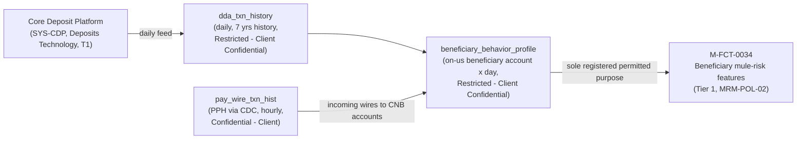

## Overview

`dda_txn_history` is a payments-domain dataset cataloged in the Treasury Data
& Insights Platform (TDIP). It is the daily transaction-history feed from the
**Core Deposit Platform** (`SYS-CDP`), CNB's system of record for demand
deposit accounts (DDAs) — i.e. on-us client checking/deposit account
activity, as distinct from the wire-payment datasets (`pay_wire_txn_hist`,
`gpi_tracker_events`) that are sourced from the Prism Payments Hub and Swift
gpi Tracker.

| Attribute | Value |
|---|---|
| Source | Core Deposit Platform (`SYS-CDP`) |
| Refresh | Daily |
| History retained | 7 years |
| Classification | **Restricted - Client Confidential** |
| Data owner / steward | Mark Sullivan / Deposits Data Engineering |

(Source: [TDIP-CAT-2026.2 Treasury Data and Insights Platform Data Catalog Extract](../../sources/estate/tdip-cat-2026.2-treasury-data-and-insights-platform-data-catalog-extract.md), §2.)

Among the six payments-domain datasets listed in the TDIP catalog,
`dda_txn_history` is the only one classified **Restricted - Client
Confidential**; every other dataset is Confidential - Client
(`pay_wire_txn_hist`, `gpi_tracker_events`, `client_hierarchy`) or Internal
(`cbo_wire_events`). It is therefore the single most restrictively classified
dataset in the domain, and the one most bound by purpose-limitation rules
when combined with other data.

## Classification basis and what it means

CNB's [DUS-07 Data Use & Client Confidentiality Standard](../policies/dus-07.md)
defines **Restricted - Client Confidential** as covering "account-level
activity in deposit systems; financial-crimes features; data about one
client's accounts used for risk purposes" — a strictly narrower and more
sensitive category than **Confidential - Client**, which covers "a client's
own transactions, wire history, beneficiaries." `dda_txn_history` sits in the
Restricted tier specifically because it is account-level deposit activity:
unlike a wire payment record, which captures a discrete, client-initiated
transfer, a DDA transaction history exposes the full pattern of money moving
into and out of a client's own on-us deposit account — balances, debits,
credits, and timing — which DUS-07 treats as materially more sensitive than
transaction-level wire data.

Two consequences follow directly from this classification under DUS-07 §7:

- **Privacy Office approval is required for access.** Any access to
  Restricted datasets in TDIP requires both data-owner sign-off and Privacy
  Office approval through the Collibra Data Access Request (DAR) process,
  with a published SLA of 15 business days — tighter governance than the
  standard Collibra-governed access that applies to Confidential or Internal
  datasets.
- **Purpose limitation carries forward to derived data.** DUS-07 §3 states
  that data collected or derived for one purpose must not be reused for
  another purpose without Privacy Office (and, for financial-crimes data, FCC)
  approval, and that "feature tables inherit the permitted purpose of their
  most restrictive input." Because `dda_txn_history` is itself Restricted,
  any feature table or analytic product built on top of it inherits that
  Restricted tier and whatever narrow permitted purpose was approved for the
  use of deposit-account data, rather than being treated as a lower,
  averaged-down classification.

## Downstream consumption: beneficiary_behavior_profile

The only documented downstream consumer of `dda_txn_history` in the current
TDIP catalog is the
[`beneficiary_behavior_profile`](beneficiary-behavior-profile.md) feature
table, which joins `dda_txn_history` with `pay_wire_txn_hist` (incoming wires
landing in CNB accounts) at a grain of on-us beneficiary account x day to
produce mule-risk behavioral features such as `bene_median_hours_to_outflow`,
`bene_outflow_ratio_24h`, and `bene_new_counterparties_30d`.

This lineage illustrates the purpose-limitation inheritance rule in practice:
`beneficiary_behavior_profile` is classified Restricted - Client
Confidential — the same tier as `dda_txn_history` rather than the lighter
Confidential - Client tier of its other input, `pay_wire_txn_hist` — because
the catalog treats the most restrictive contributing source as the floor for
a derived table's classification. `beneficiary_behavior_profile`'s single
registered permitted purpose is supplying features to
**M-FCT-0034 (Beneficiary mule-risk features)**, a Tier 1 financial-crimes
model under [MRM-POL-02](../policies/mrm-pol-02.md) owned by Financial Crimes
Technology (Victor Petrov), last validated 2026-02. MRM-POL-02 §4 explicitly
bars outputs of Tier 1 financial-crimes models, including M-FCT-0034, from
product, marketing, or client-facing use — a restriction that applies
transitively to `beneficiary_behavior_profile` and, by extension, to
`dda_txn_history` whenever it is consumed through that feature table.

No other feature table or Insights API endpoint in the current catalog reads
from `dda_txn_history`: `wire_corridor_stats_daily` and
`client_wire_history_features` are both built only from `pay_wire_txn_hist`
and `gpi_tracker_events`, and the one GA Insights API endpoint
(`GET /tdip/insights/v1/cash-forecast/{clientId}`) is powered by model
M-TRS-0142, not by deposit-account data. Consequently `dda_txn_history` has
exactly one documented, narrowly-scoped consumption path — financial-crimes
mule-risk feature engineering — and no documented path into any
client-facing dashboard or Insights API response. Any new proposal to use
`dda_txn_history` (directly or via a derived feature) for a client-facing or
product purpose would need a fresh Privacy Impact Assessment (~4 weeks) and,
per DUS-07 §7, would generally not be approved if it routes through
financial-crimes-purpose data outside FCC purposes.

## Ownership

`dda_txn_history` is jointly attributed in the catalog to **Mark Sullivan /
Deposits Data Engineering**. This differs from the ownership pattern used for
the other TDIP-ingested payments datasets, which pair a Payments business
data owner (Laura Kim or Marcus Chen) with a TDIP data-engineering lead
(Carlos Mendes): `dda_txn_history` is instead owned end-to-end by the
deposits organization rather than by Payments or TDIP engineering, consistent
with it being sourced from a system outside the Payments Platform.

This is corroborated by CNB's organization and system-ownership directory,
which separately registers:

- **[Deposits Data Ownership](../teams/deposits-data-ownership.md)**
  (accountable: Mark Sullivan) as the named partner function responsible for
  "Core Deposit Platform datasets (Restricted)" — i.e. the governance
  function that owns `dda_txn_history` specifically because of its Restricted
  classification.
- **`SYS-CDP` ([Core Deposit Platform](../systems/core-deposit-platform.md))**,
  owned by Deposits Technology, with Mark Sullivan as business owner and a
  Tier 1 (24x7 critical) support classification — the same criticality tier
  as the core payment-processing systems (PRISM Payments Hub, the Fedwire and
  Swift/gpi network gateways).

Because the Core Deposit Platform and its downstream data ownership sit
outside the Payments & Treasury Technology (PTT) organization chart that
owns most of the other datasets in this catalog (TDIP, PPH, CBO), requests to
change ingestion, add new consumers, or expand access to `dda_txn_history`
should be routed to Deposits Data Engineering / Mark Sullivan rather than to
the TDIP team (Carlos Mendes) that owns the pipeline for the wire-centric
datasets.

## Platform mechanics

`dda_txn_history` is ingested into and stored within the same TDIP platform
as the other payments-domain datasets: Snowflake (Enterprise, US-East) with
dbt transformations, a Feast feature store for derived features such as
`beneficiary_behavior_profile`, and Amazon SageMaker for batch scoring of
models like M-FCT-0034. Its **daily** refresh cadence is the slowest in the
catalog alongside `client_hierarchy`; by contrast, `pay_wire_txn_hist` and
`cbo_wire_events` refresh hourly and `gpi_tracker_events` is nightly (moving
to hourly once TDA-2188 completes). Any feature table that joins
`dda_txn_history` with a more frequently refreshed source — as
`beneficiary_behavior_profile` does with `pay_wire_txn_hist` — is bounded to
at most daily effective freshness by this slower input, regardless of how
often the other source updates.

Access to `dda_txn_history` and anything derived from it is governed through
Collibra, the platform-wide access-governance tool for TDIP, with the
15-business-day Privacy Office approval SLA noted above applying specifically
because of its Restricted classification.

## What this page does not cover

The TDIP catalog extract records only source, refresh cadence, retention
window, classification, and ownership for `dda_txn_history`; it does not
document the table's schema or grain (e.g. per-transaction vs. per-account
vs. per-day), the ingestion mechanism from the Core Deposit Platform (CDC,
batch export, or another pattern), or any Core Deposit Platform system
architecture beyond its name, owning team, and Tier 1 support classification.
Readers needing those details should treat them as a gap to confirm with
Deposits Data Engineering / Mark Sullivan rather than infer them from the
wire-dataset ingestion patterns (e.g. `pay_wire_txn_hist`'s CDC feed from
PPH), since `dda_txn_history` is sourced from a different platform with no
documented pipeline specification in the reviewed corpus.

## Related pages

- [beneficiary_behavior_profile feature table](beneficiary-behavior-profile.md)
- [client_hierarchy dataset](client-hierarchy.md)
- [Core Deposit Platform system](../systems/core-deposit-platform.md)
- [Deposits Data Ownership team](../teams/deposits-data-ownership.md)
- [DUS-07 Data Use & Client Confidentiality Standard](../policies/dus-07.md)
- [MRM-POL-02 Model Risk Management Policy](../policies/mrm-pol-02.md)
