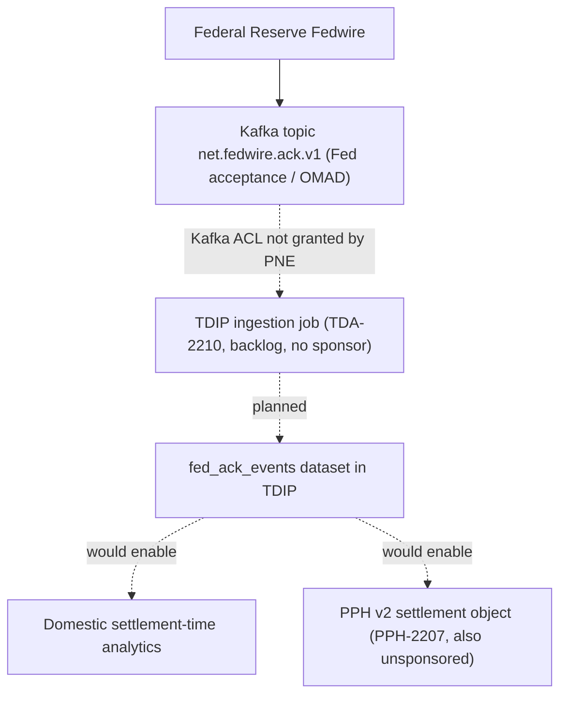

## Overview

`fed_ack_events` is a **planned, not-yet-ingested** dataset in the Treasury Data & Insights
Platform (TDIP) payments domain data catalog. It would hold Fed acceptance
acknowledgement data (OMAD — Originator's Message Accountability Data) sourced from the
`net.fedwire.ack.v1` Kafka topic, described in
[Fedwire Network ACK Topics](../interfaces/fedwire-network-ack-topics.md). As of the
2026.2 catalog publication, the dataset row exists in the TDIP catalog purely as a
placeholder: source, refresh cadence, history, classification, and data owner are all
unset ("NOT INGESTED").

The backlog item to build this ingestion is **TDA-2210** ("Ingest net.fedwire.ack.v1
(Fed acceptance / OMAD) into TDIP"), owned by Carlos Mendes, sized at 8 points, and
sitting in the TDIP (TDA) backlog with no target sprint.

## Why it matters: the settlement-time analytics gap

TDIP's existing wire dataset, `pay_wire_txn_hist`, is sourced from PPH via CDC and
captures PPH's own processing/state-transition timestamps, not the Federal Reserve's
authoritative acceptance time. Without `fed_ack_events`, TDIP has no reliable way to
compute **Fed settlement time** for domestic (Fedwire) wires:

- The catalog explicitly notes: "Settlement-time analytics for domestic wires require
  `fed_ack_events` (TDA-2210, backlog)."
- The parallel API-side gap is tracked in **PPH-2207** ("v2: add rail-specific
  settlement object (`fedSettlementTs` from pacs.002/OMAD; `settlementStatus`)"), also
  backlog and also blocked — in that case on the lack of a product sponsor to enter the
  Demand Board, with no consuming product yet identified (comment from Laura Kim:
  "No consuming product identified yet - parking"). PPH-2207's description notes that
  today "v2 stateHistory `NETWORK_ACCEPTED` timestamp is PPH processing time, not Fed
  receipt time" — the same gap `fed_ack_events` would close on the analytics side.
- By contrast, the existing `gpi_tracker_events` dataset (sourced from
  `GPI_TRACKER_SNAPSHOT`, owned by Laura Kim / Carlos Mendes) already gives TDIP
  cross-border settlement visibility; `wire_corridor_stats_daily`'s
  `same_day_accc_rate` and `median_hours_to_accc` feature-table columns are derived
  from `pay_wire_txn_hist` + `gpi_tracker_events` for **outbound Swift** wires only.
  There is no equivalent domestic-Fedwire acceptance signal feeding any TDIP feature
  table today.

The TDIP catalog's "Known gaps" section lists "Fed acceptance timestamps not ingested
(TDA-2210)" as a first-class, named limitation of the platform.

## Planned data flow (blocked)

*What this shows: the intended path from the Fedwire acknowledgement topic into a TDIP
dataset and its two downstream consumers, with the two points in the chain — the Kafka
ACL grant and the TDIP ingestion build — both currently blocked.*

## Blocking conditions

Two independent blockers must clear before `fed_ack_events` can be ingested:

1. **Kafka ACL from PNE.** TDA-2210 is explicitly "blocked on Kafka ACL from PNE" (Payment
   Networks Engineering). Carlos Mendes's comment on the ticket (2026-04-18) states:
   "Blocked on Kafka ACL from PNE for `net.fedwire.ack.v1`." PNE owns/administers the
   topic (see [Fedwire Network ACK Topics](../interfaces/fedwire-network-ack-topics.md)
   for topic ownership and schema), and TDIP has not yet been granted consumer access.
2. **No business sponsor.** The same comment continues: "No business sponsor yet." TDA-2210
   has not been prioritized or scheduled into a sprint, and has no identified downstream
   consumer or stakeholder funding the work — mirroring the sponsorship gap on the
   API-side counterpart, PPH-2207.

Both blockers must be resolved independently: granting the Kafka ACL only unblocks the
technical path, while a business sponsor is needed to get TDA-2210 scheduled and funded
against the [Treasury Data & Insights Platform](../systems/treasury-data-insights-platform.md)
roadmap.

## Catalog attributes (as published)

| Attribute | Value |
|---|---|
| Dataset name | `fed_ack_events` |
| Source | `net.fedwire.ack.v1` |
| Refresh | NOT INGESTED (TDA-2210) |
| History | — |
| Classification | — (not yet assigned; would require Collibra registration, and Restricted-classification datasets need Privacy Office approval with a 15-business-day SLA) |
| Data owner / steward | — (not yet assigned) |

Because the dataset is unbuilt, TDIP governance steps that normally apply to new
datasets — Collibra access registration, classification, and (if Restricted) Privacy
Office review — have not yet started for `fed_ack_events`.

## Relationship to other TDIP assets

- **[Treasury Data & Insights Platform](../systems/treasury-data-insights-platform.md)**
  is the owning system; `fed_ack_events` is one row in its payments-domain data catalog
  (TDIP-CAT-2026.2), alongside `pay_wire_txn_hist`, `gpi_tracker_events`,
  `dda_txn_history`, `client_hierarchy`, and `cbo_wire_events`.
- **[Fedwire Network ACK Topics](../interfaces/fedwire-network-ack-topics.md)** documents
  the `net.fedwire.ack.v1` Kafka topic that would be the dataset's sole source once
  ingestion is built.
- No TDIP feature table (`wire_corridor_stats_daily`, `beneficiary_behavior_profile`,
  `client_wire_history_features`) currently derives from `fed_ack_events`, since it does
  not yet exist; any future domestic settlement-time feature work would depend on this
  dataset shipping first.
- The Insights API (ADR-PAY-026) has no wire-settlement-time endpoint today; the catalog
  notes "No endpoints exist for wire insights" beyond the unrelated cash-forecast
  endpoint (`EP-TDIP-01`). A future settlement-time insight would need `fed_ack_events`
  as an input before it could be onboarded through the standard MRM-POL-02 /
  DUS-07 / DRC onboarding steps.

## Status summary

| Item | State |
|---|---|
| Backlog ticket | TDA-2210, Backlog, unscheduled, 8 pts, owner Carlos Mendes |
| Blocking dependency | Kafka ACL from PNE for `net.fedwire.ack.v1` — not granted |
| Business sponsor | None identified |
| Ingestion status | Not started; no source connection, refresh job, or schema mapping exists |
| Primary use case if built | Domestic (Fedwire) settlement-time analytics; input to a future PPH v2 settlement object (PPH-2207) |
