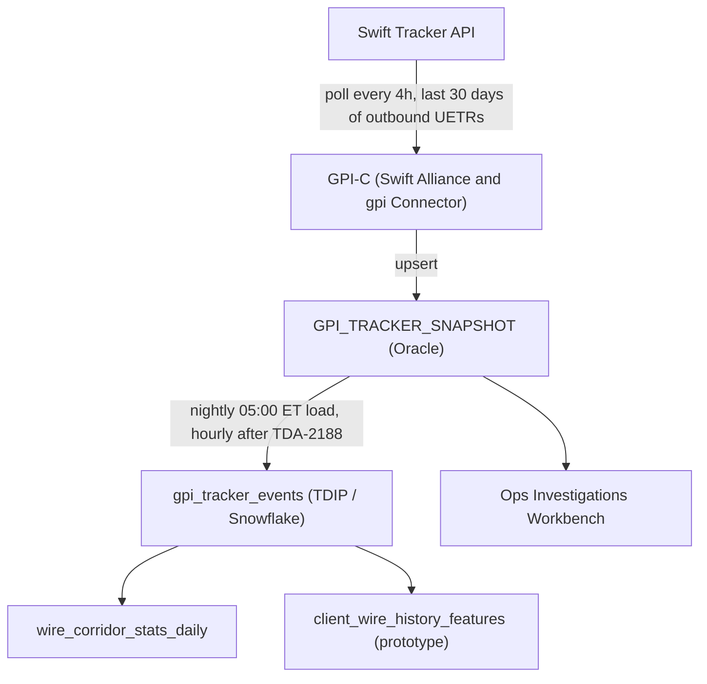

## Overview

`gpi_tracker_events` is a payments-domain dataset in the **Treasury Data & Insights Platform (TDIP)**, running on Snowflake. It is TDIP's copy of the Oracle table **GPI_TRACKER_SNAPSHOT**, which is owned and populated by the Swift Alliance & gpi Connector (GPI-C, system id `SYS-PNG-GPI`). The dataset carries Swift gpi tracking data — status, route, charges and confirmed-credit information — for CNB's outbound international (Swift) wires, joined to Prism Payments Hub (PPH) payments by UETR.

The dataset is classified **Confidential - Client** (a client's own transactions and wire history) under the Data Use & Client Confidentiality Standard (DUS-07), carries history back to **2025-03-01**, and is loaded **nightly at 05:00 ET**, moving to **hourly** once Jira story TDA-2188 ("gpi_tracker_events: move load from nightly to hourly") completes, targeted for 2026-11. Data ownership (steward) is Laura Kim (business) and Carlos Mendes (EM, Treasury Data Platform), per the TDIP data catalog.

Related pages: [Dataset: gpi_tracker_snapshot](gpi-tracker-snapshot.md) (the upstream Oracle source table), [Swift gpi Connector](../systems/swift-gpi-connector.md) (the system that populates the source table).

## Lineage and data flow

`gpi_tracker_events` is downstream of two hops: GPI-C's polling of the Swift Tracker API, and TDIP's batch copy of the resulting Oracle snapshot.

1. GPI-C calls the Swift Tracker API (via the Swift Microgateway, using SwiftNet PKI credentials bound to the GPI-C service account) every 4 hours (00:00, 04:00, 08:00, 12:00, 16:00, 20:00 ET), requesting changed payment transactions for outbound UETRs from the last 30 days, and upserts the results into the Oracle table `GPI_TRACKER_SNAPSHOT`.
2. TDIP loads `GPI_TRACKER_SNAPSHOT` into the Snowflake dataset `gpi_tracker_events` nightly at 05:00 ET (hourly after TDA-2188 ships).
3. `gpi_tracker_events` feeds two Payments-domain feature tables: `wire_corridor_stats_daily` (currency x destination country x day, built jointly from `pay_wire_txn_hist` and `gpi_tracker_events`, Internal classification, used by Payment Ops dashboards) and `client_wire_history_features` (originating client x beneficiary key, Confidential - Client, a non-productionized prototype).

*How gpi status data reaches TDIP's `gpi_tracker_events` table and the feature tables built from it.*

Because the source is itself a 4-hour batch, the end-to-end freshness of `gpi_tracker_events` is bounded below by GPI-C's polling cadence even after TDA-2188 moves the TDIP load to hourly: a status change can be up to roughly 4 hours stale in `GPI_TRACKER_SNAPSHOT` before TDIP ever picks it up, plus the TDIP load interval itself (today up to ~24 hours, falling to about 1 hour).

## Schema (inherited from GPI_TRACKER_SNAPSHOT)

`gpi_tracker_events` mirrors the column set of the source Oracle table:

| Column | Description |
|---|---|
| `UETR` | End-to-end tracking id; join key to PPH v2 `identifiers.uetr`. PPH assigns the UETR at release for every outbound wire (ADR-PAY-023); legacy PPH v1 consumers do not receive it. |
| `LAST_STATUS` / `LAST_REASON` | Latest Swift gpi tracker status (ACSP, ACCC, RJCT) and reason code (G000-G004 gpi reason codes, or an ISO 20022 reject reason such as AC01/AC04/RR05). |
| `ROUTE_JSON` | Ordered list of agents in the payment chain (BIC, name, country, received/forwarded timestamps). |
| `DEDUCTED_CHARGES_JSON` | Charges deducted per agent (amount, currency) when reported (SHAR/CRED deduction types). |
| `CONFIRMED_AMOUNT` / `CREDIT_TS` | Amount and timestamp reported with a terminal ACCC status. |
| `SNAPSHOT_TS` | Time GPI-C captured the update from the Swift Tracker API. |

`LAST_STATUS`/`LAST_REASON` values and their tracking implications (ACSP/G000 forwarded — more updates expected; ACSP/G001 forwarded to a non-gpi agent — tracking ends, no further updates; ACSP/G002-G004 pending for various reasons — update expected; ACCC — terminal, credited; RJCT + reason — terminal, return expected via pacs.004) are defined by the Swift Alliance & gpi Connector design, not by TDIP; see [Swift gpi Connector](../systems/swift-gpi-connector.md) for the full status table and Q3-2025 outcome distribution (88% ACCC, 8% ending at a non-gpi agent, 2.5% pending >24h, 1.5% RJCT; median release-to-ACCC 2h 41m).

## Consumers and known limitations

- **wire_corridor_stats_daily**: a descriptive feature table (currency x destination country x day) combining `pay_wire_txn_hist` and `gpi_tracker_events` across all originating clients, used by Payment Operations dashboards. It is registered as an End-User Analytic (EUA-TRS-0007) rather than a model under the Model Risk Management Policy (MRM-POL-02), since it contains only counts, medians and percentages with no forward-looking estimation, and carries no suppression flag (Internal classification, not shown to clients).
- **client_wire_history_features**: a prototype (not productionized, not registered under MRM) combining `pay_wire_txn_hist` and `gpi_tracker_events` at originating-client x beneficiary-key grain (count, median release-to-ACCC, p90, last_seen). It is Confidential - Client and would need MRM/model registration, Privacy Office data-use approval and an Insights API serving endpoint before any client-facing use, per the Insights API onboarding steps (MRM inventory registration, DUS-07 access approvals, serving endpoint build, Disclosure Review Committee approval of wording).
- There is **no production client-facing wire-insights endpoint**: the TDIP Insights API catalog lists only `EP-TDIP-01` (cash-forecast) as GA; no endpoint exists for wire or gpi history insights.
- **fed_ack_events** (domestic Fedwire acceptance/OMAD data from `net.fedwire.ack.v1`) is **not ingested** into TDIP (tracked as backlog story TDA-2210, blocked on a Kafka ACL from the owning network engineering team), so settlement-time analytics that would pair Fedwire acceptance with `gpi_tracker_events` for cross-rail wire analysis are not possible today.

## Governance and confidentiality constraints

`gpi_tracker_events` is classified **Confidential - Client** under DUS-07 because it carries a client's own international wire history. This has concrete consequences for any analytics or product built on top of it:

- Feature tables derived from `gpi_tracker_events` inherit the permitted purpose of their most restrictive input; a feature table combining it with a Restricted-classified input (e.g., deposit account data for fraud/mule detection) becomes Restricted - Client Confidential and is scoped to that restricted purpose only (as `beneficiary_behavior_profile` is, combining `dda_txn_history` with `pay_wire_txn_hist`).
- Any aggregated, cross-client cohort statistic shown to a client (not the client's own data) must independently meet DUS-07's cohort thresholds: at least 500 transactions, at least 20 distinct originating clients, no single client over 15% of cohort volume, monthly-or-better refresh, and Disclosure Review Committee-approved wording; cohorts failing any condition must be suppressed, not approximated.
- A client-facing insight built from the client's *own* `gpi_tracker_events` history (e.g., "this client's wires to this beneficiary typically clear in N hours") must be based on at least 5 comparable transactions and must state the basis (count and period), per DUS-07 s6.
- Any customer-facing estimate derived from this data (a forward-looking value such as an expected delivery time) is a Tier 2 model at minimum under MRM-POL-02 and requires independent model validation (typically 10-14 weeks) before it can be shown to clients; purely descriptive statistics without forward-looking estimation can instead be registered as an End-User Analytic.
- Access to the dataset is governed in Collibra; because this dataset is Confidential (not Restricted), it does not require the 15-business-day Privacy Office Data Access Request SLA that applies to Restricted datasets, but any *new* client-facing use of the data still requires a Privacy Impact Assessment (~4 weeks).

## Roadmap and operational context

- **TDA-2188** ("gpi_tracker_events: move load from nightly to hourly," owner Carlos Mendes) is in progress, targeted for 2026-11, and is the mechanism by which this dataset's refresh cadence changes from nightly to hourly. It does not change the upstream GPI-C polling cadence (still every 4 hours) or the 30-day lookback window GPI-C uses against the Swift Tracker API.
- An earlier proposal (PNG-1544) to increase GPI-C's own polling frequency from 4 hours to 2 hours was declined because projected Swift Tracker API usage would have exceeded the contracted quota of 250,000 calls/month; that need is intended to be superseded by a future change-feed-based internal service (GTSI-0107, "gpi Tracker Real-Time Service," not funded for 2026, discovery planned for 2027-Q2). TDIP's `gpi_tracker_events` dataset is unaffected by that decision since it reads the already-captured Oracle snapshot rather than calling the Swift Tracker API itself.
- Effective 2026-10-01, ownership of the upstream Swift Alliance Gateway, gpi Connector (SYS-PNG-GPI) and gpi Tracker integration moved from Payment Networks Engineering (Raj Malhotra) to Global Transaction Services Integration (GTSI, EM Omar Siddiqui, tech lead Hannah Lindqvist), with knowledge transfer targeted to complete 2026-12-15. This reorganization changes who to contact about the source system and its Swift Tracker API quota/contract (GTSI-0115, renewal due 2027-01-31), but does not change TDIP's `gpi_tracker_events` table ownership, which remains with Laura Kim / Carlos Mendes.
- The Payments Architecture Review Board (ARB) has explicitly **not approved** exposing `GPI_TRACKER_SNAPSHOT` (or, by extension, `gpi_tracker_events`) directly to client-facing channels; any read-only, quota-isolated service for that purpose would itself require ARB review. There is currently no internal API for gpi status at all — TDIP's nightly/hourly load and Payment Operations' Investigations Workbench are the only consumers of the underlying snapshot.
