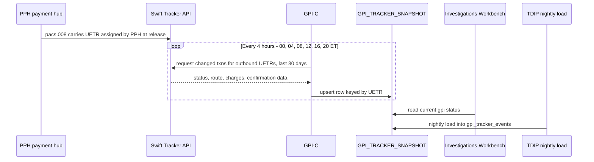

## Overview

`GPI_TRACKER_SNAPSHOT` is the Oracle table that holds the **single source of Swift gpi status** across the estate. It is owned and written exclusively by the **Swift Alliance & gpi Connector (GPI-C)**, one of the two modules of the Payment Network Gateway (the other being the Fedwire Funds Connector, FFC), operated by Payment Networks Engineering (PNE). GPI-C populates the table by polling the Swift Tracker API and upserting the latest tracking state for each outbound UETR it is tracking.

The table is a snapshot, not an event log: each row reflects the *current* known state of a payment's gpi journey, overwritten on every refresh. The companion event-oriented dataset is [GPI_TRACKER_EVENTS](./gpi-tracker-events.md), which is loaded nightly from this snapshot by TDIP.

## Ownership and ingestion mechanism

GPI-C retrieves gpi Tracker updates via the Swift API, reached through the **Swift Microgateway**, authenticating with SwiftNet PKI credentials bound to the GPI-C service account. The integration is **batch**, not real time:

- GPI-C runs every 4 hours, at **00:00, 04:00, 08:00, 12:00, 16:00, and 20:00 ET**.
- Each run requests changed payment transactions for outbound UETRs released in the **last 30 days**.
- Results are **upserted** into `GPI_TRACKER_SNAPSHOT`, keyed by UETR.

A 2026 change request (PNG-1544) to shorten the cadence from 4 hours to 2 hours was declined (Addendum A, 2026-03-03): projected Swift Tracker API usage under a 2-hour cadence would exceed the contracted monthly call quota. See [Interface: gpi Tracker Batch Feed](../interfaces/gpi-tracker-batch-feed.md) for the batch pull/upsert mechanics and [System: Swift gpi Connector](../systems/swift-gpi-connector.md) for the GPI-C module that owns this job.

Batch retrieval and upsert cycle feeding GPI_TRACKER_SNAPSHOT, and its two downstream consumers.

## Columns

| Column | Description |
|---|---|
| UETR | Tracking id (join key to PPH v2 identifiers.uetr) |
| LAST_STATUS / LAST_REASON | ACSP/ACCC/RJCT and G000-G004 or ISO reject reason |
| ROUTE_JSON | Ordered agents (BIC, name, country, received/forwarded timestamps) |
| DEDUCTED_CHARGES_JSON | Charges deducted per agent (amount, currency) when reported |
| CONFIRMED_AMOUNT / CREDIT_TS | Amount and timestamp reported with ACCC |
| SNAPSHOT_TS | Time GPI-C captured the update |

`UETR` is the join key back to PPH's own identifier, `identifiers.uetr` (v2), letting consumers correlate a gpi tracking record with the originating payment in the Payment Hub (PPH). `LAST_STATUS` / `LAST_REASON` hold the most recent Swift gpi status/reason code pair; `ROUTE_JSON` and `DEDUCTED_CHARGES_JSON` are JSON-structured fields capturing the ordered agent chain and any charges agents reported, respectively. `CONFIRMED_AMOUNT` and `CREDIT_TS` are only populated once a payment reaches the terminal `ACCC` status. `SNAPSHOT_TS` records when GPI-C captured that particular update, not when the underlying Swift event occurred.

## gpi statuses captured in LAST_STATUS / LAST_REASON

| Status / reason | Meaning | Tracking implication |
|---|---|---|
| ACSP / G000 | Forwarded to next gpi agent | Further updates expected |
| ACSP / G001 | Forwarded to a non-gpi agent | No further updates will follow - tracking ends at the last gpi agent |
| ACSP / G002 | Credit may not be confirmed same day | Update expected |
| ACSP / G003 | Pending - awaiting documents from creditor | Update expected |
| ACSP / G004 | Pending - awaiting cover funds | Update expected |
| ACCC | Credited to beneficiary account | Terminal; credit timestamp and confirmed amount available |
| RJCT + reason (e.g., AC01, AC04, RR05) | Rejected by an agent | Terminal; return expected via pacs.004 |

Observed outbound outcomes (Q3-2025) against this status model: 88% reach final status `ACCC`; 8% end tracking at `ACSP`/`G001` (handed to a non-gpi agent); 2.5% are pending more than 24 hours under `G002`/`G003`/`G004`; 1.5% are `RJCT`. Median release-to-`ACCC` time across all corridors was 2 h 41 min, and 34% of wires had at least one intermediary deduction reported (`SHAR`/`CRED`) captured in `DEDUCTED_CHARGES_JSON`.

## Access rule: no direct channel exposure

`GPI_TRACKER_SNAPSHOT` must **not be exposed directly to channels**. There is no internal API for gpi status built on top of this table. A client-facing capability (e.g., showing gpi tracking to a customer) requires a dedicated service with its own SLA, entitlement checks, and quota management, rather than direct reads against the snapshot table. This restriction exists in large part because of the Swift Tracker API quota described below: per-payment lookups driven from client channels were estimated at roughly 1.9 million calls/month (around 2,900 outbound international wires per day with repeated client views), which would exceed the contracted monthly quota by about 7x. Any future real-time design is expected to use a change-feed with internal fan-out rather than per-payment calls against Swift.

Authorized consumers of the table are:

- **Payment Operations' Investigations Workbench (IWB)** - operational investigation of gpi status, directly against the snapshot.
- **TDIP nightly load** - loads `GPI_TRACKER_SNAPSHOT` into [GPI_TRACKER_EVENTS](./gpi-tracker-events.md) once per day.

## Quota constraints shaping the cadence

The Swift Tracker API contract permits **250,000 calls per month** (renewal 2027-01-31); usage was running at roughly 61% of that quota from the combination of GPI-C's scheduled batch pulls and ad-hoc Operations lookups. This headroom is the reason the 4-hour batch cadence is a hard design constraint rather than an implementation detail: a request to double the pull frequency to every 2 hours (PNG-1544) was declined in Addendum A (2026-03-03) because the projected additional Tracker API usage would exceed the contracted quota. A change-feed-based internal service was recommended instead as a future initiative, rather than narrowing the batch interval further or allowing per-payment lookups from channels.

## Related pages

- [GPI_TRACKER_EVENTS](./gpi-tracker-events.md) - nightly TDIP-loaded event dataset derived from this snapshot.
- [Interface: gpi Tracker Batch Feed](../interfaces/gpi-tracker-batch-feed.md) - the batch pull and upsert mechanics against the Swift Tracker API.
- [System: Swift gpi Connector](../systems/swift-gpi-connector.md) - the GPI-C module that owns and writes this table.
