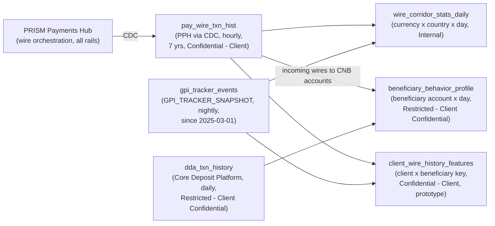

## Overview

`pay_wire_txn_hist` is a payments-domain dataset cataloged in the Treasury
Data & Insights Platform (TDIP). It is the base wire-transaction history
table for TDIP's Payments domain: a change-data-capture (CDC) feed of wire
transactions sourced hourly from [PRISM Payments Hub (PPH)](../systems/prism-payments-hub.md),
CNB's wire orchestration platform, retained for **7 years**. It is the
dataset every other wire-derived TDIP asset - corridor statistics,
beneficiary mule-risk features, and client wire-history features - traces
back to as its transactional source of record.

| Attribute | Value |
|---|---|
| Source | PPH (CDC) |
| Refresh | Hourly |
| History retained | 7 years |
| Classification | **Confidential - Client** |
| Data owner / steward | Laura Kim / Carlos Mendes |

(Source: [TDIP-CAT-2026.2 Treasury Data and Insights Platform Data Catalog Extract](../../sources/estate/tdip-cat-2026.2-treasury-data-and-insights-platform-data-catalog-extract.md), §2.)

## Source lineage: PPH via CDC

`pay_wire_txn_hist` is populated by change-data-capture replication out of
[PRISM Payments Hub (PPH)](../systems/prism-payments-hub.md) - the wire
orchestration platform, built on the Volaris Payment Platform, that
processes every CNB wire (Fedwire, Swift CBPR+, and book transfer) through
intake, validation/enrichment, screening, funds control, release, network
submission, and accounting close. Because the feed is CDC-based rather than
a batch extract, it reflects PPH's own row-level state changes - including
lifecycle-state transitions and identifier assignment events such as UETR -
replicated into TDIP on an **hourly** cadence, which the TDIP catalog's
known-gaps section records as the minimum freshness achievable for any wire
data in the platform (no sub-minute/real-time serving exists for wire data
anywhere in TDIP).

Because PPH operates active-active across two data centers and is the
system of record for a wire's full processing lifecycle (not merely its
network acknowledgment), `pay_wire_txn_hist` rows carry PPH's own
processing/state-transition timestamps - not an externally authoritative
settlement timestamp from the Federal Reserve or Swift. This distinction
matters for one specific, documented gap (see below).

## The `uetr` column: partial, rail- and date-dependent population

The catalog calls out one column-level caveat explicitly: **`pay_wire_txn_hist.uetr`
is populated only for a subset of historical rows**, not uniformly across
the table's full 7-year retention window:

| Rail | UETR populated from |
|---|---|
| Swift (CBPR+) wires | 2018 onward |
| Fedwire wires | 2025-10 onward (per [ADR-PAY-023](../decisions/adr-pay-023.md)) |

This gap exists because PPH itself only began assigning UETR to **every**
outbound wire - including domestic Fedwire transfers, which have no gpi
tracking relationship - once ADR-PAY-023 ("UETR is the canonical
end-to-end correlation id for all outbound wires," accepted 2025-09-09) was
implemented; see [UETR](../concepts/uetr.md) for the full assignment model
(UETR is minted as a UUID v4 at the **RELEASE** lifecycle stage, never
before and never reassigned). Swift wires carried a UETR well before that
ADR because Swift gpi tracking already required one.

The practical consequence is that any join from `pay_wire_txn_hist` to
`gpi_tracker_events` or another UETR-keyed dataset is reliable only for:
Swift wires from 2018 onward, and Fedwire wires from 2025-10 onward. Fedwire
wires released before 2025-10, and any Swift wires predating 2018 that may
still exist within the 7-year retention window at the edges of older
extracts, have no `uetr` value to join on at all.

## Settlement-time analytics gap: no authoritative Fed timestamp

`pay_wire_txn_hist` captures PPH's own processing and state-transition
timestamps (e.g., when PPH recorded `NETWORK_ACCEPTED`), not the Federal
Reserve's authoritative Fedwire acceptance time. The TDIP catalog states
this explicitly: "Settlement-time analytics for domestic wires require
`fed_ack_events` (TDA-2210, backlog)." [`fed_ack_events`](fed-ack-events.md)
- the planned dataset that would carry Fed acceptance/OMAD acknowledgement
timestamps from the `net.fedwire.ack.v1` Kafka topic - is not yet ingested,
and the backing backlog item (TDA-2210) is blocked on both a Kafka ACL from
Payment Networks Engineering and the absence of a business sponsor.

Consequently, `pay_wire_txn_hist` alone cannot support domestic
(Fedwire) settlement-time analytics comparable to what `gpi_tracker_events`
already enables for outbound Swift wires (same-day ACCC rate, median hours
to ACCC). Any analytics requiring a true Fed-settlement timestamp for
Fedwire wires remains blocked until `fed_ack_events` lands.

## Downstream consumption: the three Payments-domain feature tables

`pay_wire_txn_hist` is the single common input across all three feature
tables in the current TDIP Payments domain catalog:

| Feature table | Grain | Joined with `pay_wire_txn_hist` via |
|---|---|---|
| `wire_corridor_stats_daily` | currency x destination country x day | `gpi_tracker_events`, across all originating clients |
| `beneficiary_behavior_profile` | on-us beneficiary account x day | `dda_txn_history` (incoming wires to CNB accounts) |
| `client_wire_history_features` | originating client x beneficiary key | `gpi_tracker_events` |

Two consequences follow from being the common base table:

- **Classification floor, not ceiling.** `pay_wire_txn_hist` itself is
  Confidential - Client, but `beneficiary_behavior_profile` inherits the
  **more** restrictive Restricted - Client Confidential tier from its other
  input, `dda_txn_history` - the catalog treats the most sensitive
  contributing source, not `pay_wire_txn_hist`, as the classification floor
  for a derived feature table. `wire_corridor_stats_daily`, by contrast, is
  classified Internal, a lighter tier than its own `pay_wire_txn_hist`
  input, because its output is cross-client cohort statistics with no
  single-client attribution - aggregation, not source sensitivity, governs
  its classification.
- **Freshness and history ceilings from the less-fresh partner feed.**
  Wherever `pay_wire_txn_hist` is joined with `gpi_tracker_events`
  (`wire_corridor_stats_daily`, `client_wire_history_features`), the
  resulting feature table's effective freshness and historical depth are
  bounded by `gpi_tracker_events` (nightly until TDA-2188 completes; history
  only from 2025-03-01) rather than by `pay_wire_txn_hist`'s own hourly
  cadence and 7-year retention, even though `pay_wire_txn_hist` alone is
  both fresher and deeper.

No feature table or Insights API endpoint consumes `pay_wire_txn_hist` in
isolation; every documented use joins it with at least one other
Payments-domain dataset.

## Classification and governance

`pay_wire_txn_hist` carries the **Confidential - Client** classification -
the tier CNB's DUS-07 data-use standard defines as covering "a client's own
transactions, wire history, beneficiaries." This is a lighter tier than the
**Restricted - Client Confidential** classification applied to
`dda_txn_history` (account-level deposit activity) and
`beneficiary_behavior_profile` (which inherits that tier), but heavier than
the **Internal** classification on `wire_corridor_stats_daily` and
`cbo_wire_events`.

Dataset access across TDIP is governed in Collibra; because
`pay_wire_txn_hist` is Confidential rather than Restricted, access requests
do not require the 15-business-day Privacy Office approval SLA that applies
to Restricted-tier datasets such as `dda_txn_history` - though access
remains subject to standard Collibra-governed approval. Data ownership is
split between **Laura Kim** (Payments Platform Product) and **Carlos
Mendes** (EM, Treasury Data Platform) - the same ownership pairing used for
`gpi_tracker_events`, reflecting that both datasets sit in the same
payments-domain ingestion pipeline out of PPH and the Swift gpi Tracker.

## Platform context

[Treasury Data & Insights Platform (TDIP)](../systems/treasury-data-insights-platform.md)
runs on Snowflake (Enterprise, US-East) with dbt transformations, a Feast
feature store, Amazon SageMaker for model training and batch scoring, and
an Insights API serving layer for client-facing analytical outputs
([ADR-PAY-026](../decisions/adr-pay-026.md)). `pay_wire_txn_hist` is
ingested into this platform as a raw/curated dataset rather than a feature
table; it feeds the Feast-backed feature tables described above, but has no
direct Insights API endpoint of its own. The catalog's one GA Insights API
endpoint, `GET /tdip/insights/v1/cash-forecast/{clientId}`, does not consume
`pay_wire_txn_hist`; the catalog explicitly records that "no endpoints exist
for wire insights" and that `client_wire_history_features` - one of
`pay_wire_txn_hist`'s own downstream feature tables - remains only a
prototype.

## Known gaps

- **No authoritative Fed settlement timestamp** - domestic settlement-time
  analytics require the not-yet-ingested `fed_ack_events` dataset
  (TDA-2210, backlog); see [`fed_ack_events`](fed-ack-events.md).
- **Partial `uetr` population** - reliable only for Swift wires from 2018
  and Fedwire wires from 2025-10, per ADR-PAY-023's phased rollout of
  universal UETR assignment in PPH.
- **No real-time (sub-minute) serving** - hourly CDC is the minimum
  freshness achievable for wire data anywhere in the current TDIP platform,
  a limitation the catalog lists as a first-class, named gap.

## Related pages

- [UETR (Unique End-to-End Transaction Reference)](../concepts/uetr.md) - the identifier whose partial historical population on this dataset is documented above.
- [PRISM Payments Hub](../systems/prism-payments-hub.md) - the upstream system of record this dataset's CDC feed replicates from.
- [Treasury Data & Insights Platform](../systems/treasury-data-insights-platform.md) - the platform this dataset is cataloged in and the Insights API serving layer built on top of it.
- [Dataset: fed_ack_events (not ingested)](fed-ack-events.md) - the planned dataset that would close this table's domestic settlement-time analytics gap.
- [beneficiary_behavior_profile Feature Table](beneficiary-behavior-profile.md), [client_wire_history_features Feature Table](client-wire-history-features.md) - two of the three feature tables derived from this dataset.
