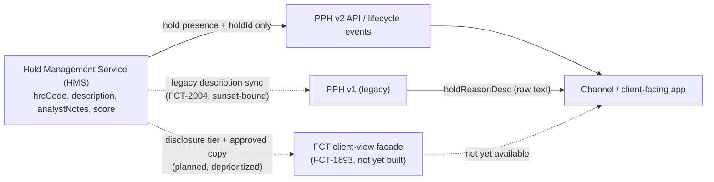

## Status

**Accepted** — 2025-04-08. Applies to **PPH v2, channels, and data** (not legacy PPH v1, which carries a documented, time-boxed exception). Recorded in the Payments Architecture Review Board (ARB) ADR register, entry ADR-PAY-021, and reaffirmed as in force in the 2026-Q3 register extract.

## Context

Payment holds are placed by the Hold Management Service (HMS), the system of record for holds on outbound payments, which is part of the Payment Risk & Screening Platform (PRSP) together with Sentinel Fraud Scoring (vendor fraud model) and SanctionScreen (sanctions-list screening). HMS classifies every hold against a twelve-entry hold reason code (HRC) taxonomy — for example `HRC-07 FRAUD_MODEL_HIGH` (Sentinel score above threshold) or `HRC-09 SANCTIONS_REVIEW` (potential sanctions match pending L1/L2 review) — and each code carries a disclosure tier (P = public status, C = client-actionable, G = generic review, R = restricted) defined by [POL-FCC-014](../policies/pol-fcc-014.md). Hold `description` and `analystNotes` fields are classified Restricted: descriptions are templated from the rule engine and routinely embed sensitive detail, e.g. `"FRAUD_MODEL_HIGH sc=9xx L1 queue"` or `"SANCTIONS_REVIEW name match 0.91 L2"`.

Before this ADR, PRISM Payments Hub (PPH) — the payments system of record that channels and downstream consumers integrate against — synced hold descriptions from HMS so that legacy PPH v1 could expose a `holdReasonDesc` field directly to callers. As PPH v2 and the Kafka lifecycle-event backbone (ADR-PAY-017) matured, the ARB needed to decide how much hold detail, if any, those newer interfaces could legitimately carry to channels and data platforms, given that raw reason text can disclose fraud-model scores, sanctions-match confidence, and investigator notes to parties outside financial-crimes technology (FCT).

## Decision

- Hold reason **codes, descriptions, scores, and analyst notes** must remain inside FCT systems (HMS and the broader PRSP) and must never be exposed to PPH v2, channels, or data platforms.
- [PPH v2](../interfaces/pph-v2-payments-api.md) and payment lifecycle events may expose only **hold presence** (a boolean/flag that a payment is held) and the **`holdId`** — enough for a consumer to know a payment is blocked and to reference the hold, but nothing about why.
- Any client-facing explanation of a hold must come from an **FCT-owned, FCC-approved facade** that returns a disclosure tier and pre-approved copy (not raw HRC reasons, descriptions, or notes). No such facade exists yet in production: the corresponding proposal, FCT-1893 ("Client-Safe Hold Status Facade" — `GET /prsp/hms/v1/holds/{holdId}/client-view` returning disclosure tier, an approved copy key, and permitted client actions), was scoped at 21 points and deprioritized in 2025-Q3. Until it ships, there is no compliant client-facing hold-explanation interface; channels must not improvise one from other data.
- **Known exception:** legacy [PPH v1](../interfaces/pph-v1-wire-status-api.md)'s `holdReasonDesc` field, fed by a pre-existing HMS-to-PPH description sync, is retained as a documented, time-boxed deviation from this decision for v1 backward compatibility only. It is not extended to v2 and is tracked as an open risk (FCT-2004) pending v1 sunset.

*What crosses the financial-crimes trust boundary today: PPH v2 is confidentiality-compliant; PPH v1's `holdReasonDesc` is a tracked exception; the ADR's intended client-facing facade (FCT-1893) has not been built.*

## Consequences

- **Channels cannot build client-facing hold explanations from PPH v2 or events.** A channel that needs to tell a client why a payment is held has no compliant data source today beyond "it's held" and a `holdId`; it must wait for an FCT-owned facade (FCT-1893 or a successor) or route the client to Payment Operations / the FIU, depending on the hold.
- **`risk.hold.events.v1`** (the HMS event topic carrying hold lifecycle detail) is restricted to FCT and Payment Operations tooling; channel applications are not authorized consumers, reinforcing the API-level restriction at the event-streaming layer.
- **Sanctions holds are handled outside normal channel disclosure entirely:** where a payment is blocked or rejected for sanctions reasons, Sanctions Operations — not channels — notifies the client in writing and reports to OFAC (blocked payments under 31 CFR 501.603; rejected payments under 31 CFR 501.604). Channels must not communicate screening outcomes under any circumstance, which is strictly tighter than the general "tier + approved copy" model envisioned for other hold types.
- **`CTRL-PAY-040`** formalizes a related constraint: no client-facing estimate of release time may be given for holds in disclosure tiers G (generic review) or R (restricted), even though median disposition times are tracked internally (e.g., HRC-01 ~47 minutes, HRC-09 ~3h20m, HRC-10 1–5 business days).
- **The v1 exception is explicitly time-boxed by a separate ARB decision**, not by this ADR itself: the 2026-09-08 ARB minutes confirm Volaris 9.6 removes the PPH v1 adapter with **no extension beyond 2027-03-31**, after which the `holdReasonDesc` sync — and the confidentiality exception it represents — must be retired. Remaining v1 consumers were required to present migration plans at the 2026-11-10 ARB session.
- Because hold detail is deliberately withheld from the Kafka integration backbone established by [ADR-PAY-017](adr-pay-017.md), event-payload design for payment lifecycle topics treats "is this field safe to publish broadly?" as an explicit per-field decision rather than a default; ISO return-reason codes were later judged safe to add to `pay.wire.lifecycle.v2`, while hold reason detail remains permanently excluded by this ADR regardless of a field's perceived usefulness downstream.

## Relationship to the hold lifecycle and taxonomy

This ADR governs *what leaves* [the Hold Management Service](../systems/hold-management-service.md), not hold processing itself. HMS progresses holds through `OPEN -> IN_REVIEW -> (ESCALATED) -> {RELEASED | REJECTED | BLOCKED | EXPIRED}`, and disposition (release/reject) requires maker-checker by a `HOLD_RELEASER` under `CTRL-PAY-012`. The confidentiality boundary applies uniformly across all twelve HRC codes and all four disclosure tiers defined in [POL-FCC-014](../policies/pol-fcc-014.md) — a tier-P code like `HRC-04 CUTOFF_WAREHOUSED` is no more exposable through PPH v2 than a tier-R code like `HRC-10 AML_REVIEW`; disclosure tier governs what the (not-yet-built) FCT facade is permitted to surface as approved copy, not what PPH or channels may read directly.

Two existing HMS endpoints remain internal-only and outside this ADR's exception: `GET /prsp/hms/v1/holds?paymentId=` (returns `hrcCode`, category, `description`, `analystNotes`, `slaDueTs` to the Investigations Workbench and to PPH's legacy sync only) and `POST /prsp/hms/v1/holds/{holdId}/disposition` (IWB only, maker-checker). Neither is reachable by channels or client-facing systems.

## Scope and known gaps

- The decision text names "PPH v2, channels, and data" as in scope; it does not change HMS's internal interfaces, the Investigations Workbench, or FCT/Payment Operations tooling, all of which continue to see full hold detail as required for casework.
- The legacy v1 `holdReasonDesc` exception is a known, tracked gap (FCT-2004), not a precedent — it exists because the HMS-to-PPH description sync predates this ADR and v1 could not be remediated without a breaking change ahead of its already-scheduled retirement.
- The ADR's intended remediation path — an FCT-owned, FCC-approved client-view facade returning disclosure tier and approved copy — has a concrete design (FCT-1893) but no committed delivery date; it was deprioritized in 2025-Q3. Until it is built and funded, channels have no compliant way to give clients more than "payment is held."
- `CTRL-PAY-031` (introduced 2026-06 after pilot FCT-1951) allows client self-service resolution of `HRC-01` (duplicate-suspect) holds via attestation through a digital channel with step-up authentication, up to $5,000,000; above that threshold, or for any other HRC code, Wire Room release is required. This narrow exception lets a channel resolve a specific hold type without ever learning or displaying the underlying reason detail, consistent with this ADR.

## Governance

ADR-PAY-021 was approved by the Payments Architecture Review Board and is recorded as entry ADR-PAY-021 in the Payments ARB's ADR register, alongside [ADR-PAY-017](adr-pay-017.md) (Kafka integration backbone), ADR-PAY-019 (event-driven channel status), ADR-PAY-023 (UETR as correlation id), and ADR-PAY-026 (client analytics via TDIP). The underlying hold reason taxonomy, disclosure tiers, and data-handling rules it protects are owned by Financial Crimes Technology and documented in PRSP-HMS-3.4, reviewed by FCC Policy & Advisory; disclosure-tier definitions themselves are owned by [POL-FCC-014](../policies/pol-fcc-014.md).
