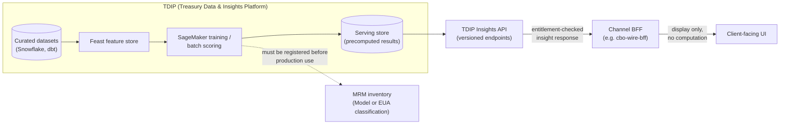

## Status

Accepted - decided 2026-05-12, published in the Payments Architecture Review
Board (ARB) register 2026-09-12. Binding on channel, payments and data teams.
Applies to all channels and to TDIP.

## Context

Crestline National Bank channels increasingly want to show clients
forward-looking or statistical content alongside raw payment status - for
example an expected time to completion for a wire, or how a client's wire to
a given beneficiary compares to its own history. Two risks motivated this
decision:

- **Model risk and disclosure control.** Any forward-looking value shown to a
  client is a "customer-facing estimate" under the Model Risk Management
  policy and is Tier 2 at minimum, requiring independent validation and
  approved use conditions (disclaimers, monitoring thresholds) before it can
  be shown to a client. If a channel backend-for-frontend (BFF) computed such
  figures itself, model risk and governance over it would be invisible to
  MRM and Enterprise Architecture.
- **Duplicated, ungoverned computation.** Channel BFFs (such as the CBO Wire
  Center BFF, `cbo-wire-bff`) are synchronous, per-request integration
  layers; they are not built to own curated datasets, feature pipelines, or
  model lifecycle. Letting each channel compute its own analytics from raw
  payment data would duplicate logic, bypass dataset classification and
  aggregation-threshold controls (see the Data Use & Client Confidentiality
  Standard, DUS-07), and make it hard to guarantee consistent, auditable
  outputs across channels.

The Treasury Data & Insights Platform (TDIP) already exists as the payments
domain's curated data and modeling platform (Snowflake, dbt, a Feast feature
store, SageMaker for training/scoring) and already exposes a serving layer -
the **Insights API** - that publishes precomputed results from a low-latency
store behind versioned, entitlement-aware endpoints.

## Decision

Predictions, typical-time statistics, and other analytical outputs shown to
clients must be:

1. **Computed in TDIP** (batch or micro-batch), not in channel BFFs or any
   other channel-owned component.
2. **Served to channels exclusively via versioned TDIP Insights API
   endpoints** (for example `GET /tdip/insights/v1/cash-forecast/{clientId}`,
   reference implementation EP-TDIP-01). Channel BFFs call these endpoints
   and delegate entitlement checks themselves; they must not perform
   analytical computation locally.
3. **Classified under MRM before production.** Every insight must be
   registered in the Model Risk Management inventory, per
   [MRM-POL-02](../policies/mrm-pol-02.md), as either a Model (statistical,
   financial, or ML technique producing a forward-looking estimate - Tier 2
   minimum, since all customer-facing estimates are Tier 2 or higher and
   require independent validation and approved disclaimers/monitoring before
   release) or an End-User Analytic (EUA - simple descriptive calculations
   such as counts, medians, or percentages over historical data, requiring
   registration and business-owner attestation but no independent
   validation). An insight may not go to production, and may not be shown to
   a client, until this classification and any required validation is
   complete.

"Channel BFFs must not compute analytics" is an explicit prohibition: BFFs
may display, cache for short periods, and route to the Insights API, but the
statistical or predictive computation itself must happen in TDIP.

## Scope and relationship to other controls

This decision governs *where* client-facing analytics are computed and
served; it does not by itself authorize any specific insight. Each insight
must still clear the controls that apply to the underlying data and model:

- **Data use and confidentiality** ([DUS-07](../../sources/estate/dus-07-v2.1-data-use-and-client-confidentiality-standard.md) referenced via TDIP's catalog):
  a client's own historical transactions may be used to generate insights
  shown to that client (for example typical time to completion for that
  client's past wires to a beneficiary) only when based on at least 5
  comparable transactions, with the basis (count and period) stated.
  Aggregated cohort statistics drawn from multiple clients require at least
  500 transactions, at least 20 distinct originating clients, no single
  client contributing more than 15% of cohort volume, at least monthly
  refresh, and Disclosure Review Committee approval of wording and
  disclaimers; cohorts failing any condition must be suppressed, not
  rounded or approximated.
- **Model risk classification** ([MRM-POL-02](../policies/mrm-pol-02.md)):
  customer-facing estimates are Tier 2 at minimum and cannot be shown to
  clients before independent validation and approved use conditions are in
  place; EUAs need only registration and attestation. Financial-crimes
  models and features (e.g. Sentinel fraud scores M-FCT-0021, beneficiary
  mule-risk features M-FCT-0034) remain Tier 1 and may not be repurposed for
  client-facing output under any circumstance.
- **Onboarding workflow** for a new insight, per the TDIP data catalog: (1)
  MRM inventory registration per MRM-POL-02, (2) data access approvals per
  DUS-07, (3) serving endpoint build on the Insights API (roughly 13-21
  story points typical), (4) Disclosure Review Committee approval of
  client-facing wording and disclaimers.

## Consequences

- **Channels cannot add predictive or statistical client-facing features by
  computing them locally.** Any such feature requires an Insights API
  endpoint to exist (or be built) and an MRM classification to be completed;
  this adds lead time (MRM Tier 2 validation alone is typically 10-14 weeks,
  with roughly a 6-week queue before work even starts as of Q4-2026) that
  channel teams must plan for.
- **The reference pattern is EP-TDIP-01** (`GET
  /tdip/insights/v1/cash-forecast/{clientId}`, backed by model M-TRS-0142,
  GA since 2025-09, p95 120 ms). New insight endpoints are expected to follow
  this shape: TDIP-side computation, versioned REST endpoint, entitlement
  checks delegated to the calling channel.
- **Coverage gaps block feature launches rather than being worked around
  locally.** As of the TDIP 2026.2 catalog, no Insights API endpoint exists
  for wire-history or corridor insights; the only related feature table
  (`client_wire_history_features`) is an unproductionized prototype with no
  MRM registration. A channel wanting such a feature must wait for TDIP to
  build and classify it rather than compute it in its own BFF.
- **Existing channel BFFs that do not yet integrate with the Insights API
  are unaffected until they add analytics.** For example, the CBO Wire
  Center BFF (`cbo-wire-bff`) currently integrates only with PPH v1, CES,
  CBO Auth and ENS and does not call the TDIP Insights API; it remains
  compliant as long as it displays only status data and does not introduce
  locally computed predictions or statistics. See
  [CBO Wire Center](../systems/cbo-wire-center.md).
- **Aligns with other ARB decisions on channel/backend separation**, notably
  ADR-PAY-019 (event-driven channel status; no polling of PPH) and ADR-PAY-021
  (hold reason detail stays behind an FCT-owned facade) - all three decisions
  push domain-specific computation and sensitive logic out of channel BFFs
  and into governed backend services or platforms.
- **Interim or informal exposure of underlying raw data is explicitly not an
  acceptable substitute.** The same ARB session that published this ADR
  separately declined to approve direct channel exposure of the raw
  `GPI_TRACKER_SNAPSHOT` feed, reinforcing that channels are expected to
  consume governed, purpose-built serving endpoints rather than raw
  payments/treasury data.

## Related

- [TDIP Insights API](../interfaces/tdip-insights-api.md) - the versioned
  serving interface this decision mandates for client-facing analytics.
- [MRM-POL-02](../policies/mrm-pol-02.md) - the Model Risk Management policy
  that defines the Model/EUA classification and validation tiers required
  before production.
- [CBO Wire Center](../systems/cbo-wire-center.md) - an example channel
  system whose BFF is in scope of this decision's prohibition on
  locally-computed analytics.
