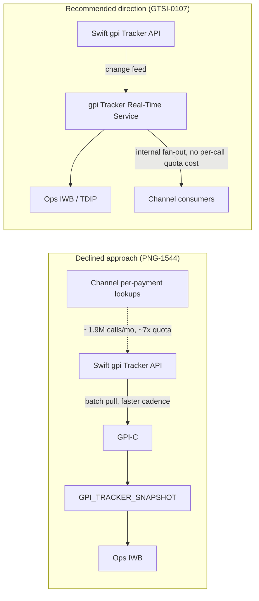

# PNG-1544: gpi Batch Frequency Increase Declined

## Status

Resolved as **Won't Do**, 2026-03-03. Raised in Jira as PNG-1544 ("Increase gpi Tracker batch frequency 4h -> 2h", 5 points, Raj Malhotra), labeled `gpi` and `quota`, and recorded as **Addendum A** to PNG-TDD-6.0 (*Payment Network Gateway - Fedwire Funds Connector & Swift gpi Integration: Technical Design*). The Jira issue links the decision as "superseded by GTSI-0107."

## Context

The Swift Alliance & gpi Connector (GPI-C, system id `SYS-PNG-GPI`), owned by Payment Networks Engineering (PNE), retrieves gpi Tracker updates via the Swift API through the Swift Microgateway using SwiftNet PKI credentials. This integration is batch-only: every 4 hours (00:00, 04:00, 08:00, 12:00, 16:00, 20:00 ET) GPI-C requests changed payment transactions for outbound UETRs from the last 30 days and upserts the results into the Oracle table `GPI_TRACKER_SNAPSHOT`. The only consumers of that snapshot are Payment Operations' Investigations Workbench (IWB) and the Treasury Data and Insights Platform's nightly `gpi_tracker_events` load — there has never been an internal API serving gpi status, and the design explicitly prohibits exposing `GPI_TRACKER_SNAPSHOT` directly to channel systems.

PNG-1544 asked to double the pull frequency to 2 hours, most plausibly to shrink the staleness window for gpi milestones (median release-to-ACCC was measured at 2h41m in Q3-2025 observed outcomes, so a 4-hour cadence can miss a wire's terminal status for a full cycle). The request arose while Crestline Business Online was spiking interest in client-facing international wire status (CBO-4480, "International wire status visibility (gpi) for clients"), since gpi status at the time was visible only to Ops in IWB.

### The quota constraint

The Swift Tracker API contract permits **250,000 calls per month** (contract renewal due 2027-01-31, tracked separately as GTSI-0115). At the time of this decision, current usage from the existing batch pulls plus Ops ad-hoc lookups was already running at roughly 61% of that quota. Doubling the batch frequency alone would materially add to that baseline, but the decisive data point was the implied scale of the underlying client-facing demand: per-payment status lookups driven from client channels were estimated at **~1.9 million calls/month** (based on roughly 2,900 outbound international wires per day with repeated client views), which would exceed the contracted quota by roughly 7x. A faster batch poll does nothing to address that root cause and does not scale toward a client-facing use case — it only front-loads more Tracker calls onto the same quota-constrained, synchronous polling pattern.

## Decision

PNG-1544 was declined (Won't Do). PNE did not increase the gpi Tracker batch frequency. The design addendum instead recommends that any real-time or near-real-time gpi capability be built as a **change-feed-based internal service** with internal fan-out, rather than by polling the Swift Tracker API more frequently or by making per-payment Tracker calls on behalf of channels. This mirrors the bank's broader event-driven status posture (see [ADR-PAY-019](adr-pay-019.md), which separately prohibits channel polling of Prism Payments Hub for status).

The recommendation was carried forward as **GTSI-0107**, "gpi Tracker Real-Time Service (GTRS)": an internal REST + event API layered over the Swift gpi Tracker change feed, intended to let consumers (eventually including channels) obtain gpi updates without each one issuing direct, quota-metered Tracker API calls. See [gpi Tracker Real-Time Service (GTSI-0107)](../projects/gtsi-0107-gpi-real-time-service.md).

## Consequences

- The gpi Tracker batch feed continues to run unchanged at a 4-hour cadence against `GPI_TRACKER_SNAPSHOT`. See [gpi Tracker Batch Feed](../interfaces/gpi-tracker-batch-feed.md) for the interface this decision kept in place, and [Swift gpi Connector](../systems/swift-gpi-connector.md) for the owning system.
- `GPI_TRACKER_SNAPSHOT` remains off-limits as a direct channel data source. The 2026-09-08 Payments ARB session separately reaffirmed this: interim direct exposure of the snapshot to channels was **not approved**, and the board noted that even a read-only, quota-isolated service for that purpose would itself require ARB review.
- Client-facing gpi visibility (the need behind spike CBO-4480) stayed unresolved at the time of this decision and remained dependent on GTSI-0107, which is not funded for 2026; discovery was planned for 2027-Q2 with build in 2027-Q3/Q4, subject to the 2027 portfolio review.
- Ownership of gpi-related work, including GTSI-0107 and the GTSI-0115 Tracker contract renewal, moved from Payment Networks Engineering to the newly formed Global Transaction Services Integration (GTSI) team as part of the 2026-09 cross-border network integration realignment (knowledge transfer tracked as GTSI-0112). New gpi requests are directed to GTSI rather than reopened against PNE/PNG.
- Separately, Treasury Data and Insights Platform increased the frequency of its own downstream `gpi_tracker_events` load from nightly to hourly (TDA-2188, targeted 2026-11). This changes how often TDIP re-reads the existing 4-hour snapshot table; it does not increase calls to the Swift Tracker API and is independent of this decision.

## Related

- [gpi Tracker Real-Time Service (GTSI-0107)](../projects/gtsi-0107-gpi-real-time-service.md) — the change-feed-based service recommended by this decision.
- [gpi Tracker Batch Feed](../interfaces/gpi-tracker-batch-feed.md) — the 4-hour batch integration left unchanged by this decision.
- [Swift gpi Connector](../systems/swift-gpi-connector.md) — the system (`SYS-PNG-GPI`) that performs the batch pulls and enforces the Tracker API quota.
- [ADR-PAY-019](adr-pay-019.md) — the related architectural principle that channel status must be event-driven rather than polled, which GTSI-0107's change-feed design follows.
