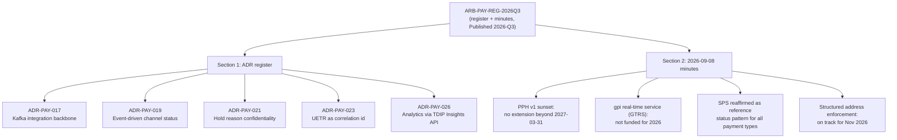

# ARB-PAY-REG-2026Q3: Payments ARB ADR Register & Decision Minutes

## What this document is

ARB-PAY-REG-2026Q3 is a published extract from the Payments Architecture
Review Board (ARB) at Crestline National Bank: a combined **ADR register**
(the authoritative list of architecture decisions currently binding on
channel, payments, and data teams) and **decision minutes** for the board's
2026-09-08 session. It is classified **INTERNAL - CONFIDENTIAL** and marked
"uncontrolled when printed," meaning the version held in document control is
the only authoritative copy.

| Field | Value |
|---|---|
| Document ID | ARB-PAY-REG-2026Q3 |
| Version / Status | 2026-Q3 / Published |
| Document owner | Jenna Ross, ARB Secretariat |
| Approver | Nikhil Bose, Chief Architect - Payments & Treasury (ARB Chair) |
| Effective / last reviewed | Published 2026-09-12 |
| Classification | INTERNAL - CONFIDENTIAL |
| Related documents | PIR-2024-07; PPH-API-CAT-2026.3; TDIP-CAT-2026.2 |

The document is produced and owned by the ARB secretariat function
described in [Payments ARB / Enterprise Architecture](../teams/payments-arb-enterprise-architecture.md);
this page is a metadata record describing the register's content and
structure, not a restatement of the underlying source text.

## Structure

The extract has two parts:

1. **Section 1 - ADR register (Payments):** a table of currently binding
   ADRs (number, title, date, status, applicability), each followed by a
   short context/decision/consequences summary.
2. **Section 2 - Minutes, ARB session 2026-09-08 (extract):** a table of
   agenda items discussed at that session, the decision reached for each,
   and the responsible owner, plus the schedule for upcoming sessions.

## Section 1: the ADR register

As of this 2026-Q3 extract, the register lists five ADRs, all currently
**Accepted** and binding on the teams indicated:

| ADR | Title | Date | Applies to |
|---|---|---|---|
| [ADR-PAY-017](../decisions/adr-pay-017.md) | Kafka (Confluent) is the integration backbone for payment lifecycle events | 2023-11-07 | All payment systems |
| [ADR-PAY-019](../decisions/adr-pay-019.md) | Channel status integrations must be event-driven; no polling of PPH | 2024-06-11 | All channels |
| [ADR-PAY-021](../decisions/adr-pay-021.md) | Hold reason details never leave the financial-crimes trust boundary | 2025-04-08 | PPH v2, channels, data |
| [ADR-PAY-023](../decisions/adr-pay-023.md) | UETR is the canonical end-to-end correlation id for all outbound wires | 2025-09-09 | PPH, gateways, channels, TDIP |
| [ADR-PAY-026](../decisions/adr-pay-026.md) | Client-facing analytical outputs are served via the TDIP Insights API | 2026-05-12 | Channels, TDIP |

The register's entry dates mark each ADR's original acceptance, not when it
was last discussed by the board — several of the ADRs are each re-referenced
or extended by the 2026-09-08 minutes captured in the same document (for
example, ADR-PAY-019 is reinforced by the minutes' SPS reaffirmation, and
ADR-PAY-021's legacy exception is time-boxed by the minutes' PPH v1 sunset
decision). The register itself is the binding record; the full rationale,
consequences, and downstream relationships for each ADR are documented on
each ADR's own page, linked above.

## Section 2: minutes of the 2026-09-08 ARB session

The minutes extract records four agenda items from that session:

- **PPH v1 sunset.** Volaris 9.6 removes the PPH v1 adapter. The board
  decided **no extension beyond 2027-03-31**; remaining v1 consumers must
  present migration plans at the next (2026-11-10) ARB session. This
  directly time-boxes the legacy `holdReasonDesc` exception carved out by
  ADR-PAY-021 and the permanent absence of UETR for v1 consumers under
  ADR-PAY-023. Owner: Kevin O'Brien.
- **gpi real-time service.** A proposed real-time Swift gpi tracking service
  (GTRS, tracked as GTSI-0107) is **not funded for 2026**. The board noted
  client demand and recommended GTSI engage channel teams early, but
  explicitly declined to approve interim direct exposure of the
  `GPI_TRACKER_SNAPSHOT` dataset to channels; any read-only, quota-isolated
  service built for that purpose would itself require a separate ARB
  review. Owner: Elena Vasquez.
- **Status projection reuse.** The board reaffirmed the Status Projection
  Service (SPS) pattern — the Kafka-consumer-to-read-model architecture
  established under ADR-PAY-019 — as the reference pattern for client-facing
  status of **any** payment type, not just wires. Owner: Arjun Mehta.
- **Structured address enforcement.** PPH and gateway enforcement of
  structured address fields remains on track for November 2026; the board
  expects this to increase repair-hold volume. Owner: Raymond Ortiz.

The minutes also record the board's forward cadence: the next sessions are
scheduled for **2026-11-10** and **2026-12-08**, with submissions due **10
business days** prior via the ARB intake form.

## Related documents

The register's "related documents" field names three other artifacts that
are referenced for context but are not reproduced in this extract:

- **PIR-2024-07** — the post-implementation review of INC-2024-1182 (the
  PPH v1 polling incident) whose findings produced ADR-PAY-019.
- **PPH-API-CAT-2026.3** — the PRISM Payments Hub API catalog, relevant to
  the v1/v2 API distinctions referenced throughout ADR-PAY-021, -023, and
  the v1-sunset minutes item.
- **TDIP-CAT-2026.2** — the Treasury Data & Insights Platform catalog,
  relevant to ADR-PAY-026's requirement that client-facing analytics be
  served only through the TDIP Insights API.

## Governance and audience

The document is explicitly scoped as binding "on channel, payments and data
teams" — it is not advisory. It is owned by the ARB Secretariat (Jenna Ross)
and approved by the ARB Chair, the Chief Architect for Payments & Treasury
(Nikhil Bose), who also chaired the 2026-09-08 session reflected in the
minutes. Any team building or changing a payment-adjacent integration
(channel status, hold handling, correlation identifiers, client-facing
analytics, or anything touching PPH v1) is expected to treat the ADRs in
this register, and the minutes' interim guidance (e.g., the v1 sunset date
and the non-approval of direct `GPI_TRACKER_SNAPSHOT` exposure), as current
constraints until a later register extract supersedes them.
