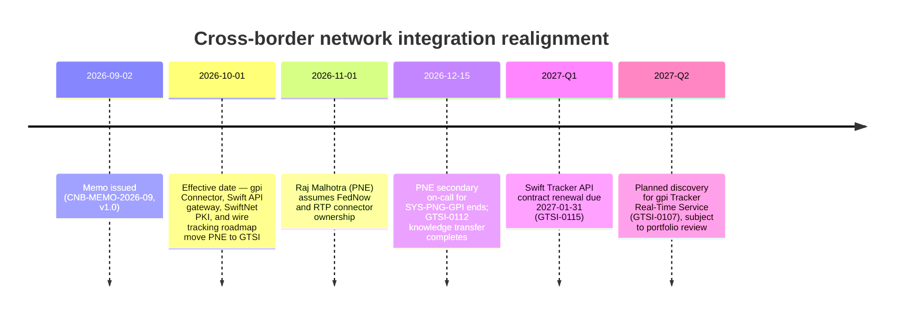

## Overview

CNB-MEMO-2026-09 is an internal organizational announcement issued by the Office of the CIO, Payments & Treasury Technology at Crestline National Bank. It formalizes the transfer of cross-border Swift network integration responsibilities from **Payment Networks Engineering (PNE)**, led by Raj Malhotra, to **Global Transaction Services Integration (GTSI)**, led by Elena Vasquez. The memo frames the consolidation as a response to growing cross-border volumes and Swift's continuing ISO 20022 roadmap beyond the end of MT/MX coexistence.

| Field | Value |
|---|---|
| Document ID | CNB-MEMO-2026-09 |
| Version / Status | 1.0 / Issued |
| Document owner | Office of the CIO, Payments & Treasury Technology |
| Approver | Gregory Hall (MD, CIO Payments & Treasury Technology) |
| Issued | 2026-09-02 |
| Effective | 2026-10-01 |
| Classification | INTERNAL |
| Related documents | CNB-ORG-PTT-2026-06 (refresh pending Q4); GTSI-0112 |

## What is moving

Effective **2026-10-01**, three capability areas move from PNE to GTSI:

1. **Swift Alliance Gateway, gpi Connector (SYS-PNG-GPI), and gpi Tracker integration** — accountable leaders become Omar Siddiqui (Engineering Manager) and Hannah Lindqvist (Tech Lead), under Elena Vasquez. This is the system also documented as the [Swift gpi Connector](../systems/swift-gpi-connector.md).
2. **Swift API gateway (Microgateway) and SwiftNet PKI service accounts** — moves to GTSI under Hannah Lindqvist.
3. **International wire tracking roadmap**, including any client-facing gpi capability — moves to GTSI under Elena Vasquez, with Laura Kim as business sponsor.

## What is not moving

- The **Fedwire Funds Connector (SYS-PNG-FFC)**, including the `net.fedwire.ack.v1` and `net.fedwire.inbound.v1` topics, remains with PNE under Raj Malhotra (Brian Walsh, Engineering Manager).
- Raj Malhotra additionally assumes ownership of the **FedNow and RTP connectors** from 2026-11-01, so PNE's scope narrows on cross-border Swift work while it simultaneously gains domestic instant-payments connectors.

## People changes

- **Tomasz Nowak** (Senior Engineer, gpi Connector) transfers to GTSI and reports to Omar Siddiqui.
- **PNE on-call** remains secondary support for SYS-PNG-GPI only until **2026-12-15**, when knowledge transfer under **GTSI-0112** is expected to complete. After that date, PNE has no residual support obligation for the gpi connector.

## How to engage

From 2026-10-01 onward, all new requests for gpi data, Swift Tracker usage, or international wire status capabilities must be raised in Jira project **GTSI**, directed to Omar Siddiqui, rather than the legacy **PNG** project. Tickets already open against PNG for gpi topics are triaged by GTSI during the knowledge-transfer window; teams are explicitly asked not to open new PNG tickets for gpi topics during this period. The **PTT Organization & Ownership Directory (CNB-ORG-PTT-2026-06)** is expected to reflect the new ownership in its Q4 refresh, so it should be treated as not-yet-updated for this change until that refresh lands.

## Roadmap note

- GTSI takes ownership of the **gpi Tracker Real-Time Service initiative (GTSI-0107)**. It is unfunded for 2026; discovery is tentatively planned for 2027-Q2, subject to the 2027 portfolio review. Teams with near-term gpi data needs are asked to engage GTSI early so requirements can inform discovery.
- GTSI is also responsible for the **Swift Tracker API contract renewal**, due **2027-01-31** (GTSI-0115).

## Ownership transition timeline

## Relationships

- **[Swift gpi Connector](../systems/swift-gpi-connector.md)** — the primary system whose ownership (SYS-PNG-GPI) is transferred by this memo; engineering and on-call responsibility move to GTSI while PNE retains time-boxed secondary support.
- **[GTSI](../teams/gtsi.md)** — the receiving team for all capabilities listed in "What is moving," and owner of the follow-on roadmap items GTSI-0107 and GTSI-0115.
- **Payment Networks Engineering (PNE)** — the prior owner of the transferred capabilities; retains the Fedwire Funds Connector (SYS-PNG-FFC) and gains the FedNow/RTP connectors from 2026-11-01.
- **CNB-ORG-PTT-2026-06** — the PTT ownership directory that this memo supersedes in effect but which will not textually reflect the change until its Q4 2026 refresh.
- **GTSI-0112** — the knowledge-transfer initiative that governs the wind-down of PNE's secondary on-call support, completing 2026-12-15.

## Operational implications

- Jira routing changes on 2026-10-01: new gpi/Swift Tracker/international wire status requests go to project **GTSI**, not **PNG**.
- Until 2026-12-15, incident response for SYS-PNG-GPI involves both GTSI (primary) and PNE (secondary), after which PNE has no further operational role in the gpi connector.
- Anyone consulting the PTT Organization & Ownership Directory for cross-border network ownership before its Q4 refresh should treat this memo as the authoritative, more current source.
