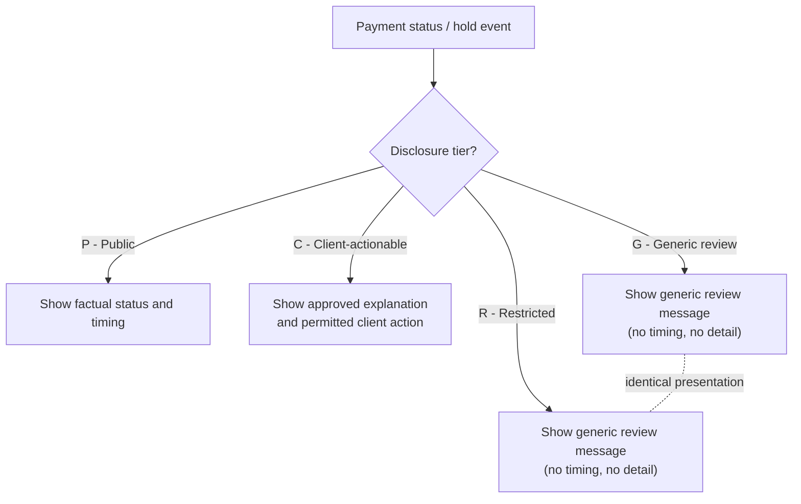

## Overview

POL-FCC-014 is an **INTERNAL - CONFIDENTIAL** enterprise policy document owned by
Crestline National Bank's Financial Crimes Compliance (FCC) function. Version
3.2 governs *what may and may not be communicated to clients* about payment
status, holds, and exceptions across every client-facing channel. Its primary
purpose is to prevent disclosures that would reveal the existence of a
Suspicious Activity Report (SAR), aid fraud or sanctions evasion, or otherwise
mislead clients about the state of their payments, while still allowing
accurate, actionable status information where no financial-crimes sensitivity
exists.

The policy sits inside a small corpus of related, cross-referenced controls
and standards: **PRSP-HMS-3.4**, **DUS-07**, **MRM-POL-02**, **SEC-STD-22**,
and the **CTRL-PAY-018 / -031 / -040** control set. A companion page,
[POL-FCC-014](../policies/pol-fcc-014.md), tracks the policy itself; this page
is the metadata/document record for the specific v3.2 artifact.

## Document identity

| Field | Value |
|---|---|
| Document ID | POL-FCC-014 |
| Version / Status | 3.2 / Approved — Enterprise Policy Committee |
| Document owner | Catherine Doyle, EVP, Chief BSA/AML Officer; co-owner Michael Tran, SVP, OFAC/Sanctions Officer |
| Approver(s) | Enterprise Policy Committee (2026-02-12) |
| Effective / Last reviewed | Effective 2026-03-01; next review 2027-03-01 |
| Classification | INTERNAL - CONFIDENTIAL |
| Policy contact | Jordan Ellis, VP, FCC Policy & Advisory |
| Related documents | PRSP-HMS-3.4; DUS-07; MRM-POL-02; SEC-STD-22; CTRL-PAY-018 / -031 / -040 |

## Scope

The standard applies to **all client-facing channels and artifacts**:

- Crestline Business Online (web and mobile)
- APIs and host-to-host status files
- Notifications (email, SMS, push, in-app)
- Commercial Service Center scripts
- Relationship manager communications
- Downloadable reports
- Any content shared with third parties at a client's request

## Regulatory and legal basis

The standard is anchored to six source authorities, each mapped to a specific
communication constraint:

| Source | Relevance |
|---|---|
| 31 U.S.C. 5318(g)(2); 31 CFR 1020.320(e) | Confidentiality of Suspicious Activity Reports — no disclosure of a SAR or information that would reveal its existence |
| 31 CFR Part 501 (incl. 501.603, 501.604) | OFAC blocking and reject reporting; sanctions outcomes communicated only per Sanctions Operations Procedure |
| UCC Article 4A; Regulation J (12 CFR 210, Subpart B) | Acceptance, settlement finality and completion of funds transfers |
| FFIEC "Authentication and Access to Financial Institution Services and Systems" (2021) | Risk-based authentication for high-risk actions |
| Section 5 of the FTC Act (UDAP) | Representations to clients must not be unfair or deceptive |
| CNB Fair Representation Standard (FRS-02) | Accuracy of client-facing estimates and status language |

## Disclosure tiers

The standard's central mechanism is a four-tier disclosure model that
determines what a client may see for any given payment event:

| Tier | Name | Client may see | Example |
|---|---|---|---|
| P | Public status | Factual processing status and timing | "Scheduled for next business day (after cutoff)" |
| C | Client-actionable | Approved explanation and permitted client action | "Possible duplicate"; "limit exceeded"; "funds pending" |
| G | Generic review | Generic "being reviewed" message only | "Operations manual review" |
| R | Restricted | Generic "being reviewed" message only — **identical to tier G** | Fraud, account takeover, sanctions, AML, legal holds |

The defining invariant of the model is that **tier R is deliberately
indistinguishable from tier G** in every client-facing presentation. This is
what prevents a client from inferring, from UI behavior alone, that a payment
is under a fraud, sanctions, AML, or legal-hold review rather than a routine
operations review.

*Disclosure-tier routing: tiers G and R intentionally render as the same indistinguishable client message.*

## Requirements

### Holds (Section 5.1)

1. Restricted (R) reasons, hold codes, scores, list names, match details,
   analyst notes, or queue names must never be displayed, transmitted, or
   implied in any client-facing channel.
2. **Indistinguishability**: tier R and tier G holds must be presented
   identically — same label, icon, color, copy, actions, and absence of
   timing information — so a client cannot infer the nature of a review from
   the presentation.
3. No estimated release time, likelihood of release, or "next steps" timing
   may be shown for tier G or R holds (CTRL-PAY-040).
4. Client actions on holds are permitted only where Appendix A allows, using
   step-up authentication of an entitled user.
5. Callback verification (HRC-02) cannot be satisfied by any in-channel
   confirmation from the channel that initiated the payment (CTRL-PAY-018).
   The channel may show that a callback is pending and let the client request
   one.
6. Sanctions blocks/rejects are communicated only by Sanctions Operations per
   procedure; channels show only the tier G/R presentation.

### Status terminology (Section 5.2)

Specific status words are gated on concrete payment-rail events, not on
internal processing milestones:

| Term | Permitted only when | Not permitted |
|---|---|---|
| Sent / In transit | Released and transmitted to the payment network | Before network transmission |
| Delivered to beneficiary's bank (domestic) | Fedwire acceptance received (pacs.002 with OMAD) | At release or transmission |
| Completed / Settled | Domestic: Fedwire acceptance received. International: gpi ACCC received from the beneficiary bank | On release, transmission, Swift network ACK, or ACSP statuses |
| Credited to beneficiary | gpi ACCC received | Domestic Fedwire (beneficiary credit is not reported); any non-ACCC status |
| Tracking unavailable beyond [bank] | Last gpi status ACSP/G001 | Showing "in transit" with estimates after G001 |
| Returned + reason | Return received; ISO reason from returning bank may be shown (e.g., AC04 Account closed) | Returns initiated by CNB for financial-crimes reasons (show "Returned" only) |

### International (gpi) data (Section 5.3)

For a client's own payments, channels may display agent names, countries,
timestamps, and deducted charges reported via SWIFT gpi. Where tracking ends
at a non-gpi agent, the presentation must state that tracking is unavailable
beyond that point.

### Sharing with third parties (Section 5.4)

Status shared with a beneficiary or other third party at the client's request
is limited to: amount, currency, value date, status milestones, and a
reference (cboRef or UETR). It must exclude account numbers, fees, the
originator's internal references, and any hold information. Third-party
sharing links must expire within 7 days, must be enabled by a client
administrator, and require InfoSec (SEC-STD-22) and Privacy approval of the
design.

### Predictive and insight statements (Section 5.5)

Client-facing insights (e.g., typical completion times, estimated delivery)
must:
- use only the requesting client's own data, or aggregated cohorts meeting
  DUS-07 Section 5;
- be registered with Model Risk Management where MRM-POL-02 applies;
- carry a DRC-approved disclaimer;
- never be shown for payments in tier G or R hold.

### Approvals (Section 6)

New or changed client-facing status, hold, or exception experiences require
FCC Policy & Advisory review before build commitment, plus DRC approval of
final copy. Exceptions require Chief BSA/AML Officer approval.

## Appendix A — Hold code mapping

Appendix A is the authoritative mapping from internal Hold/Review Codes
(HRC) to disclosure tier, approved copy key, and permitted client action.
This table is the concrete lookup a channel or service implementation would
consult when rendering a hold to a client.

| HRC | Mnemonic | Tier | Copy key | Client action permitted |
|---|---|---|---|---|
| HRC-01 | DUP_SUSPECT | C | COPY-HOLD-DUP-01 | Yes — digital attestation (confirm / cancel) with step-up auth (CTRL-PAY-031) |
| HRC-02 | CALLBACK_REQUIRED | C | COPY-HOLD-CB-01 | No in-channel confirmation; client may request callback, verification only via callback to contact on file (CTRL-PAY-018) |
| HRC-03 | LIMIT_EXCEEDED | C | COPY-HOLD-LIM-01 | Client admin secondary approval or RM limit request |
| HRC-04 | CUTOFF_WAREHOUSED | P | COPY-STAT-WH-01 | None needed (informational) |
| HRC-05 | FUNDS_PENDING | C | COPY-HOLD-FUND-01 | Fund account; auto-retry until 5:30 p.m. ET |
| HRC-06 | REPAIR_REQUIRED | C | COPY-HOLD-RPR-01 | Cancel and resubmit with corrected beneficiary data (no in-place edit) |
| HRC-07 | FRAUD_MODEL_HIGH | R | COPY-HOLD-GEN-01 | None |
| HRC-08 | ATO_SUSPECT | R | COPY-HOLD-GEN-01 | None |
| HRC-09 | SANCTIONS_REVIEW | R | COPY-HOLD-GEN-01 | None |
| HRC-10 | AML_REVIEW | R | COPY-HOLD-GEN-01 | None |
| HRC-11 | LEGAL_HOLD | R | COPY-HOLD-GEN-01 | None |
| HRC-12 | OPS_MANUAL_REVIEW | G | COPY-HOLD-GEN-01 | None |

Note that HRC-07 through HRC-11 (fraud, account takeover, sanctions, AML, and
legal holds — all tier R) share the exact same copy key, `COPY-HOLD-GEN-01`,
as HRC-12 (`OPS_MANUAL_REVIEW`, tier G). This is the Appendix A expression of
the Section 5.1 indistinguishability requirement: five distinct and sensitive
financial-crimes review reasons render identically to one routine
operational review reason.

## Appendix B — Approved copy library (excerpt)

| Copy key | Approved text |
|---|---|
| COPY-HOLD-GEN-01 | "This wire is being reviewed. No action is needed from you at this time. For questions, contact Treasury Support." |
| COPY-HOLD-DUP-01 | "This wire appears similar to another recent wire. Please confirm whether you intend to send both." |
| COPY-HOLD-CB-01 | "We will contact an authorized person at your company to verify this wire. You can request a call back." |
| COPY-HOLD-LIM-01 | "This wire exceeds a limit on your account. An administrator can approve it or contact your relationship manager." |
| COPY-HOLD-FUND-01 | "This wire is waiting for available funds. It will be retried until 5:30 p.m. ET." |
| COPY-HOLD-RPR-01 | "Additional beneficiary information is required. Please cancel and resubmit this wire with complete details." |
| COPY-STAT-WH-01 | "This wire is scheduled for the next business day." |

Only copy drawn from this DRC-approved library (or future additions approved
through the same process) may be surfaced to clients for hold and exception
states; this is the enforcement mechanism behind Section 6's approval
requirement.

## Appendix C — Prohibited terms in client-facing copy

The standard maintains an explicit denylist of words that must never appear
in client-facing copy, regardless of channel or context (with one narrow
carve-out):

> fraud; suspicious; sanctions; OFAC; watch list; screening hit; AML;
> compliance review; investigation; flagged; security alert; risk score; law
> enforcement; blocked (except Sanctions Operations correspondence).

## Relationships to other controls

- **CTRL-PAY-018** — governs callback verification; referenced by Section
  5.1's callback rule and by HRC-02 in Appendix A.
- **CTRL-PAY-031** — governs step-up authentication for digital attestation;
  referenced by HRC-01 in Appendix A.
- **CTRL-PAY-040** — governs the prohibition on showing estimated release
  timing for G/R holds, referenced in Section 5.1.
- **SEC-STD-22** — InfoSec design approval required for third-party status
  sharing links (Section 5.4).
- **DUS-07** and **MRM-POL-02** — govern data-use and model-risk constraints
  on predictive/insight statements (Section 5.5).
- **PRSP-HMS-3.4** — listed as a related document in the document header;
  consult it alongside this standard for hold-management-system procedures
  that this policy constrains at the communication layer.

## Operational implications

Any team building or modifying a client-facing payment status, hold, or
exception experience (web/mobile UI copy, notification templates,
Commercial Service Center scripts, status APIs, or downloadable reports)
must treat this standard as a binding design constraint, not merely
reference material:

- New/changed experiences require FCC Policy & Advisory review **before**
  build commitment, and DRC sign-off on final copy (Section 6).
- Any deviation ("exception") requires Chief BSA/AML Officer approval.
- Implementations must drive copy selection from the HRC → Tier → Copy key
  mapping in Appendix A rather than ad hoc engineering judgment, since this
  is the control that prevents tier R information from leaking through
  differentiated UI treatment.
