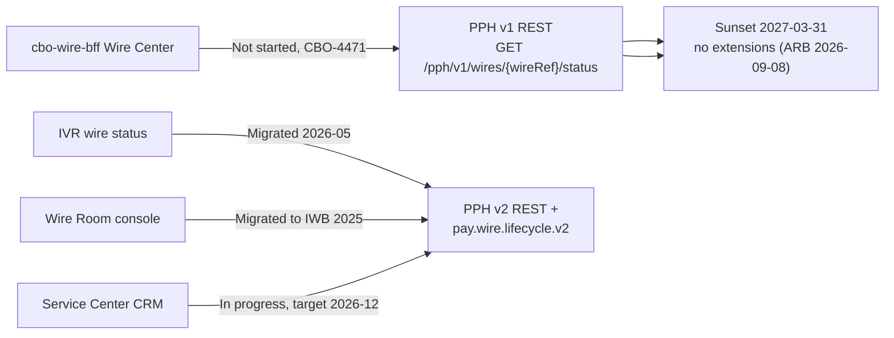

## Overview

PPH-API-CAT-2026.3 is the "PRISM Payments Hub - API & Event Catalog (v1 / v2) incl. v1 Deprecation Notice," the consumer-facing reference for every REST API and Kafka topic exposed by the PRISM Payments Hub (PPH). It is owned by Sunita Rao (Principal Engineer - PPH APIs), approved by Kevin O'Brien (EM) and Raymond Ortiz (Director), classified INTERNAL - CONFIDENTIAL, and was published 2026-09-10 as version 2026.3. The document is the system of record consumer teams use to pick an interface version, understand field semantics and limits, and track the mandatory migration off v1.

It cross-references PPH-SYS-OVW-9.2 (system overview), ADR-PAY-019, ADR-PAY-021, and ADR-PAY-023 (v2 design decisions, including the removal of the legacy `holdReasonDesc` field), and the backlog tickets PPH-2190 (v1 sunset tracking) and PPH-2207 (proposed v2 settlement object). The two interfaces it governs - the deprecated v1 wire-status API and the current v2 payments API - are documented in detail on their own pages: [PPH v1 Wire Status API](../interfaces/pph-v1-wire-status-api.md) and [PPH v2 Payments API](../interfaces/pph-v2-payments-api.md).

## v1 deprecation notice

The catalog's headline content is a hard sunset for all PPH v1 APIs: **2027-03-31, with no extensions**. The Architecture Review Board (ARB) confirmed on 2026-09-08 that no extensions will be granted, and the stated technical driver is that the v1 adapter is not supported on Volaris 9.6, the platform version the estate upgrades to in April 2027. Every consumer must migrate to v2 and, for status-tracking use cases specifically, to the `pay.wire.lifecycle.v2` Kafka topic rather than polling a REST status endpoint.

Migration progress is tracked under PPH-2190 per consumer:

| v1 consumer | Owner | Migration status | Notes |
|---|---|---|---|
| IVR wire status | Contact Center Tech | Migrated (2026-05) | - |
| Service Center CRM | CRM Engineering | In progress (target 2026-12) | - |
| cbo-wire-bff (Wire Center) | CBO Wire Center squad | Not started | Tracked as CBO-4471, unscheduled |
| Wire Room console | Payment Operations Tech | Migrated to IWB (2025) | - |

*Migration state of each v1 consumer toward the v2 REST API / `pay.wire.lifecycle.v2` event topic ahead of the 2027-03-31 v1 sunset.*

As of the catalog's publication, the Wire Center consumer (`cbo-wire-bff`) has not started migration and its work is unscheduled, making it the highest-risk gap against the fixed sunset date.

## v1 APIs (deprecated)

| ID | Method / path | Purpose | Limits |
|---|---|---|---|
| EP-PPH-01 | `GET /pph/v1/wires/{wireRef}/status` | Coarse status for one wire | 20 TPS shared across all v1 consumers |
| EP-PPH-02 | `GET /pph/v1/wires?clientId&fromDate&toDate` | List wires | Max 500 rows; no cursor |
| EP-PPH-03 | `POST /pph/v1/wires` | Submit approved wire | - |

EP-PPH-01's response collapses several downstream lifecycle states into one coarse `status` enum (`RECEIVED | PENDING | HELD | PROCESSED | REJECTED | CANCELLED | RETURNED`); `PROCESSED` itself covers `RELEASED`, `SENT_TO_NETWORK`, `NETWORK_ACCEPTED`, and `COMPLETED` (see PPH-SYS-OVW-9.2 s3). Two fields are noted as legacy or limited:

- `holdReasonDesc` - free-text hold description synchronized from HMS (legacy, in place since 2019), not curated for external display, and intentionally dropped in v2 (ADR-PAY-021).
- `fedRef` - carries the Fedwire IMAD only; OMAD and UETR identifiers are not available in v1 at all.

Full request/response shape and field-level semantics for this interface are documented on [PPH v1 Wire Status API](../interfaces/pph-v1-wire-status-api.md).

## v2 APIs (GA 2025-10)

| ID | Method / path | Purpose | Limits / notes |
|---|---|---|---|
| EP-PPH-04 | `GET /pph/v2/payments/{paymentId}` | Payment detail incl. `lifecycleState`, identifiers, network, hold, charges | 150 TPS |
| EP-PPH-05 | `GET /pph/v2/payments?clientId&rail&state&from&to&cursor` | Search | Filters by `clientId` only (not account); no beneficiary-name filter (PPH-2251) |
| EP-PPH-06 | `GET /pph/v2/payments/{paymentId}/history` | State history | Timestamps are PPH processing time, not network time |
| EP-PPH-07 | `POST /pph/v2/payments` | Submit payment | Requires an `Idempotency-Key` header |

Compared with v1, the v2 payment detail response (EP-PPH-04) replaces the flat `status` string with a richer `lifecycleState`, a `rail` discriminator (`FEDWIRE | SWIFT | BOOK`), a nested `identifiers` object exposing `cboRef`, `imad`, `omad`, `uetr`, and `endToEndId`, a `network` block, an explicit `hold` object (`isHeld` / `holdId`, with no free-text reason), a `charges` block (e.g., `chargeBearer`, `orderingBankFee`), and a `return` block for ISO return reasons. Two gaps are called out explicitly: v2 has **no settlement object** - rail-specific settlement status and the authoritative Federal Reserve acceptance timestamp are proposed separately under PPH-2207 and are currently backlog with no product sponsor - and intermediary or beneficiary bank charges are not known to PPH at all, in v1 or v2. Full endpoint and schema documentation lives on [PPH v2 Payments API](../interfaces/pph-v2-payments-api.md).

## Kafka topics

| ID | Topic | Content | Retention | Classification / onboarding |
|---|---|---|---|---|
| EV-PPH-01 | `pay.wire.lifecycle.v2` | `WireLifecycleEvent` v2.3 (Avro): `paymentId`, `rail`, `fromState`, `toState`, `eventTs`, `identifiers`, `return.isoReason` | 7 days | Confidential - Client; consumer ACL via PPH Jira, ~3 weeks including schema registry access |
| EV-PPH-02 | `pay.ach.lifecycle.v1` | ACH lifecycle events | 7 days | Consumed by CBO SPS (ACH Tracker) |

Hold reasons are deliberately not published on any PPH topic. Return reasons - ISO 20022 `pacs.004` codes such as `AC04`, `AC01`, and `RR05` - have been published on `pay.wire.lifecycle.v2` only since 2026-08 (PPH-2266); consumers that onboarded before that date should confirm they handle the `return.isoReason` field. New consumers should expect an onboarding lead time of roughly three weeks to clear the ACL request and schema registry access for this topic.

## Service levels

| Interface | Availability | Latency (p95) | Support |
|---|---|---|---|
| v1 REST | 99.9% | 350 ms | Best effort until sunset |
| v2 REST | 99.95% | 180 ms | T1 |
| `pay.wire.lifecycle.v2` | 99.95% | event lag < 2 s | T1 |

v1 REST carries only best-effort support for the remainder of its life, reinforcing that production dependencies should move to v2 REST or the `pay.wire.lifecycle.v2` event stream, both of which carry T1 (fully supported) status and tighter SLAs.

## Open backlog relevant to consumers

| Key | Summary | Status |
|---|---|---|
| PPH-2207 | v2 settlement object (`fedSettlementTs` derived from `pacs.002`/OMAD; `settlementStatus` by rail) | Backlog - no sponsor |
| PPH-2251 | v2 search: index beneficiary name | Backlog |
| PPH-2190 | v1 sunset - consumer migration tracking | In progress |

Consumers relying on settlement confirmation or beneficiary-name search should treat these as known gaps rather than defects, and should route sponsorship or prioritization requests through the contacts below rather than assuming the capability is forthcoming on a fixed timeline.

## Contacts and related documents

- API design: Sunita Rao
- Scheduling, via the Payments Platform Demand Board: Kevin O'Brien
- Product: Laura Kim

Related documents: PPH-SYS-OVW-9.2 (PPH system overview), ADR-PAY-019, ADR-PAY-021 (basis for dropping `holdReasonDesc` in v2), ADR-PAY-023, and backlog items PPH-2190 and PPH-2207 referenced above.
