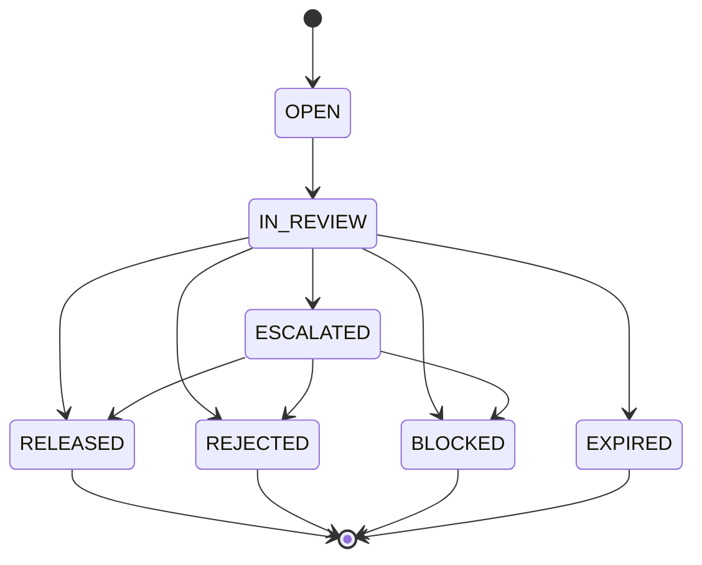

## Overview

**PRSP-HMS-3.4** ("Payment Risk & Screening Platform - Hold Management Service: Design & Hold Reason Taxonomy") is a **RESTRICTED - FINANCIAL CRIMES** design document owned by Financial Crimes Technology (FCT). Version 3.4 (Approved, last reviewed 2026-06-24) is the authoritative source for how the Hold Management Service (HMS) models, routes, and discloses holds placed on outbound payments. It is the system-of-record design artifact behind [Hold Management Service](../systems/hold-management-service.md) and is the primary source feeding the merged reference page [Hold Reason Taxonomy (HRC) and Disclosure Tiers](../concepts/hold-reason-taxonomy-disclosure-tiers.md).

| Field | Value |
|---|---|
| Document ID | PRSP-HMS-3.4 |
| Version / Status | 3.4 / Approved |
| Document owner | Daniel Kowalski (Tech Lead) / Grace Mensah (EM), Financial Crimes Technology |
| Approver(s) | Victor Petrov (Director, FCT); reviewed by Jordan Ellis (FCC Policy & Advisory) |
| Effective / Last reviewed | Last reviewed 2026-06-24 |
| Classification | RESTRICTED - FINANCIAL CRIMES |
| Related documents | [POL-FCC-014](pol-fcc-014.md); PPH-SYS-OVW-9.2; [MRM-POL-02](mrm-pol-02.md); FCT-1893; FCT-1951; FCT-2004 |

Because of its classification, this page documents the RESTRICTED material faithfully for internal reference but anyone building a client-facing artifact should instead consult [Hold Reason Taxonomy (HRC) and Disclosure Tiers](../concepts/hold-reason-taxonomy-disclosure-tiers.md), which reconciles this document against [POL-FCC-014](pol-fcc-014.md) and states explicitly which fields must never reach a client-facing surface.

## Purpose and scope

HMS is the system of record for holds placed on outbound payments by screening, fraud, funds control, and operational controls. It is one of three components of the Payment Risk & Screening Platform (PRSP), alongside **Sentinel Fraud Scoring** (a vendor fraud model, MRM ID M-FCT-0021, governed by [MRM-POL-02](mrm-pol-02.md)) and **SanctionScreen** (OFAC and other sanctions-list screening). HMS work queues surface to Payment Operations and the Financial Intelligence Unit (FIU) through the Investigations Workbench (IWB).

## Hold lifecycle

A hold progresses through a fixed state model from creation to resolution:

| State | Description |
|---|---|
| OPEN | Hold created; payment in PPH state HELD |
| IN_REVIEW | Assigned to analyst (Wire Room, Fraud Ops, Sanctions L1/L2, FIU) |
| ESCALATED | Escalated (e.g., Sanctions L2, FIU) |
| RELEASED | Disposition = release (maker-checker); PPH resumes processing |
| REJECTED | Disposition = reject; PPH cancels payment |
| BLOCKED | OFAC blocking; funds moved to a blocked account; reported to OFAC within 10 business days (31 CFR 501.603) |
| EXPIRED | Auto-cancel after the client response window elapses (applies to HRC-01/02/05) |

*HMS hold lifecycle: dispositions (RELEASED/REJECTED) require maker-checker under CTRL-PAY-012; BLOCKED is reserved for OFAC blocking outcomes; EXPIRED is an automatic timeout for client-response-dependent hold types.*

## Hold reason taxonomy (HRC-01 through HRC-12)

Every hold carries one of twelve Hold Reason Codes (HRC). Each code has a disclosure tier defined by POL-FCC-014 (P = public status, C = client-actionable, G = generic review, R = restricted):

| Code | Mnemonic | Description | Tier | Share of holds |
|---|---|---|---|---|
| HRC-01 | DUP_SUSPECT | Possible duplicate of a recent wire (same beneficiary/amount/date window) | C | 22% |
| HRC-02 | CALLBACK_REQUIRED | Out-of-band callback verification for new/changed beneficiary above threshold | C | 18% |
| HRC-03 | LIMIT_EXCEEDED | Client daily / per-transaction limit exceeded | C | 9% |
| HRC-04 | CUTOFF_WAREHOUSED | Received after Fedwire customer cutoff (6:00 p.m. ET) or future-dated | P | 6% |
| HRC-05 | FUNDS_PENDING | Insufficient available balance at funds control | C | 14% |
| HRC-06 | REPAIR_REQUIRED | Message repair (e.g., structured postal address, invalid routing/BIC) | C | 11% (forecast ~16% after Nov-2026 address enforcement) |
| HRC-07 | FRAUD_MODEL_HIGH | Sentinel fraud score above threshold | R | 8% |
| HRC-08 | ATO_SUSPECT | Session / device anomalies indicating possible account takeover | R | 1% |
| HRC-09 | SANCTIONS_REVIEW | SanctionScreen potential match pending L1/L2 review | R | 7% |
| HRC-10 | AML_REVIEW | Unusual activity review by FIU | R | 2% |
| HRC-11 | LEGAL_HOLD | Legal process / law enforcement request | R | <0.5% |
| HRC-12 | OPS_MANUAL_REVIEW | Large-value or exception manual review by Wire Room | G | 1.5% |

Observed volume is roughly 410 holds per business day (2.6% of outbound wires). Median time to disposition: HRC-01 ≈ 47 min; HRC-02 ≈ 2 h 10 min; HRC-07 ≈ 1 h 35 min; HRC-09 ≈ 3 h 20 min; HRC-10 1-5 business days. None of these HRC mnemonics, descriptions, or durations may be surfaced to a client for tier G or R holds; see [Hold Reason Taxonomy (HRC) and Disclosure Tiers](../concepts/hold-reason-taxonomy-disclosure-tiers.md) for the full copy-key mapping and client-disclosure rules merged with POL-FCC-014.

## Data handling

- Hold **description** and **analystNotes** fields are classified Restricted. Descriptions are generated from rule templates and typically embed the HRC mnemonic and investigative context, e.g. `"FRAUD_MODEL_HIGH sc=9xx L1 queue"`, `"SANCTIONS_REVIEW name match 0.91 L2"`, `"Possible duplicate of PPH260924..."`.
- A legacy HMS-to-PPH description sync feeds the PPH v1 `holdReasonDesc` field. This sync predates [ADR-PAY-021](../decisions/adr-pay-021.md) (Hold Reason Confidentiality) and remains active only as a time-boxed backward-compatibility exception for PPH v1, tracked as open risk FCT-2004 pending the v1 sunset.
- The Kafka topic `risk.hold.events.v1` is restricted to FCT and Payment Operations tooling; channel applications are not authorized consumers.

## Interfaces

| ID | Interface | Callers | Notes |
|---|---|---|---|
| EP-HMS-01 | `GET /prsp/hms/v1/holds?paymentId=` | IWB; PPH (legacy sync) | Returns `hrcCode`, category, `description`, `analystNotes`, `slaDueTs` |
| EP-HMS-02 | `POST /prsp/hms/v1/holds/{holdId}/disposition` | IWB only | Role `HOLD_RELEASER`; maker-checker (CTRL-PAY-012) |
| EV-HMS-01 | `risk.hold.events.v1` | FCT / Ops tooling | Restricted |

There is currently no client-facing interface into HMS. Proposal **FCT-1893** (Client-Safe Hold Status Facade, 21 points, deprioritized 2025-Q3) would add `GET /prsp/hms/v1/holds/{holdId}/client-view`, returning only disclosure tier, an approved copy key, and permitted client actions. No client attestation endpoint exists at this document's scope; the one narrow exception, HRC-01 digital attestation, is delivered separately by the FCT-1951 pilot under CTRL-PAY-031 (see Controls below).

## Controls

| Control | Requirement |
|---|---|
| CTRL-PAY-012 | Release/reject dispositions require maker-checker by users with the `HOLD_RELEASER` role. |
| CTRL-PAY-018 | Callback verification (HRC-02) must be completed by phone to a contact on file obtained independently of the payment instruction or the requesting session. Confirmations received through the channel that initiated the payment do not satisfy this control. |
| CTRL-PAY-031 | (Updated 2026-06 following pilot FCT-1951) Duplicate-suspect holds (HRC-01) may be resolved by client attestation through a digital channel, subject to step-up authentication of an entitled user. Attestation for amounts above $5,000,000 still requires Wire Room release. Applies to HRC-01 only. |
| CTRL-PAY-040 | No client-facing estimate of release time may be provided for holds in tiers G or R. |

## Sanctions-specific handling

Where a payment is blocked or rejected for sanctions reasons, Sanctions Operations - not any client-facing channel - notifies the client in writing per the Sanctions Operations Procedure, and reports the outcome to OFAC (blocked payments under 31 CFR 501.603; rejected payments under 31 CFR 501.604). Channels must not communicate screening outcomes under any circumstance.

## Related material

- [Hold Management Service](../systems/hold-management-service.md) - the system this document designs.
- [Hold Reason Taxonomy (HRC) and Disclosure Tiers](../concepts/hold-reason-taxonomy-disclosure-tiers.md) - merges this document's HRC table with POL-FCC-014's copy keys and client-disclosure rules.
- [POL-FCC-014](pol-fcc-014.md) - the companion disclosure-tier and customer-communication standard referenced throughout this document.
- [MRM-POL-02](mrm-pol-02.md) - governs the Sentinel Fraud Scoring vendor model (M-FCT-0021) that drives HRC-07.
- [ADR-PAY-021: Hold Reason Confidentiality](../decisions/adr-pay-021.md) - the architecture decision constraining what hold detail may leave HMS toward PPH, channels, and data platforms, including the FCT-2004 legacy sync exception and the un-built FCT-1893 facade described in this document.
