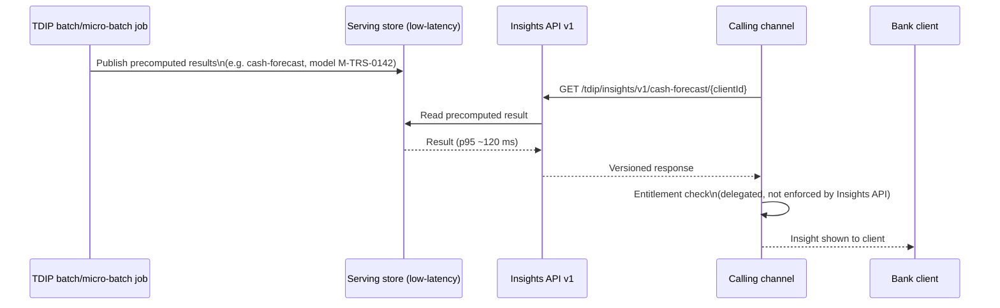

## Overview

TDIP-CAT-2026.2 is the "Treasury Data & Insights Platform - Data Catalog Extract
(Payments Domain) & Insights API," a published, INTERNAL - CONFIDENTIAL reference
document maintained by Treasury Data & Analytics. It catalogs the payments-domain
datasets and derived feature tables that run on the
[Treasury Data & Insights Platform (TDIP)](../systems/treasury-data-insights-platform.md),
records their source systems, refresh cadence, history depth, data-governance
classification and ownership, and documents the **Insights API**, the serving layer
through which TDIP publishes client-facing analytical outputs. It is version 2026.2,
published 2026-09-18, owned jointly by Carlos Mendes (EM, Treasury Data Platform) and
Dr. Aisha Rahman (Lead Data Scientist), and approved by Wei Zhang (Director, Treasury
Data & Analytics) and Ethan Brooks (Data Governance). Like other documents in this
corpus it is marked "Uncontrolled when printed," so Collibra (the data catalog of
record) and the Insights API's own endpoint registry remain authoritative over this
extract for current classification and availability.

| Field | Value |
|---|---|
| Document ID | TDIP-CAT-2026.2 |
| Version / Status | 2026.2 / Published |
| Document owner | Carlos Mendes (EM, Treasury Data Platform); Dr. Aisha Rahman (Lead Data Scientist) |
| Approver(s) | Wei Zhang (Director, Treasury Data & Analytics); Ethan Brooks (Data Governance) |
| Effective / Last reviewed | Published 2026-09-18 |
| Classification | INTERNAL - CONFIDENTIAL |
| Related documents | DUS-07; MRM-POL-02; ADR-PAY-026; PNG-TDD-6.0 |

## Platform stack and access control

The extract's platform-overview section summarizes TDIP's technology stack: Snowflake
(Enterprise, US-East) as the warehouse, dbt for transformations, a Feast feature
store, Amazon SageMaker for model training and batch scoring, and a separate
low-latency serving store that backs the Insights API. Access governance runs through
Collibra, and any dataset classified Restricted requires Privacy Office approval with
a 15-business-day SLA — the same approval path and SLA that
[DUS-07](dus-07.md) defines for Restricted datasets generally. This stack
description is the architectural anchor for the
[Treasury Data & Insights Platform system page](../systems/treasury-data-insights-platform.md).

## Payments-domain datasets

The catalog lists six payments-domain datasets, each with its upstream source,
refresh cadence, retained history, DUS-07 classification, and named data owner /
steward:

| Dataset | Source | Refresh | History | Classification | Data owner / steward |
|---|---|---|---|---|---|
| `pay_wire_txn_hist` | PPH (CDC) | Hourly | 7 yrs | Confidential - Client | Laura Kim / Carlos Mendes |
| `gpi_tracker_events` | GPI_TRACKER_SNAPSHOT (GPI-C) | Nightly 05:00 ET (hourly from 2026-11, TDA-2188) | Since 2025-03-01 | Confidential - Client | Laura Kim / Carlos Mendes |
| `fed_ack_events` | net.fedwire.ack.v1 | **Not ingested** (TDA-2210) | - | - | - |
| `dda_txn_history` | Core Deposit Platform | Daily | 7 yrs | Restricted - Client Confidential | Mark Sullivan / Deposits Data Eng. |
| `client_hierarchy` | CIF + CES | Daily | Current + 2 yrs | Confidential - Client | Marcus Chen / Carlos Mendes |
| `cbo_wire_events` | CBO clickstream | Hourly | 13 months | Internal | Marcus Chen |

Two notes materially affect how `pay_wire_txn_hist` can be used for completion-time
analytics:

- `pay_wire_txn_hist.uetr` is populated for Swift wires since 2018 but only for
  Fedwire wires since 2025-10, per ADR-PAY-023 (the decision to use UETR as a
  cross-rail correlation id, recorded in the Payments ARB register — see
  [ARB-PAY-REG-2026Q3](arb-pay-reg-2026q3.md)). Any corridor or completion-time
  feature spanning Fedwire history before 2025-10 cannot rely on UETR-based
  correlation.
- Settlement-time analytics for domestic (Fedwire) wires require `fed_ack_events`,
  which is **not ingested** — tracked as backlog item TDA-2210. This is the single
  largest capability gap in the catalog: TDIP cannot currently produce acceptance- or
  settlement-timestamp insights for Fedwire traffic the way it can for Swift/gpi
  traffic.

<!-- openwiki: mermaid parse failed and this diagram was converted to a text fence so it does not break rendering. Fix the diagram source and restore the mermaid fence. Parser error: Heuristic: an unescaped angle bracket inside a label breaks rendering; rephrase the label. -->
```text
flowchart LR
    PPH["PPH (CDC)"] --> wire["pay_wire_txn_hist\nConfidential - Client, hourly, 7 yrs"]
    GPIC["GPI_TRACKER_SNAPSHOT (GPI-C)"] --> gpi["gpi_tracker_events\nConfidential - Client, nightly->hourly (TDA-2188)"]
    Fedwire["net.fedwire.ack.v1"] -.not ingested, TDA-2210.-> fedack["fed_ack_events"]
    CoreDeposit["Core Deposit Platform"] --> dda["dda_txn_history\nRestricted - Client Confidential, daily, 7 yrs"]
    CIFCES["CIF + CES"] --> hier["client_hierarchy\nConfidential - Client, daily"]
    CBO["CBO clickstream"] --> cbo["cbo_wire_events\nInternal, hourly, 13 mo"]

    wire --> corridor["wire_corridor_stats_daily"]
    gpi --> corridor
    dda --> bene["beneficiary_behavior_profile"]
    wire --> bene
    wire --> hist["client_wire_history_features"]
    gpi --> hist

    corridor --> insights["Insights API\n(serving store)"]
    hist -. prototype, not productionized .-> insights
```

## Feature tables

Three feature tables are derived from the raw datasets, each with its own grain,
inherited classification, permitted purpose, and (where applicable) a Model Risk
Management (MRM) inventory link:

| Feature table | Grain | Derived from | Classification / permitted purpose | MRM link |
|---|---|---|---|---|
| `wire_corridor_stats_daily` (TDA-2140) | currency × destination country × day | `pay_wire_txn_hist` + `gpi_tracker_events`, all originating clients | Internal - built for Payment Ops dashboards; wire counts, distinct originating clients, same-day ACCC rate, median hours to ACCC; **no suppression flag** | None (descriptive) |
| `beneficiary_behavior_profile` | on-us beneficiary account × day | `dda_txn_history` + `pay_wire_txn_hist` (incoming wires to CNB accounts) | Restricted - Client Confidential; permitted purpose is FCT fraud / mule-detection features only; includes beneficiary median-hours-to-outflow, 24h outflow ratio, 30-day new-counterparty count | Input to M-FCT-0034 |
| `client_wire_history_features` | originating client × beneficiary key | `pay_wire_txn_hist` + `gpi_tracker_events` | Confidential - Client; **prototype, not productionized**: count, median release-to-ACCC, p90, last_seen | Not registered |

Two cross-cutting governance points follow from how these feature tables inherit
classification and purpose restrictions, consistent with
[DUS-07](dus-07.md)'s rule that a feature table inherits the most restrictive
permitted purpose of any of its inputs:

- `beneficiary_behavior_profile` is built from a beneficiary's own account activity
  after receiving funds and is restricted to financial-crimes (fraud / mule-detection)
  use feeding model M-FCT-0034. DUS-07's cross-client confidentiality rule — that one
  client's behavior as a counterparty may not be used to generate content shown to
  another client, even presented only as a pattern or typical value — means this
  feature table cannot legitimately back a client-facing insight; it is scoped to
  internal fraud detection only, and [MRM-POL-02](mrm-pol-02.md)'s use limitations
  separately bar Tier 1 financial-crimes model inputs from product or client-facing
  use.
- `wire_corridor_stats_daily` is marked Internal with **no suppression flag**, even
  though it is built across all originating clients and the catalog's own rolling
  90-day corridor sample (Section 3.1) shows cohorts that would fail DUS-07's
  aggregated-cohort-disclosure thresholds (at least 500 transactions, at least 20
  distinct originating clients, no client over 15% of cohort volume). For example,
  the sampled MXN/MX corridor (2,950 wires, 88 clients, largest client 21% of volume)
  and NGN/NG corridor (140 wires, 11 clients, largest client 38% of volume) each
  breach the "no single client over 15%" and/or minimum-volume/client-count
  conditions. Because the feature table carries no suppression flag today, any
  client-facing use of corridor statistics for thin corridors would need an explicit
  suppression mechanism before it could satisfy DUS-07 Section 5 — a gap relevant to
  anyone proposing to extend corridor/wire-history insights to clients.

### Corridor statistics sample

The catalog includes a rolling-90-day sample (to 2026-08-31) of outbound Swift wire
corridor statistics computed by `wire_corridor_stats_daily`:

| Currency / country | Wires | Distinct originating clients | Largest client share | Same-day ACCC | Median hours to ACCC |
|---|---|---|---|---|---|
| EUR / DE | 31,200 | 1,140 | 4% | 92% | 2.1 |
| GBP / GB | 18,450 | 860 | 6% | 94% | 1.6 |
| CAD / CA | 12,900 | 1,020 | 5% | 90% | 2.4 |
| MXN / MX | 2,950 | 88 | 21% | 81% | 4.9 |
| INR / IN | 1,730 | 64 | 9% | 76% | 6.2 |
| NGN / NG | 140 | 11 | 38% | 52% | 19.5 |

The large, liquid corridors (EUR/DE, GBP/GB, CAD/CA) comfortably clear DUS-07's
disclosure thresholds; the thin corridors (MXN/MX, INR/IN, NGN/NG) do not, which is
the practical reason the catalog's only GA Insights API endpoint today serves
per-client cash forecasts rather than cross-client corridor insights.

## Insights API

Client-facing analytical outputs are served by the **Insights API**, the pattern
formalized by ADR-PAY-026 and recorded in the Payments ARB register (see
[ARB-PAY-REG-2026Q3](arb-pay-reg-2026q3.md)). Results are computed inside TDIP
(batch or micro-batch jobs reading from Snowflake/dbt/Feast/SageMaker outputs),
published to the low-latency serving store described in the platform overview, and
exposed through versioned HTTP endpoints. Entitlement/authorization checks are
delegated to the calling channel rather than enforced inside the Insights API itself.

| ID | Endpoint | Status | Notes |
|---|---|---|---|
| EP-TDIP-01 | `GET /tdip/insights/v1/cash-forecast/{clientId}` | GA (2025-09) | Backed by model M-TRS-0142; p95 120 ms; treated as the reference implementation |
| - | Wire history / corridor insights | Not available | No endpoints exist; `client_wire_history_features` is only a prototype |



### Onboarding a new insight

The catalog defines a four-step onboarding sequence for adding a new Insights API
endpoint, which ties together governance obligations from three other documents in
the corpus:

1. **MRM inventory registration**, per [MRM-POL-02](mrm-pol-02.md) — the candidate
   model or descriptive calculation must be registered and, unless it qualifies as an
   End-User Analytic, tiered and validated before its output may be shown to a
   client.
2. **Data-access approvals**, per [DUS-07](dus-07.md) — including Privacy Office
   sign-off for any Restricted input and confirmation that purpose-limitation and
   (for cross-client statistics) aggregation-threshold rules are satisfied.
3. **Serving endpoint build** — typical sizing of ~13-21 story points.
4. **Disclosure Review Committee (DRC) approval** of client-facing wording and
   disclaimers.

Because EP-TDIP-01 is both GA and described as the "reference implementation," new
Insights API endpoints are expected to follow its same model-registration →
data-access-approval → build → DRC-wording sequence rather than skip steps for
expedience.

## Known gaps

The extract calls out three open gaps that bound what TDIP and the Insights API can
currently deliver:

- **Fed acceptance timestamps are not ingested** (`fed_ack_events`, TDA-2210), so
  TDIP cannot compute Fedwire settlement-time analytics comparable to what it already
  computes for Swift/gpi traffic.
- **gpi data refreshes only nightly** until TDA-2188 completes (targeted 2026-11),
  and its history begins 2025-03-01; gpi-derived features (e.g. in
  `wire_corridor_stats_daily`) cannot reflect same-day gpi events until that project
  ships.
- **No real-time (sub-minute) serving exists for wire data**; hourly is the minimum
  achievable freshness for any wire-derived dataset or feature table in the current
  architecture.

## Relationships

- **Platform**: TDIP-CAT-2026.2 is the data-catalog extract for the
  [Treasury Data & Insights Platform](../systems/treasury-data-insights-platform.md)
  system itself; the system page covers TDIP's architecture and operations, while
  this document records dataset/feature inventory, classification, and the Insights
  API endpoint list.
- **Upstream source systems**: `pay_wire_txn_hist` and `gpi_tracker_events` are fed
  by change-data-capture and snapshot feeds from the PRISM Payments Hub (PPH) and the
  GPI tracker, documented in
  [PPH-API-CAT-2026.3](pph-api-cat-2026.3.md) and
  [PNG-TDD-6.0](png-tdd-6.0.md) (Fedwire/gpi technical design) respectively;
  `dda_txn_history` comes from the Core Deposit Platform and `client_hierarchy` from
  CIF + CES.
- **DUS-07**: governs the classification scheme (Public / Internal / Confidential -
  Client / Restricted - Client Confidential) applied to every dataset and feature
  table in this catalog, the Restricted-dataset approval SLA, and the aggregated
  cohort-disclosure thresholds that the corridor-statistics sample and
  `wire_corridor_stats_daily`'s missing suppression flag put in tension. See
  [DUS-07](dus-07.md).
- **MRM-POL-02**: governs model/EUA registration and tiering for anything backing an
  Insights API endpoint (e.g. M-TRS-0142 behind EP-TDIP-01) and bars Tier 1
  financial-crimes model inputs, including `beneficiary_behavior_profile`'s
  contribution to M-FCT-0034, from product or client-facing use. See
  [MRM-POL-02](mrm-pol-02.md).
- **ADR-PAY-026 / Payments ARB**: the architecture decision that establishes serving
  client-facing analytics via the Insights API pattern described here, recorded in
  the Payments ARB register. See [ARB-PAY-REG-2026Q3](arb-pay-reg-2026q3.md).
- **PNG-TDD-6.0**: the Fedwire/gpi payment-network-gateway technical design is the
  related document most relevant to closing the `fed_ack_events` ingestion gap
  (TDA-2210) and understanding the gpi tracker feed behind `gpi_tracker_events`. See
  [PNG-TDD-6.0](png-tdd-6.0.md).
