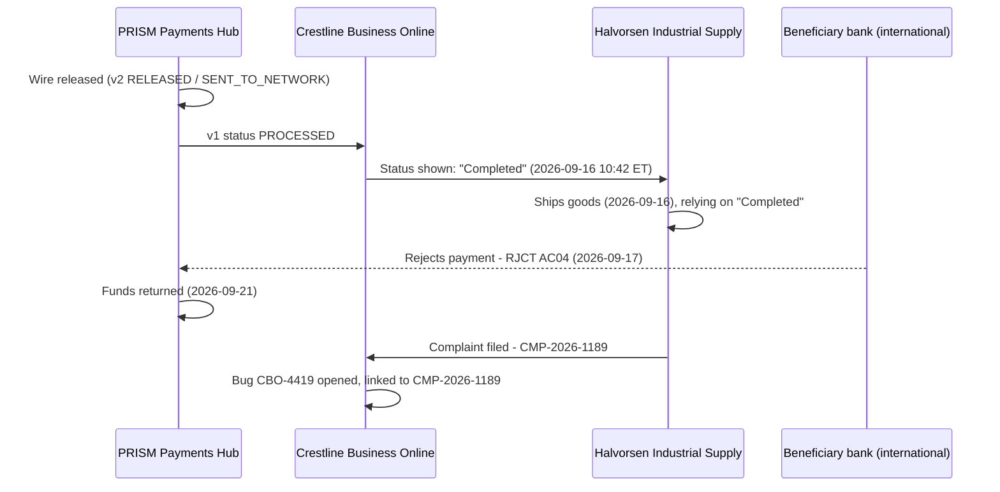

## Summary

CMP-2026-1189 is an open regulatory complaint from Halvorsen Industrial
Supply, a Crestline Business Online (CBO) client who shipped goods in
reliance on a wire status label that did not mean what the client believed it
meant. It is the concrete incident that the
[Settlement, Release, and "Completed" - Status Semantics](../concepts/settlement-release-completed-semantics.md)
gap had been predicting since at least the 2024 Wire Status Lite pilot: CBO
displays "Completed" at wire release, well before any confirmation that the
beneficiary actually received funds, and in this case the payment did not
complete at all.

The complaint is tracked against the engineering bug
[CBO-4419](#linked-records) ("Client complaint: wire showed 'Completed' then
returned/rejected"), which was still `Open`/root-cause-TBD as of the
2026-10-05 export cited below, and is the trigger case cited by the
status-semantics gap page.

## The facts

| Fact | Value |
|---|---|
| Client | Halvorsen Industrial Supply |
| Channel | Crestline Business Online (CBO) |
| Wire amount | **EUR 412,600** |
| Rail | International (Swift CBPR+ / gpi) |
| Status shown | "Completed" |
| Time status shown | **2026-09-16 10:42 ET** |
| Client action taken | Released/shipped goods on 2026-09-16, in reliance on the "Completed" status |
| Beneficiary bank action | Rejected the payment |
| Rejection date | **2026-09-17** |
| Rejection reason | **RJCT, ISO return reason AC04** (account closed) |
| Funds returned to CNB | **2026-09-21** |
| Complaint status (as of 2026-10-05 export) | Open - regulatory complaint review pending |

These facts are recorded identically in the Pega complaint record summary
and in the linked Jira bug's discovery comment; both are reproduced in the
seed export at `repo://sources/estate/jira-export-wt-discovery-2026-10-05.md#L99-L106`
and `#L183-L188`.

## Timeline

*From release to complaint: no gpi ACCC was ever received for this wire -
the beneficiary bank rejected it instead, after the client had already acted
on the "Completed" label.*

## Why this happened: the status-semantics gap

The wire's "Completed" label was not a data error or a one-off UI bug; it
reflects a structural mismatch between three different definitions of
"completed" at Crestline National Bank, documented in full on
[Settlement, Release, and "Completed" - Status Semantics](../concepts/settlement-release-completed-semantics.md):

1. **Engineering (PPH):** the v2 lifecycle state `COMPLETED` is PPH's internal
   accounting close, reached only after network acknowledgment - but the
   legacy v1 status API that CBO's backend-for-frontend (`cbo-wire-bff`)
   consumes collapses `RELEASED`, `SENT_TO_NETWORK`, `NETWORK_ACCEPTED`, and
   `COMPLETED` into one value, `PROCESSED`. See
   [Wire Lifecycle State Model](../concepts/wire-lifecycle-state-model.md).
2. **Compliance ([POL-FCC-014](../policies/pol-fcc-014.md)):** the words
   "Completed" or "Settled" may be shown to a client only once a specific
   network event has occurred - for an international wire, that is gpi
   `ACCC` (funds confirmed credited to the beneficiary's account), not mere
   network delivery acknowledgment.
3. **CBO product:** in R26.1 (2026-02, delivered via Jira story CBO-4402),
   CBO Product replaced the legacy label "Processed" with "Completed" based
   on a six-client usability survey, mapping the new label onto the same
   v1 `PROCESSED` signal - i.e., onto release, not onto gpi `ACCC`
   (`repo://sources/estate/jira-export-wt-discovery-2026-10-05.md#L83-L98`).

For this specific wire, the practical effect of that mapping was that CBO
displayed "Completed" at `RELEASED`/`PROCESSED` on 2026-09-16 - before the
outbound `pacs.008` had even reached a terminal gpi outcome. The payment's
actual terminal outcome, reached the next day, was `RJCT` with reason `AC04`,
not `ACCC`. Per the gpi status/reason table in
[SWIFT gpi & CBPR+](../concepts/swift-gpi-cbpr.md), only `ACCC` and `RJCT`
are genuinely terminal gpi outcomes, and `RJCT` triggers a `pacs.004` return
rather than a beneficiary credit - exactly what occurred here, with funds
returned to CNB on 2026-09-21.

CBO-4402's own product rationale ("'Processed' was unclear; 'Completed'
tested better") addressed a usability complaint without being validated
against POL-FCC-014's status-terminology gate - the same gap the 2024 Wire
Status Lite pilot's post-implementation review (PIR-2024-07) had already
flagged and left as an open, unexecuted action item ("Validate client-facing
status terminology with FCC and Legal before any future tracking feature").
CMP-2026-1189 is that unexecuted action item materializing as a live
regulatory complaint.

## Linked records

| Record | System | Type | Status (as of 2026-10-05 export) | Relationship |
|---|---|---|---|---|
| CMP-2026-1189 | Complaints (Pega) | Regulatory complaint | Open - regulatory complaint review pending | This page's subject |
| CBO-4419 | Jira (CBO project) | Bug | Open, Backlog, unassigned sprint; owner Tom Becker | "relates to CMP-2026-1189"; root cause recorded as TBD |
| CBO-4402 | Jira (CBO project) | Story (Done, R26.1) | Done | Introduced the "Processed" -> "Completed" label change that this complaint is about |
| CBO-4471 | Jira (CBO project) | Epic (Backlog, unscheduled) | Must complete before PPH v1 sunset 2027-03-31 | Migration off v1 to v2 is the structural fix that would let CBO see the rail-specific acknowledgment/settlement states this complaint turns on, but is unscheduled and blocked on CBO-4473 |
| PPH-2266 | Jira (PPH project) | Story (Done, 2026-08) | Done | Publishes ISO return reason (`pacs.004`) such as `AC04` on `pay.wire.lifecycle.v2`, i.e., the kind of data needed to explain this rejection, but only on the v2 event stream CBO does not yet consume |

Source: `repo://sources/estate/jira-export-wt-discovery-2026-10-05.md#L36`,
`#L99-L113`, `#L56`, `#L183-L188`.

## Why a structural fix is not yet scheduled

Two gating facts, both visible in the same Jira export, explain why this
complaint is unresolved rather than quickly closed with a status-label
correction:

- **CBO-4471** (migrate `cbo-wire-bff` from PPH v1 to v2) is the change that
  would give CBO access to the rail-specific, event-granular states needed to
  show "Completed" only when POL-FCC-014 permits it. It is sized at 34 points,
  sits in an unscheduled backlog, and is blocked on **CBO-4473** (CES
  account-filter mapping for PPH v2 search). As of the 2026-10-05 export it
  was not yet in the PI 26.4 or PI 27.1 draft planning.
- Even after a v1-to-v2 migration, gpi status itself is not real-time: per
  [SWIFT gpi & CBPR+](../concepts/swift-gpi-cbpr.md), the gpi Tracker
  Connector (GPI-C) only batch-pulls Swift Tracker updates every 4 hours, and
  there is no internal API exposing gpi status to channels today (tracked as
  spike **CBO-4480**, status `To Do`). A compliant "Completed" label for
  international wires therefore depends on work beyond the v1-to-v2
  migration alone.

Both gating items remain unresourced as of the cited export, meaning the
underlying status-semantics gap that produced CMP-2026-1189 remains open for
any future international wire, not just this one.

## Related pages

- [Settlement, Release, and "Completed" - Status Semantics](../concepts/settlement-release-completed-semantics.md) - the full three-way terminology analysis (engineering/compliance/product) this incident is the evidentiary case for.
- [Wire Lifecycle State Model](../concepts/wire-lifecycle-state-model.md) - defines the v2 states the v1 `PROCESSED` value collapses, including why `RELEASED` and `COMPLETED` are conflated.
- [SWIFT gpi & CBPR+](../concepts/swift-gpi-cbpr.md) - the international rail's `ACSP`/`ACCC`/`RJCT` status vocabulary, including why `RJCT AC04` is a terminal, non-credit outcome.
- [POL-FCC-014](../policies/pol-fcc-014.md) - the compliance standard whose Section 5.2 terminology gate this complaint is about.
- [CBO Wire Center](../systems/cbo-wire-center.md) - the channel system that rendered the "Completed" label.
