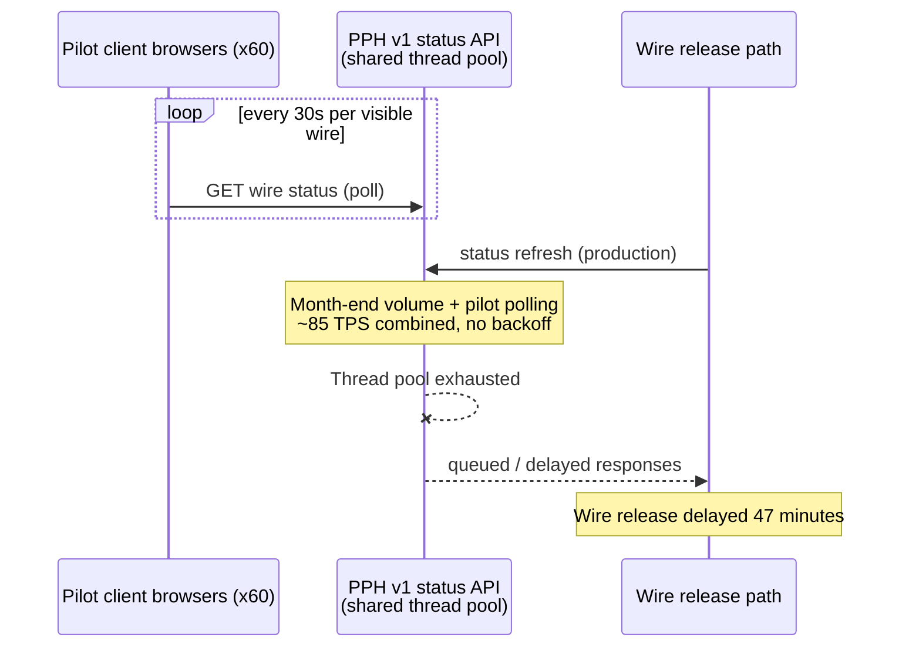

## Summary

INC-2024-1182 occurred on **2024-05-31** (a month-end processing day) when
client-facing polling traffic from the Wire Status Lite pilot ([CBO-3120](../projects/cbo-3120-wire-status-lite-pilot.md))
combined with normal production wire-release status refreshes to drive
approximately **85 TPS** against the PPH v1 wire status API. This exhausted
the PPH v1 API's thread pool and delayed wire release processing for
**47 minutes**. The incident is the documented root cause behind
[ADR-PAY-019](../decisions/adr-pay-019.md) and is analyzed in depth in
[PIR-2024-07](pir-2024-07.md), the post-implementation review that also closed
out the Wire Status Lite pilot.

## What happened

Wire Status Lite was a pilot (CBO-3120, closed "Won't Do") that let 60
pilot clients see auto-refreshing wire status in CBO. Each client browser
polled PPH v1 for every visible wire's status once every 30 seconds. PPH v1
is a shared, synchronous API also used by the production wire-release path
and other consumers (e.g., IVR, CRM) to check and act on wire status.

On 2024-05-31, a month-end day, two load sources stacked on the same thread
pool at the same time:

- **Pilot polling load**: 60 clients' browsers refreshing every visible wire
  every 30 seconds, scaling with however many wires each client had open.
- **Production load**: the normal, much higher volume of production wire
  releases and their associated status refreshes that occurs at month-end.

Combined, this drove roughly 85 TPS at the v1 status endpoint. The polling
pattern had no client-side backoff, so as latency increased under load,
retries and continued fixed-interval polling added to the queue rather than
relieving it. The PPH v1 API's thread pool saturated, so requests involved in
the production wire-release flow queued behind pilot polling requests, and
wire release was delayed by 47 minutes enterprise-wide while the backlog
drained.

## Impact

| Measure | Value |
|---|---|
| Wires delayed | 1,240 |
| Wires released after the 6:00 p.m. ET Fedwire customer cutoff (value next day) | 312 |
| Clients compensated (interest claims) | 14 clients, $41,800 |
| Regulatory notification | Not required (no data exposure) |
| Wire release delay | 47 minutes |
| Approximate combined load at peak | ~85 TPS against PPH v1 status API |

Because 312 wires missed the 6:00 p.m. ET Fedwire customer cutoff, those
wires valued the next business day, producing the interest-claim
compensation paid to 14 affected clients. No client data was exposed, so the
incident did not trigger a regulatory notification requirement.

## Root causes

The post-implementation review (PIR-2024-07) identified three root causes:

1. **Polling architecture against a shared synchronous API with no
   client-side backoff.** Wire Status Lite polled PPH v1 on a fixed 30-second
   interval per visible wire regardless of API latency or errors, so
   degraded performance under load produced more load rather than less.
2. **No capacity test at month-end volumes.** The pilot's load was never
   validated against the production traffic profile seen at month-end, when
   wire-release volume is substantially higher than on ordinary days.
3. **Status semantics were not validated with Compliance or Legal before
   exposure.** This third root cause is about client-facing status
   terminology rather than the thread-pool exhaustion mechanism itself, but
   it is recorded alongside the technical causes because it shaped how the
   pilot was wound down rather than patched and retried (see
   [Related client-trust findings](#related-client-trust-findings)).

## Resolution and corrective actions

| Action | Owner | Status |
|---|---|---|
| Rate-limit PPH v1 status API to 20 TPS shared | PPH | Done 2024-06 |
| Adopt event-driven status pattern (became [ADR-PAY-019](../decisions/adr-pay-019.md)) | Enterprise Architecture | Done 2024-06 |
| Build a reusable status projection service in CBO | CBO Platform | Delivered for ACH in 2025 (CBO-3815, Status Projection Service) |
| Validate client-facing status terminology with FCC and Legal before any future tracking feature | CBO Product | Open - carried forward |

The immediate fix was a shared 20 TPS rate limit applied to the PPH v1 status
API, completed in June 2024. The durable fix was architectural: Enterprise
Architecture used this incident to justify moving wire (and later other
payment-rail) status delivery away from client-side polling of a shared
synchronous API and toward an event-driven status pattern, which was
formalized as [ADR-PAY-019](../decisions/adr-pay-019.md). The pilot epic
CBO-3120 itself was closed as "Won't Do" rather than resumed.

ADR-PAY-019's pattern was first delivered for ACH, not wires: CBO-3815 built
a Kafka-consumer-based Status Projection Service (SPS) that reads
`pay.wire.lifecycle.v2`-style lifecycle events into a Postgres read model
served over an internal `/cbo/sps/v1` API, and CBO-3790 (ACH Payment Tracker)
consumed it in 2025. As of the most recent Wire Center backlog export, wires
have not yet been migrated onto this pattern: Wire Center still reads wire
status from PPH v1, and migrating it to PPH v2 is tracked as a separate,
unscheduled epic (CBO-4471) ahead of the PPH v1 sunset on 2027-03-31.

## Related client-trust findings

The PIR also captured findings about the pilot's client-facing status
semantics that motivated the fourth, still-open action item above:

- 37% of surveyed pilot users believed the status **"Processed"** meant the
  beneficiary had already received the funds, which is not necessarily true.
- Users most valued knowing the wire had left CNB, the Fed reference for
  their beneficiary, and when international wires were credited.
- Users asked why wires were held, and Treasury Support could not explain
  hold reasons without FCC (financial crimes compliance) guidance.

These findings are why the pilot was not simply re-launched after the rate
limit and architecture fix: client-facing status terminology needed
Compliance and Legal validation before any future wire-tracking feature,
and that validation was still open at the time of the PIR and remains an
open action item.

## Relationship to later work

- **ADR-PAY-019** cites this incident as its root cause and specifies the
  event-driven status pattern adopted in response. See
  [ADR-PAY-019](../decisions/adr-pay-019.md).
- **PIR-2024-07** is the formal post-implementation review document for both
  the Wire Status Lite pilot and this incident; it contains the impact
  figures, root causes, and action items summarized on this page. See
  [PIR-2024-07](pir-2024-07.md).
- **CBO-3120 (Wire Status Lite pilot)** is the epic whose polling design
  caused the incident; it was closed "Won't Do" as a direct result. See
  [Wire Status Lite pilot](../projects/cbo-3120-wire-status-lite-pilot.md).
- A later Jira backlog export (2026-10-05) continues to reference
  INC-2024-1182 as the cause of CBO-3120's closure and as a precedent cited
  when scoping newer wire-tracking work, underscoring that the thread-pool
  exhaustion risk against shared PPH v1 capacity remains a live constraint
  for any new polling-style feature built against it.

## Sources

- Jira export "WT-discovery" (2026-10-05): CBO-3120 epic record and linked
  records table noting INC-2024-1182 as "PPH v1 thread-pool exhaustion caused
  by Wire Status Lite polling (month-end)", closed, see PIR-2024-07.
- PIR-2024-07 "Post-Implementation Review: Wire Status Lite Pilot and
  Incident INC-2024-1182" (v1.1, Final, 2024-07-15): summary, impact table,
  root causes, and actions.
