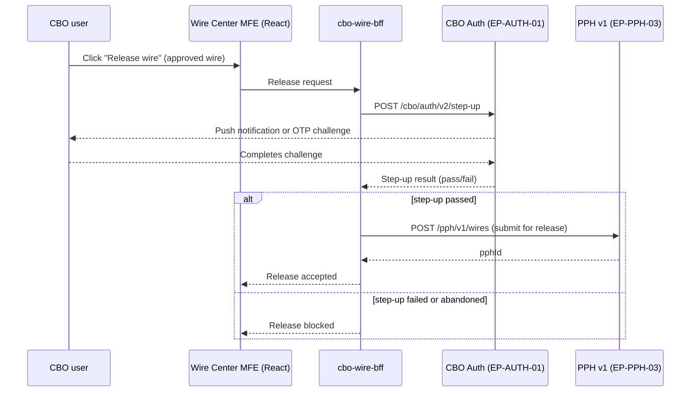

## Overview

The CBO Auth Step-Up API is a shared authentication service exposed by the **CBO Auth** platform at
`POST /cbo/auth/v2/step-up` (catalog ID **EP-AUTH-01**). It provides risk-based, in-session
re-authentication — a "step-up" challenge (push notification or one-time passcode, OTP) — for
actions inside Crestline Business Online (CBO) that are considered high-risk enough to require
stronger proof of user presence than the standing OAuth2 session already provides.

Today the API has exactly one production caller: `cbo-wire-bff`, the backend-for-frontend behind
the [CBO Wire Center](../systems/cbo-wire-center.md) module, which invokes it synchronously as the
final gate before releasing an approved wire. The API is explicitly called out in Wire Center's
architecture as a **reusable asset**: it is intentionally action-agnostic so that any future
high-risk client action in CBO can adopt the same step-up mechanism without building new
authentication plumbing.

## Entry point

| Field | Value |
|---|---|
| Catalog ID | EP-AUTH-01 |
| Endpoint | `POST /cbo/auth/v2/step-up` |
| Version | v2 |
| Protocol | REST over HTTPS, synchronous, called within an existing OAuth2 session |
| Owning platform | CBO Auth |
| Current caller(s) | `cbo-wire-bff` (wire release) |
| Challenge methods | Push notification or OTP |

The endpoint sits alongside — but is independent from — the entitlement check performed via
`GET /ces/v2/users/{id}/entitlements` (EP-CES-01). Entitlement answers "is this user allowed to
perform this class of action at all," while step-up answers "has this specific user, right now,
proven presence strongly enough to perform this specific high-risk instance of the action."
Both checks are enforced server-side in `cbo-wire-bff`, not in the Wire Center micro-frontend.

## Control flow: wire release (current usage)

In Wire Center, release is gated by two independent controls that must both be satisfied:
client-configured **dual approval** above client-defined thresholds, and this **step-up
authentication** call at the moment of release. Dual approval establishes a second authorized
approver; step-up authentication confirms the identity/presence of the user performing the final
release action. Neither control substitutes for the other.

## Relationship to Wire Center's status and identifier model

Step-up authentication occurs before a wire is submitted to PPH v1 (`POST /pph/v1/wires`,
EP-PPH-03) and therefore before the wire receives a `pphId` or transitions out of CBO-owned
pre-submission statuses (Draft / Pending Approval / Approved). A failed or abandoned step-up
challenge leaves the wire in its prior CBO-owned state; it does not produce a PPH-side record. See
[CBO Wire Center](../systems/cbo-wire-center.md) for the full status model and identifier
lifecycle.

## Extension point: reuse beyond wire release

The Wire Center architecture document records step-up authentication as a reusable asset
("Already used for wire release; reusable for other high-risk client actions") and the API's own
purpose statement generalizes it to "any future high-risk client action such as hold
attestation." A concrete candidate consumer is **digital attestation on duplicate-suspect
holds (HRC-01)** under [POL-FCC-014](../policies/pol-fcc-014.md) and control CTRL-PAY-031: a
client may confirm or cancel a duplicate-suspect hold through a digital channel, but only subject
to step-up authentication of an entitled user, and only below a USD 5,000,000 threshold — amounts
above that threshold still require manual Wire Room release regardless of digital attestation. As
of the current architecture baseline, no digital attestation path has been built; this consumption
would be new integration work reusing the existing EP-AUTH-01 contract rather than a new
authentication mechanism.

This reuse pattern defines the API's extension contract: any new high-risk action that wants
step-up protection should call `POST /cbo/auth/v2/step-up` from its own BFF at the point of
action, the same way `cbo-wire-bff` does for release, rather than implementing bespoke
challenge/response logic per action.

## Security and policy context

- Step-up authentication is required for wire release per the CBO Wire Center architecture
  (CBO-ARCH-WC-4.1, Section 6: Security and entitlements), in addition to dual approval.
- Risk-based authentication for high-risk actions is also an enterprise regulatory expectation
  (FFIEC "Authentication and Access to Financial Institution Services and Systems," 2021), cited
  as part of the basis for [POL-FCC-014](../policies/pol-fcc-014.md), which governs what client
  actions on payment holds are permitted and requires step-up authentication of an entitled user
  for any permitted hold action (POL-FCC-014 Section 5.1, item 4).
- Any capability that would externally share client transaction data (e.g., links or documents
  shared with non-users) is a separate concern from step-up authentication and is out of scope for
  this API; such sharing requires its own InfoSec design review under SEC-STD-22 ("Digital Channel
  External Sharing & Step-Up Standard") and a Privacy Impact Assessment, independent of whether
  step-up is used.

## Known limitations / open items

- EP-AUTH-01 is documented as a current-state integration point in the Wire Center architecture
  baseline (CBO-ARCH-WC-4.1); the CBO Auth service's own internal design (challenge delivery
  mechanics, retry/lockout behavior, OTP vs. push selection logic) is owned outside Wire Center and
  is not detailed in the available Wire Center architecture source.
- Reuse for hold attestation (HRC-01, CTRL-PAY-031) is named as an intended extension but is not
  yet implemented in any client-facing channel as of the current architecture baseline; building it
  requires a digital attestation flow in the consuming BFF, not changes to this API's contract.
