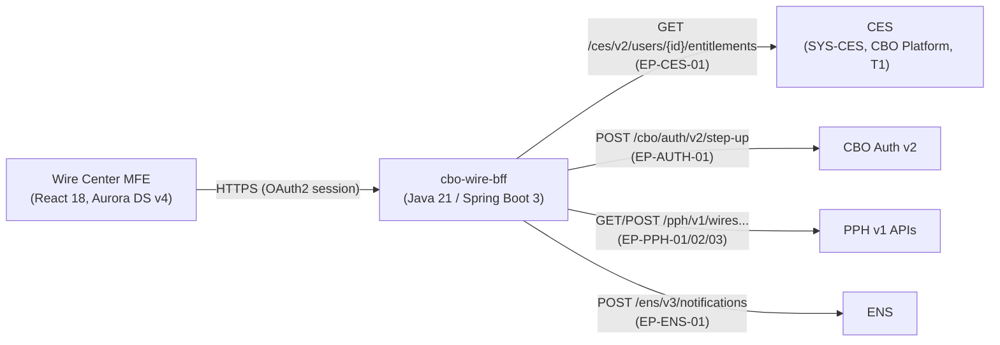
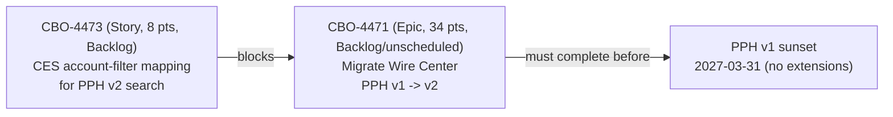

## Overview

**EP-CES-01** is `GET /ces/v2/users/{id}/entitlements`, a synchronous v2 REST endpoint exposed by the
**Commercial Entitlements Service (CES)** (`SYS-CES`), the system of record for which commercial
banking users and clients are entitled to which accounts and which entitlement types. It is called
at request time by `cbo-wire-bff`, the backend-for-frontend behind the Crestline Business Online
(CBO) **Wire Center** module, and serves two purposes in that caller: **authorization** (does this
user hold the entitlement needed for the action being attempted) and **account-level filtering**
(restricting wire search/activity results to only the accounts the calling user is entitled to see).
CES is owned by the **CBO Platform** team (technical owner Nadia Haddad, business owner Marcus Chen)
and runs as a Tier 1 (24x7 critical) system, reflecting that an outage or degradation of this
endpoint would block wire authorization and release across Wire Center, not just degrade a
non-critical feature.

See [Commercial Entitlements Service](../systems/commercial-entitlements-service.md) for the
system-level writeup of CES and [CBO-4471: PPH v1→v2 Migration](../projects/cbo-4471-pph-v1-to-v2-migration.md)
for the migration project this endpoint's account-filtering semantics currently block.

## Entrypoint and call pattern

| Aspect | Value |
|---|---|
| Endpoint ID | EP-CES-01 |
| Method / path | `GET /ces/v2/users/{id}/entitlements` |
| Version | v2 |
| Caller | `cbo-wire-bff` (Java 21 / Spring Boot 3, OpenShift) |
| Call style | Synchronous REST, called at request time (not cached/batched by the caller) |
| Stated purpose (integration inventory) | Authorization |
| Notes (integration inventory) | "Account-level filtering of results" |

`cbo-wire-bff` calls EP-CES-01 as part of handling Wire Center requests — alongside its calls to
`POST /cbo/auth/v2/step-up` (EP-AUTH-01, for release step-up) and the PPH wire APIs — making CES one
of the backend-for-frontend's standard per-request downstream dependencies rather than an
occasional or batch integration.

*Wire Center's logical architecture (CBO-ARCH-WC-4.1 section 2): CES authorization sits alongside
step-up auth, PPH, and ENS as a standard per-request dependency of `cbo-wire-bff`.*

## Responsibilities in Wire Center

1. **Authorization.** `cbo-wire-bff` uses the entitlements returned by EP-CES-01 to gate
   Wire Center actions against the CES entitlement types in use: `WIRE_VIEW`, `WIRE_INITIATE`,
   `WIRE_APPROVE`, `WIRE_RELEASE`, and `WIRE_TEMPLATE_ADMIN`. Wire release additionally requires
   step-up authentication (EP-AUTH-01) and client-configured dual approval above client-defined
   thresholds — CES entitlement checks and step-up are independent, composed controls, not
   substitutes for one another.
2. **Account-level filtering of search/activity results.** Wire Center's architecture document
   states plainly that "search results are filtered to the user's entitled accounts in the BFF" —
   i.e., filtering by entitled account is `cbo-wire-bff`'s responsibility, applied using the
   entitlement data EP-CES-01 returns, not a capability of the upstream PPH wire-list API itself.
   In the current (PPH v1) integration this combines with another known limitation: the activity
   list endpoint (`GET /pph/v1/wires?clientId...`, EP-PPH-02) returns up to 500 rows for a client
   with no server-side account or other filter, so `cbo-wire-bff` fetches by `clientId` and then
   applies filtering — including the entitled-account filtering driven by CES — client-side
   (tracked as CBO-4302, delivered R26.3).

## Downstream consumption of CES data: `client_hierarchy`

CES is also one of the two upstream sources (with the Client Information File, CIF) feeding the
Treasury Data & Insights Platform's `client_hierarchy` dataset, which links clients to accounts for
entitlement-aware analytics. That path is batch and asynchronous — `client_hierarchy` refreshes
daily — in contrast to EP-CES-01's synchronous, per-request role in Wire Center. A change in CES
entitlements (e.g., a new account added to a client's Wire Center relationship) is reflected
immediately the next time `cbo-wire-bff` calls EP-CES-01, but only reaches TDIP's
`client_hierarchy`-derived analytics after the next daily batch run. See
[client_hierarchy Dataset](../datasets/client-hierarchy.md) for the dataset-side detail.

## CBO-4473: the blocking dependency for PPH v2 migration

EP-CES-01's account-filtering semantics are the specific reason the PPH v1-to-v2 migration epic
(CBO-4471, 34 points, unscheduled, must complete before the 2027-03-31 PPH v1 sunset) cannot start:
it is blocked by **CBO-4473** — "CES: account-filter mapping for PPH v2 search (clientId + entitled
accounts)" (Story, 8 points, Backlog, owner Arjun Mehta, CBO Platform).

The dependency exists because the two PPH search interfaces have different filtering contracts:

| | PPH v1 list (EP-PPH-02) | PPH v2 search (EP-PPH-05) |
|---|---|---|
| Path | `GET /pph/v1/wires?clientId...` | `GET /pph/v2/payments?clientId&rail&state&from&to&cursor` |
| Server-side account filter | None (max 500 rows, no cursor) | Filters by `clientId` only — not by account |
| How account-level entitlement filtering happens today | `cbo-wire-bff` filters client-side using CES entitlements (CBO-4302) | Not yet defined |

Because PPH v2 search, like v1, has no account-level filter parameter, `cbo-wire-bff` will still need
to apply CES-driven, entitled-account filtering itself after migrating — but CBO-4473 is the
as-yet-undelivered work item that defines how CES's per-user, per-account entitlement data maps onto
a `clientId`-scoped v2 search so that filtering continues to work correctly post-migration. Until
CBO-4473 is designed and delivered, CBO-4471 remains in Backlog (unscheduled) against a hard,
no-extensions 2027-03-31 PPH v1 sunset date (confirmed by the Architecture Review Board on
2026-09-08), making EP-CES-01's filtering contract the critical path for the entire migration.

*Dependency chain from the CES account-filter mapping story to the fixed PPH v1 sunset date
(Jira export WT-discovery, 2026-10-05).*

## Operational notes and gaps

- **No documented schema beyond behavior.** The reviewed architecture and backlog sources describe
  EP-CES-01 by its path, version, and the two behaviors above (authorization, account-level
  filtering); they do not include a field-level response schema (e.g., whether entitlements are
  returned as a flat list, grouped by account, or paginated). Any integration work should confirm
  the current response contract directly with CES/CBO Platform rather than assume a shape.
- **Tier 1 criticality.** As a T1 (24x7 critical) system, CES degradation has an immediate blast
  radius on Wire Center: both the authorization checks gating initiate/approve/release/template-admin
  actions and the account-level filtering of every activity-list and search result depend on this
  endpoint responding correctly on the request path.
- **Entitlement types in use today** are limited to the five Wire Center types listed above; the
  architecture document does not describe entitlement types for other CES consumers, and this page
  should not be read as an exhaustive CES entitlement taxonomy.

## Related pages

- [Commercial Entitlements Service](../systems/commercial-entitlements-service.md) — system-level
  ownership, tiering, and broader role of CES.
- [CBO-4471: PPH v1→v2 Migration](../projects/cbo-4471-pph-v1-to-v2-migration.md) — the migration
  epic blocked by CBO-4473.
- [client_hierarchy Dataset](../datasets/client-hierarchy.md) — the batch/analytics consumer of CES
  entitlement data, as distinct from this synchronous API.
