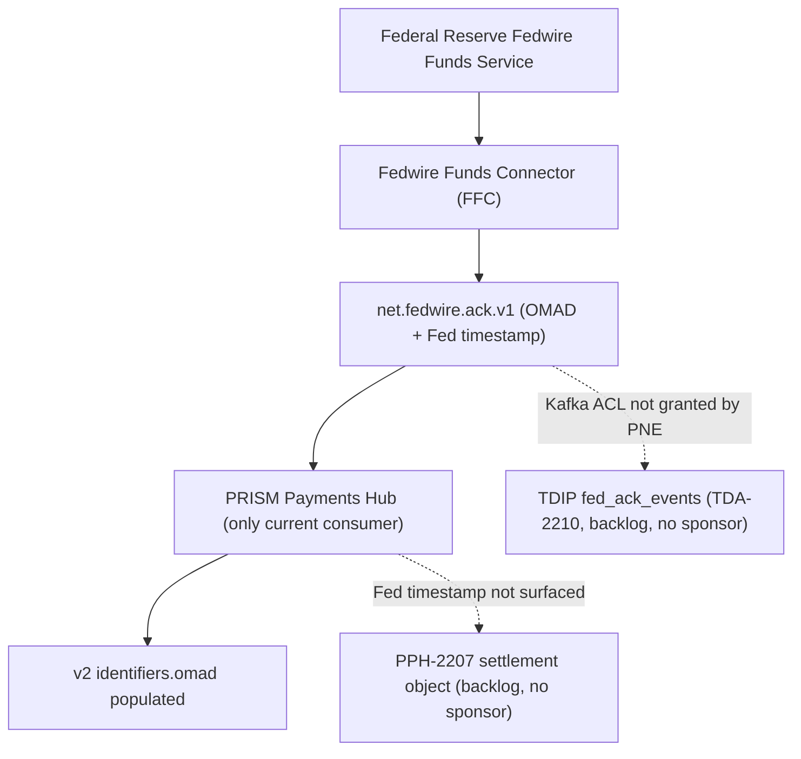

## Overview

`net.fedwire.ack.v1` and `net.fedwire.inbound.v1` are the two Kafka topics through which the
**Fedwire Funds Connector (FFC)** — the Fedwire module of the Payment Network Gateway (PNG), owned
by Payment Networks Engineering (PNE) — exposes everything it receives from the Federal Reserve's
Fedwire Funds Service back into Crestline's systems. Together they are the **sole authoritative
source** of two facts that exist nowhere else in the estate:

- the **OMAD** (Output Message Accountability Data), assigned by the Federal Reserve itself, and
- the **Federal Reserve's own creation timestamp** on the acceptance message — as opposed to the
  time any downstream system happened to process that acceptance.

Both topics are produced exclusively by FFC and are currently consumed by exactly one system:
PRISM Payments Hub (PPH). No other system — not the Treasury Data & Insights Platform (TDIP), not
any PPH v2 settlement feature — currently consumes them, even though both have open backlog items
to do so.

## Topics at a glance

| Topic | Producer | Content | Authorized consumer(s) | ACL owner |
|---|---|---|---|---|
| `net.fedwire.ack.v1` | Fedwire Funds Connector (FFC) | Federal Reserve acknowledgments for outbound value messages: **positive** `pacs.002` (OMAD + Fed creation timestamp) and errors (`admi.002` technical/business rejects, keyed by IMAD; negative `pacs.002`) | PPH | PNE |
| `net.fedwire.inbound.v1` | Fedwire Funds Connector (FFC) | Inbound value messages received from the Fed: `pacs.008` (customer transfer), `pacs.009` (FI transfer), `pacs.004` (return) | PPH | PNE |

Both topics sit on the same Kafka infrastructure, are produced by the same FFC module, and are
administered under the same ACL ownership (PNE); a consumer must be separately authorized for each
topic even though they originate from the same connector.

## `net.fedwire.ack.v1`: Federal Reserve acceptance and OMAD

For every accepted outbound value message (`pacs.008`/`pacs.009`), the Federal Reserve returns a
**`pacs.002`** acknowledgment carrying the OMAD and a Fed-assigned creation timestamp. FFC
publishes this acknowledgment to `net.fedwire.ack.v1` (catalog event **EV-PNG-01**). Errors —
`admi.002` technical/business rejects, or a negative `pacs.002` — are published on the same topic,
keyed by the **IMAD** reference instead, since a rejected message has no OMAD.

Acceptance by the Fedwire Funds Service is **final and irrevocable interbank settlement** between
the sending and receiving banks under Regulation J / UCC Article 4A. It is *not* confirmation that
the receiving bank has credited the beneficiary's account — that is a separate event the Fed does
not report. See [IMAD and OMAD](../concepts/imad-omad.md) for the full identifier model and why
this distinction matters to downstream consumers.

Observed latency and volume (Q3-2025):

| Metric | Value |
|---|---|
| Median Fed acknowledgment latency (send to `pacs.002`) | 4.2 s |
| Median PPH `RELEASED` to Fed acceptance (incl. queueing) | 6 min |
| Fed technical/business rejects (`admi.002` / negative `pacs.002`) | 0.07% of messages |

### Control flow: acceptance from the Fed to PPH

```mermaid
sequenceDiagram
    participant PPH as PRISM Payments Hub
    participant FED as Federal Reserve Fedwire Funds Service
    participant FFC as Fedwire Funds Connector
    participant ACK as net.fedwire.ack.v1

    PPH->>FED: pacs.008 / pacs.009 (value message, IMAD assigned)
    alt accepted
        FED-->>FFC: pacs.002 positive ack (OMAD + Fed creation timestamp)
        FFC->>ACK: Publish EV-PNG-01, keyed by OMAD
        ACK-->>PPH: Consume ack
        PPH->>PPH: Transition to NETWORK_ACCEPTED; v2 identifiers.omad populated
    else rejected
        FED-->>FFC: admi.002 or negative pacs.002
        FFC->>ACK: Publish error, keyed by IMAD (no OMAD)
        ACK-->>PPH: Consume ack
        PPH->>PPH: Transition to NETWORK_REJECTED
    end
```
This shows the only two outcomes of an outbound Fedwire value message — positive acceptance
keyed by OMAD, or a rejection keyed by IMAD — and how each drives a PPH lifecycle transition.

### What PPH does, and does not, do with the ack

PPH is the only consumer today. When it processes a positive acknowledgment, it:

- transitions the payment's v2 lifecycle state to `NETWORK_ACCEPTED`, and
- populates the v2 REST field `identifiers.omad` on `GET /pph/v2/payments/{paymentId}`.

Two gaps are visible at this boundary, both of which this topic's content would close if fully
consumed:

1. **Timestamp substitution.** The v2 `stateHistory` timestamp recorded for `NETWORK_ACCEPTED` is
   the time PPH *processed* the acknowledgment, not the Federal Reserve's own creation timestamp
   carried inside the `pacs.002`. The authoritative Fed timestamp exists only on
   `net.fedwire.ack.v1` itself — no PPH API field surfaces it today.
2. **No v1 exposure.** OMAD has never been added to the legacy v1 API. The v1 `fedRef` field
   carries IMAD only, and v1's `status` field collapses `RELEASED`, `SENT_TO_NETWORK`,
   `NETWORK_ACCEPTED`, and `COMPLETED` into a single value, `PROCESSED` — so a v1 consumer can
   distinguish neither "released" from "Fed-accepted," nor can it ever see the OMAD that would
   prove the latter.

Backlog item **PPH-2207** ("v2: add rail-specific settlement object — `fedSettlementTs` from
`pacs.002`/OMAD, plus `settlementStatus`") would close gap (1) by exposing the Fed's own timestamp
alongside OMAD in a dedicated v2 field, sourced from this topic's content. It has no product
sponsor and remains parked in the PPH backlog (Laura Kim: "No consuming product identified yet -
parking").

### The TDIP ingestion gap

Beyond PPH, no other system consumes `net.fedwire.ack.v1`. Treasury Data & Insights Platform
(TDIP) has a planned, not-yet-ingested dataset — [`fed_ack_events`](../datasets/fed-ack-events.md)
— intended to source this topic for domestic settlement-time analytics, tracked as backlog item
**TDA-2210** ("Ingest `net.fedwire.ack.v1` (Fed acceptance / OMAD) into TDIP"). TDA-2210 is blocked
on two independent conditions that must both clear:

- a **Kafka ACL grant from PNE** (the topic's ACL owner) to TDIP, not yet issued, and
- a **business sponsor**, not yet identified.

Until both clear, TDIP has no way to compute Fed-authoritative settlement time for domestic wires;
its existing `pay_wire_txn_hist` dataset reflects only PPH's own processing timestamps. This is the
mirror image of the PPH-2207 gap on the API side: the same underlying Fed-timestamp content is
unavailable to both a settlement-analytics consumer and a settlement-status API consumer, for
independent but structurally similar reasons (missing ACL/sponsor vs. missing product sponsor).


What this shows: `net.fedwire.ack.v1` has one working consumer (PPH) and two parked consumers
(a PPH v2 settlement object and a TDIP dataset), each blocked for its own reason.

## `net.fedwire.inbound.v1`: incoming value messages

`net.fedwire.inbound.v1` carries the value messages the Federal Reserve forwards to Crestline as a
receiving bank: `pacs.008` (customer transfer), `pacs.009` (FI transfer), and `pacs.004` (return).
FFC publishes each as received. Like the ack topic, it is produced solely by FFC, owned by PNE for
ACL purposes, and consumed today only by PPH, which uses these inbound messages to post incoming
wires and process returns against previously released outbound payments (driving the `RETURNED`
lifecycle state for a `pacs.004` return of a payment PPH itself released).

No other backlog item currently proposes a second consumer for `net.fedwire.inbound.v1`; the
TDA-2210 and PPH-2207 backlog items are specific to the acknowledgment topic's OMAD/settlement-
timestamp content, not to inbound value-message traffic.

## Access and ownership

Both topics are produced exclusively by the Fedwire Funds Connector module of the Payment Network
Gateway. Payment Networks Engineering (PNE) owns the Kafka ACLs for both topics; any new consumer —
whether an internal platform like TDIP or a future PPH feature — requires an explicit ACL grant
from PNE before it can subscribe. As of the current estate baseline, PPH is the only system with
that grant for either topic.

Operationally, both topics are produced by the same connector monitored under the `PNG-FFC-*`
Splunk dashboards, and connectivity changes happen only within PNE's published change windows
(Saturday 22:00–02:00 ET). FFC itself connects to the Fed over FedLine Direct (dual MQ channels,
primary Columbus / contingency Charlotte) using ISO 20022 messaging since the Federal Reserve's
single-day cutover on 2025-07-14; FedLine Advantage serves as the connector's own business-
continuity contingency, independent of the Kafka topics.

## Related pages

- [IMAD and OMAD](../concepts/imad-omad.md) — the identifier model these topics carry, and why
  OMAD's limited availability blocks a true domestic settlement-status feature.
- [fed_ack_events dataset](../datasets/fed-ack-events.md) — the planned, blocked TDIP ingestion of
  `net.fedwire.ack.v1` (TDA-2210).
- [Fedwire Funds Connector](../systems/fedwire-funds-connector.md) — the producing system for both
  topics, including its FedLine connectivity and message-format details.
