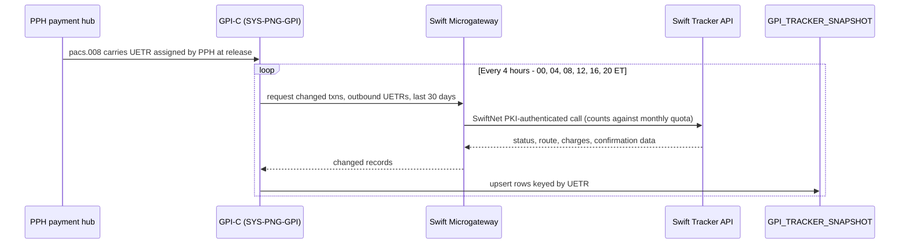

## Overview

The gpi Tracker Batch Snapshot Feed is the only integration Crestline National Bank has with the Swift gpi Tracker API today. It is a scheduled, batch pull performed by the **Swift Alliance & gpi Connector (GPI-C)**, the gpi-facing module of the Payment Network Gateway (system id `SYS-PNG-GPI`, owned by Payment Networks Engineering / PNE). GPI-C calls the Swift Tracker API through the **Swift Microgateway**, authenticating with SwiftNet PKI credentials bound to the GPI-C service account, and upserts the results into the Oracle table [GPI_TRACKER_SNAPSHOT](../datasets/gpi-tracker-snapshot.md).

There is no streaming or webhook connection to Swift for gpi status, and no per-payment, on-demand lookup path for outbound wires. Every status GPI-C knows about was obtained by one of these scheduled batch calls (or, for Operations, an ad-hoc manual lookup counted against the same quota). This batch design, and the quota headroom behind it, is documented in PNG-TDD-6.0 section 3.2-3.3 and carried forward unchanged by Addendum A (PNG-1544).

## Entrypoint and schedule

GPI-C runs the batch pull six times a day, at a fixed schedule:

- **00:00, 04:00, 08:00, 12:00, 16:00, 20:00 ET** - every 4 hours.

Each run requests **changed payment transactions for outbound UETRs released in the last 30 days** from the Swift Tracker API, and **upserts** the results into `GPI_TRACKER_SNAPSHOT`, keyed by UETR. Because the feed is a rolling 30-day window upsert rather than a full history pull, a payment's tracking record keeps refreshing on every run until either it reaches a terminal state or it ages out of the 30-day lookback.

The fixed 4-hourly batch cycle: each run is a bounded, quota-metered call to the Swift Tracker API, not a per-payment lookup.

## What the feed writes

Each upsert into `GPI_TRACKER_SNAPSHOT` populates, per UETR: `LAST_STATUS` / `LAST_REASON` (the gpi ACSP/ACCC/RJCT status and G000-G004 or ISO reject reason code), `ROUTE_JSON` (the ordered agent chain with BIC, name, country, and received/forwarded timestamps), `DEDUCTED_CHARGES_JSON` (per-agent deducted charges when reported), `CONFIRMED_AMOUNT` / `CREDIT_TS` (populated once a payment reaches terminal `ACCC`), and `SNAPSHOT_TS` (when GPI-C captured that update, not when the underlying Swift event occurred). Full column semantics and the gpi status/reason table live in [GPI_TRACKER_SNAPSHOT](../datasets/gpi-tracker-snapshot.md).

## Why this interface is batch, not real-time

### The Swift Tracker API quota

The Swift Tracker API contract permits **250,000 calls per month** (renewal 2027-01-31). At the time of the PNG-1544 review, usage from the existing 4-hourly batch pulls plus Operations' ad-hoc manual lookups already stood at roughly 61% of that quota.

Per-payment status lookups driven directly from client channels were estimated at **~1.9 million calls/month** (based on roughly 2,900 outbound international wires per day with repeated client views over the life of a payment). That volume **would exceed the contracted monthly quota by roughly 7x**. This estimate, from PNG-TDD-6.0 section 3.3, is the core reason the integration is designed as a scheduled batch pull against a shared table rather than a per-payment, on-demand call pattern: a single client-facing "check status" action fanning out to a direct Swift Tracker API call does not scale within the contracted quota, no matter how the call is triggered.

The stated architectural consequence is that **any real-time gpi design must use a change-feed with internal fan-out rather than per-payment calls** to the Swift Tracker API - i.e., consumers should be served from an internally maintained feed/cache (ultimately sourced from a single quota-metered poller like GPI-C), not by each consumer or channel independently calling Swift per payment.

### No internal API for gpi status

As of this design, **there is no internal API that serves gpi status**. The only two consumers reading `GPI_TRACKER_SNAPSHOT` are:

- **Payment Operations' Investigations Workbench (IWB)** - operational investigation, reading the snapshot directly.
- **TDIP's nightly load** - into the downstream dataset [GPI_TRACKER_EVENTS](../datasets/gpi-tracker-events.md).

`GPI_TRACKER_SNAPSHOT` **must not be exposed directly to channels**. This was reaffirmed by the Payments Architecture Review Board on 2026-09-08: an interim proposal to expose the snapshot table directly to channel systems was **not approved**, and the board noted that even a read-only, quota-isolated service built for that purpose would itself require ARB review before being built. A client-facing gpi capability therefore requires a dedicated service with its own SLA, entitlement checks, and quota management - not direct reads against this batch-fed table, and not ad hoc per-payment calls to Swift on a channel's behalf.

## PNG-1544: the declined 2-hour frequency change

In 2026, Payment Networks Engineering raised **PNG-1544**, a request to double the batch pull frequency from every 4 hours to every 2 hours, primarily to shrink the staleness window for gpi milestones (median release-to-`ACCC` was measured at 2h41m in Q3-2025, so a 4-hour cadence can miss a wire's terminal status for a full cycle).

The request was **declined** ("Won't Do", 2026-03-03), recorded as **Addendum A** to PNG-TDD-6.0. The decisive factor was not the modest incremental cost of halving the batch interval by itself, but that a faster poll does nothing to address the real demand behind the request (client-facing wire status visibility) and does not scale toward that use case: per-payment lookups from channels, at ~1.9 million calls/month, would still exceed the 250,000/month contracted quota by ~7x regardless of batch cadence. The addendum recommended that any real-time or near-real-time gpi capability instead be built as a **change-feed-based internal service** with internal fan-out, which was carried forward as project [GTSI-0107, gpi Tracker Real-Time Service](../projects/gtsi-0107-gpi-real-time-service.md). Full decision detail, consequences, and ownership transfer are in [PNG-1544](../decisions/png-1544.md).

As a direct result of this decision, the gpi Tracker Batch Snapshot Feed described on this page continues to run unchanged at its original 4-hour cadence.

## Operational notes

- **Quota is shared**: GPI-C's scheduled batch calls and Payment Operations' ad-hoc manual Tracker lookups draw from the same 250,000-calls/month contract, so both must be accounted for when evaluating any change to this feed's frequency or scope.
- **Lookback window**: each run only requests changes for outbound UETRs released in the last 30 days; older, already-terminal payments are not re-polled.
- **Monitoring**: Splunk dashboards `PNG-GPI-*` cover this connector, alongside `PNG-FFC-*` for the sibling Fedwire Funds Connector module.
- **Change windows**: Saturday 22:00-02:00 ET, consistent with the rest of the Payment Network Gateway.

## Related pages

- [GPI_TRACKER_SNAPSHOT](../datasets/gpi-tracker-snapshot.md) - the Oracle table this feed writes, with full column and status-code reference.
- [PNG-1544: gpi Batch Frequency Increase Declined](../decisions/png-1544.md) - the decision record for the declined 2-hour cadence change.
- [gpi Tracker Real-Time Service (GTSI-0107)](../projects/gtsi-0107-gpi-real-time-service.md) - the change-feed-based service recommended in place of a faster batch poll.
- [System: Swift gpi Connector](../systems/swift-gpi-connector.md) - the GPI-C module (`SYS-PNG-GPI`) that runs this feed.
</content>
