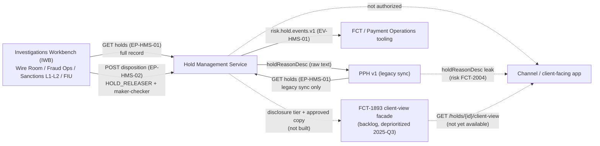

## Overview

The Hold Management Service (HMS) exposes two REST endpoints and one Kafka event topic for working payment holds. All three are **internal-only**: they are scoped to Financial Crimes Technology (FCT) tooling, Payment Operations tooling, and one narrowly justified legacy sync. No channel, client-facing application, or external caller is an authorized consumer of any of them today. This page documents the three interfaces, who may call them, and the deprioritized proposal (FCT-1893) that would eventually give channels a compliant, read-only view of hold status.

HMS itself — its lifecycle, hold reason taxonomy, and data handling — is documented in [Hold Management Service](../systems/hold-management-service.md); the confidentiality rule that keeps raw hold detail out of client-facing systems is [ADR-PAY-021](../decisions/adr-pay-021.md), and the disclosure-tier definitions referenced by these interfaces come from [POL-FCC-014](../policies/pol-fcc-014.md).

## Interface inventory

| ID | Interface | Protocol | Authorized callers | Notes |
|---|---|---|---|---|
| EP-HMS-01 | `GET /prsp/hms/v1/holds?paymentId=` | REST | Investigations Workbench (IWB); PPH (legacy sync only) | Returns `hrcCode`, `category`, `description`, `analystNotes`, `slaDueTs` |
| EP-HMS-02 | `POST /prsp/hms/v1/holds/{holdId}/disposition` | REST | Investigations Workbench (IWB) only | Requires role `HOLD_RELEASER`; maker-checker per `CTRL-PAY-012` |
| EV-HMS-01 | `risk.hold.events.v1` | Kafka event topic | FCT and Payment Operations tooling only | Restricted; channel applications are not authorized consumers |

There is **no client-facing hold interface today**. No endpoint, event, or facade in production lets a channel application or an end client query hold detail, hold reason, or even disclosure-safe status directly from HMS.

## EP-HMS-01 — `GET /prsp/hms/v1/holds?paymentId=`

Looks up the hold(s) associated with a `paymentId` and returns the full internal hold record: `hrcCode` (one of the twelve hold reason codes, e.g. `HRC-07 FRAUD_MODEL_HIGH`), `category`, free-text `description`, `analystNotes`, and `slaDueTs`. `description` and `analystNotes` are classified Restricted — they are generated from rule templates and routinely contain sensitive detail such as `"FRAUD_MODEL_HIGH sc=9xx L1 queue"` or `"SANCTIONS_REVIEW name match 0.91 L2"`.

Two callers are authorized:

- **Investigations Workbench (IWB)** — the primary consumer; analysts in Wire Room, Fraud Ops, Sanctions L1/L2, and the FIU work hold queues through IWB, which needs the full record (including restricted fields) for casework.
- **PPH, via its legacy description sync only** — PRISM Payments Hub's v1 adapter reads this endpoint to populate the `holdReasonDesc` field it exposes on wire status responses. This sync predates [ADR-PAY-021](../decisions/adr-pay-021.md) and is retained solely as a time-boxed backward-compatibility exception for PPH v1; it is not extended to PPH v2. The sync's effect — leaking HMS free-text (including possible HRC mnemonics and analyst notes) through `holdReasonDesc` to whatever reads PPH v1 — is tracked as open risk **FCT-2004**, pending remediation (stop the sync, or redact at the API gateway) or mooted by the PPH v1 sunset (2027-03-31, no extensions per the 2026-09-08 ARB decision).

No other caller — including any channel, BFF, or client-facing service — is authorized against EP-HMS-01.

## EP-HMS-02 — `POST /prsp/hms/v1/holds/{holdId}/disposition`

Records a disposition (release or reject) against a hold. This is the only interface that changes hold state: a `RELEASED` disposition lets PPH resume processing the held payment, and a `REJECTED` disposition causes PPH to cancel it.

- **Caller: Investigations Workbench (IWB) only.** No legacy sync, batch job, or other system is authorized to call this endpoint.
- **Authorization:** the calling user must hold the `HOLD_RELEASER` role.
- **Control:** dispositions require maker-checker under `CTRL-PAY-012` — the user who proposes a release/reject cannot be the same user who approves it.

EP-HMS-02 is the enforcement point for several related controls documented on [Hold Management Service](../systems/hold-management-service.md): callback verification for `HRC-02` (`CTRL-PAY-018`, requiring an independently-sourced phone contact rather than confirmation through the initiating channel), and the digital-attestation carve-out for `HRC-01` duplicate-suspect holds (`CTRL-PAY-031`, introduced after pilot FCT-1951, capped at $5,000,000 and requiring step-up authentication; above that threshold or for any other HRC code, Wire Room release via IWB is still required).

## EV-HMS-01 — `risk.hold.events.v1`

A Kafka topic carrying hold lifecycle events (creation, state transitions, disposition) with the same level of hold detail as EP-HMS-01. It is restricted to **FCT and Payment Operations tooling**. Channel applications are explicitly **not** authorized consumers of this topic — this is an event-streaming-layer restatement of the same confidentiality boundary enforced at the API layer by EP-HMS-01's caller list and by [ADR-PAY-021](../decisions/adr-pay-021.md), which separately requires that payment lifecycle events visible to channels (e.g. `pay.wire.lifecycle.v2`) carry only hold presence and `holdId`, never hold reason detail.

## Access model

*Who may call HMS's hold interfaces today: IWB and PPH's legacy sync only; channels have no authorized path, aside from the tracked FCT-2004 leak through PPH v1, and the client-safe facade (FCT-1893) remains unbuilt.*

## FCT-1893 — Client-Safe Hold Status Facade (deprioritized)

**There is no client-facing hold interface today.** The only proposed remediation is **FCT-1893**, a 21-point story (`GET /prsp/hms/v1/holds/{holdId}/client-view`) that would let a channel retrieve, for a given hold, only:

- the disclosure tier (P/C/G/R, as defined in [POL-FCC-014](../policies/pol-fcc-014.md));
- an approved copy key (pre-written, FCC-approved client-facing text, not raw HRC descriptions); and
- permitted client actions.

It would never return the HRC code, free-text `description`, `analystNotes`, or Sentinel/SanctionScreen scoring detail. A corresponding client attestation endpoint (for clients to self-resolve a hold, e.g. confirming they intended a duplicate-looking wire) does not exist either; the only attestation path in production is the `HRC-01`-only, phone/digital-channel pilot governed by `CTRL-PAY-031`.

FCT-1893 is **backlog, deprioritized in 2025-Q3** — product owner Daniel Kowalski's team recorded "no channel consumer committed; revisit when a client-facing hold experience is funded." It has no assigned sprint or delivery date. Until it (or a successor) ships, channels have no compliant way to tell a client anything beyond "payment is held" (via hold presence / `holdId` on PPH v2 and lifecycle events), and must route clients to Payment Operations or the FIU for anything more specific.

## Failure modes and known gaps

- **FCT-2004 (open risk):** PPH v1's `holdReasonDesc`, fed by the pre-ADR-PAY-021 HMS-to-PPH sync via EP-HMS-01, exposes HMS free-text — potentially including HRC mnemonics and analyst notes — to whatever consumes PPH v1. Observed sample values from UAT include strings like `"FRAUD_MODEL_HIGH sc=9xx L1 queue"` and `"SANCTIONS_REVIEW name match 0.91 L2"`. Remediation options under consideration are stopping the sync or redacting at the API gateway; the PPH v1 sunset (2027-03-31, no extensions) may moot the issue by retiring the field entirely.
- **CBO-4388 (wire-center UX, in progress):** the Wire Center UI began surfacing `holdReasonDesc` directly as a client-visible tooltip (truncated at 120 characters, falling back to "Under review") on 'Pending Review' wires, behind feature flag `WC_HOLD_TOOLTIP`. This is downstream of the same PPH v1 field implicated by FCT-2004, not a new authorized HMS interface — it consumes PPH v1, not HMS directly — but it is a concrete instance of the leak the risk describes reaching an actual client-facing surface.
- **`CTRL-PAY-040`:** no client-facing estimate of release time may be given for holds in disclosure tiers G or R, even though HMS tracks median time-to-disposition internally (e.g., `HRC-01` ~47 min, `HRC-09` ~3h20m, `HRC-10` 1–5 business days). This constrains what any future client-view facade (FCT-1893 or a successor) could ever return, independent of whether it is built.
- **No entity-level or hold-specific event subscription exists yet.** The related initiative ENS-1120 (planned, 2027-H1) would let a consumer subscribe to events for a specific `paymentId`/`caseId`, but as scoped it is a general payment-events initiative, not a channel-authorized path into `risk.hold.events.v1`, which remains FCT/Ops-only regardless of subscription granularity.

## Operational notes

- EP-HMS-02 dispositions are irreversible in effect: `RELEASED` lets PPH resume processing and `REJECTED` causes PPH to cancel the payment, so the maker-checker control (`CTRL-PAY-012`) and `HOLD_RELEASER` role gate are the primary safeguards against erroneous or unauthorized release/reject actions.
- Because EP-HMS-01 is the single read path for both IWB casework and the PPH v1 legacy sync, any change to its response shape (e.g., removing `description`/`analystNotes` to close FCT-2004) must be coordinated with both consumers; removing fields outright would break IWB's casework workflow, so remediation favors redaction at the gateway or stopping the sync rather than altering the endpoint's authorized (IWB-facing) contract.
- Teams considering a new consumer of any of these three interfaces should treat "channel" or "client-facing" as an automatic disqualifier absent a shipped, FCC-reviewed facade; the only sanctioned route for client-facing hold information is the not-yet-built FCT-1893 facade or a successor explicitly scoped and approved for that purpose.
