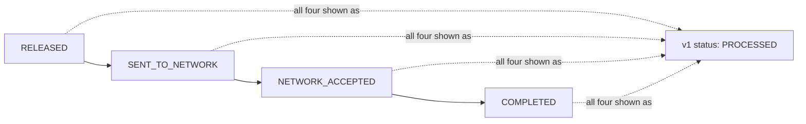

## Overview

PPH v1 is PRISM Payments Hub's original REST surface for wire submission, listing, and status lookup. It predates PPH's v2 payments API and the `pay.wire.lifecycle.v2` event topic, and it is the subject of a published deprecation notice: **sunset 2027-03-31, no extensions**, confirmed by the Payments Architecture Review Board (ARB) on 2026-09-08. The v1 adapter is not supported on the vendor's Volaris 9.6 upgrade (scheduled April 2027), which is the hard technical deadline behind the sunset date.

Three endpoints make up v1. [Crestline Business Online (CBO) Wire Center](../systems/cbo-wire-center.md) is, as of the last architecture review (2026-08-20), the only major v1 consumer that has **not started** migrating to [PPH v2](pph-v2-payments-api.md), making this page primarily a Wire Center dependency record as well as a general v1 reference.

## Endpoint inventory (EP-PPH-01/02/03)

| ID | Method / path | Purpose | Limits | Status |
|---|---|---|---|---|
| EP-PPH-01 | `GET /pph/v1/wires/{wireRef}/status` | Coarse status for one wire | 20 TPS shared across all v1 consumers | deprecated, sunset 2027-03-31 |
| EP-PPH-02 | `GET /pph/v1/wires?clientId&fromDate&toDate` | List wires | Max 500 rows; no cursor | deprecated, sunset 2027-03-31 |
| EP-PPH-03 | `POST /pph/v1/wires` | Submit approved wire | - | deprecated, sunset 2027-03-31 |

The 20 TPS shared limit on EP-PPH-01 is not an arbitrary throttle: it was imposed in June 2024, after incident INC-2024-1182, in which a Wire Center pilot ("Wire Status Lite", CBO-3120) auto-refreshed visible wire status every 30 seconds and drove ~85 TPS against this same endpoint at month-end, exhausting PPH's API thread pool and delaying wire release by 47 minutes. See [ADR-PAY-019](../decisions/adr-pay-019.md) for the resulting event-driven-status policy and the throttled-refresh exception that still governs how Wire Center is allowed to call EP-PPH-01 today.

## EP-PPH-01 response shape

```json
{
  "wireRef": "PPH26092400481233",
  "status": "HELD",            // RECEIVED | PENDING | HELD | PROCESSED | REJECTED | CANCELLED | RETURNED
  "statusTs": "2026-09-24T14:12:09-04:00",
  "holdFlag": true,
  "holdReasonDesc": "<string, max 255>",
  "fedRef": "20260924QMGFT015000123"     // IMAD; null for Swift wires
}
```

| Field | Description |
|---|---|
| `status` | One of seven coarse values. `PROCESSED` is a collapse of four distinct v2 lifecycle states (see below). |
| `holdReasonDesc` | Free-text hold description synchronized from the Hold Management Service (HMS), present in v1 since 2019. Content is not curated for external display and **must not be displayed by consumers** (FCT-2004, see below). Not present in v2 ([ADR-PAY-021](../decisions/adr-pay-021.md)). |
| `fedRef` | Fedwire IMAD only. OMAD and UETR are not available in v1 — a channel needing the authoritative Fed settlement reference or end-to-end tracking id cannot get it from this API. |

## The PROCESSED collapse

`status: "PROCESSED"` is not one canonical lifecycle state: it is v1's single label for four distinct underlying v2 states — `RELEASED`, `SENT_TO_NETWORK`, `NETWORK_ACCEPTED`, and `COMPLETED`. A v1 consumer cannot distinguish "the wire has merely been released for transmission" from "the network has acknowledged it" from "accounting close has happened at end of day." This is an intentional simplification carried over from PPH's original design, not a bug, but it has real consequences downstream:

- The 2024 Wire Status Lite pilot found that 37% of surveyed users believed "Processed" meant the beneficiary had received the funds — it does not; `NETWORK_ACCEPTED` on Fedwire means the Federal Reserve has settled the payment order, which is final and irrevocable interbank settlement but does **not** confirm credit to the beneficiary's account, and on Swift it means only that the message was accepted for delivery to the next agent, with no settlement implication at all.
- CBO Wire Center's R26.1 release (CBO-4402) renamed the client-facing label from "Processed" to "Completed" in response to this confusion, but the underlying ambiguity in the v1 field itself was not resolved by the relabel — "Completed" still maps to the same four-state collapse.
- An open complaint (CMP-2026-1189) involves a client who relied on a "Completed" status for an international wire that was later rejected (ISO return reason AC04), and who is seeking clarity on what "Completed" actually represents.
- Consumers that need to distinguish these states (e.g., to tell "sent" from "Fed-acknowledged") must move to [PPH v2](pph-v2-payments-api.md)'s `lifecycleState` field or the `pay.wire.lifecycle.v2` Kafka topic, neither of which collapses these states.


*v1's `PROCESSED` status collapses four distinct v2 lifecycle states into one undifferentiated value.*

## FCT-2004: holdReasonDesc leaks HMS free-text

`holdReasonDesc` is populated by a legacy, always-on sync from HMS into PPH, predating PPH v1 itself (active since 2019) and predating [ADR-PAY-021](../decisions/adr-pay-021.md) (Hold Reason Confidentiality), the architecture decision that otherwise bars raw hold detail from leaving HMS toward channels or data platforms. HMS's underlying `description` and `analystNotes` fields are classified Restricted and routinely contain sensitive content such as `"FRAUD_MODEL_HIGH sc=9xx L1 queue"` or `"SANCTIONS_REVIEW name match 0.91 L2"` — HRC mnemonics and analyst casework notes, not client-safe copy.

This is tracked as open risk **FCT-2004** (owner: Daniel Kowalski, FCT security review, raised 2026-05): any consumer of PPH v1 can read `holdReasonDesc` and, if it renders the field, would expose this internal text to end users or support staff. **Consumers of PPH v1 must not display `holdReasonDesc`.** Remediation options under consideration are stopping the HMS-to-PPH sync or redacting the field at the API gateway; neither has shipped, and the PPH v1 sunset (2027-03-31) may moot the issue by retiring the field entirely rather than remediating it. This exception is retained only for v1 backward compatibility — `holdReasonDesc` has no v2 equivalent and is not carried into `pay.wire.lifecycle.v2` (hold reasons are not published on PPH topics; only hold presence and `holdId` are visible to channels in v2).

Today, CBO Wire Center does not display `holdReasonDesc`: held wires show the generic client-facing label "Pending Review" with fixed text "This wire is being reviewed." However, CBO-4388 (in progress) has begun surfacing `holdReasonDesc` directly as a client-visible tooltip (truncated at 120 characters, falling back to "Under review") behind feature flag `WC_HOLD_TOOLTIP` — a concrete instance of the FCT-2004 leak reaching an actual client-facing surface. Full detail on the HMS side of this sync, including the authorized-caller model and the unbuilt client-safe facade proposal (FCT-1893), is on [HMS Hold API & Hold Events](hms-hold-api.md).

## Status and label mapping

| PPH v1 `status` | CBO Wire Center label | Since |
|---|---|---|
| (pre-submission, CBO-owned) | Draft / Pending Approval / Approved | R21 |
| `RECEIVED` | Submitted | R21 |
| `PENDING` | In Process | R21 |
| `HELD` | Pending Review | R22 |
| `PROCESSED` | Completed (was "Processed" before R26.1 / CBO-4402) | R26.1 |
| `REJECTED` | Rejected | R21 |
| `CANCELLED` | Cancelled | R21 |
| `RETURNED` | Returned | R23 |

## Rate limits, caching, and the no-polling constraint

EP-PPH-01 is rate-limited to 20 TPS shared across *all* v1 consumers, not per-consumer — a single caller sending unthrottled traffic can starve every other v1 consumer, which is exactly what happened in INC-2024-1182. Per [ADR-PAY-019](../decisions/adr-pay-019.md), channel teams must not poll this endpoint; synchronous status calls are permitted only for user-initiated refresh. CBO Wire Center's `cbo-wire-bff` enforces this with a 60-second server-side cache and a refresh throttle of 1 call per 60 seconds per wire. EP-PPH-02 has no comparable rate limit documented but is capped at 500 rows per response with no cursor, so large activity-list queries must be paginated by the caller's own date-range slicing; Wire Center applies its filters client-side after retrieval (CBO-4302). EP-PPH-03 (submission) carries no documented rate limit or idempotency mechanism — notably, unlike PPH v2's `POST /pph/v2/payments` (EP-PPH-07), it does not require an `Idempotency-Key` header.

v1 REST overall is published at 99.9% availability with p95 latency of 350 ms, and is designated "best effort" support until sunset — a materially lower service commitment than v2 REST (99.95% / 180 ms / T1 support).

## Consumer migration status (PPH-2190)

| v1 consumer | Owner | Migration status | Notes |
|---|---|---|---|
| IVR wire status | Contact Center Tech | Migrated (2026-05) | - |
| Service Center CRM | CRM Engineering | In progress (target 2026-12) | - |
| `cbo-wire-bff` (Wire Center) | CBO Wire Center squad | Not started | Tracked as CBO-4471 (34 pts, unscheduled) |
| Wire Room console | Payment Operations Tech | Migrated to Investigations Workbench (IWB) (2025) | - |

Migration tracking as a whole is [PPH-2190](../projects/pph-2190-v1-sunset-migration.md). Wire Center's migration (CBO-4471) additionally depends on CBO-4473 (mapping CES account-level entitlement filtering onto v2's search semantics), since PPH v2 search (EP-PPH-05) filters by `clientId` only and has no beneficiary-name filter (PPH-2251, backlog) — matching v1's client-side filtering behavior is not a drop-in replacement.

```mermaid
flowchart LR
    WireCenterMFE["Wire Center MFE"] --> BFF["cbo-wire-bff"]
    BFF -- "EP-PPH-03 submit" --> PPHv1["PPH v1 REST\n(deprecated, sunset 2027-03-31)"]
    BFF -- "EP-PPH-02 list" --> PPHv1
    BFF -- "EP-PPH-01 status\n(throttled 1/60s per wire)" --> PPHv1
    PPHv1 -- "holdReasonDesc\n(FCT-2004 leak risk)" -.-> BFF
```
*Wire Center's current-state dependency on PPH v1; no other major consumer still calls all three endpoints unmigrated.*

## Relationship to v2 and to event-driven status

v1 has no event-topic equivalent: hold reasons, settlement detail, OMAD, and UETR are either absent from v1 entirely or only available via [PPH v2](pph-v2-payments-api.md) (`GET /pph/v2/payments/{paymentId}`, EP-PPH-04) or the `pay.wire.lifecycle.v2` Kafka topic. Any channel capability that needs finer-grained status than v1's seven coarse values, or needs to avoid the `holdReasonDesc` leak, requires migrating off v1 — there is no way to request only "safe" fields from v1 while retaining its existing shape, since the catalog defines no v1 field-level access control.

## Related

- [PPH v2 Payments API](pph-v2-payments-api.md) - the replacement REST surface (GA 2025-10) that v1 consumers must migrate to.
- [PPH 2190: v1 Sunset Migration](../projects/pph-2190-v1-sunset-migration.md) - the consumer migration tracking project referenced above.
- [Crestline Business Online Wire Center](../systems/cbo-wire-center.md) - the only major v1 consumer with migration not started, and the system whose current-state architecture documents these endpoints' usage in detail.
- [ADR-PAY-019: Event-Driven Channel Status (No Polling)](../decisions/adr-pay-019.md) - the policy constraining how v1's status endpoint may be called, following INC-2024-1182.
- [ADR-PAY-021: Hold Reason Confidentiality](../decisions/adr-pay-021.md) - the decision that `holdReasonDesc`'s legacy sync is a documented, time-boxed exception to.
- [HMS Hold API & Hold Events](hms-hold-api.md) - the HMS-side view of the sync that feeds `holdReasonDesc` and the FCT-2004 risk.
