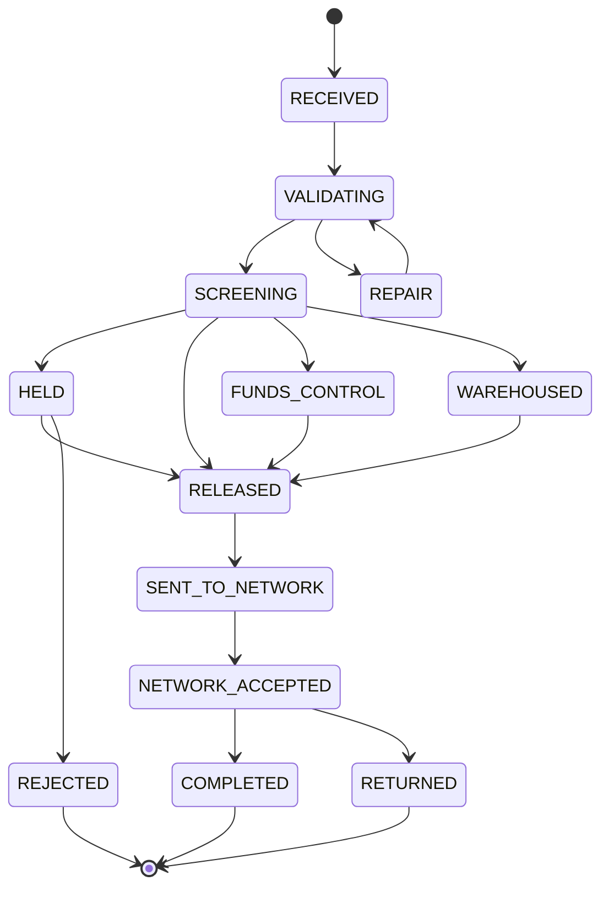

## Overview

The **PPH v2 Payments API** is the current, generally-available REST surface
that PRISM Payments Hub (PPH) — Crestline National Bank's payments system of
record — exposes for reading and submitting payments. It reached GA in
**2025-10** and is the sanctioned replacement for the deprecated
[PPH v1 Wire Status API](pph-v1-wire-status-api.md), which sunsets on
**2027-03-31 with no extensions** (confirmed by the Payments Architecture
Review Board, ARB, on 2026-09-08). This page documents the four v2 endpoints
(EP-PPH-04..07), the shape and semantics of the payment-detail payload, and
the two product-backlog gaps consumers most often ask about: the missing
settlement object (PPH-2207) and the missing beneficiary-name search filter
(PPH-2251).

v2 is one part of a larger payments integration surface documented
separately: see the related [pay.wire.lifecycle.v2](../decisions/adr-pay-017.md)
Kafka topic for event-driven status (no-polling, per
[ADR-PAY-019](../decisions/adr-pay-019.md)), and the
[CBO-4471 v1-to-v2 migration project](../projects/cbo-4471-pph-v1-to-v2-migration.md)
for the one CNB channel BFF still unmigrated from v1.

## Endpoint inventory (EP-PPH-04..07)

| ID | Method / path | Purpose | Limits / notes |
|---|---|---|---|
| EP-PPH-04 | `GET /pph/v2/payments/{paymentId}` | Payment detail including `lifecycleState`, identifiers, network, hold, charges | 150 TPS |
| EP-PPH-05 | `GET /pph/v2/payments?clientId&rail&state&from&to&cursor` | Search | Filters by `clientId` (not account); no beneficiary-name filter (PPH-2251) |
| EP-PPH-06 | `GET /pph/v2/payments/{paymentId}/history` | State history | Timestamps are PPH processing time, not network/settlement time |
| EP-PPH-07 | `POST /pph/v2/payments` | Submit payment | `Idempotency-Key` header required |

These four endpoints replace the three deprecated v1 endpoints
(`EP-PPH-01` status, `EP-PPH-02` list, `EP-PPH-03` submit); v2 adds a
dedicated state-history endpoint (EP-PPH-06) with no v1 equivalent, and
EP-PPH-07 requires an `Idempotency-Key` header that v1's submit endpoint
(`EP-PPH-03`) did not.

## EP-PPH-04 response shape

`GET /pph/v2/payments/{paymentId}` returns a payment-detail document built
around five sub-objects — `identifiers`, `network`, `hold`, `charges`, and
`return` — anchored by a top-level `lifecycleState`:

```json
{
  "paymentId": "PPH26092400481233",
  "rail": "FEDWIRE",              // FEDWIRE | SWIFT | BOOK
  "lifecycleState": "NETWORK_ACCEPTED",
  "identifiers": {
    "cboRef": "CBW-20260924-004812",
    "imad": "...",
    "omad": "...",
    "uetr": "8f0c1b52-4d1e-4b0a-9e43-2b6c1f4f7a10",
    "endToEndId": "INV-77812"
  },
  "network": { "sentTs": "...", "gateway": "FFC" },
  "hold": { "isHeld": false, "holdId": null },
  "charges": {
    "chargeBearer": "SHAR",
    "orderingBankFee": { "amount": 30.00, "ccy": "USD" }
  },
  "return": { "isoReason": null, "returnedTs": null }
}
```

### `lifecycleState`

`lifecycleState` is v2's single field for where a payment stands, replacing
v1's coarser `status` enum (`RECEIVED | PENDING | HELD | PROCESSED | REJECTED
| CANCELLED | RETURNED`), in which `PROCESSED` collapsed several distinct
v2 states (`RELEASED`, `SENT_TO_NETWORK`, `NETWORK_ACCEPTED`, `COMPLETED`)
into one value. v2 exposes those states individually, giving consumers
finer-grained visibility into network-acceptance versus completion without
having to infer it from timestamps.

### `identifiers`: rail-aware identifier set

v2's `identifiers` object is materially richer than v1's single `fedRef`
field, and the richer set is a primary reason channels migrate:

| Field | Available in v1? | Notes |
|---|---|---|
| `cboRef` | — (channel-specific) | CBO-assigned reference |
| `imad` | Yes, as `fedRef` | Fedwire sender reference; `null` for Swift wires in v1 |
| `omad` | **No** | Federal Reserve's acceptance reference (pacs.002); only on v2 and `net.fedwire.ack.v1` — see [IMAD and OMAD](../concepts/imad-omad.md) |
| `uetr` | **No** | Rail-agnostic correlation id, assigned by PPH at release for every outbound wire per [ADR-PAY-023](../decisions/adr-pay-023.md) — see [UETR](../concepts/uetr.md) |
| `endToEndId` | — | Caller-supplied end-to-end reference |

Because UETR and OMAD exist only in v2 (and in v2 lifecycle events), any
consumer still integrated only against v1 cannot correlate a payment with
Swift gpi tracking data or confirm Federal Reserve acceptance — it must
migrate to obtain either identifier.

### `hold`: presence only, never a reason

v2's `hold` object exposes exactly two fields: `isHeld` (boolean) and
`holdId`. It deliberately carries **no hold reason, description, score, or
analyst note** — this is a direct consequence of
[ADR-PAY-021](../decisions/adr-pay-021.md) (Hold Reason Confidentiality),
which restricts that detail to Financial Crimes Technology systems (the Hold
Management Service and the broader Payment Risk & Screening Platform) and
permits PPH v2 and payment lifecycle events to surface presence and
`holdId` only. This is a deliberate behavioral difference from legacy v1,
whose `holdReasonDesc` field synced free-text hold descriptions from HMS as a
documented, time-boxed exception (tracked as risk FCT-2004) that is not
extended to v2 and will be retired at v1 sunset. A consumer that needs to
explain a hold to a client cannot do so from v2 data alone; no compliant
client-facing hold-explanation facade exists in production today (see
[HMS Hold API & Hold Events](hms-hold-api.md)).

### `charges`

`charges.chargeBearer` and `charges.orderingBankFee` describe only the fee
PPH itself knows about — the ordering bank's own fee. Intermediary or
beneficiary bank charges are not known to PPH and are not present anywhere
in the v2 payload.

### `return`

`return.isoReason` and `return.returnedTs` are populated when a payment is
returned. ISO pacs.004 return-reason codes (e.g. `AC04`, `AC01`, `RR05`) have
also been published on the `pay.wire.lifecycle.v2` Kafka topic since 2026-08
(PPH-2266) — hold reasons are not published on any PPH topic, consistent
with ADR-PAY-021.

## EP-PPH-05 search limits

Search filters by `clientId`, `rail`, `state`, and a `from`/`to` date range,
paginated with `cursor`. Two limitations matter for integration planning:

- **No account-level filter.** Search is scoped to `clientId`, not to an
  individual account, so a consumer needing account-level results must
  filter client-side after retrieval.
- **No beneficiary-name filter.** This is the open backlog item PPH-2251
  (see below) — search cannot be indexed or filtered by beneficiary name
  today.

## EP-PPH-07 submission semantics

`POST /pph/v2/payments` requires an `Idempotency-Key` header on every
request, letting callers safely retry a submission without risking a
duplicate payment. This is a hard requirement, not a recommendation; v1's
equivalent submit endpoint (`EP-PPH-03`) carried no such requirement.

## Lifecycle and state model



*UETR is minted only at the `RELEASED` transition; a payment in any earlier
state has no `identifiers.uetr` value. EP-PPH-06 returns the full sequence of
these transitions with PPH processing timestamps for a given `paymentId`.*

## Service levels

| Interface | Availability | Latency (p95) | Support |
|---|---|---|---|
| v2 REST (EP-PPH-04..07) | 99.95% | 180 ms | T1 |
| `pay.wire.lifecycle.v2` | 99.95% | event lag < 2 s | T1 |
| v1 REST (for comparison) | 99.9% | 350 ms | Best effort until sunset |

## Open backlog gaps

Two consumer-relevant gaps are tracked against PPH v2 in PPH-API-CAT-2026.3
section 6:

### PPH-2207 — missing settlement object (no sponsor)

v2 does **not** include a settlement object. There is no field carrying
rail-specific settlement status or the authoritative Federal Reserve
acceptance timestamp (`fedSettlementTs`, which would be sourced from the
pacs.002/OMAD acknowledgment) anywhere in the v2 payment-detail response.
PPH-2207 proposes adding exactly that: a `settlementStatus` keyed by rail
plus `fedSettlementTs` derived from pacs.002/OMAD. It is scoped at **8
points** and is currently **backlog with no assigned product sponsor** —
there is no committed delivery date. Until it ships, a consumer that needs
true settlement finality (as opposed to `lifecycleState: NETWORK_ACCEPTED`,
which only indicates the message was accepted, not that funds are
irrevocably settled) must correlate `identifiers.omad` against the
`net.fedwire.ack.v1` acknowledgment topic itself; see
[IMAD and OMAD](../concepts/imad-omad.md) for why OMAD's presence in v2 (and
absence from v1) is the load-bearing fact here.

### PPH-2251 — missing beneficiary-name search (backlog)

`EP-PPH-05` search can filter by `clientId`, `rail`, `state`, and a date
range, but **not** by beneficiary name — there is no beneficiary-name index
or filter parameter. PPH-2251 tracks adding one. It is in backlog status
(no points or sponsor given in the catalog) with no committed delivery date.
Consumers that need to locate payments by beneficiary today must retrieve
by `clientId`/date range and filter client-side, or maintain their own
beneficiary-name index downstream.

### PPH-2190 — v1 sunset migration tracking (in progress, context only)

Not a v2 gap, but the backlog item that governs the deadline by which v1
consumers must have migrated to this API: PPH-2190 tracks migration status
across the four known v1 consumers (IVR wire status — migrated 2026-05;
Service Center CRM — in progress, target 2026-12; `cbo-wire-bff` / Wire
Center — not started, tracked separately as
[CBO-4471](../projects/cbo-4471-pph-v1-to-v2-migration.md); Wire Room
console — migrated to IWB in 2025). It is listed here because PPH-API-CAT-2026.3
treats it as the deadline driver for completing migration to the API this
page documents.

## Relationship to adjacent decisions and interfaces

- **[ADR-PAY-021](../decisions/adr-pay-021.md)** governs the `hold` object's
  presence-only shape; it is the authoritative source for why v2 will never
  gain a hold-reason field, in contrast to v1's time-boxed
  `holdReasonDesc` exception.
- **[ADR-PAY-023](../decisions/adr-pay-023.md)** governs `identifiers.uetr`:
  v2 (API and lifecycle events) is the *only* supported source for a
  payment's UETR; v1 has no UETR field and will not receive one.
- **[PPH v1 Wire Status API](pph-v1-wire-status-api.md)** is the deprecated
  predecessor this page's API replaces, sunsetting 2027-03-31.
- **[CBO-4471](../projects/cbo-4471-pph-v1-to-v2-migration.md)** is the
  unscheduled migration project for the last major unmigrated v1 consumer,
  `cbo-wire-bff` (Wire Center).
