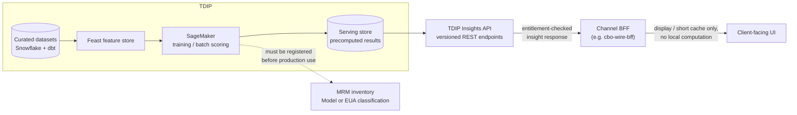
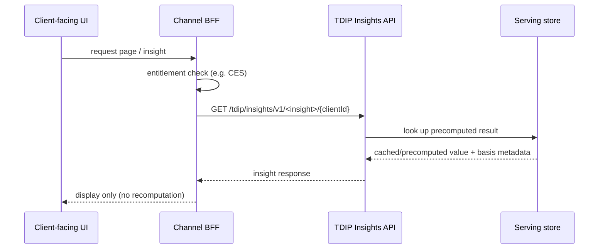

## Overview

The TDIP Insights API is the serving layer of the Treasury Data & Insights
Platform (TDIP) - the payments domain's curated data and modeling platform
(Snowflake, dbt, a Feast feature store, Amazon SageMaker for training and
batch scoring). It publishes precomputed analytical results from a
low-latency serving store behind versioned, entitlement-aware REST
endpoints. It exists specifically to be the *only* sanctioned place from
which client-facing predictions, typical-time statistics, and other
analytical outputs may be served, per
[ADR-PAY-026](../decisions/adr-pay-026.md). Channel backends-for-frontend
(BFFs) call these endpoints and apply their own entitlement checks; they
must not compute analytics locally.

As of the TDIP 2026.2 data catalog, the API has exactly one generally
available endpoint, **EP-TDIP-01** (cash forecast), and no endpoints for
wire-history or corridor insights despite client demand for such features;
see [Treasury Data & Insights Platform](../systems/treasury-data-insights-platform.md)
for the platform that builds and operates it.

## Why this interface exists: ADR-PAY-026

[ADR-PAY-026](../decisions/adr-pay-026.md) (accepted 2026-05-12) mandates
that any forward-looking or statistical value shown to a client must be:

1. **Computed in TDIP** (batch or micro-batch) - never in a channel BFF or
   other channel-owned component.
2. **Served exclusively through versioned TDIP Insights API endpoints.**
   Channel BFFs call these endpoints and perform entitlement checks
   themselves; they may display and briefly cache results but must not
   perform the statistical or predictive computation.
3. **Classified under Model Risk Management before production**, per
   [MRM-POL-02](../policies/mrm-pol-02.md), as either a Model (statistical,
   financial, or ML technique producing a forward-looking estimate - Tier 2
   minimum because all customer-facing estimates are Tier 2 or higher) or an
   End-User Analytic (EUA - simple descriptive calculations such as counts,
   medians, or percentages, needing only registration and business-owner
   attestation).

This closes two gaps the ADR identified: channel BFFs computing their own
analytics would hide model risk from MRM and Enterprise Architecture, and
would duplicate logic while bypassing dataset classification and
aggregation-threshold controls in
[DUS-07](../../sources/estate/dus-07-v2.1-data-use-and-client-confidentiality-standard.md).
The same ARB session that produced ADR-PAY-026 separately declined to
approve direct channel exposure of the raw `GPI_TRACKER_SNAPSHOT` feed,
reinforcing that governed, purpose-built serving endpoints - not raw
payments/treasury data - are the only acceptable path to a channel.

## Serving pattern and request flow

Every Insights API endpoint follows the same shape: TDIP computes results
offline or in micro-batch, publishes them to a low-latency serving store,
and exposes them through a versioned `GET` endpoint. The calling channel BFF
is responsible for authentication of the end user and for entitlement
checks before displaying the result; the Insights API itself is where
analytical computation is centralized and where MRM classification attaches.

## Endpoints

| ID | Endpoint | Status | Backing model / notes |
|---|---|---|---|
| EP-TDIP-01 | `GET /tdip/insights/v1/cash-forecast/{clientId}` | GA since 2025-09 | Model M-TRS-0142; p95 latency 120 ms; this is the reference implementation that new insight endpoints are expected to follow |
| - | Wire-history / corridor insights | **Not available** | No endpoint exists; the only related feature table, `client_wire_history_features`, is an unproductionized prototype with no MRM registration |

EP-TDIP-01 is the only GA endpoint and the pattern other insights are
expected to copy: TDIP-side computation, a versioned REST path scoped to a
single client (`{clientId}`), and entitlement checks left to the caller.
Its backing model, M-TRS-0142 (Treasury Insights cash forecast), was
validated in 2025-09 as a Tier 3 model under the pre-2026-07 MRM tiering,
but the MRM-POL-02 v7.0 re-baseline (effective 2026-07-01) treats all
customer-facing estimates as Tier 2 at minimum; the inventory extract
records M-TRS-0142 as being re-tiered to Tier 2 under this review. Any
channel relying on EP-TDIP-01 should treat its validation status as subject
to this in-flight re-tiering rather than assuming the original Tier 3
validation remains sufficient.

There is no API for wire-level status or corridor statistics. The
`wire_corridor_stats_daily` feature table (currency × destination country ×
day; wire counts, distinct originating clients, same-day ACCC rate, median
hours to ACCC) is Internal-classified and built only for Payment Ops
dashboards, not client display, and is not registered under MRM. The
`client_wire_history_features` prototype (originating client × beneficiary
key: count, median release-to-ACCC, p90, last_seen) is Confidential -
Client classified but not productionized and not MRM-registered. Neither
can be shown to clients today; a channel such as the CBO Wire Center that
wants wire-history or corridor insights must wait for TDIP to build and
classify a new endpoint rather than compute anything locally from these
tables. See [CBO Wire Center](../systems/cbo-wire-center.md), whose BFF
(`cbo-wire-bff`) does not currently call the TDIP Insights API at all and
integrates only with PPH v1, CES, CBO Auth, and ENS.

## Controls that gate every insight

ADR-PAY-026 governs *where* analytics are computed and served; it does not
by itself authorize any specific insight. Each insight must separately
clear:

- **Data use and confidentiality** ([DUS-07](../policies/dus-07.md)):
  - A client's own historical transactions may be used to generate insights
    shown to that same client (e.g. typical time to completion for that
    client's past wires to a beneficiary) only when based on at least 5
    comparable transactions, with the basis (count and period) stated.
  - Aggregated cohort statistics drawn from multiple clients may be shown
    only when the cohort has at least 500 transactions, at least 20
    distinct originating clients, no single client contributing more than
    15% of cohort volume, at least monthly refresh, and Disclosure Review
    Committee (DRC) approval of wording and disclaimers for that measurement
    window. A cohort failing any condition must be suppressed outright, not
    rounded or approximated.
  - Information about one client - including a counterparty's behavior
    after receiving funds - must never be used to generate content shown to
    a *different* client, even presented as a pattern or typical value and
    even if the counterparty is unnamed. This rules out using
    `beneficiary_behavior_profile` (permitted purpose: FCT fraud/mule
    detection only) for any client-facing insight.
- **Model risk classification** ([MRM-POL-02](../policies/mrm-pol-02.md)):
  customer-facing estimates are Tier 2 at minimum and cannot be shown to
  clients before independent validation (typically 10-14 weeks, 160-240
  validator hours, with roughly a 6-week intake queue as of Q4-2026) and
  approved use conditions (disclaimers, monitoring thresholds) are in
  place; EUAs need only registration and business-owner attestation
  (roughly 2 weeks). Financial-crimes models and features - Sentinel fraud
  scores (M-FCT-0021) and beneficiary mule-risk features (M-FCT-0034) - are
  Tier 1 and may never be repurposed for client-facing output.
- **Disclosure Review Committee approval** of client-facing wording and
  disclaimers, meeting bi-weekly with a 5-business-day submission lead time.

## Onboarding a new insight

The TDIP data catalog documents a four-step sequence for bringing a new
insight to an Insights API endpoint, roughly 13-21 story points of
engineering work once governance clears:

1. MRM inventory registration, per MRM-POL-02 (Model or EUA path).
2. Data access approvals, per DUS-07 (Collibra Data Access Request; an
   additional 15 business days if the source dataset is Restricted).
3. Serving endpoint build on the Insights API itself.
4. Disclosure Review Committee approval of client-facing wording and
   disclaimers.

Because MRM Tier 2 validation alone typically takes 10-14 weeks (plus a
roughly 6-week queue before work starts, as of Q4-2026), channel teams
requesting a new client-facing analytic should expect this to dominate lead
time; coverage gaps (such as wire-history insights) block feature launches
rather than being worked around with local computation in a channel BFF.

## Operational characteristics and known gaps

- **Freshness floor.** There is no real-time (sub-minute) serving for wire
  data; minimum freshness across TDIP's payments datasets is hourly, and
  `gpi_tracker_events` refreshes only nightly (05:00 ET) until TDA-2188
  moves it to hourly (targeted 2026-11). Any Insights API endpoint derived
  from these sources inherits that lag.
- **Settlement-time analytics are blocked for domestic wires.** Fed
  acceptance/OMAD timestamps (`net.fedwire.ack.v1`) are not ingested into
  TDIP (tracked as TDA-2210, backlog); endpoints needing true settlement
  time for Fedwire wires cannot be built until this lands.
- **UETR coverage is partial.** `pay_wire_txn_hist.uetr` is populated for
  Swift wires since 2018 but only for Fedwire wires since 2025-10 (per
  ADR-PAY-023), which constrains cross-correlation for any insight spanning
  older domestic wires.
- **Access control for underlying data** is independent of Insights API
  entitlement checks: Collibra governs dataset access, and Restricted
  datasets require Privacy Office approval with a 15-business-day SLA.

## Related

- [ADR-PAY-026](../decisions/adr-pay-026.md) - the decision that mandates
  this serving pattern and prohibits channel BFFs from computing analytics.
- [Treasury Data & Insights Platform](../systems/treasury-data-insights-platform.md) -
  the platform (Snowflake, dbt, Feast, SageMaker) that computes and
  publishes everything the Insights API serves.
- [DUS-07](../policies/dus-07.md) - data use, cross-client confidentiality,
  and aggregation-threshold rules every insight must satisfy.
- [MRM-POL-02](../policies/mrm-pol-02.md) - the Model/EUA classification and
  validation-tier requirements gating production use of any insight.
- [CBO Wire Center](../systems/cbo-wire-center.md) - an example channel
  system that does not yet call the Insights API and would need a new,
  classified endpoint before adding wire-history or corridor features.
