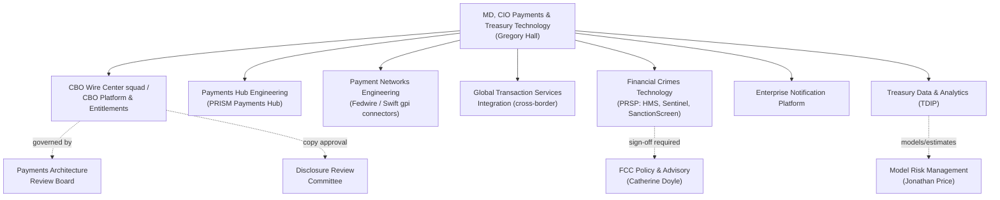

# Crestline National Bank (CNB)

Crestline National Bank (CNB) is the fictional commercial bank whose payments
and treasury systems the estate documents. This page is the top-level entry
point: it summarizes the bank's payments-related lines of business, the
engineering organization that builds them, and the regulatory and policy
basis that constrains what those systems may do — especially what they may
tell clients about the status of a payment. Deeper, system-level detail lives
in the child pages linked throughout.

## Lines of business touching payments

CNB's commercial/treasury business is built around **Crestline Business
Online (CBO)**, the commercial digital banking portal (web and mobile) used
by Treasury Management clients. Within CBO, the **Wire Center** module
provides domestic (Fedwire) and international (Swift) wire initiation,
templates, dual approval, release with step-up authentication, a wire
activity list and confirmation downloads; it currently has no milestone
tracking, international (gpi) status, hold explanations or client actions on
held wires. CBO originates roughly two-thirds of CNB's outgoing wires, with
the remainder coming from host-to-host files, Swift for Corporates, branch
channels and the Ops desk.

Behind the channel layer, **PRISM Payments Hub (PPH)** — built on the vendor
Volaris Payment Platform — is CNB's wire orchestration engine for all
channels and rails (Fedwire, Swift CBPR+, book transfer). PPH intakes
instructions, validates and enriches them, calls the **Payment Risk &
Screening Platform (PRSP)** synchronously for sanctions/fraud screening,
performs funds control against the **Core Deposit Platform (CDP)**, and
routes releases to the Payment Network Gateway for Fedwire or Swift/gpi
delivery. A screening hit or funds shortfall places a payment into a held
state managed by PRSP's Hold Management Service (HMS) rather than exposing
screening detail to the client. These systems, their ownership and their
lifecycle/state model are documented under
[Payments & Treasury Technology](payments-treasury-technology.md).

Treasury Management Products — CBO itself, Wire Center, entitlements and the
broader treasury product suite sold to commercial clients — are owned on the
business side by the EVP, Head of Treasury Management Products, and are
described in [Treasury Management Products](treasury-management-products.md).

## Payments & Treasury Technology (PTT)

PTT is the engineering division that builds and runs CNB's payments and
treasury systems, led by the MD, CIO Payments & Treasury Technology. PTT
groups the engineering teams that own the channel, hub, network and data
layers of the payments estate, plus the first- and second-line partner
functions that must review or approve changes before they reach clients.

### Leadership

| Role | Name | Scope |
|---|---|---|
| MD, CIO Payments & Treasury Technology | Gregory Hall | All PTT engineering: channels, payments hub, networks, data |
| EVP, Head of Treasury Management Products | Danielle Okafor | Business owner, Treasury Management (TM) products incl. Crestline Business Online |
| Director, Digital Treasury Product | Marcus Chen | Product Owner, CBO Wire Center and Payments & Transfers |
| Director, Payments Platform Product | Laura Kim | Product Owner, PRISM Payments Hub; Business Data Owner for payment datasets |
| Chief Architect, Payments & Treasury | Nikhil Bose | Chair, Payments Architecture Review Board (ARB) |
| EVP, Chief BSA/AML Officer | Catherine Doyle | 2nd-line owner of financial-crimes policies incl. POL-FCC-014 |
| Head of Model Risk Management | Jonathan Price | 2nd-line owner of MRM-POL-02 and the model inventory |
| Chief Privacy Officer | Rachel Goldberg | Owner of DUS-07 Data Use & Client Confidentiality Standard |

### Engineering teams

PTT's engineering is organized by payments function rather than by channel
alone: the CBO Wire Center squad and CBO Platform & Entitlements team own the
client-facing portal and its entitlements/status-projection services;
Payments Hub Engineering owns PRISM Payments Hub; Payment Networks
Engineering (PNE) owns the Fedwire and Swift/gpi network connectors; Global
Transaction Services Integration (GTSI) owns cross-border and nostro
reconciliation integration; Financial Crimes Technology (FCT) owns PRSP,
including the Hold Management Service, Sentinel fraud scoring and
SanctionScreen; the Enterprise Notification Platform owns outbound client
notifications; and Treasury Data & Analytics (TDIP) owns payments data and
insights. Each of these teams, their leads and their system ownership are
catalogued in the PTT organization directory and summarized in
[Payments & Treasury Technology](payments-treasury-technology.md).

### Partner functions (first and second line)

Changes that touch client-facing payment status, screening/holds, data use
or client-facing analytics cannot be made by engineering alone. The
accountable partner functions are:

| Function | Accountable | Role |
|---|---|---|
| Financial Crimes Compliance (FCC) | Catherine Doyle | Owns financial-crimes policy (e.g., POL-FCC-014); sign-off required for hold/screening-facing changes |
| Model Risk Management (MRM) | Jonathan Price | Owns model definition, tiering and validation (MRM-POL-02); governs customer-facing estimates |
| Payment Operations | Denise Carter | Wire investigations and wire room operations |
| Commercial Service Center | Kim Nguyen | Client-facing support scripts and training |
| Legal — Treasury & Payments | Andrew Feldman | Chairs the Disclosure Review Committee via Patricia Moore |
| Information Security — Digital Channels | Farah Ali | Design security reviews (SECREV) |
| Privacy Office & Data Governance | Rachel Goldberg | Owns DUS-07 and purpose-limitation/aggregation rules for client data |
| Deposits Data Ownership | Mark Sullivan | Owns Core Deposit Platform datasets (Restricted) |

### Governance forums and planning

New client-facing integrations to payment systems require sign-off from the
monthly Payments Architecture Review Board (ARB, chaired by the Chief
Architect); hold/screening changes require FCT Change Advisory review with
FCC sign-off; and new or changed client-facing copy requires approval from
the bi-weekly Disclosure Review Committee (DRC). Models that produce
customer-facing estimates must be registered with Model Risk Management
before development, and new uses of client data in client-facing features
require a Privacy Impact Assessment. Cross-team work is scoped against
published planning factors (story-point hours, velocity and committed
capacity per team) and routed through each team's own intake system (Jira,
ServiceNow, ARB submission, etc.), refreshed quarterly by the PTT Business
Management Office. Dependency conflicts escalate from engineering managers
to Directors and then to the PTT Leadership Team; compliance or policy
interpretation questions are decided by FCC Policy & Advisory or the Privacy
Office, never by engineering teams directly.

## Regulatory and policy basis constraining the estate

CNB's payments systems operate under an explicit, enterprise-level standard
on what may be communicated to clients about payment status: **POL-FCC-014,
Customer Communication of Payment Status, Holds and Exceptions Standard**,
owned by the Chief BSA/AML Officer with the OFAC/Sanctions Officer as
co-owner. It applies to every client-facing channel and artifact — CBO web
and mobile, APIs and host-to-host status files, notifications, Commercial
Service Center scripts, relationship-manager communications, downloadable
reports, and anything shared with third parties at a client's request. Its
legal basis spans SAR confidentiality (31 U.S.C. 5318(g)(2); 31 CFR
1020.320(e)), OFAC blocking/reject reporting (31 CFR Part 501), funds-transfer
finality (UCC Article 4A; Regulation J), risk-based authentication (FFIEC
guidance), and prohibitions on unfair or deceptive representations (FTC Act
Section 5 UDAP) alongside CNB's internal Fair Representation Standard.

The standard's core mechanism is a four-tier disclosure model — Public,
Client-actionable, Generic review, and Restricted — under which Restricted
holds (fraud, account takeover, sanctions, AML, legal) must be presented to
the client **identically** to Generic operational holds, with no hold code,
score, reason, timing estimate or next-step language ever exposed. It also
fixes the exact terminology permitted for payment milestones (e.g.,
"Delivered to beneficiary's bank" only after Fedwire acceptance; "Completed /
Settled" only after Fedwire acceptance domestically or gpi ACCC
internationally), restricts what may be shared with third parties at a
client's request, and gates any predictive or "typical completion time"
statement behind Model Risk Management registration and Disclosure Review
Committee approval. New or changed client-facing status, hold or exception
experiences require FCC Policy & Advisory review before build commitment and
DRC approval of final copy; exceptions require Chief BSA/AML Officer
approval. This policy is the primary reason PTT's payment-status features
(Wire Center, PPH status APIs, PRSP holds, Enterprise Notification Service
messages) are deliberately coarser and more conservative than the underlying
systems' internal state models — see
[Payments & Treasury Technology](payments-treasury-technology.md) for how
those internal states map to the disclosure tiers.

Two further enterprise policies bound adjacent product work: the **Data Use
& Client Confidentiality Standard (DUS-07)**, owned by the Chief Privacy
Officer, which limits reuse of data collected for one purpose (e.g., fraud
detection) for another (e.g., product features) and sets minimum cohort size,
client-count and concentration thresholds before aggregated statistics may be
shown to clients; and the **Model Risk Management Policy (MRM-POL-02)**,
owned by the Head of Model Risk Management, which defines what counts as a
"model" versus a simple End-User Analytic and tiers customer-facing estimates
for mandatory independent validation before they can ship. Both apply
directly to treasury-management features that surface payment insights or
predictive delivery times, and both are referenced by POL-FCC-014's
predictive-statement requirements.

## Related pages

- [Payments & Treasury Technology](payments-treasury-technology.md) — PTT engineering organization, system ownership (CBO, PPH, PRSP, Payment Network Gateway, ENS, TDIP) and the payment lifecycle/state model.
- [Treasury Management Products](treasury-management-products.md) — Crestline Business Online and the treasury product suite sold to commercial clients.
