# Payments & Treasury Technology (PTT)

Payments & Treasury Technology (PTT) is the Crestline National Bank (CNB) CIO
engineering organization that builds and operates every system in the
payments and treasury estate — the client-facing channel layer, the central
wire orchestration hub, the payment network connectors, financial-crimes
screening, cross-border integration, client notifications and payments data.
It is led by the MD, CIO Payments & Treasury Technology, and spans engineering
teams, a dedicated architecture governance forum, and the first- and
second-line partner functions whose sign-off gates client-facing or
compliance-sensitive changes. This page is the organizational and
system-ownership reference for PTT: who leads which team, which systems each
team owns and at what support tier, which forums govern change, and how to
engage each team for cross-team work. It is sourced primarily from
**CNB-ORG-PTT-2026-06** (the quarterly PTT Organization, System Ownership &
Engagement Directory) and **CNB-MEMO-2026-09** (the October 2026 cross-border
network realignment).

Because CNB-ORG-PTT-2026-06 is refreshed only quarterly, organizational
announcements issued between refreshes — such as CNB-MEMO-2026-09 — take
precedence over the directory until the next refresh folds them in (the Q4
2026 refresh is expected to reflect the realignment described below).

## 1. Leadership

| Role | Name | Scope |
|---|---|---|
| MD, CIO Payments & Treasury Technology | [Gregory Hall](../people/gregory-hall.md) | All PTT engineering: channels, payments hub, networks, data |
| EVP, Head of Treasury Management Products | Danielle Okafor | Business owner, Treasury Management (TM) products incl. Crestline Business Online |
| Director, Digital Treasury Product | Marcus Chen | Product Owner, CBO Wire Center and Payments & Transfers |
| Director, Payments Platform Product | Laura Kim | Product Owner, PRISM Payments Hub; Business Data Owner for payment datasets |
| Chief Architect, Payments & Treasury | Nikhil Bose | Chair, Payments Architecture Review Board (ARB) |
| EVP, Chief BSA/AML Officer | Catherine Doyle | 2nd-line owner of financial-crimes policies incl. POL-FCC-014 |
| Head of Model Risk Management | Jonathan Price | 2nd-line owner of MRM-POL-02 and the model inventory |
| Chief Privacy Officer | Rachel Goldberg | Owner of DUS-07 Data Use & Client Confidentiality Standard |

Gregory Hall owns all of PTT engineering end to end — channels, the payments
hub, the payment networks, and payments data — and is the approver of the
quarterly ownership directory and the sole signatory on organizational
announcements such as the cross-border realignment memo. Business ownership
of products (Treasury Management products, CBO, PRISM Payments Hub) is held
separately by product-side leaders (Danielle Okafor, Marcus Chen, Laura Kim),
who sit alongside engineering leadership rather than inside the CIO's
reporting line; the Chief Architect, Chief BSA/AML Officer, Head of Model
Risk Management, and Chief Privacy Officer are second-line/architecture
partners whose sign-off PTT engineering must obtain before shipping specific
classes of change (see [Governance forums](#5-governance-forums) below).

## 2. Engineering team directory

The table below reflects the engineering team directory as published in
CNB-ORG-PTT-2026-06 (as of 2026-06-15), updated for the cross-border
realignment that took effect 2026-10-01 (CNB-MEMO-2026-09); realignment
changes are marked.

| Team | Leader | Key contacts | Jira / Slack |
|---|---|---|---|
| Digital Treasury Channels — CBO Wire Center squad | Anjali Deshpande (Director) | Tom Becker (EM); Lucas Ferreira (Tech Lead); Marcus Chen (PO) | CBO / #cbo-wire-center |
| CBO Platform & Entitlements | Nadia Haddad (EM) | Arjun Mehta (Tech Lead: SPS, CES) | CBO (Platform) / #cbo-platform |
| Payments Hub Engineering | Raymond Ortiz (Director) | Kevin O'Brien (EM); Sunita Rao (Principal Eng.); Laura Kim (PO) | PPH / #pph-support |
| Payment Networks Engineering (PNE) | Raj Malhotra (Director) | Brian Walsh (EM, Fedwire); Chen Wei (TL, Fedwire); also owns FedNow and RTP connectors from 2026-11-01 | PNG / #payment-networks |
| Global Transaction Services Integration (GTSI) | Elena Vasquez (Director) | Omar Siddiqui (EM); Hannah Lindqvist (TL) — CHIPS connector, nostro reconciliation integration, **and Swift Alliance Gateway / gpi Connector / gpi Tracker integration since 2026-10-01** | GTSI / #gtsi-crossborder |
| Financial Crimes Technology (FCT) — PRSP | Victor Petrov (Director) | Grace Mensah (EM); Daniel Kowalski (TL, Hold Management Service) | FCT / #fct-prsp |
| Enterprise Notification Platform | Sanjay Iyer (Director) | Melissa Grant (EM); Paul Henderson (Onboarding) | ENS / #ens-onboarding |
| Treasury Data & Analytics (TDIP) | Wei Zhang (Director) | Carlos Mendes (EM, Data Eng.); Dr. Aisha Rahman (Lead Data Scientist) | TDA / #tdip-help |

PTT groups engineering by payments function rather than by channel alone: the
CBO Wire Center squad (documented further in
<!-- openwiki: broken internal link [../digital-treasury-channels.md] file "../digital-treasury-channels.md" does not exist. Fix the href or restore the target, then delete this comment. -->
[Digital Treasury Channels](../digital-treasury-channels.md)) and CBO Platform
& Entitlements own the client-facing commercial portal and its
entitlements/status-projection services; Payments Hub Engineering owns PRISM
Payments Hub, the wire orchestration engine; Payment Networks Engineering
(PNE) owns the Fedwire, FedNow and RTP connectors; Global Transaction
Services Integration (GTSI) owns cross-border network integration (Swift,
CHIPS, nostro reconciliation); Financial Crimes Technology (FCT) owns PRSP —
the Hold Management Service, Sentinel fraud scoring and SanctionScreen;
Enterprise Notification Platform owns outbound client notifications; and
Treasury Data & Analytics (TDIP) owns payments data and insights. The
Payments ARB (chaired by Nikhil Bose) is a cross-cutting architecture
governance body rather than an engineering team; see
[Payments ARB / Enterprise Architecture](../teams/payments-arb-enterprise-architecture.md).

### 2.1 Partner functions (first and second line)

| Function | Accountable | Contacts for product / design reviews |
|---|---|---|
| Financial Crimes Compliance (FCC) | Catherine Doyle | Jordan Ellis (FCC Policy & Advisory); Michael Tran (OFAC); Rebecca Stone (FIU) |
| Model Risk Management (MRM) | Jonathan Price | Sophie Laurent (Validation Lead, Treasury & Ops models) |
| Payment Operations | Denise Carter | Luis Ramirez (Wire Investigations); Tanya Brooks (Wire Room) |
| Commercial Service Center | Kim Nguyen | Treasury Support scripts and training |
| Legal — Treasury & Payments | Andrew Feldman | Patricia Moore (Chair, Disclosure Review Committee) |
| Information Security — Digital Channels | Farah Ali | Design reviews (SECREV) |
| Privacy Office & Data Governance | Rachel Goldberg | Ethan Brooks (Data Governance Lead, Commercial Bank) |
| Deposits Data Ownership | Mark Sullivan | Core Deposit Platform datasets (Restricted) |

These functions are not part of PTT's engineering reporting line but hold
mandatory review or sign-off authority over specific classes of PTT change —
financial-crimes policy, model validation, client-facing disclosure copy,
information security design review, and privacy impact — described under
[Governance forums](#5-governance-forums).

## 3. PTT organization chart

The diagram below reflects the leadership and engineering-team reporting
structure in CNB-ORG-PTT-2026-06 sections 2–3, updated for the 2026-10-01
cross-border realignment (CNB-MEMO-2026-09): the Swift Alliance Gateway,
gpi Connector and gpi Tracker integration moved from PNE to GTSI, and
Tomasz Nowak transferred from PNE to GTSI under Omar Siddiqui.

```mermaid
flowchart TD
    CIO["Gregory Hall\nMD, CIO Payments & Treasury Technology"]
    CA["Nikhil Bose\nChief Architect\n(Chair, Payments ARB)"]
    TMP["Danielle Okafor\nEVP, Treasury Management Products"]

    CIO -. architecture governance .-> CA
    CIO -. business sponsor .-> TMP

    CIO --> CBOD["Anjali Deshpande (Director)\nCBO Wire Center squad"]
    CBOD --> CBOEM["Tom Becker (EM)"]
    CBOD --> CBOTL["Lucas Ferreira (Tech Lead)"]

    CIO --> CBOP["Nadia Haddad (EM)\nCBO Platform & Entitlements"]
    CBOP --> CBOPTL["Arjun Mehta\n(Tech Lead: SPS, CES)"]

    CIO --> PPH["Raymond Ortiz (Director)\nPayments Hub Engineering"]
    PPH --> PPHEM["Kevin O'Brien (EM)"]
    PPH --> PPHPE["Sunita Rao (Principal Eng.)"]

    CIO --> PNE["Raj Malhotra (Director)\nPayment Networks Engineering"]
    PNE --> PNEEM["Brian Walsh (EM, Fedwire)"]
    PNEEM --> PNETL["Chen Wei (TL, Fedwire)"]
    PNE --> PNEFN["FedNow / RTP connectors\n(added 2026-11-01)"]

    CIO --> GTSI["Elena Vasquez (Director)\nGlobal Transaction Services\nIntegration"]
    GTSI --> GTSIEM["Omar Siddiqui (EM)"]
    GTSIEM --> GTSITL["Hannah Lindqvist (TL)\nCHIPS, nostro recon,\nSwift gpi (from 2026-10-01)"]
    GTSIEM --> GTSITN["Tomasz Nowak (Sr. Eng.)\ntransferred from PNE 2026-10-01"]

    CIO --> FCT["Victor Petrov (Director)\nFinancial Crimes Technology (PRSP)"]
    FCT --> FCTEM["Grace Mensah (EM)"]
    FCT --> FCTTL["Daniel Kowalski\n(TL, Hold Management Service)"]

    CIO --> ENS["Sanjay Iyer (Director)\nEnterprise Notification Platform"]
    ENS --> ENSEM["Melissa Grant (EM)"]
    ENS --> ENSOB["Paul Henderson (Onboarding)"]

    CIO --> TDIP["Wei Zhang (Director)\nTreasury Data & Analytics (TDIP)"]
    TDIP --> TDIPEM["Carlos Mendes (EM, Data Eng.)"]
    TDIP --> TDIPDS["Dr. Aisha Rahman\n(Lead Data Scientist)"]

    PNE -. secondary on-call for gpi\nuntil 2026-12-15 .-> GTSI
```

PTT's leadership and engineering org chart: the CIO owns seven engineering
teams directly, with the Chief Architect and Treasury Management Products
leadership sitting alongside as architecture-governance and business-sponsor
relationships rather than direct reports; dotted lines show the 2026-10-01
cross-border realignment moving gpi/Swift ownership and staff from PNE to
GTSI, with PNE retained as secondary on-call through the knowledge-transfer
window.

## 4. System ownership register

Technical owner = accountable engineering manager/lead. Business owner =
accountable product or data owner. Support tier: T1 = 24x7 critical, T2 =
business hours + on-call, T3 = business hours.

| System ID | System | Owning team | Technical owner | Business owner | Tier |
|---|---|---|---|---|---|
| SYS-CBO | Crestline Business Online — Wire Center module | CBO Wire Center squad | Tom Becker / Lucas Ferreira | Marcus Chen | T1 |
| SYS-CBO-SPS | CBO Status Projection Service | CBO Platform | Arjun Mehta | Marcus Chen | T2 |
| SYS-CES | Commercial Entitlements Service | CBO Platform | Nadia Haddad | Marcus Chen | T1 |
| SYS-PPH | PRISM Payments Hub (Volaris 9.4) | Payments Hub Engineering | Kevin O'Brien / Sunita Rao | Laura Kim | T1 |
| SYS-PNG-FFC | Payment Network Gateway — Fedwire Funds Connector | PNE | Brian Walsh / Chen Wei | Laura Kim | T1 |
| SYS-PNG-GPI | Payment Network Gateway — Swift Alliance & gpi Connector | GTSI (moved from PNE 2026-10-01) | Omar Siddiqui / Hannah Lindqvist | Laura Kim | T1 |
| SYS-PRSP-HMS | PRSP — Hold Management Service | FCT | Grace Mensah / Daniel Kowalski | Rebecca Stone (FIU) | T1 |
| SYS-PRSP-SEN | PRSP — Sentinel Fraud Scoring (vendor) | FCT | Grace Mensah | Fraud Strategy (FCC) | T1 |
| SYS-PRSP-SSC | PRSP — SanctionScreen | FCT | Grace Mensah | Michael Tran | T1 |
| SYS-ENS | Enterprise Notification Service | Enterprise Notification Platform | Melissa Grant | Sanjay Iyer | T2 |
| SYS-TDIP | Treasury Data & Insights Platform | TDIP | Carlos Mendes | Laura Kim (payment data) | T2 |
| SYS-CDP | Core Deposit Platform | Deposits Technology (outside PTT) | (Deposits Tech) | Mark Sullivan | T1 |
| SYS-IWB | Investigations Workbench | Payment Operations Tech (outside PTT) | (Ops Tech) | Luis Ramirez | T2 |

SYS-CDP and SYS-IWB are owned by technology teams outside PTT (Deposits
Technology and Payment Operations Technology respectively) but are listed in
the register because PRISM Payments Hub depends on them for funds control and
investigations handoff.

As recorded in the row above, **SYS-PNG-GPI moved from Payment Networks
Engineering to Global Transaction Services Integration effective 2026-10-01**
per CNB-MEMO-2026-09; see [Cross-border network realignment](#6-cross-border-network-realignment-2026-10)
below for the full detail and transition terms.

## 5. Governance forums

| Forum | Cadence | Submission lead time | Notes |
|---|---|---|---|
| Payments Architecture Review Board (ARB) | Monthly, 2nd Tuesday | 10 business days | Required for new client-facing integrations to payment systems |
| Payments Platform Demand Board | Monthly | Request by prior month-end | Prioritizes PPH roadmap |
| FCT Change Advisory | Bi-weekly | 5 business days | FCC sign-off required for hold/screening changes; year-end freeze Dec-15 to Jan-05 |
| Disclosure Review Committee (DRC) | Bi-weekly, Thursday | 5 business days | Approves client-facing copy, disclaimers and notification templates |
| MRM Model Inventory & Validation | Continuous (Archer) | Register before development | Tier 2 validation 10–14 weeks plus queue |
| Privacy Impact Assessment (PIA) | Continuous (OneTrust) | ~4 weeks | Required for new uses of client data in client-facing features |

Any new client-facing integration to a payment system must clear the
Payments ARB chaired by Nikhil Bose (see
[Payments ARB / Enterprise Architecture](../teams/payments-arb-enterprise-architecture.md));
changes to holds or screening additionally require FCT Change Advisory review
with FCC sign-off; and any new or changed client-facing copy — including
payment-status wording — requires Disclosure Review Committee approval.
Models producing customer-facing estimates must be registered with MRM before
development begins, and new client-data uses in client-facing features
require a completed Privacy Impact Assessment. These gates are independent of
PTT's own planning cadence and frequently set the critical path for
cross-team delivery.

## 6. Cross-border network realignment (2026-10)

Effective **2026-10-01**, CNB-MEMO-2026-09 (issued 2026-09-02 by Gregory
Hall) consolidated cross-border network capability that had been split across
Payment Networks Engineering and GTSI under a single accountable leader, in
response to growing cross-border volumes and Swift's continuing ISO 20022
roadmap beyond MT/MX coexistence:

- **Moved to GTSI (Elena Vasquez), under Omar Siddiqui (EM) and Hannah
  Lindqvist (Tech Lead):** the Swift Alliance Gateway, gpi Connector and gpi
  Tracker integration (SYS-PNG-GPI); the Swift API gateway (Microgateway) and
  SwiftNet PKI service accounts; and the international wire tracking roadmap,
  including any client-facing gpi capability (business sponsor Laura Kim).
- **Not moving:** the Fedwire Funds Connector (SYS-PNG-FFC), including the
  `net.fedwire.ack.v1` and `net.fedwire.inbound.v1` topics, stays with PNE
  under Raj Malhotra (Brian Walsh, EM). Raj Malhotra additionally assumed
  ownership of the FedNow and RTP connectors from 2026-11-01.
- **People:** Tomasz Nowak (Senior Engineer, gpi Connector) transferred to
  GTSI, reporting to Omar Siddiqui.
- **Transition support:** PNE on-call remains secondary support for
  SYS-PNG-GPI until **2026-12-15**, when knowledge transfer (tracked as
  GTSI-0112) completes.
- **Engagement routes, effective 2026-10-01:** all new requests for gpi data,
  Swift Tracker usage, or international wire status capabilities go to Jira
  project **GTSI**, directed to Omar Siddiqui, rather than project PNG.
  Requests already logged against PNE are triaged by GTSI during knowledge
  transfer; teams should not open new PNG tickets for gpi topics.
- **Roadmap:** GTSI owns the gpi Tracker Real-Time Service initiative
  (GTSI-0107), unfunded for 2026 with discovery planned for 2027-Q2 subject
  to portfolio review, and the Swift Tracker API contract renewal due
  2027-01-31 (GTSI-0115). Teams with near-term gpi needs should engage GTSI
  early so requirements can inform discovery.

CNB-ORG-PTT-2026-06 is expected to reflect these changes in its Q4 2026
refresh; until then, the memo takes precedence over the directory for
cross-border ownership and engagement routing.

## 7. Engagement routes, planning factors and the PI calendar

Cross-team dependency sizing in PTT uses story-point-hour planning factors
calibrated from the last four program increments (PIs), published quarterly
by the PTT Business Management Office (BMO):

| Team | Planning factor | Intake route / lead time | Capacity note (PI 27.1) |
|---|---|---|---|
| CBO Wire Center squad | 1 pt ~6.5 hrs; velocity ~42 pts/sprint | Jira CBO; PO prioritization | Q4-2026 ~85% committed |
| CBO Platform & Entitlements | 1 pt ~6.5 hrs; ~30 pts/sprint | Jira CBO (Platform); 2-week triage | ~70% committed |
| Payments Hub Engineering | 1 pt ~8 hrs (vendor platform + regression) | Payments Platform Demand Board; 6–8 weeks to schedule | ~90% committed (Nov-2026 address enforcement; FedNow outbound) |
| Payment Networks Engineering | 1 pt ~8 hrs | Jira PNG; change windows Sat 22:00–02:00 ET | ~80% committed |
| GTSI | 1 pt ~7 hrs | Jira GTSI; quarterly roadmap intake | ~75% committed |
| Financial Crimes Technology | 1 pt ~8 hrs + 20% independent compliance testing | FCT Change Advisory + FCC sign-off | ~80% committed |
| Enterprise Notification Platform | ~12 ENS hrs per new event type | ServiceNow "ENS Event Onboarding"; SLA 6 weeks | Per-entity subscriptions 2027-H1 |
| TDIP | 1 pt ~6 hrs | Jira TDA; Collibra DAR (Restricted: +15 business days) | ~75% committed |
| Model Risk Management | EUA registration ~16 hrs; Tier 2 validation 160–240 validator hrs | Archer; Tier 2 10–14 weeks + queue | Queue ~6 weeks (Q4-2026) |
| FCC Policy & Advisory | ~10 business days per review | FCC Advisory intake | — |
| Information Security (SECREV) | Design review ~24–40 hrs | SLA 3 weeks | — |
| Payment Operations | ~40 hrs per new client-facing workflow (SOPs) | Ops Readiness Review 4 weeks pre go-live | — |
| Commercial Service Center | ~24 hrs scripts/training | Readiness checklist 3 weeks pre go-live | — |

Delivery is organized around program increments:

| PI | Dates | Planning event |
|---|---|---|
| PI 26.4 | 2026-09-07 to 2026-11-27 | Complete |
| PI 27.1 | 2026-12-01 to 2027-03-05 | PI planning 2026-11-17/18 (dependency asks due 2026-11-06) |
| PI 27.2 | 2027-03-15 to 2027-06-11 | PI planning 2027-03-02/03 |

## 8. Escalation

Dependency conflicts that cannot be resolved between engineering managers
escalate to the respective Directors, then to the PTT Leadership Team, which
meets weekly on Mondays. Compliance or policy interpretation questions route
to FCC Policy & Advisory (Jordan Ellis) or the Privacy Office (Ethan Brooks)
and are explicitly not decided by engineering teams.

## Related pages

- [Crestline National Bank (CNB)](crestline-national-bank.md) — the parent bank, its lines of business, and the regulatory/policy basis (POL-FCC-014, DUS-07, MRM-POL-02) that constrains PTT's systems.
<!-- openwiki: broken internal link [../digital-treasury-channels.md] file "../digital-treasury-channels.md" does not exist. Fix the href or restore the target, then delete this comment. -->
- [Digital Treasury Channels](../digital-treasury-channels.md) — the CBO Wire Center and CBO Platform & Entitlements teams and the client-facing channel systems they own.
- [Gregory Hall](../people/gregory-hall.md) — MD, CIO Payments & Treasury Technology.
- [Payments ARB / Enterprise Architecture](../teams/payments-arb-enterprise-architecture.md) — the architecture review board chaired by Nikhil Bose and its approval gates.
