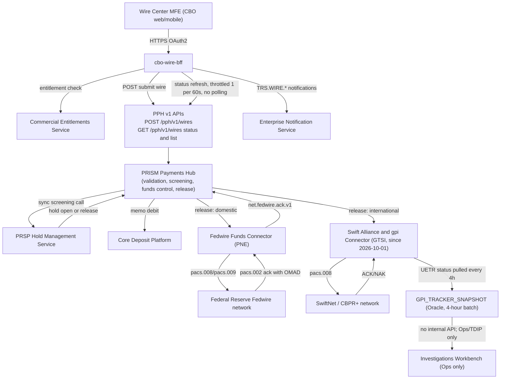

## What this estate is

This page orients a reader to Crestline National Bank's (CNB) wire payments
estate: the systems that originate, orchestrate, screen, and transmit domestic
(Fedwire) and international (Swift CBPR+) wires, and the data and compliance
layers wrapped around them. The estate spans Payments & Treasury Technology
(PTT) and several first/second-line partners (Financial Crimes, Model Risk
Management, Privacy, Legal). It is documented across 15 source records, listed
below with the IDs cited throughout this wiki.

| Document ID | Title | What it covers |
|---|---|---|
| CBO-ARCH-WC-4.1 | Wire Center Current-State Architecture | CBO Wire Center's integrations, status model, constraints |
| CNB-ORG-PTT-2026-06 | PTT Organization, System Ownership & Engagement Directory | Who owns what, engagement routes, planning factors |
| PPH-SYS-OVW-9.2 | PRISM Payments Hub System Overview & Lifecycle State Model | PPH processing stages, canonical v2 states, cutoffs |
| PPH-API-CAT-2026.3 | PPH API & Event Catalog incl. v1 Deprecation Notice | v1/v2 API contracts, Kafka topics, v1 sunset tracking |
| PNG-TDD-6.0 (+Addendum A) | Payment Network Gateway - Fedwire & gpi Technical Design | Fedwire Funds Connector, Swift/gpi Connector, gpi Tracker batch integration |
| PRSP-HMS-3.4 | Hold Management Service Design & Reason Taxonomy (Restricted) | Hold lifecycle, HRC reason codes, disposition controls |
| POL-FCC-014 v3.2 | Customer Communication of Payment Status, Holds & Exceptions Standard | Disclosure tiers, permitted status terminology, prohibited terms |
| ARB-PAY-REG-2026Q3 | Payments ARB ADR Register & Minutes | Binding ADRs (event-driven status, hold confidentiality, UETR, Insights via TDIP), latest board decisions |
| CNB-MEMO-2026-09 | Realignment of Cross-Border Network Integration | gpi/Swift ownership move from PNE to GTSI effective 2026-10-01 |
| PIR-2024-07 | Wire Status Lite Pilot / INC-2024-1182 Post-Implementation Review | Root cause of the 2024 polling incident that produced ADR-PAY-019 |
| DUS-07 v2.1 | Data Use & Client Confidentiality Standard | Purpose limitation, cross-client confidentiality, cohort aggregation thresholds |
| ENS-INT-3.2 | Enterprise Notification Service Integration Guide | Treasury event catalog, subscription model, content rules |
| MRM-POL-02 v7.0 | Model Risk Management Policy Extract | Model/EUA tiering, validation timelines applicable to client-facing estimates |
| TDIP-CAT-2026.2 | Treasury Data & Insights Platform Data Catalog Extract | Payments datasets, feature tables, Insights API, known data gaps |
| JIRA-EXP-2026-10-05 | Jira Export - Wire Center & Dependency Team Backlog | Live backlog evidencing the state of the v1 migration, gpi visibility, and hold-tooltip work |

For the organizational side of this estate, see
[Payments & Treasury Technology](organizations/payments-treasury-technology.md).
For a reader's first steps through the estate, see
[Quickstart](quickstart.md). For PPH internals specifically, see
[PRISM Payments Hub](systems/prism-payments-hub.md).

## Architecture at a glance: CBO -> PPH -> network connectors

Client-initiated wires flow from the digital channel (Crestline Business
Online, "CBO") through the Wire Center module, into PRISM Payments Hub (PPH)
for orchestration, screening and funds control, and out through the Payment
Network Gateway (PNG) to the Fedwire or Swift network. CBO Wire Center is the
origin of roughly 67% of CNB's outgoing wires; the remainder arrive via
host-to-host files, Swift for Corporates, branch, and the Ops desk
(CBO-ARCH-WC-4.1).

PPH is CNB's wire orchestration platform (Volaris Payment Platform 9.4,
on-premises active-active across Columbus and Charlotte). It validates and
enriches instructions, calls the Payment Risk & Screening Platform (PRSP) for
synchronous screening, performs funds control against the Core Deposit
Platform (CDP), and routes releases to the Payment Network Gateway
(PPH-SYS-OVW-9.2). The gateway has two rail-specific connectors owned,
historically, by Payment Networks Engineering (PNE): the Fedwire Funds
Connector (FFC, SYS-PNG-FFC) and the Swift Alliance & gpi Connector (GPI-C,
SYS-PNG-GPI) (PNG-TDD-6.0). Effective 2026-10-01, ownership of the Swift
Alliance gateway, gpi Connector, and the international wire tracking roadmap
moved from PNE to Global Transaction Services Integration (GTSI); the Fedwire
Funds Connector stays with PNE (CNB-MEMO-2026-09).

*Current-state flow: CBO Wire Center submits and polls-by-refresh against PPH
v1 only; PPH orchestrates screening and funds control before releasing to the
rail-specific network connector; gpi status lands in a batch snapshot table
with no path back to the client channel.*

## PPH's canonical lifecycle vs. what channels see

PPH's v2 model defines nine canonical states (RECEIVED, VALIDATING,
SCREENING, HELD, REPAIR, FUNDS_CONTROL, WAREHOUSED, RELEASED,
SENT_TO_NETWORK, NETWORK_ACCEPTED, COMPLETED, CANCELLED, RETURNED), but the
v1 API and all current CBO consumers only ever see seven coarse values
(RECEIVED, PENDING, HELD, PROCESSED, REJECTED, CANCELLED, RETURNED), because
v1's single value PROCESSED collapses RELEASED, SENT_TO_NETWORK,
NETWORK_ACCEPTED and COMPLETED together (PPH-SYS-OVW-9.2, PPH-API-CAT-2026.3).
CBO Wire Center further maps PROCESSED to the client-facing label
"Completed" (replacing "Processed" in release R26.1 per CBO-4388/CBO-4402),
which a 2024 client survey found 37% of users interpreted as "the beneficiary
received the funds" — a reading the underlying acknowledgment does not
support, since Fedwire acceptance is final interbank settlement but does not
confirm beneficiary credit, and Swift ACK is only network delivery, not
settlement (PIR-2024-07, PPH-SYS-OVW-9.2, CBO-ARCH-WC-4.1). A 2026 client
complaint (CBO-4419, linked to CMP-2026-1189) shows the live consequence: an
international wire displayed "Completed" at release and was rejected by the
beneficiary bank the next day (JIRA-EXP-2026-10-05).

Channel status integration is constrained by ADR-PAY-019: channels must
obtain status via event-driven read models, not by polling PPH. This rule
exists because a 2024 pilot (Wire Status Lite, CBO-3120) auto-refreshed
status every 30 seconds per visible wire and, at month-end, drove roughly 85
TPS against the v1 status API, exhausting its thread pool and delaying wire
release for 47 minutes (INC-2024-1182) — 1,240 wires were delayed and 312
missed the Fedwire customer cutoff (PIR-2024-07, ARB-PAY-REG-2026Q3). CBO
Wire Center today permits only user-initiated, throttled refresh (1 request
per 60 seconds per wire) against the v1 status endpoint (CBO-ARCH-WC-4.1).

## Major unresolved tensions

### 1. PPH v1 sunset (2027-03-31, no extensions)

PPH's v1 REST APIs are being retired on 2027-03-31 because the upcoming
Volaris 9.6 upgrade removes the v1 adapter; the Payments Architecture Review
Board (ARB) confirmed on 2026-09-08 that no extensions will be granted
(ARB-PAY-REG-2026Q3, PPH-API-CAT-2026.3). Of the four known v1 consumers,
IVR wire status has migrated and the Service Center CRM is in progress, but
**CBO Wire Center's migration (epic CBO-4471, 34 points) is unscheduled**
and depends on a prerequisite entitlements story (CBO-4473) that is also
unscheduled (PPH-API-CAT-2026.3, JIRA-EXP-2026-10-05). CBO Wire Center is
by volume the dominant channel — about 67% of outgoing wires and roughly
11,600 wires initiated per business day — so an unmanaged v1 cutover is a
material operational risk (CBO-ARCH-WC-4.1).

### 2. The gpi real-time tracking gap

International (Swift gpi) tracking data exists only as a 4-hour batch
snapshot (table GPI_TRACKER_SNAPSHOT), refreshed by the Swift Alliance & gpi
Connector pulling the last 30 days of changed UETRs from the Swift Tracker
API; **there is no internal API exposing gpi status**, and the snapshot must
not be exposed directly to channels (PNG-TDD-6.0). A prior request to double
the batch frequency to 2 hours (PNG-1544) was declined because projected
Tracker API usage would exceed the contracted 250,000-call monthly quota; a
per-payment, client-facing design was estimated at roughly 1.9 million
calls/month — about 7x the contract (PNG-TDD-6.0). The ARB has explicitly
declined to approve direct channel exposure of the snapshot and noted that a
real-time gpi service (GTSI-0107, "GTRS") is not funded for 2026, with
discovery deferred to 2027-Q2 (ARB-PAY-REG-2026Q3, CNB-MEMO-2026-09). CBO
Wire Center today shows no international milestone tracking to clients at
all (CBO-ARCH-WC-4.1); the open discovery spike (CBO-4480) has not progressed
beyond "To Do" (JIRA-EXP-2026-10-05). Compounding this, ownership of the gpi
Connector, Swift gateway, and the international tracking roadmap transferred
from PNE to GTSI effective 2026-10-01, with knowledge transfer targeted for
completion 2026-12-15 — a reorganization that postdates, and is not yet
reflected in, the published PTT ownership directory (CNB-MEMO-2026-09,
CNB-ORG-PTT-2026-06).

### 3. Hold disclosure limits vs. client demand for explanation

Hold reason codes, scores, match details and analyst notes are classified
Restricted and are confined to the financial-crimes trust boundary by
ADR-PAY-021; PPH's v2 API exposes only `hold.isHeld` and `hold.holdId`, never
a reason (ARB-PAY-REG-2026Q3, PPH-SYS-OVW-9.2). POL-FCC-014 enforces this at
the client-communication layer: of the twelve HRC hold reason codes
(PRSP-HMS-3.4), only three disclosure tiers may ever reach a client-facing
surface in any form, and tiers G (generic review) and R (restricted —
fraud, account takeover, sanctions, AML, legal hold) must be presented
*identically*, with no estimated release time or next-step timing, so a
client cannot infer the nature of the review (POL-FCC-014, CTRL-PAY-040).
Only tier C (client-actionable) holds — duplicate-suspect, callback-required,
limit-exceeded, funds-pending, repair-required — carry an approved
explanation and a permitted client action (POL-FCC-014 Appendix A).

This creates a persistent gap with no FCT-approved facade to serve it: a 2025
proposal for a Client-Safe Hold Status Facade (FCT-1893, 21 points) was
deprioritized, so no client-facing hold-reason API exists today
(PRSP-HMS-3.4, JIRA-EXP-2026-10-05). Meanwhile, PPH still synchronizes HMS's
free-text hold description into the legacy v1 field `holdReasonDesc` for
backward compatibility with the Wire Room console — a sync that predates
ADR-PAY-021 and is tracked as open risk FCT-2004 because it leaks
Restricted-tier HMS text (e.g., "FRAUD_MODEL_HIGH sc=9xx L1 queue",
"SANCTIONS_REVIEW name match 0.91 L2") to any v1 consumer (PRSP-HMS-3.4,
PPH-API-CAT-2026.3). As of this writing, CBO Wire Center has an in-progress
story (CBO-4388) that populates a client-visible tooltip directly from
`holdReasonDesc`, with UAT samples showing exactly that Restricted-tier text
and a feature flag defaulting ON for the 2026-10-22 release
(JIRA-EXP-2026-10-05) — a direct collision with POL-FCC-014's tier
indistinguishability rule and ADR-PAY-021's confidentiality boundary.

## Who owns what (summary)

Payments Hub Engineering (Director Raymond Ortiz) owns PPH; Payment Networks
Engineering (Director Raj Malhotra) owns the Fedwire Funds Connector; GTSI
(Director Elena Vasquez) now owns the Swift/gpi Connector and international
tracking roadmap; the CBO Wire Center squad (Director Anjali Deshpande, PO
Marcus Chen) owns the channel; and Financial Crimes Technology (Director
Victor Petrov) owns the Hold Management Service and its FCC policy
constraints (CNB-ORG-PTT-2026-06, CNB-MEMO-2026-09). New client-facing
integrations to payment systems require Payments ARB review (monthly, 10
business days lead time), and any change to client-facing status, hold, or
exception copy requires FCC Policy & Advisory review plus Disclosure Review
Committee approval before build commitment (CNB-ORG-PTT-2026-06,
POL-FCC-014). See
[Payments & Treasury Technology](organizations/payments-treasury-technology.md)
for the full organization and engagement-route directory.
