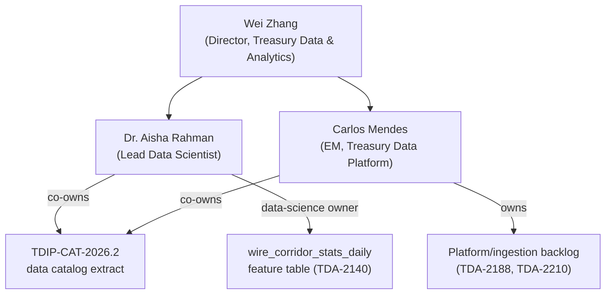

## Overview

Dr. Aisha Rahman is the **Lead Data Scientist** on the Treasury Data &
Analytics team, which builds and operates the **Treasury Data & Insights
Platform (TDIP)** within Crestline National Bank's Payments & Treasury
Technology (PTT) organization. The team is directed by Wei Zhang and tracks
its work under the Jira project `TDA` and Slack channel `#tdip-help`.
Alongside Carlos Mendes (EM, Treasury Data Platform / Data Eng.), she is one
of the two named leads of the TDIP team as recorded in the PTT engineering
team directory. (Source:
<!-- openwiki: broken internal link [../sources/estate/cnb-org-ptt-2026-06-ptt-organization-system-ownership-engagement-directory.md] file "../sources/estate/cnb-org-ptt-2026-06-ptt-organization-system-ownership-engagement-directory.md" does not exist. Fix the href or restore the target, then delete this comment. -->
[CNB-ORG-PTT-2026-06](../sources/estate/cnb-org-ptt-2026-06-ptt-organization-system-ownership-engagement-directory.md),
§3.)

## Responsibilities and ownership

- **Document owner, [TDIP-CAT-2026.2](../documents/tdip-cat-2026.2.md)** — Dr.
  Rahman is listed jointly with Carlos Mendes as document owner of the
  Treasury Data & Insights Platform's published Data Catalog Extract
  (Payments Domain) & Insights API, version 2026.2 (published 2026-09-18,
  approved by Wei Zhang and Ethan Brooks). This document is the authoritative
  internal record of TDIP's payments-domain datasets, feature tables,
  classifications, ownership and the Insights API serving pattern. (Source:
<!-- openwiki: broken internal link [../sources/estate/tdip-cat-2026.2-treasury-data-and-insights-platform-data-catalog-extract.md] file "../sources/estate/tdip-cat-2026.2-treasury-data-and-insights-platform-data-catalog-extract.md" does not exist. Fix the href or restore the target, then delete this comment. -->
  [TDIP-CAT-2026.2](../sources/estate/tdip-cat-2026.2-treasury-data-and-insights-platform-data-catalog-extract.md),
  header block.)
- **Data-science owner, [`wire_corridor_stats_daily`](../datasets/wire-corridor-stats-daily.md)** —
  Jira story `TDA-2140` ("Feature table wire_corridor_stats_daily
  (currency/country completion stats)"), 8 points, was delivered under her
  sole assignee/owner credit and closed Done on 2026-05-22. This is the
  feature table underlying Payment Ops corridor-completion dashboards: it
  aggregates `pay_wire_txn_hist` and `gpi_tracker_events` at a
  currency × destination-country × day grain into wire counts, distinct
  originating clients, same-day ACCC rate and median hours to ACCC, across
  all originating clients. It is classified **Internal**, carries **no
  suppression flag**, and its MRM-inventory link is recorded as "None
  (descriptive)" — an affirmative determination that its purely historical,
  non-forward-looking statistics fall outside MRM-POL-02's model-review
  scope. (Source:
<!-- openwiki: broken internal link [../sources/estate/jira-export-wt-discovery-2026-10-05.md] file "../sources/estate/jira-export-wt-discovery-2026-10-05.md" does not exist. Fix the href or restore the target, then delete this comment. -->
  [Jira Export WT-discovery 2026-10-05](../sources/estate/jira-export-wt-discovery-2026-10-05.md),
<!-- openwiki: broken internal link [../sources/estate/tdip-cat-2026.2-treasury-data-and-insights-platform-data-catalog-extract.md] file "../sources/estate/tdip-cat-2026.2-treasury-data-and-insights-platform-data-catalog-extract.md" does not exist. Fix the href or restore the target, then delete this comment. -->
  §1; [TDIP-CAT-2026.2](../sources/estate/tdip-cat-2026.2-treasury-data-and-insights-platform-data-catalog-extract.md),
  §3.)

Within the TDIP team, this reflects a division of labor visible in the
backlog: feature-table/data-science deliverables (`TDA-2140`) are credited
to Dr. Rahman, while platform- and ingestion-engineering backlog items —
`TDA-2188` (moving `gpi_tracker_events` from nightly to hourly load, target
2026-11) and `TDA-2210` (ingesting `net.fedwire.ack.v1` / Fed acceptance
events, currently backlog) — are owned by Carlos Mendes. (Source:
<!-- openwiki: broken internal link [../sources/estate/jira-export-wt-discovery-2026-10-05.md] file "../sources/estate/jira-export-wt-discovery-2026-10-05.md" does not exist. Fix the href or restore the target, then delete this comment. -->
[Jira Export WT-discovery 2026-10-05](../sources/estate/jira-export-wt-discovery-2026-10-05.md),
§1.)

*Reporting line and ownership split within the Treasury Data & Analytics
(TDIP) team.*

## Relationships

- **Carlos Mendes** — EM, Treasury Data Platform; co-owner with Dr. Rahman of
  TDIP-CAT-2026.2 and the engineering counterpart who owns
  `pay_wire_txn_hist`, `gpi_tracker_events`, `client_hierarchy`, and the
  platform-engineering backlog items (`TDA-2188`, `TDA-2210`).
- **Wei Zhang** — Director, Treasury Data & Analytics; approves
  TDIP-CAT-2026.2 and directs the team Dr. Rahman leads data science for.
- **Ethan Brooks** — Data Governance; co-approver of TDIP-CAT-2026.2 alongside
  Wei Zhang.
- **[TDIP-CAT-2026.2](../documents/tdip-cat-2026.2.md)** — the catalog
  document Dr. Rahman co-owns, which also names related governance documents
  DUS-07, MRM-POL-02, ADR-PAY-026 and PNG-TDD-6.0 that constrain how TDIP's
  datasets and feature tables (including her `wire_corridor_stats_daily`
  table) may be classified, approved and served.
- **[`wire_corridor_stats_daily` feature table](../datasets/wire-corridor-stats-daily.md)** —
  the feature table she delivered under `TDA-2140`, consumed by Payment Ops
  dashboards and not currently exposed through the
  [TDIP Insights API](../interfaces/tdip-insights-api.md).

## Related pages

- [TDIP-CAT-2026.2](../documents/tdip-cat-2026.2.md) — the data catalog
  document she co-owns.
- [wire_corridor_stats_daily Feature Table](../datasets/wire-corridor-stats-daily.md) —
  the feature table she built and owns as a data-science deliverable.
- [Crestline National Bank](../organizations/crestline-national-bank.md) —
  parent organization; places Treasury Data & Analytics (TDIP) within the
  Payments & Treasury Technology org.
- [Payments & Treasury Technology](../organizations/payments-treasury-technology.md) —
  the PTT engineering organization that includes the TDIP team.
