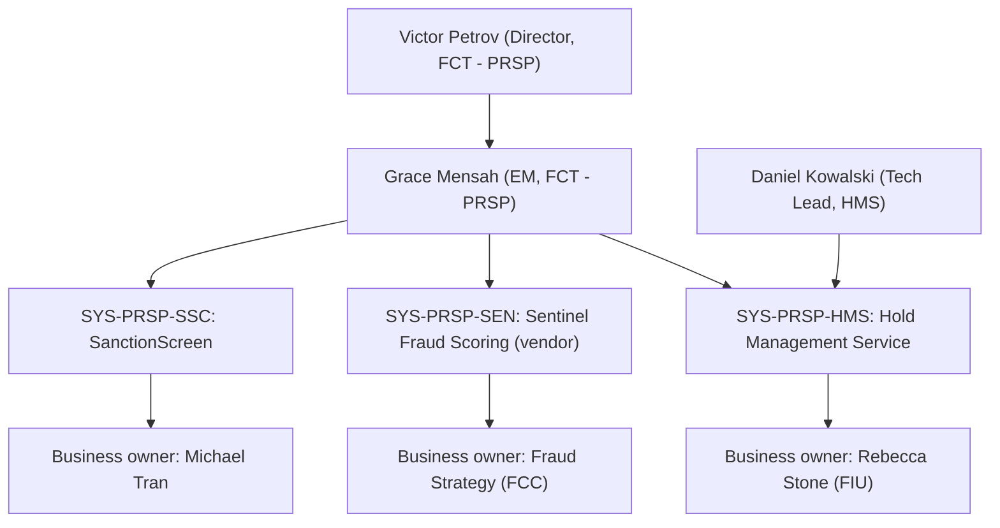

## Overview

Grace Mensah is the Engineering Manager (EM) for the **Financial Crimes Technology - PRSP** team within Payments & Treasury Technology (PTT), reporting to Victor Petrov (Director, FCT - PRSP). She is the accountable technical owner for the PRSP suite of fraud, sanctions, and hold-handling systems and led the FCT-1951 duplicate-suspect client attestation pilot.

_Reporting line and system ownership for Grace Mensah within FCT - PRSP._

## Role and team

- **Title / function:** Engineering Manager, Financial Crimes Technology (team label "FCT - PRSP").
- **Reports to:** Victor Petrov, Director, Financial Crimes Technology - PRSP.
- **Team contacts:** Daniel Kowalski serves as Tech Lead for the [Hold Management Service](../systems/hold-management-service.md) under her.
- **Engagement channel:** Jira project `FCT`; Slack `#fct-prsp`.
- **Intake and planning:** Work for the FCT team is sized at roughly 1 story point ≈ 8 engineering hours **plus a 20% allowance for independent compliance testing**, and is taken in through the FCT Change Advisory forum (bi-weekly) with required FCC (Financial Crimes Compliance) sign-off for any hold or screening change. The FCT Change Advisory observes a year-end change freeze from December 15 to January 5. As of PI 27.1 planning, the team's capacity was estimated at ~80% committed.

## Systems owned

Grace Mensah is listed as the accountable **technical owner** (engineering manager/lead responsible for the system) for three Tier-1 (24x7 critical) systems in the PRSP system ownership register:

| System ID | System | Technical owner | Business owner | Tier |
|---|---|---|---|---|
| SYS-PRSP-HMS | PRSP - Hold Management Service | Grace Mensah / Daniel Kowalski | Rebecca Stone (FIU) | T1 |
| SYS-PRSP-SEN | PRSP - Sentinel Fraud Scoring (vendor) | Grace Mensah | Fraud Strategy (FCC) | T1 |
| SYS-PRSP-SSC | PRSP - SanctionScreen | Grace Mensah | Michael Tran | T1 |

She shares technical ownership of the [Hold Management Service](../systems/hold-management-service.md) with Daniel Kowalski (Tech Lead), while sole technical ownership of Sentinel Fraud Scoring (a vendor product) and SanctionScreen sits with her. All three are Tier-1 systems, meaning they require 24x7 on-call coverage. A known cross-team risk against the Hold Management Service - that the legacy PPH v1 `holdReasonDesc` field leaks HMS free-text hold descriptions (potentially including hold-reason-code and analyst notes) to downstream channel consumers (FCT-2004) - is tracked by her Tech Lead, Daniel Kowalski, and remains open pending a remediation decision (strip the field in v1, or redact at the API gateway).

## FCT-1951: Duplicate-suspect attestation pilot

Grace Mensah was the assignee and lead for **FCT-1951**, an epic titled "Duplicate-suspect client attestation pilot (via Service Center phone)," completed in 2026-04 (18 points). The pilot allowed clients to attest, by phone through the Commercial Service Center, that a wire flagged as a possible duplicate was in fact intentional, in order to accelerate release of holds with hold-reason-code **HRC-01** (duplicate-suspect).

- **Outcome:** 82% of HRC-01 holds were resolved within 30 minutes once a client confirmation was obtained.
- **Risk sign-off:** FCT Risk approved digital/phone attestation for HRC-01 holds only, subject to step-up authentication.
- **Control update:** The pilot's results fed a 2026-06-10 update to control **CTRL-PAY-031**, which codified that digital/phone attestation is permitted for HRC-01 only (with step-up auth), that wires above $5M still require manual Wire Room release regardless of attestation, and that no fully digital (self-service, non-phone) attestation path existed at that time.

See [FCT-1951 Duplicate-Suspect Attestation Pilot](../projects/fct-1951-duplicate-suspect-attestation-pilot.md) for the project write-up.

## Related decisions

- On **FCT-1893** ("Client-Safe Hold Status Facade," a proposed `GET /holds/{id}/client-view` API meant to return only a disclosure tier and approved copy key per POL-FCC-014 Appendix A, never raw hold-reason-code or analyst notes), Grace Mensah recorded in 2025-08-19 that the story was deprioritized because no channel consumer had committed to building against it, with a note to revisit once a client-facing hold experience is funded.

## Governance context

Because her systems sit behind HRC/sanctions and fraud scoring, any change she or her team ships to hold or screening behavior must pass through the bi-weekly **FCT Change Advisory** forum and receive FCC sign-off; this is distinct from the monthly Payments Architecture Review Board, which governs new client-facing integrations to payment systems generally. Policy or compliance interpretation questions (e.g., how a hold-reason-code should be disclosed to clients) are explicitly out of scope for engineering decision-making and route instead to FCC Policy & Advisory (Jordan Ellis) or the Chief BSA/AML Officer's organization (Catherine Doyle).
