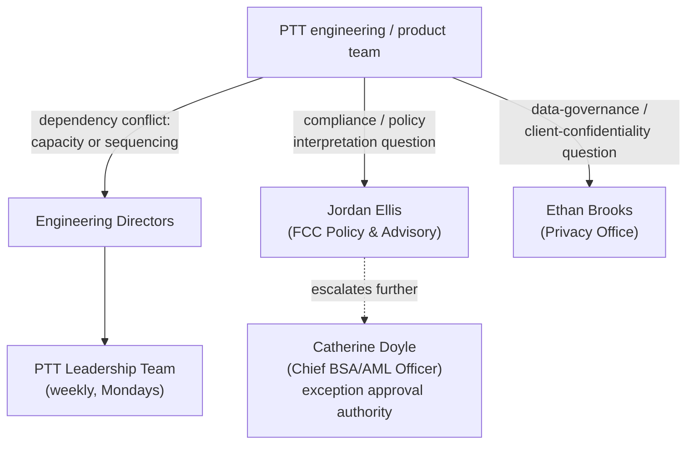

## Overview

Jordan Ellis is **VP, FCC Policy & Advisory**, the named day-to-day specialist
contact inside Crestline National Bank's (CNB) **Financial Crimes Compliance
(FCC)** partner function, which is accountable to Catherine Doyle, EVP, Chief
BSA/AML Officer. Ellis sits in the second-line partner-function structure
described in the Payments & Treasury Technology (PTT) organization directory,
not in an engineering reporting line: PTT engineering and product teams are
directed to engage Ellis directly for financial-crimes policy interpretation
and client-facing disclosure questions, rather than escalating to Doyle or
deciding such questions unilaterally themselves.

Ellis holds two concrete, named responsibilities in the source corpus:

- **Policy contact for [POL-FCC-014](../policies/pol-fcc-014.md)** — the enterprise standard governing what may and may not be communicated to clients about payment status, holds and exceptions.
- **Reviewer of PRSP-HMS-3.4** — the Financial Crimes Technology (FCT) design document for the Hold Management Service (HMS), approved by Victor Petrov (Director, FCT) and reviewed by Ellis.

## Role and scope

- **Title**: VP, FCC Policy & Advisory.
- **Function**: Financial Crimes Compliance (FCC), accountable to Catherine Doyle (EVP, Chief BSA/AML Officer). In the partner-functions table of the PTT organization directory, Ellis is listed alongside Michael Tran (OFAC/Sanctions) and Rebecca Stone (FIU) as the named contacts for product/design reviews under the FCC function.
- **Reporting**: FCC Policy & Advisory is not an engineering team; it is a second-line partner function with mandatory review or sign-off authority over client-facing financial-crimes disclosure design, distinct from Financial Crimes Technology (FCT), the engineering organization (led by Victor Petrov) that builds the systems Ellis's policies constrain.

## Responsibilities

### Policy contact for POL-FCC-014

Ellis is listed as the **Policy contact** in the document-identity header of
[POL-FCC-014](../policies/pol-fcc-014.md) v3.2, "Customer Communication of
Payment Status, Holds & Exceptions Standard" — the standard defining how CNB
communicates payment status, holds and exceptions through any client-facing
channel, and the four-tier (P/C/G/R) disclosure model at its center. The
document is owned by Catherine Doyle (co-owned with Michael Tran) and was
approved by the Enterprise Policy Committee on 2026-02-12, effective
2026-03-01, next review 2027-03-01. As policy contact, Ellis is the person a
team consults to interpret how the standard's disclosure tiers, status
terminology rules, third-party sharing limits and prohibited-term list apply
to a specific client-facing design.

Per POL-FCC-014 Section 6 ("Approvals"), **new or changed client-facing
status, hold or exception experiences require FCC Policy & Advisory review
before build commitment**, with Disclosure Review Committee (DRC) approval of
final copy; exceptions to the standard require Chief BSA/AML Officer
(Doyle) approval rather than Ellis's. The PTT organization directory's
planning factors quantify this review as taking **approximately 10 business
days per review** through FCC Policy & Advisory intake — a mandatory
dependency that engineering teams must sequence into any change touching
client-facing payment status, hold or exception content.

### Reviewer of PRSP-HMS-3.4

Ellis is named in the approvals line of **PRSP-HMS-3.4** ("Payment Risk &
Screening Platform - Hold Management Service: Design & Hold Reason
Taxonomy"), the RESTRICTED Financial Crimes Technology design document that
defines the Hold Management Service (HMS) hold lifecycle, the twelve-code
hold reason taxonomy (HRC-01 through HRC-12), disposition controls, and data
handling and interface rules for payment holds. The document is owned by
Daniel Kowalski (Tech Lead) and Grace Mensah (EM), approved by Victor Petrov
(Director, FCT), and lists Ellis as the compliance reviewer — the role that
confirms the HRC-to-disclosure-tier mapping and hold-presentation rules HMS
implements are consistent with POL-FCC-014 before the design is approved.
This review role is the direct link between the two documents: PRSP-HMS-3.4
Section 3 explicitly states that its hold reason taxonomy's disclosure tiers
(P/C/G/R) are defined by POL-FCC-014, and Ellis's review is the compliance
checkpoint confirming that linkage rather than an engineering sign-off.

### First escalation point for compliance/policy interpretation

Both the PTT organization directory's escalation section and multiple
engineering-team/person pages state that **compliance or policy
interpretation questions route to FCC Policy & Advisory (Jordan Ellis) — or
to the Privacy Office (Ethan Brooks) for data-governance/client-confidentiality
questions — and are explicitly not decided unilaterally by engineering
teams**. This places Ellis, alongside Brooks, above the normal
engineering-manager → director → PTT Leadership Team dependency-escalation
path specifically for disagreements that turn on how payment status, hold or
exception information may be classified, presented or disclosed to a client,
as distinct from disagreements about engineering capacity or sequencing.

*Escalation routing: compliance/policy interpretation questions bypass the normal engineering escalation chain and go directly to Jordan Ellis (or Ethan Brooks for data-governance questions); Catherine Doyle retains sole authority to approve exceptions to POL-FCC-014.*

## Relationships

- **Second-line accountable owner**: [Catherine Doyle](catherine-doyle.md), EVP, Chief BSA/AML Officer, document owner of POL-FCC-014 and accountable leader of the Financial Crimes Compliance function Ellis belongs to.
- **Peer contacts in FCC**: Michael Tran (OFAC/Sanctions, POL-FCC-014 co-owner) and Rebecca Stone (Financial Intelligence Unit, FIU) — the other two named specialist contacts under Doyle's function.
- **Engineering counterparts reviewed by Ellis**: [Daniel Kowalski](daniel-kowalski.md) (Tech Lead) and Grace Mensah (EM), co-owners of PRSP-HMS-3.4; Victor Petrov (Director, Financial Crimes Technology), the document's approver.
- **Parallel escalation contact**: Ethan Brooks (Privacy Office, Data Governance Lead), the equivalent first escalation point for data-governance and client-confidentiality questions, as distinguished from Ellis's financial-crimes/compliance remit.
- **Approval-chain counterpart**: the Disclosure Review Committee (DRC, chaired by Patricia Moore), which approves final client-facing copy after FCC Policy & Advisory review under POL-FCC-014 Section 6.

## Related pages

- [POL-FCC-014](../policies/pol-fcc-014.md) — the standard Ellis is policy contact for.
- [Financial Crimes Compliance](../teams/financial-crimes-compliance.md) — the partner function Ellis belongs to.
