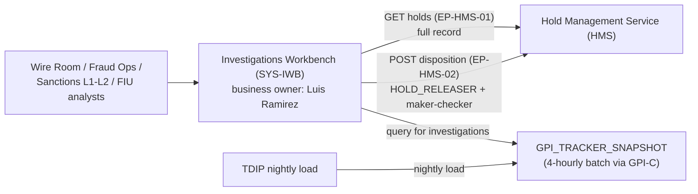

## Overview

Luis Ramirez is the **Wire Investigations** contact for Payment Operations at
Crestline National Bank (CNB) and the registered **business owner** of the
**Investigations Workbench** (`SYS-IWB`) in the Payments & Treasury Technology
(PTT) system ownership register. He is named twice in the PTT Organization,
System Ownership & Engagement Directory (CNB-ORG-PTT-2026-06): once as a
product/design-review contact under the Payment Operations partner function,
and once as the accountable business owner of record for the Investigations
Workbench system.

## Role and scope

Payment Operations is a first-line business function, distinct from the PTT
engineering organization, accountable to **Denise Carter**. The directory
lists two named contacts for product and design reviews under Payment
Operations: Luis Ramirez for **Wire Investigations**, and **Tanya Brooks**
for the **Wire Room**. This split reflects two adjacent but distinct
casework surfaces inside Payment Operations — wire investigations/exception
handling (Ramirez's area) and wire release/repair operations (Brooks's
area) — both of which work against the same underlying tooling, the
Investigations Workbench.

Ramirez's role is first-line/business, not engineering: he is a named
engagement contact and business owner, not a technical owner in the PTT
register. Teams proposing changes that touch wire investigations casework —
for example, a new hold-detail surface, a new gpi exception view, or a
change to how channels expose hold status — should route product and design
questions through Ramirez (or, for Wire Room-specific concerns, through
Brooks), consistent with the directory's instruction to "raise demand
through the correct intake route."

## Business owner of the Investigations Workbench (SYS-IWB)

In the PTT system ownership register, `SYS-IWB` ("Investigations Workbench")
is owned by **Payment Operations Tech** — a technology team distinct from
Carter's first-line Payment Operations organization — with its technical
owner recorded only as "(Ops Tech)" (no named individual) and Luis Ramirez
as **business owner**. The system carries a **Tier 2** support rating
(business hours plus on-call), lower than the Tier 1 rating given to most
client-facing and screening systems in the register (CBO Wire Center, CES,
PRISM Payments Hub, both Payment Network Gateway connectors, and all three
PRSP components).

As business owner, Ramirez is the accountable product-side owner for what
the Investigations Workbench does and who may use it — the counterpart to
the unnamed engineering owner, in the same pattern used elsewhere in the
register (e.g. Laura Kim as business owner of payment datasets alongside
named technical owners).

### What the Investigations Workbench does

The Investigations Workbench (IWB) is the casework tool used by **Wire
Room, Fraud Ops, Sanctions L1/L2, and the Financial Intelligence Unit
(FIU)** analysts. It is the system of record's *only* authorized
caller for the two operational endpoints of the Hold Management Service
(HMS):

- `GET /prsp/hms/v1/holds?paymentId=` (**EP-HMS-01**) — returns the full
  internal hold record, including the Restricted-classified `hrcCode`,
  `description`, `analystNotes` and `slaDueTs` fields that must never reach
  client-facing channels.
- `POST /prsp/hms/v1/holds/{holdId}/disposition` (**EP-HMS-02**) — the
  *only* interface that changes hold state (release or reject), gated by
  the `HOLD_RELEASER` role and maker-checker control `CTRL-PAY-012`.

IWB is also one of only two consumers of the Swift gpi Tracker snapshot
(`GPI_TRACKER_SNAPSHOT`), which the Swift Alliance & gpi Connector (GPI-C)
refreshes by batch every four hours; the other consumer is the Treasury
Data & Insights Platform's (TDIP) nightly load. IWB queries that snapshot
directly for operational gpi-status investigation — there is no internal
API for gpi status, and the table is explicitly not permitted to be exposed
to client-facing channels.

IWB is the successor to the legacy **Wire Room console**, which was
migrated onto the Investigations Workbench in 2025; PRISM Payments Hub's
(PPH) v1 wire-status API originally served that console directly.

*Investigations Workbench as the sole operational caller of HMS's hold endpoints and one of two consumers of the gpi Tracker snapshot; Luis Ramirez is its registered business owner.*

### Why IWB's access matters for channel design

Because IWB is the only system authorized to retrieve full hold detail
(including Restricted-tier fields) or to release/reject a hold, any
client-facing feature that needs to resolve or explain a held wire beyond
"payment is held" must either route the client to Payment Operations (i.e.,
to the queues IWB serves) or wait on a dedicated, compliance-reviewed
facade. The one proposed alternative, **FCT-1893** (a client-safe hold
status facade that would expose only disclosure tier, approved copy key and
permitted actions), was deprioritized in 2025-Q3 and does not exist; until
it or a successor ships, Payment Operations — and by extension Ramirez's
Wire Investigations function — remains the only path for anything more
specific than hold presence.

## Relationships

- **Payment Operations (first-line function)**: accountable leader
  [Denise Carter](denise-carter.md); Luis Ramirez (Wire Investigations) and
  Tanya Brooks (Wire Room) are the directory's named product/design-review
  contacts under her.
- **Payment Operations Tech (owning team)**: the engineering team that
  technically owns `SYS-IWB`, distinct from Carter's first-line
  organization; its technical owner is unnamed ("Ops Tech") in the
  directory, while Ramirez is the named business owner.
- **Hold Management Service / Financial Crimes Technology (FCT)**: IWB is
  HMS's sole operational consumer for hold lookups and dispositions; HMS is
  owned by FCT (Victor Petrov, Director), with [Daniel Kowalski](daniel-kowalski.md)
  and Grace Mensah as technical owners and Rebecca Stone (FIU) as business
  owner.
- **Payment Networks Engineering (PNE)**: owns the Swift Alliance & gpi
  Connector that produces the `GPI_TRACKER_SNAPSHOT` table IWB queries for
  gpi-status casework.
- **Treasury Data & Insights Platform (TDIP)**: the only other consumer of
  the gpi Tracker snapshot, via a separate nightly load rather than IWB's
  direct operational queries.

## Governance context

Luis Ramirez's role and IWB's business ownership are documented in the PTT
Organization, System Ownership & Engagement Directory (CNB-ORG-PTT-2026-06),
a quarterly-refreshed reference maintained by the PTT Business Management
Office (BMO) and approved by Gregory Hall, MD - CIO Payments & Treasury
Technology. The directory states that organizational announcements issued
between quarterly refreshes take precedence over its contents, so this
assignment should be reconfirmed against the latest refresh or direct
engagement when used for active planning.

## Related pages

- [Payments & Treasury Technology](../organizations/payments-treasury-technology.md)
- [Investigations Workbench](../systems/investigations-workbench.md)
- [HMS Hold API & Hold Events](../interfaces/hms-hold-api.md)
- [Denise Carter](denise-carter.md)
- [Daniel Kowalski](daniel-kowalski.md)
