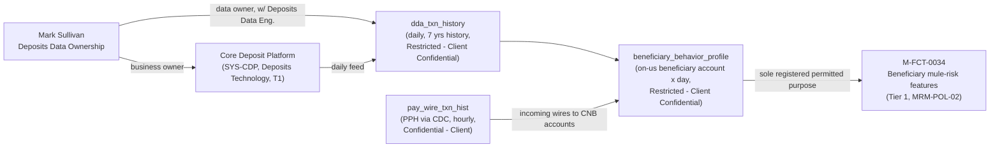

## Overview

Mark Sullivan is the accountable leader of **Deposits Data Ownership**, a
first/second-line partner function listed in Crestline National Bank's
Payments & Treasury Technology (PTT) organization and system-ownership
directory. Unlike the engineering-team leaders in that directory, Mark
Sullivan does not sit in the PTT engineering reporting line under Gregory
Hall (MD, CIO Payments & Treasury Technology); he instead sits alongside
other partner-function leaders — Catherine Doyle (Financial Crimes
Compliance), Jonathan Price (Model Risk Management), Denise Carter (Payment
Operations), Andrew Feldman (Legal — Treasury & Payments), Farah Ali
(Information Security — Digital Channels), Kim Nguyen (Commercial Service
Center), and Rachel Goldberg (Privacy Office & Data Governance) — as one of
the named accountable owners whose sign-off or stewardship PTT teams must
seek for a specific class of dependency.

Mark Sullivan's accountability is specifically for **Core Deposit Platform
datasets (Restricted)**: he is recorded as the **business owner** of the
[Core Deposit Platform](../systems/core-deposit-platform.md) (`SYS-CDP`) in
the PTT system ownership register, and as the **data owner / steward**
(jointly with Deposits Data Engineering) of
[`dda_txn_history`](../datasets/dda-txn-history.md), the daily transaction-history
feed from the Core Deposit Platform cataloged in the Treasury Data & Insights
Platform (TDIP).

## Role and ownership

### Deposits Data Ownership (partner function)

The PTT directory's partner-functions table names Mark Sullivan as
accountable for "Core Deposit Platform datasets (Restricted)," placing
Deposits Data Ownership in the same governance category as Financial Crimes
Compliance, Model Risk Management, and Privacy Office & Data Governance:
functions that are "not part of PTT's engineering reporting line but hold
mandatory review or sign-off authority over specific classes of PTT change."
For Mark Sullivan, that class of change is any access to, or new consumption
of, Core Deposit Platform data by PTT or TDIP teams.

### Business owner, Core Deposit Platform (SYS-CDP)

In the PTT system ownership register, `SYS-CDP` (Core Deposit Platform) is
listed with:

| Field | Value |
|---|---|
| Owning team | Deposits Technology (outside PTT) |
| Technical owner | (Deposits Tech) — not individually named in the directory |
| Business owner | Mark Sullivan |
| Support tier | T1 (24x7 critical) |

Core Deposit Platform is the only system in the register, besides
Investigations Workbench (`SYS-IWB`), whose owning team sits outside the PTT
engineering organization; it is included in the register only because PRISM
Payments Hub depends on it for funds control. Its Tier 1 classification
places it at the same criticality level as PTT's core payment-processing
systems (PRISM Payments Hub, the Fedwire and Swift/gpi network gateways),
even though Mark Sullivan's business ownership and the Deposits Technology
engineering team sit outside PTT's own chain of command. Unlike every other
system in the register, no individual engineering manager or tech lead is
named as technical owner for `SYS-CDP` — only the team name "Deposits
Technology" — which means PTT teams needing engineering-level engagement on
Core Deposit Platform changes must route through Mark Sullivan's function
rather than a named technical counterpart.

### Data owner, dda_txn_history

The TDIP data catalog (TDIP-CAT-2026.2) lists Mark Sullivan, jointly with
Deposits Data Engineering, as the data owner / steward of
[`dda_txn_history`](../datasets/dda-txn-history.md):

| Field | Value |
|---|---|
| Source | Core Deposit Platform |
| Refresh | Daily |
| History retained | 7 years |
| Classification | **Restricted — Client Confidential** |
| Data owner / steward | Mark Sullivan / Deposits Data Engineering |

`dda_txn_history` is the only dataset in the TDIP payments-domain catalog
classified Restricted — Client Confidential; every other listed dataset
(`pay_wire_txn_hist`, `gpi_tracker_events`, `client_hierarchy`) is
Confidential - Client or lower. This ownership pattern also differs from the
rest of the catalog: other payments datasets pair a PTT business data owner
(Laura Kim or Marcus Chen) with TDIP's data-engineering lead (Carlos
Mendes), whereas `dda_txn_history` is owned end-to-end by the deposits
organization — Mark Sullivan and Deposits Data Engineering — reflecting that
it is sourced from a system (Core Deposit Platform) outside the Payments
Platform and PTT organization chart entirely.

Because of its Restricted classification, access to `dda_txn_history` (and
anything derived from it) requires both data-owner sign-off and a Collibra
Data Access Request with Privacy Office approval, carrying a published SLA
of 15 business days — longer than the standard Collibra-governed access
applied to Confidential or Internal TDIP datasets. Under
[DUS-07](../documents/dus-07.md)'s purpose-limitation rule, any feature
table or analytic product derived from `dda_txn_history` inherits that
Restricted tier and the narrow permitted purpose approved for the underlying
deposit-account data, rather than being treated as a lower, averaged-down
classification.

## Downstream consumption

The only documented consumer of `dda_txn_history` in the current TDIP
catalog is the
[`beneficiary_behavior_profile`](../datasets/beneficiary-behavior-profile.md)
feature table, which joins `dda_txn_history` with `pay_wire_txn_hist`
(incoming wires to CNB accounts) at a grain of on-us beneficiary account x
day to produce mule-risk behavioral features feeding **M-FCT-0034**
(Beneficiary mule-risk features), a Tier 1 financial-crimes model under
MRM-POL-02 owned by Financial Crimes Technology. `beneficiary_behavior_profile`
inherits the Restricted classification of `dda_txn_history` — its more
sensitive input — and its single registered permitted purpose is supplying
features to that model; MRM-POL-02 bars Tier 1 financial-crimes model
outputs from product, marketing, or client-facing use, a restriction that
applies transitively back to data sourced from Mark Sullivan's Core Deposit
Platform.

No other feature table or Insights API endpoint in the current catalog reads
from `dda_txn_history`: `wire_corridor_stats_daily` and
`client_wire_history_features` are built only from `pay_wire_txn_hist` and
`gpi_tracker_events`, and the one GA Insights API endpoint
(`GET /tdip/insights/v1/cash-forecast/{clientId}`) is powered by a different
model (M-TRS-0142). Any new proposal to use `dda_txn_history` for a
client-facing or product purpose would need both a fresh Privacy Impact
Assessment (~4 weeks) and Mark Sullivan's data-owner sign-off, and under
DUS-07 §7 would generally not be approved if it routes deposit-account data
through a use outside the FCC purpose it was approved for.

## Engagement and escalation

Because Core Deposit Platform and its downstream data ownership sit outside
the PTT organization chart that owns most of the other systems and datasets
in these registers, requests to change `dda_txn_history` ingestion, add new
consumers, or expand access to Core Deposit Platform data should be routed
to Deposits Data Ownership / Mark Sullivan (and Deposits Data Engineering)
rather than to TDIP (Carlos Mendes) or any PTT engineering team — even
though TDIP operates the Snowflake/dbt pipeline that ingests the data daily.
Per the PTT directory's general escalation path, compliance or
policy-interpretation questions are not decided by engineering teams alone;
for Restricted deposit data, Mark Sullivan's sign-off sits alongside (and is
additive to) the standing Privacy Office approval required for any
Restricted-dataset access.

## Relationships

- **Peer partner-function leaders**: Catherine Doyle (Financial Crimes
  Compliance, owner of POL-FCC-014), Jonathan Price (Model Risk Management,
  owner of MRM-POL-02), Denise Carter (Payment Operations), Kim Nguyen
  (Commercial Service Center), Andrew Feldman (Legal — Treasury & Payments),
  Farah Ali (Information Security — Digital Channels), and Rachel Goldberg
  (Chief Privacy Officer, owner of DUS-07) — all first/second-line partner
  functions in the same PTT directory section as Deposits Data Ownership.
- **Deposits Data Engineering** — the co-steward named alongside Mark
  Sullivan for `dda_txn_history`, and the team to whom ingestion, schema, and
  pipeline questions about Core Deposit Platform data should be directed.
- **Carlos Mendes** (EM, Data Engineering, TDIP) — operates the TDIP pipeline
  that ingests `dda_txn_history` daily into Snowflake, but is not the data
  owner; data-access and purpose-limitation decisions for the dataset remain
  with Mark Sullivan.
- **Victor Petrov** (Director, Financial Crimes Technology) — his team's
  `beneficiary_behavior_profile` feature table and M-FCT-0034 model are the
  sole downstream consumers of data for which Mark Sullivan is accountable.
- **Rachel Goldberg** (Chief Privacy Officer, owner of DUS-07) — the Privacy
  Office approval required for Restricted dataset access runs in parallel
  with, not in place of, Mark Sullivan's data-owner sign-off.

## What is not documented in the source corpus

The reviewed directory and catalog extracts do not record Mark Sullivan's
formal title, reporting line, or organizational home outside of "Deposits
Data Ownership" and "business owner, Core Deposit Platform"; they also do
not name an individual technical owner (engineering manager or tech lead)
for the Core Deposit Platform, nor document its internal architecture,
schema, or ingestion mechanism beyond "Deposits Technology" as the owning
team and a daily feed into TDIP. These should be treated as gaps to confirm
directly with Deposits Data Ownership / Deposits Data Engineering rather
than inferred from the PTT-owned systems and datasets documented elsewhere
in this wiki.
