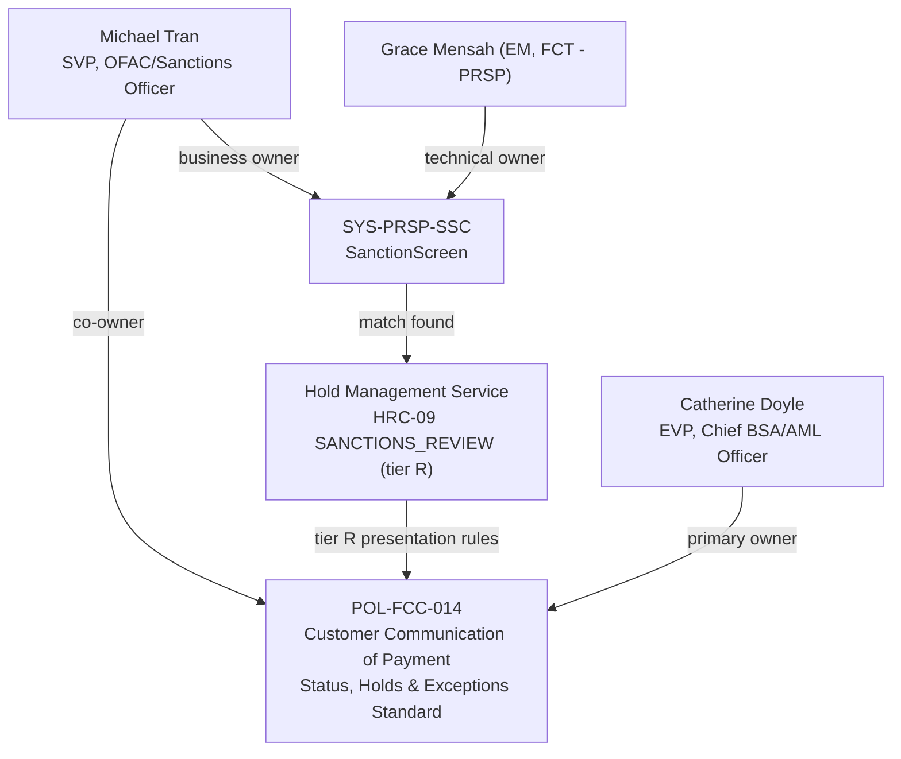

## Overview

Michael Tran is **SVP, OFAC/Sanctions Officer** at Crestline National Bank
(CNB). He holds two distinct, named accountabilities in the source corpus:
he is the **co-owner of POL-FCC-014**, the enterprise standard governing
what may and may not be communicated to clients about payment status, holds
and exceptions, alongside Catherine Doyle (EVP, Chief BSA/AML Officer); and
he is the named **business owner of SanctionScreen** (system ID
SYS-PRSP-SSC), the OFAC and sanctions-list screening system within the
Payment Risk & Screening Platform (PRSP). Like his peers in the Financial
Crimes Compliance (FCC) partner function, Tran is a second-line compliance
accountable owner, not a member of an engineering team: Financial Crimes
Technology (FCT) engineers build and operate SanctionScreen, while Tran
owns its business requirements and sanctions-policy correctness.

## Role and scope

- **Title**: SVP, OFAC/Sanctions Officer.
- **Function**: Financial Crimes Compliance (FCC), accountable to Catherine Doyle, EVP, Chief BSA/AML Officer. In the partner-functions table of the Payments & Treasury Technology (PTT) organization directory, Tran is listed as the FCC contact for OFAC matters, alongside Jordan Ellis (FCC Policy & Advisory) and Rebecca Stone (Financial Intelligence Unit, FIU).
- **Reporting**: FCC is a second-line partner function engaged by PTT engineering and product teams for sanctions and financial-crimes design questions; it is distinct from Financial Crimes Technology (FCT), the engineering organization (led by Victor Petrov, with Grace Mensah as Engineering Manager) that builds and operates the systems Tran's policy and business ownership constrain.

## Co-ownership of POL-FCC-014

Tran is named in the document-identity header of **POL-FCC-014 v3.2**,
"Customer Communication of Payment Status, Holds & Exceptions Standard," as
co-owner alongside Catherine Doyle (EVP, Chief BSA/AML Officer, primary
document owner). The standard was approved by the Enterprise Policy
Committee on 2026-02-12, is effective 2026-03-01, and is next due for
review 2027-03-01; Jordan Ellis (VP, FCC Policy & Advisory) is its
day-to-day policy contact. As co-owner, Tran shares accountability for the
rules that govern client-facing payment-status communication, including
provisions that are most directly tied to his sanctions remit:

- **Disclosure tiers (P/C/G/R)**: tier R ("Restricted") covers fraud, account takeover, sanctions, AML and legal holds, and must be presented to the client identically to generic tier-G reviews — same label, icon, color, copy and absence of timing information — so a client cannot infer that a hold is sanctions-related.
- **Sanctions-specific communication rule**: "Sanctions blocks/rejects are communicated only by Sanctions Operations per procedure; channels show tier G/R presentation" (Section 5.1.6) — meaning no client-facing channel, API, notification or Commercial Service Center script may independently disclose a sanctions hold, block or reject outcome.
- **Prohibited terms**: Appendix C explicitly bars the terms "sanctions," "OFAC," "watch list" and "screening hit" (among others) from any client-facing copy, directly operationalizing the confidentiality of sanctions-screening activity that Tran's OFAC function is accountable for.
- **Exceptions**: Section 6 provides that exceptions to the standard require Chief BSA/AML Officer (Doyle) approval, not Tran's — his co-ownership covers the standard's content and maintenance rather than exception sign-off.

See [POL-FCC-014](../policies/pol-fcc-014.md) for the full policy record.

## Business ownership of SanctionScreen

In the PTT system ownership register, Tran is listed as the **business
owner** of **SYS-PRSP-SSC, PRSP - SanctionScreen**, a Tier-1 (24x7
critical) system whose technical owner is Grace Mensah (Engineering
Manager, Financial Crimes Technology - PRSP). SanctionScreen performs OFAC
and other sanctions-list screening as part of the Payment Risk & Screening
Platform (PRSP), alongside Sentinel Fraud Scoring (vendor fraud model) and
the Hold Management Service (HMS, system of record for payment holds).

- **Screening function**: per the PRISM Payments Hub (PPH) lifecycle, outbound wires pass through a synchronous screening step calling PRSP (SanctionScreen + Sentinel); a SanctionScreen hit creates an HMS hold and the payment enters the HELD state.
- **Hold-reason linkage**: a SanctionScreen potential match drives hold reason code **HRC-09 (SANCTIONS_REVIEW)**, tier R, pending L1/L2 analyst review — about 7% of HMS holds by volume, with a median time to disposition of roughly 3 hours 20 minutes. Tran's business ownership of SanctionScreen is the upstream accountability for the detections that populate this hold category in the system his FCC peers (and PRSP-HMS owner Grace Mensah) jointly govern.
- **No client-facing interface**: PRSP-HMS-3.4 records that there is currently no client-facing interface to hold data, and a proposed "Client-Safe Hold Status Facade" (FCT-1893) was deprioritized in 2025-Q3; any future design exposing SanctionScreen-driven hold status to clients would need to satisfy POL-FCC-014's tier-R indistinguishability and prohibited-terms rules that Tran co-owns.
- **Blocked-funds handling**: where SanctionScreen contributes to an OFAC blocking determination, HMS enters the BLOCKED state, funds are moved to a blocked account, and the block is reported to OFAC within 10 business days (31 CFR 501.603) — a regulatory obligation under Tran's OFAC/Sanctions Officer remit, executed operationally by Sanctions Operations rather than by channel or engineering teams.

*Michael Tran's dual accountability: policy co-ownership of POL-FCC-014 and business ownership of SanctionScreen, which feeds tier-R sanctions holds governed by that same policy.*

## Relationships

- **Second-line accountable leader**: [Catherine Doyle](catherine-doyle.md), EVP, Chief BSA/AML Officer — primary document owner of POL-FCC-014 and accountable leader of the Financial Crimes Compliance function Tran belongs to; sole approver of exceptions to the standard.
- **Peer FCC contacts**: Jordan Ellis (VP, FCC Policy & Advisory, day-to-day policy contact for POL-FCC-014) and Rebecca Stone (Financial Intelligence Unit, FIU, business owner of the Hold Management Service) — the other two named specialist contacts under Doyle's function.
- **Technical owner counterpart**: [Grace Mensah](grace-mensah.md), Engineering Manager, Financial Crimes Technology - PRSP, the accountable technical owner of SanctionScreen that Tran owns from the business side; Mensah also owns the Hold Management Service (with Daniel Kowalski) and Sentinel Fraud Scoring.
- **Engineering reporting line above Mensah**: Victor Petrov (Director, Financial Crimes Technology - PRSP), the FCT leader whose team builds and operates SanctionScreen.
- **Governance forum**: changes touching sanctions screening or hold handling require sign-off through the bi-weekly **FCT Change Advisory** forum, which mandates FCC sign-off and observes a year-end change freeze (December 15 to January 5) — the forum through which Tran's function's concerns on SanctionScreen-related changes are raised.

## Related pages

- [POL-FCC-014](../policies/pol-fcc-014.md)
- [SanctionScreen](../systems/sanctionscreen.md)
