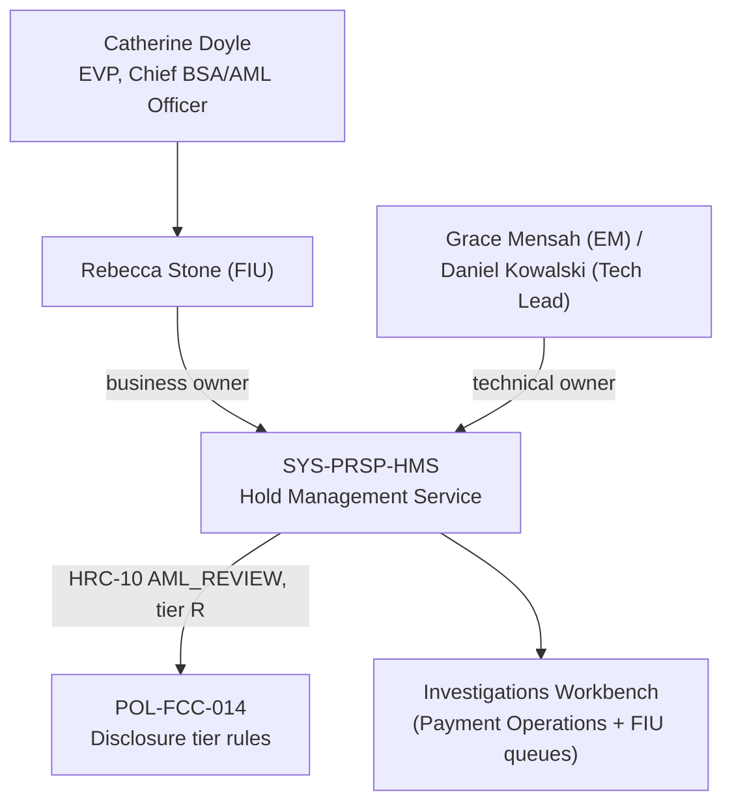

## Overview

Rebecca Stone represents the **Financial Intelligence Unit (FIU)** within
Financial Crimes Compliance (FCC) at Crestline National Bank (CNB). She has
two named accountabilities in the source corpus: she is the FCC contact for
FIU-related product and design reviews under Catherine Doyle (EVP, Chief
BSA/AML Officer), and she is the named **business owner** of the **Hold
Management Service (HMS, system ID `SYS-PRSP-HMS`)**, the Tier-1 system of
record for holds placed on outbound payments within the Payment Risk &
Screening Platform (PRSP). Like her FCC peers Jordan Ellis (Policy &
Advisory) and Michael Tran (OFAC/Sanctions), Stone is a second-line
compliance accountable owner rather than a member of an engineering team:
Financial Crimes Technology (FCT) — led by Victor Petrov (Director), with
Grace Mensah (Engineering Manager) and Daniel Kowalski (Tech Lead) — builds
and operates HMS, while Stone owns its business requirements from the
financial-intelligence/AML perspective.

## Role and scope

- **Function**: Financial Intelligence Unit (FIU) contact, within Financial
  Crimes Compliance (FCC), accountable to Catherine Doyle, EVP, Chief
  BSA/AML Officer.
- **Partner-function listing**: In the partner-functions table of the
  Payments & Treasury Technology (PTT) organization directory, Stone is
  listed as the FIU contact for product/design reviews, alongside Jordan
  Ellis (FCC Policy & Advisory) and Michael Tran (OFAC).
- **Not an engineering role**: FCC is a second-line partner function that PTT
  engineering and product teams must engage for hold- and financial-crime-
  related design questions; it is organizationally distinct from Financial
  Crimes Technology (FCT), the engineering group that builds the systems
  Stone's business ownership constrains.

## Business ownership of the Hold Management Service

In the PTT system ownership register, Stone is listed as the **business
owner** of `SYS-PRSP-HMS`, **PRSP - Hold Management Service**, a Tier-1
(24x7 critical) system whose technical owners are Grace Mensah (Engineering
Manager) and Daniel Kowalski (Tech Lead), Financial Crimes Technology - PRSP.

- **What HMS does**: HMS is the system of record for holds placed on
  outbound payments by screening, fraud, funds-control and operational
  controls. It sits within PRSP alongside Sentinel Fraud Scoring (vendor
  fraud model, business-owned by Fraud Strategy/FCC) and SanctionScreen
  (OFAC and sanctions-list screening, business-owned by Michael Tran). HMS
  work queues are surfaced to Payment Operations and to the FIU itself via
  the Investigations Workbench (IWB).
- **FIU-relevant hold reason**: the hold reason code most directly tied to
  Stone's FIU remit is **HRC-10 (`AML_REVIEW`)**, "Unusual activity review by
  FIU" — a tier-R (restricted) reason representing roughly 2% of HMS holds by
  volume, with a median time to disposition of 1–5 business days (the
  longest of any hold reason, reflecting the depth of FIU unusual-activity
  review relative to faster-resolving reasons such as HRC-01 duplicate-
  suspect, ~47 minutes).
- **Disclosure constraints**: under POL-FCC-014 (the Customer Communication
  of Payment Status, Holds & Exceptions Standard, owned by Catherine Doyle
  and co-owned by Michael Tran), tier-R holds — including HRC-10 AML review —
  must be presented to clients identically to generic tier-G reviews, with no
  hold code, score, analyst notes, or estimated release timing disclosed.
  This reflects the statutory confidentiality of suspicious-activity review:
  31 U.S.C. 5318(g)(2) and 31 CFR 1020.320(e) prohibit disclosure of a SAR or
  information that would reveal its existence, which is the regulatory
  backdrop for Stone's FIU business-ownership of HMS specifically (as
  distinct from the fraud- or sanctions-reason codes owned elsewhere in
  PRSP).
- **No client-facing interface**: per PRSP-HMS-3.4, HMS currently has no
  client-facing interface; a proposed "Client-Safe Hold Status Facade"
  (FCT-1893, 21 points) that would have exposed only disclosure tier and
  approved copy key was deprioritized in 2025-Q3. Any future design exposing
  AML-review hold status to clients would need Stone's (and FCC's) sign-off
  alongside POL-FCC-014's tier-R indistinguishability rules.
- **Known data-handling risk**: HMS's `description` and `analystNotes`
  fields are classified Restricted, but a legacy sync feeds HMS descriptions
  into the PRISM Payments Hub (PPH) v1 `holdReasonDesc` field for backward
  compatibility; this is tracked as the open risk FCT-2004 (owned by Daniel
  Kowalski) and is directly relevant to Stone's business ownership because an
  unremediated leak could expose AML-review hold context to downstream
  channel consumers, which POL-FCC-014 and underlying SAR-confidentiality law
  would prohibit.

*Rebecca Stone's position as FIU contact and business owner of the Hold Management Service, which surfaces AML-review holds through the Investigations Workbench under POL-FCC-014 disclosure constraints.*

## Relationships

- **Second-line accountable leader**: [Catherine Doyle](catherine-doyle.md),
  EVP, Chief BSA/AML Officer — accountable leader of the Financial Crimes
  Compliance function Stone belongs to, and document owner of POL-FCC-014.
- **Peer FCC contacts**: [Jordan Ellis](jordan-ellis.md) (FCC Policy &
  Advisory, day-to-day policy contact for POL-FCC-014) and
  [Michael Tran](michael-tran.md) (OFAC/Sanctions Officer, business owner of
  SanctionScreen) — the other two named specialist contacts under Doyle's
  function.
- **Technical owner counterparts**: [Grace Mensah](grace-mensah.md)
  (Engineering Manager, FCT - PRSP) and [Daniel Kowalski](daniel-kowalski.md)
  (Tech Lead), the accountable technical owners of the Hold Management
  Service that Stone owns from the business side.
- **Engineering reporting line**: Victor Petrov (Director, Financial Crimes
  Technology - PRSP), whose team builds and operates HMS.
- **Governance forum**: changes touching hold handling — including anything
  affecting HRC-10 AML-review holds — require sign-off through the bi-weekly
  **FCT Change Advisory** forum, which mandates FCC sign-off and observes a
  year-end change freeze (December 15 to January 5); this is the primary
  forum through which Stone's FIU concerns on HMS changes are raised.

## Related pages

- [Hold Management Service](../systems/hold-management-service.md)
