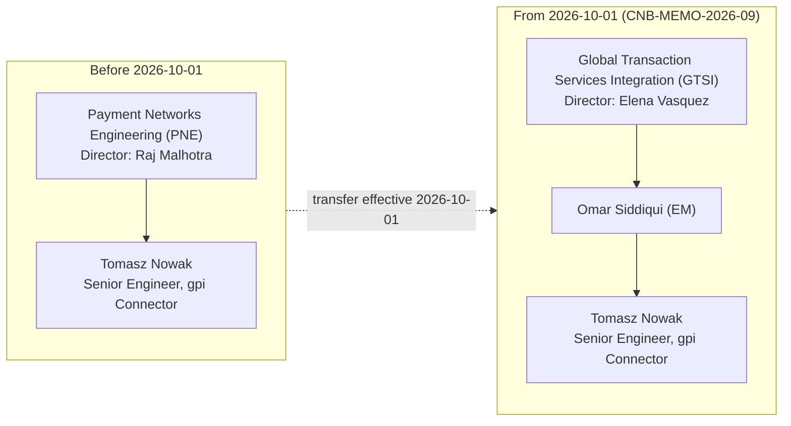

## Overview

Tomasz Nowak is a Senior Engineer whose primary responsibility is the Swift gpi Connector component of the Payment Network Gateway (`SYS-PNG-GPI`). As of the 2026-06-15 PTT engineering directory he was listed as the Senior Engineer for the gpi Connector within Payment Networks Engineering (PNE), under Director Raj Malhotra, with Raj Malhotra and Tomasz Nowak jointly recorded as technical owners of `SYS-PNG-GPI`.

## Organizational transfer: PNE → GTSI (effective 2026-10-01)

Per **CNB-MEMO-2026-09** ("Realignment of Cross-Border Network Integration," issued 2026-09-02 by Gregory Hall, MD - CIO Payments & Treasury Technology), Tomasz Nowak transfers from Payment Networks Engineering to Global Transaction Services Integration (GTSI), effective **2026-10-01**, and now reports to **Omar Siddiqui** (Engineering Manager, GTSI).

This transfer is one piece of a broader realignment in which ownership of the Swift Alliance Gateway, the gpi Connector (`SYS-PNG-GPI`), and gpi Tracker integration moves from PNE (Raj Malhotra) to GTSI (Director Elena Vasquez), with Omar Siddiqui as the accountable Engineering Manager and Hannah Lindqvist as Tech Lead. The Swift API gateway (Microgateway) and SwiftNet PKI service accounts move to GTSI under Hannah Lindqvist at the same time, and the international wire tracking roadmap moves to GTSI under Elena Vasquez with business sponsor Laura Kim. The Fedwire Funds Connector (`SYS-PNG-FFC`) is explicitly **not** moving and remains with PNE under Raj Malhotra (EM: Brian Walsh).

During the transition:

- PNE on-call continues to provide **secondary support** for `SYS-PNG-GPI` until **2026-12-15**, when knowledge transfer (tracked as **GTSI-0112**) completes.
- From 2026-10-01, new requests for gpi data, Swift Tracker usage, or international wire status capabilities are raised in Jira project **GTSI** and directed to Omar Siddiqui, rather than the legacy PNE Jira project (PNG).
- Tickets already logged against PNE/PNG for gpi topics are triaged by GTSI during the knowledge-transfer window rather than being re-filed.

The PTT Organization & Ownership Directory (**CNB-ORG-PTT-2026-06**), last published 2026-06-15 and still showing Tomasz Nowak under PNE, is scheduled to be refreshed in Q4 2026 to reflect this and other CNB-MEMO-2026-09 changes; organizational announcements such as CNB-MEMO-2026-09 take precedence over the directory until that refresh.

## Role and responsibilities

- Owns engineering work on the [Swift gpi Connector](../systems/swift-gpi-connector.md), part of the Payment Network Gateway (`SYS-PNG-GPI`), which also includes the Swift Alliance Gateway and gpi Tracker integration.
- After the transfer, sits within [GTSI](../teams/gtsi.md), reporting to Omar Siddiqui (EM), alongside Hannah Lindqvist (Tech Lead), on the cross-border/Swift gpi capability.
- Business owner for the underlying payment datasets associated with `SYS-PNG-GPI` is Laura Kim (Director, Payments Platform Product), unchanged by the organizational move.

## Related context

- GTSI additionally takes on the gpi Tracker Real-Time Service initiative (**GTSI-0107**, discovery planned 2027-Q2, not funded for 2026) and the Swift Tracker API contract renewal due 2027-01-31 (**GTSI-0115**), both relevant to the gpi capability area Tomasz Nowak works in.
- Raj Malhotra (PNE) separately assumes ownership of the FedNow and RTP connectors effective 2026-11-01, unrelated to the gpi transfer but part of the same realignment announcement.

## Sources

- [CNB-MEMO-2026-09: Realignment of Cross-Border Network Integration](../documents/cnb-memo-2026-09.md)
- [CNB-ORG-PTT-2026-06: PTT Organization, System Ownership & Engagement Directory](../documents/cnb-org-ptt-2026-06.md)
