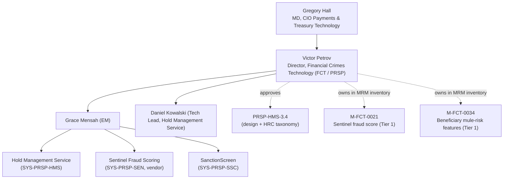

## Overview

Victor Petrov is **Director, Financial Crimes Technology (FCT)**, the
engineering team responsible for the **Payment Risk & Screening Platform
(PRSP)** at Crestline National Bank (CNB). PRSP comprises three systems: the
**Hold Management Service (HMS)**, **Sentinel Fraud Scoring** (a vendor fraud
model), and **SanctionScreen** (OFAC and other sanctions-list screening).
Petrov sits in the PTT (Payments & Treasury Technology) engineering reporting
line, under the CIO, Payments & Treasury Technology (Gregory Hall), with
Grace Mensah (Engineering Manager) and Daniel Kowalski (Tech Lead, Hold
Management Service) reporting into his team.

Petrov holds two concrete, named accountabilities in the source corpus:

- **Approver of [PRSP-HMS-3.4](../documents/prsp-hms-3.4.md)** — the RESTRICTED Financial Crimes Technology design document that defines the HMS hold lifecycle, the twelve-code hold reason (HRC) taxonomy and its disclosure tiers, data-handling rules, interfaces, and controls.
- **Model owner, M-FCT-0021 and M-FCT-0034** — named in the [MRM-POL-02](../documents/mrm-pol-02.md) model inventory as the accountable owner of two Tier 1 financial-crimes models: the Sentinel payment fraud score (vendor) and beneficiary mule-risk features.

*Victor Petrov's reporting line, team, and the two accountabilities named in the source corpus: approval of PRSP-HMS-3.4 and model ownership of M-FCT-0021/M-FCT-0034.*

## Role and team

- **Title**: Director, Financial Crimes Technology.
- **Reports to**: Gregory Hall, MD, CIO, Payments & Treasury Technology (PTT), per the PTT organization chart.
- **Team**: Financial Crimes Technology (FCT) — PRSP, listed in the PTT engineering-team directory with Grace Mensah (EM) and Daniel Kowalski (Tech Lead, Hold Management Service) as the named key contacts. Jira project `FCT`; Slack `#fct-prsp`.
- **Scope**: FCT owns the full PRSP suite — the Hold Management Service, Sentinel Fraud Scoring, and SanctionScreen — rather than any single component. Grace Mensah is the accountable technical owner for all three systems (sharing HMS ownership with Daniel Kowalski), while Petrov is the director accountable for the team as a whole.
- **Reporting lines above Petrov's direct reports**: engineering counterparts across Payment Operations, PPH, and the Investigations Workbench (IWB) consistently describe Victor Petrov as the director at the top of FCT's engineering chain, distinct from the second-line partner functions (Financial Crimes Compliance, Model Risk Management) that review or govern FCT's work rather than reporting into it.

## Approver of PRSP-HMS-3.4

Petrov is named as approver in the document-identity header of
**[PRSP-HMS-3.4](../documents/prsp-hms-3.4.md)** ("Payment Risk & Screening
Platform - Hold Management Service: Design & Hold Reason Taxonomy"), version
3.4, classification RESTRICTED - FINANCIAL CRIMES, last reviewed 2026-06-24.
The document is owned by Daniel Kowalski (Tech Lead) and Grace Mensah (EM),
with Jordan Ellis (FCC Policy & Advisory) as compliance reviewer; Petrov's
sign-off is the engineering-side approval that sits alongside — but is
distinct from — Ellis's compliance review confirming the HRC-to-disclosure-tier
mapping aligns with [POL-FCC-014](../documents/pol-fcc-014.md).

As approver, Petrov's sign-off covers the document's full scope:

- The seven-state **hold lifecycle** (`OPEN` → `IN_REVIEW` → `ESCALATED` →
  `RELEASED` / `REJECTED` / `BLOCKED` / `EXPIRED`), including that
  release/reject dispositions require maker-checker under `CTRL-PAY-012` and
  that `BLOCKED` holds are OFAC blocking outcomes reported to OFAC within 10
  business days (31 CFR 501.603).
- The **twelve-code hold reason (HRC) taxonomy** (HRC-01 through HRC-12) and
  its POL-FCC-014-defined disclosure tiers (P/C/G/R), including that
  `HRC-07 FRAUD_MODEL_HIGH` (Sentinel fraud score above threshold, ~8% of
  holds) and `HRC-09 SANCTIONS_REVIEW` are Restricted-tier codes that must
  never reach a client-facing surface.
- **Data handling** rules classifying the hold `description` and
  `analystNotes` fields as Restricted, and the legacy HMS-to-PPH v1
  `holdReasonDesc` sync — a pre-ADR-PAY-021 backward-compatibility exception
  tracked as open risk **FCT-2004** — which his Tech Lead, Daniel Kowalski,
  owns.
- **Interfaces and controls**, including that no client-facing HMS interface
  or client attestation endpoint exists at the document's scope (the proposed
  **FCT-1893** Client-Safe Hold Status Facade remains deprioritized), and that
  `CTRL-PAY-031` permits digital/phone attestation only for `HRC-01`
  duplicate-suspect holds following the **FCT-1951** pilot, with amounts above
  $5,000,000 still requiring Wire Room release.

Because PRSP-HMS-3.4 is the system-of-record design artifact behind the Hold
Management Service, Petrov's approval is the engineering governance
checkpoint under which Kowalski's and Mensah's team may change hold
lifecycle states, HRC codes/tiers, data handling, or interfaces — subject to
the bi-weekly FCT Change Advisory forum and required FCC sign-off for any
hold or screening change described for his team.

## Model owner: Sentinel fraud score and beneficiary mule-risk features

Under **[MRM-POL-02](../documents/mrm-pol-02.md)** v7.0 (the Model Risk
Management Policy, owned by Jonathan Price, Head of Model Risk Management),
Petrov is named in the Treasury & Payments model inventory extract as the
accountable owner of two **Tier 1** models:

| Model ID | Name | Tier | Owner | Status |
|---|---|---|---|---|
| `M-FCT-0021` | Sentinel payment fraud score (vendor) | 1 | Victor Petrov | Validated 2025-12 |
| `M-FCT-0034` | Beneficiary mule-risk features | 1 | Victor Petrov | Validated 2026-02 |

Tier 1 is MRM-POL-02's highest tier — assigned to regulatory, capital,
financial-crimes detection, or high-financial-exposure models — and requires
full independent validation with annual review. As the named owner of both
models, Petrov's organization is accountable for:

- **Use limitations**: per MRM-POL-02 Section 4, the outputs of Tier 1
  financial-crimes models, including both `M-FCT-0021` and `M-FCT-0034`, may
  not be used for product, marketing, or client-facing purposes. This
  restriction is cited as the governing reason `beneficiary_behavior_profile`
  (the feature table feeding `M-FCT-0034`) may never be read by a
  client-facing surface.
- **Vendor-model obligations**: `M-FCT-0021` (Sentinel) is a vendor model;
  MRM-POL-02 requires compensating controls and outcome monitoring where the
  vendor cannot provide sufficient development information, rather than full
  transparency into model internals.
- **Annual revalidation**: both models require full independent validation
  on an annual cycle; `M-FCT-0021` was last validated 2025-12 and `M-FCT-0034`
  2026-02.
- **Registration and tiering engagement**: Tier 1/2 model changes and new
  registrations route to Model Risk Management (Jonathan Price's
  organization) via Archer intake before development begins, with Sophie
  Laurent as the named day-to-day contact for Treasury/Operations-adjacent
  work (Petrov's financial-crimes models themselves sit outside Sophie
  Laurent's named Treasury & Operations portfolio).

Sentinel's fraud score is the detection mechanism behind hold reason code
`HRC-07 FRAUD_MODEL_HIGH` in the Hold Management Service's taxonomy, and
`M-FCT-0034`'s beneficiary mule-risk features are built from
`beneficiary_behavior_profile`, which inherits a Restricted - Client
Confidential classification. Together these connect Petrov's model-ownership
accountability directly to the hold-handling behavior his team approves
under PRSP-HMS-3.4: Sentinel's score is both a Tier 1 MRM-governed model
output and an input that determines whether a payment is held and how that
hold may (or, for Restricted-tier HRC-07, may not) be disclosed to a client.

## Relationships

- **Direct reports**: [Grace Mensah](grace-mensah.md) (Engineering Manager, FCT — PRSP; technical owner of HMS, Sentinel Fraud Scoring, and SanctionScreen) and [Daniel Kowalski](daniel-kowalski.md) (Tech Lead, Hold Management Service; co-owner of PRSP-HMS-3.4 and assignee of FCT-2004 and FCT-1893).
- **Reports to**: Gregory Hall, MD, CIO, Payments & Treasury Technology.
- **Compliance reviewer on PRSP-HMS-3.4**: [Jordan Ellis](jordan-ellis.md), VP, FCC Policy & Advisory, who reviews the document for consistency with POL-FCC-014's disclosure-tier rules.
- **Business owner of the Hold Management Service**: [Rebecca Stone](rebecca-stone.md) (Financial Intelligence Unit, FCC), who owns HMS's business requirements while Petrov's team builds and operates it.
- **Second-line governance partner**: Jonathan Price (Head of Model Risk Management), whose organization tiers and validates `M-FCT-0021` and `M-FCT-0034` and sets the use limitations Petrov's team must honor; Sophie Laurent is Price's named validation contact, though she is scoped to Treasury & Operations models rather than Petrov's financial-crimes models.
- **Other FCC partner contacts**: Michael Tran (OFAC/Sanctions, business owner of SanctionScreen) and Catherine Doyle (EVP, Chief BSA/AML Officer), whose policies (POL-FCC-014) constrain how Petrov's team's systems disclose hold and screening information.
- **Upstream data owner**: Mark Sullivan (Deposits Data Ownership), whose `dda_txn_history` dataset feeds `beneficiary_behavior_profile` and, in turn, `M-FCT-0034`; Petrov's team is the sole downstream consumer of that data for this purpose.

## Related pages

- [Financial Crimes Technology](../teams/financial-crimes-technology.md)
- [Sentinel Fraud Scoring](../systems/sentinel-fraud-scoring.md)
- [Hold Management Service](../systems/hold-management-service.md)
- [PRSP-HMS-3.4 (document record)](../documents/prsp-hms-3.4.md)
- [MRM-POL-02 (document record)](../documents/mrm-pol-02.md)
- [Payments & Treasury Technology](../organizations/payments-treasury-technology.md)
